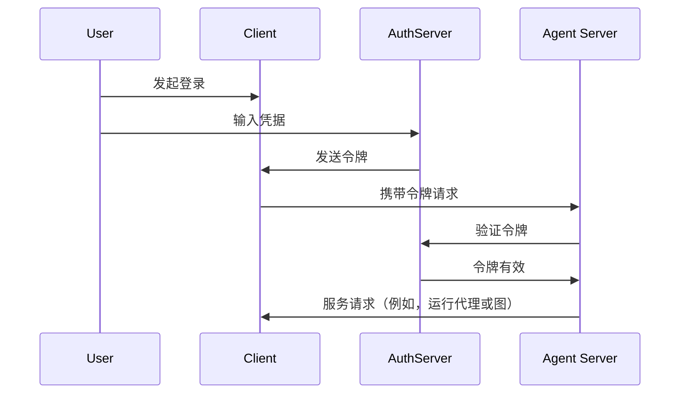

在[上一个教程](/langsmith/resource-auth)中，你添加了资源授权功能，为用户提供私密对话。然而，你仍然在使用硬编码的令牌进行身份验证，这并不安全。现在，你将使用 [OAuth2](/langsmith/deployment-quickstart) 来替换这些令牌，采用真实的用户账户。

你将保留相同的 @[`Auth`][Auth] 对象和[资源级访问控制](/langsmith/auth#single-owner-resources)，但将身份验证升级为使用 Supabase 作为你的身份提供者。虽然本教程使用了 Supabase，但这些概念适用于任何 OAuth2 提供者。你将学习如何：

1. 用真实的 JWT 令牌替换测试令牌
2. 与 OAuth2 提供者集成以实现安全的用户身份验证
3. 在维护现有授权逻辑的同时处理用户会话和元数据

## 背景

OAuth2 涉及三个主要角色：

1.  **授权服务器**：身份提供者（例如 Supabase、Auth0、Google），负责处理用户身份验证并颁发令牌
2.  **应用后端**：你的 LangGraph 应用程序。它验证令牌并提供受保护的资源（对话数据）
3.  **客户端应用程序**：用户与之交互的 Web 或移动应用

标准的 OAuth2 流程大致如下：



## 先决条件

开始本教程前，请确保：

*   来自[第二个教程](/langsmith/resource-auth)的机器人能够无错误运行。
*   拥有一个 [Supabase 项目](https://supabase.com/dashboard) 以使用其身份验证服务器。

## 1. 安装依赖项

安装所需的依赖项。在你的 `custom-auth` 目录中开始，并确保已安装 `langgraph-cli`：

<CodeGroup>
```bash pip
cd custom-auth
pip install -U "langgraph-cli[inmem]"
```

```bash uv
cd custom-auth
uv add "langgraph-cli[inmem]"
```
</CodeGroup>

<a id="setup-auth-provider"></a>
## 2. 设置身份验证提供者

接下来，获取你的身份验证服务器的 URL 和用于身份验证的私钥。
由于你在此使用 Supabase，你可以在 Supabase 仪表板中完成此操作：

1.  在左侧边栏中，点击 ⚙️ "Project Settings"，然后点击 "API"
2.  复制你的项目 URL 并将其添加到你的 `.env` 文件中
    ```shell
    echo "SUPABASE_URL=your-project-url" >> .env
    ```
3.  复制你的服务角色密钥并将其添加到你的 `.env` 文件中：
    ```shell
    echo "SUPABASE_SERVICE_KEY=your-service-role-key" >> .env
    ```
4.  复制你的 "anon public" 密钥并记下来。稍后在你设置客户端代码时会用到它。
    ```bash
    SUPABASE_URL=your-project-url
    SUPABASE_SERVICE_KEY=your-service-role-key
    ```

## 3. 实现令牌验证

在之前的教程中，你使用 @[`Auth`][Auth] 对象来[验证硬编码令牌](/langsmith/set-up-custom-auth)和[添加资源所有权](/langsmith/resource-auth)。

现在，你将升级你的身份验证，以验证来自 Supabase 的真实 JWT 令牌。主要的更改都将发生在 @[`@auth.authenticate`][Auth.authenticate] 装饰的函数中：

*   不再检查硬编码的令牌列表，而是向 Supabase 发起 HTTP 请求来验证令牌。
*   从已验证的令牌中提取真实的用户信息（ID、邮箱）。
*   现有的资源授权逻辑保持不变。

更新 `src/security/auth.py` 来实现这一点：

```python {highlight={8-9,20-30}} title="src/security/auth.py"
import os
import httpx
from langgraph_sdk import Auth

auth = Auth()

# 这是从你上面创建的 `.env` 文件中加载的
SUPABASE_URL = os.environ["SUPABASE_URL"]
SUPABASE_SERVICE_KEY = os.environ["SUPABASE_SERVICE_KEY"]


@auth.authenticate
async def get_current_user(authorization: str | None):
    """验证 JWT 令牌并提取用户信息。"""
    assert authorization
    scheme, token = authorization.split()
    assert scheme.lower() == "bearer"

    try:
        # 通过身份验证提供者验证令牌
        async with httpx.AsyncClient() as client:
            response = await client.get(
                f"{SUPABASE_URL}/auth/v1/user",
                headers={
                    "Authorization": authorization,
                    "apiKey": SUPABASE_SERVICE_KEY,
                },
            )
            assert response.status_code == 200
            user = response.json()
            return {
                "identity": user["id"],  # 唯一的用户标识符
                "email": user["email"],
                "is_authenticated": True,
            }
    except Exception as e:
        raise Auth.exceptions.HTTPException(status_code=401, detail=str(e))

# ... 其余部分与之前相同

# 保留我们上一个教程中的资源授权
@auth.on
async def add_owner(ctx, value):
    """使用资源元数据使资源对其创建者私有。"""
    filters = {"owner": ctx.user.identity}
    metadata = value.setdefault("metadata", {})
    metadata.update(filters)
    return filters
```

最重要的变化是，我们现在使用真实的身份验证服务器来验证令牌。我们的身份验证处理程序拥有 Supabase 项目的私钥，我们可以用它来验证用户的令牌并提取他们的信息。

## 4. 测试身份验证流程

让我们测试一下新的身份验证流程。你可以在文件或笔记本中运行以下代码。你需要提供：

*   一个有效的邮箱地址
*   一个 Supabase 项目 URL（来自[上文](#setup-auth-provider)）
*   一个 Supabase anon **public key**（同样来自[上文](#setup-auth-provider)）

```python
import os
import httpx
from getpass import getpass
from langgraph_sdk import get_client


# 从命令行获取邮箱
email = getpass("Enter your email: ")
base_email = email.split("@")
password = "secure-password"  # CHANGEME
email1 = f"{base_email[0]}+1@{base_email[1]}"
email2 = f"{base_email[0]}+2@{base_email[1]}"

SUPABASE_URL = os.environ.get("SUPABASE_URL")
if not SUPABASE_URL:
    SUPABASE_URL = getpass("Enter your Supabase project URL: ")

# 这是你的 PUBLIC anon key（可以安全地在客户端使用）
# 请勿将其与秘密的服务角色密钥混淆
SUPABASE_ANON_KEY = os.environ.get("SUPABASE_ANON_KEY")
if not SUPABASE_ANON_KEY:
    SUPABASE_ANON_KEY = getpass("Enter your public Supabase anon  key: ")


async def sign_up(email: str, password: str):
    """创建新用户账户。"""
    async with httpx.AsyncClient() as client:
        response = await client.post(
            f"{SUPABASE_URL}/auth/v1/signup",
            json={"email": email, "password": password},
            headers={"apiKey": SUPABASE_ANON_KEY},
        )
        assert response.status_code == 200
        return response.json()

# 创建两个测试用户
print(f"Creating test users: {email1} and {email2}")
await sign_up(email1, password)
await sign_up(email2, password)
```

⚠️ 继续之前：检查你的邮箱并点击两个确认链接。在你确认用户的邮箱之前，Supabase 将拒绝 `/login` 请求。

现在测试用户是否只能看到自己的数据。确保服务器正在运行（运行 `langgraph dev`）后再继续。以下代码片段需要你在[之前设置身份验证提供者](#setup-auth-provider)时从 Supabase 仪表板复制的 "anon public" 密钥。

```python
async def login(email: str, password: str):
    """获取现有用户的访问令牌。"""
    async with httpx.AsyncClient() as client:
        response = await client.post(
            f"{SUPABASE_URL}/auth/v1/token?grant_type=password",
            json={
                "email": email,
                "password": password
            },
            headers={
                "apikey": SUPABASE_ANON_KEY,
                "Content-Type": "application/json"
            },
        )
        assert response.status_code == 200
        return response.json()["access_token"]


# 以用户 1 身份登录
user1_token = await login(email1, password)
user1_client = get_client(
    url="http://localhost:2024", headers={"Authorization": f"Bearer {user1_token}"}
)

# 以用户 1 身份创建线程
thread = await user1_client.threads.create()
print(f"✅ User 1 created thread: {thread['thread_id']}")

# 尝试在没有令牌的情况下访问
unauthenticated_client = get_client(url="http://localhost:2024")
try:
    await unauthenticated_client.threads.create()
    print("❌ Unauthenticated access should fail!")
except Exception as e:
    print("✅ Unauthenticated access blocked:", e)

# 尝试以用户 2 身份访问用户 1 的线程
user2_token = await login(email2, password)
user2_client = get_client(
    url="http://localhost:2024", headers={"Authorization": f"Bearer {user2_token}"}
)

try:
    await user2_client.threads.get(thread["thread_id"])
    print("❌ User 2 shouldn't see User 1's thread!")
except Exception as e:
    print("✅ User 2 blocked from User 1's thread:", e)
```

输出应该如下所示：

```shell
✅ User 1 created thread: d6af3754-95df-4176-aa10-dbd8dca40f1a
✅ Unauthenticated access blocked: Client error '403 Forbidden' for url 'http://localhost:2024/threads'
✅ User 2 blocked from User 1's thread: Client error '404 Not Found' for url 'http://localhost:2024/threads/d6af3754-95df-4176-aa10-dbd8dca40f1a'
```

你的身份验证和授权正在协同工作：

1.  用户必须登录才能访问机器人
2.  每个用户只能看到自己的线程

所有用户都由 Supabase 身份验证提供者管理，因此你无需实现任何额外的用户管理逻辑。

## 后续步骤

你已成功为你的 LangGraph 应用程序构建了一个可用于生产环境的身份验证系统！让我们回顾一下你已完成的工作：

1.  设置了一个身份验证提供者（本例中为 Supabase）
2.  添加了具有邮箱/密码身份验证的真实用户账户
3.  将 JWT 令牌验证集成到你的 Agent Server 中
4.  实现了适当的授权，确保用户只能访问自己的数据
5.  创建了一个基础，可以应对你下一个身份验证挑战

现在你拥有了可用于生产的身份验证，可以考虑：

1.  使用你喜欢的框架构建一个 Web UI（参见 [Custom Auth](https://github.com/langchain-ai/custom-auth) 模板以获取示例）
2.  在[身份验证概念指南](/langsmith/auth)中了解更多关于身份验证和授权的其他方面。
3.  阅读 @[参考文档][Auth] 后，进一步自定义你的处理程序和设置。
