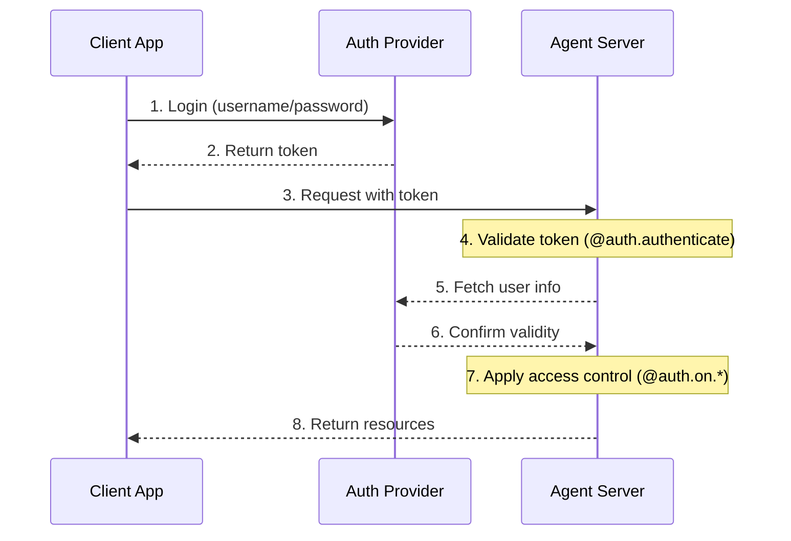
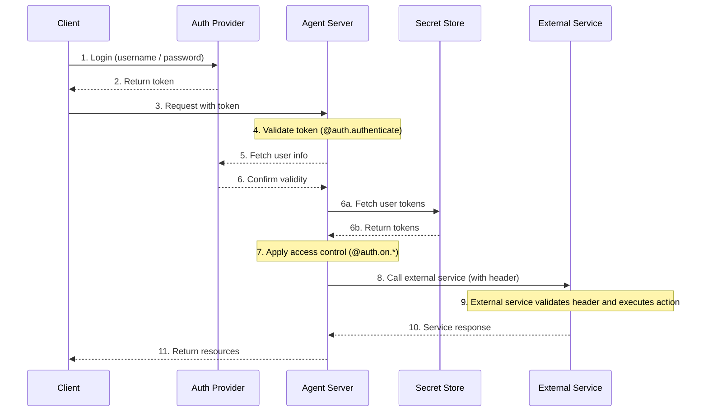

LangSmith 提供了一个灵活的认证和授权系统，可以与大多数认证方案集成。

## 核心概念

### 认证 vs 授权

虽然这两个术语经常互换使用，但它们代表了不同的安全概念：

* [**认证**](#authentication) ("AuthN") 验证 _你是谁_。这作为中间件在每个请求上运行。
* [**授权**](#authorization) ("AuthZ") 决定 _你能做什么_。这基于每个资源来验证用户的权限和角色。

在 LangSmith 中，认证由你的 @[`@auth.authenticate`][Auth.authenticate] 处理器处理，授权由你的 @[`@auth.on`][Auth.on] 处理器处理。

## 默认安全模型

LangSmith 提供了不同的安全默认设置：

### LangSmith

* 默认使用 LangSmith API 密钥
* 要求在 `x-api-key` 请求头中包含有效的 API 密钥
* 可以使用你的认证处理器进行自定义

<Note>
**自定义认证**
LangSmith 的所有套餐都**支持**自定义认证。
</Note>

### 自托管

* 无默认认证
* 完全灵活，可实施你的安全模型
* 你控制认证和授权的所有方面

## 系统架构

典型的认证设置涉及三个主要组件：

1.  **认证提供方** (身份提供方/IdP)
    * 管理用户身份和凭证的专用服务
    * 处理用户注册、登录、密码重置等
    * 在成功认证后颁发令牌（JWT、会话令牌等）
    * 示例：Auth0、Supabase Auth、Okta 或你自己的认证服务器
2.  **智能体服务器** (资源服务器)
    * 你的智能体或 LangGraph 应用程序，包含业务逻辑和受保护资源
    * 与认证提供方验证令牌
    * 基于用户身份和权限强制执行访问控制
    * 不直接存储用户凭证
3.  **客户端应用程序** (前端)
    * Web 应用、移动应用或 API 客户端
    * 收集有时效性的用户凭证并发送给认证提供方
    * 从认证提供方接收令牌
    * 在向智能体服务器发出的请求中包含这些令牌

以下是这些组件通常如何交互：



你在 LangGraph 中的 @[`@auth.authenticate`][Auth.authenticate] 处理器处理步骤 4-6，而你的 @[`@auth.on`][Auth.on] 处理器实现步骤 7。

## 认证

LangGraph 中的认证作为中间件在每个请求上运行。你的 @[`@auth.authenticate`][Auth.authenticate] 处理器接收请求信息并应：

1.  验证凭证
2.  如果有效，则返回包含用户身份和用户信息的 @[用户信息][MinimalUserDict]
3.  如果无效，则引发 @[HTTP 异常][HTTPException] 或 AssertionError

```python
from langgraph_sdk import Auth

auth = Auth()

@auth.authenticate
async def authenticate(headers: dict) -> Auth.types.MinimalUserDict:
    # Validate credentials (e.g., API key, JWT token)
    api_key = headers.get(b"x-api-key")
    if not api_key or not is_valid_key(api_key):
        raise Auth.exceptions.HTTPException(
            status_code=401,
            detail="Invalid API key"
        )

    # Return user info - only identity and is_authenticated are required
    # Add any additional fields you need for authorization
    return {
        "identity": "user-123",        # Required: unique user identifier
        "is_authenticated": True,      # Optional: assumed True by default
        "permissions": ["read", "write"], # Optional: for permission-based auth
        # You can add more custom fields if you want to implement other auth patterns
        "role": "admin",
        "org_id": "org-456"

    }
```

返回的用户信息可通过以下方式获取：

*   通过 @[`ctx.user`][AuthContext] 提供给您的授权处理器
*   在您的应用程序中通过 `config["configuration"]["langgraph_auth_user"]` 获取

<Accordion title="支持的参数">
  @[`@auth.authenticate`][Auth.authenticate] 处理器可以通过名称接受以下任何参数：

  * request (Request): 原始的 ASGI 请求对象
  * path (str): 请求路径，例如 `"/threads/abcd-1234-abcd-1234/runs/abcd-1234-abcd-1234/stream"`
  * method (str): HTTP 方法，例如 `"GET"`
  * path_params (dict[str, str]): URL 路径参数，例如 `{"thread_id": "abcd-1234-abcd-1234", "run_id": "abcd-1234-abcd-1234"}`
  * query_params (dict[str, str]): URL 查询参数，例如 `{"stream": "true"}`
  * headers (dict[bytes, bytes]): 请求头
  * authorization (str | None): Authorization 请求头的值（例如 `"Bearer <token>"`）

  在我们的许多教程中，为了简洁起见，我们只展示 "authorization" 参数，但您可以根据需要选择接受更多信息来实现您的自定义认证方案。
</Accordion>

### 智能体认证

自定义认证允许委托访问。您在 `@auth.authenticate` 中返回的值会被添加到运行上下文中，为智能体提供用户范围的凭证，使其能够代表用户访问资源。



认证后，平台会创建一个特殊的配置对象，该对象通过可配置的上下文传递给你的图和所有节点。
此对象包含有关当前用户的信息，包括你从 @[`@auth.authenticate`][Auth.authenticate] 处理器返回的任何自定义字段。

要使智能体能够代表用户行事，请使用[自定义认证中间件](/langsmith/custom-auth)。这将允许智能体代表用户与外部系统（如 MCP 服务器、外部数据库，甚至其他智能体）进行交互。

更多信息，请参阅[使用自定义认证](/langsmith/custom-auth#enable-agent-authentication)指南。

### 使用 MCP 的智能体认证

有关如何对智能体进行 MCP 服务器认证的信息，请参阅 [MCP 概念指南](/oss/langchain/mcp)。

## 授权

认证后，LangGraph 会调用你的 @[`@auth.on`][Auth] 处理器来控制对特定资源（例如，线程、助手、定时任务）的访问。这些处理器可以：

1.  通过直接修改 `value["metadata"]` 字典来添加在资源创建期间要保存的元数据。有关每种操作 `value` 可以接受的类型列表，请参阅[支持的操作表](#supported-actions)。
2.  在搜索/列表或读取操作期间，通过返回[过滤器字典](#filter-operations)来按元数据过滤资源。
3.  如果访问被拒绝，则引发 HTTP 异常。

如果你只想实现简单的用户范围访问控制，可以为所有资源和操作使用单个 @[`@auth.on`][Auth] 处理器。如果你想根据资源和操作有不同的控制，可以使用[资源特定处理器](#resource-specific-handlers)。有关支持访问控制的资源的完整列表，请参阅[支持的资源](#supported-resources)部分。

```python
@auth.on
async def add_owner(
    ctx: Auth.types.AuthContext,
    value: dict  # The payload being sent to this access method
) -> dict:  # Returns a filter dict that restricts access to resources
    """Authorize all access to threads, runs, crons, and assistants.

    This handler does two things:
        - Adds a value to resource metadata (to persist with the resource so it can be filtered later)
        - Returns a filter (to restrict access to existing resources)

    Args:
        ctx: Authentication context containing user info, permissions, the path, and
        value: The request payload sent to the endpoint. For creation
              operations, this contains the resource parameters. For read
              operations, this contains the resource being accessed.

    Returns:
        A filter dictionary that LangGraph uses to restrict access to resources.
        See [Filter Operations](#filter-operations) for supported operators.
    """
    # Create filter to restrict access to just this user's resources
    filters = {"owner": ctx.user.identity}

    # Get or create the metadata dictionary in the payload
    # This is where we store persistent info about the resource
    metadata = value.setdefault("metadata", {})

    # Add owner to metadata - if this is a create or update operation,
    # this information will be saved with the resource
    # So we can filter by it later in read operations
    metadata.update(filters)

    # Return filters to restrict access
    # These filters are applied to ALL operations (create, read, update, search, etc.)
    # to ensure users can only access their own resources
    return filters
```

<a id="resource-specific-handlers"></a>
### 资源特定处理器

你可以通过将资源名和操作名与 @[`@auth.on`][Auth] 装饰器链接在一起来为特定资源和操作注册处理器。
当发出请求时，将调用与该资源和操作匹配的最具体的处理器。以下是如何为特定资源和操作注册处理器的示例。对于以下设置：

1.  已认证用户能够创建线程、读取线程以及在线程上创建运行
2.  只有拥有 "assistants:create" 权限的用户才被允许创建新助手
3.  所有其他端点（例如，删除助手、定时任务、存储）对所有用户禁用。

<Tip>
**支持的处理器**
有关支持的资源和操作的完整列表，请参阅下面的[支持的资源](#supported-resources)部分。
</Tip>

```python
# Generic / global handler catches calls that aren't handled by more specific handlers
@auth.on
async def reject_unhandled_requests(ctx: Auth.types.AuthContext, value: Any) -> False:
    print(f"Request to {ctx.path} by {ctx.user.identity}")
    raise Auth.exceptions.HTTPException(
        status_code=403,
        detail="Forbidden"
    )

# Matches the "thread" resource and all actions - create, read, update, delete, search
# Since this is **more specific** than the generic @auth.on handler, it will take precedence
# over the generic handler for all actions on the "threads" resource
@auth.on.threads
async def on_thread(
    ctx: Auth.types.AuthContext,
    value: Auth.types.threads.create.value
):
    # Setting metadata on the thread being created
    # will ensure that the resource contains an "owner" field
    # Then any time a user tries to access this thread or runs within the thread,
    # we can filter by owner
    metadata = value.setdefault("metadata", {})
    metadata["owner"] = ctx.user.identity
    return {"owner": ctx.user.identity}


# Thread creation. This will match only on thread create actions
# Since this is **more specific** than both the generic @auth.on handler and the @auth.on.threads handler,
# it will take precedence for any "create" actions on the "threads" resources
@auth.on.threads.create
async def on_thread_create(
    ctx: Auth.types.AuthContext,
    value: Auth.types.threads.create.value
):
    # Reject if the user does not have write access
    if "write" not in ctx.permissions:
        raise Auth.exceptions.HTTPException(
            status_code=403,
            detail="User lacks the required permissions."
        )
    # Setting metadata on the thread being created
    # will ensure that the resource contains an "owner" field
    # Then any time a user tries to access this thread or runs within the thread,
    # we can filter by owner
    metadata = value.setdefault("metadata", {})
    metadata["owner"] = ctx.user.identity
    return {"owner": ctx.user.identity}

# Reading a thread. Since this is also more specific than the generic @auth.on handler, and the @auth.on.threads handler,
# it will take precedence for any "read" actions on the "threads" resource
@auth.on.threads.read
async def on_thread_read(
    ctx: Auth.types.AuthContext,
    value: Auth.types.threads.read.value
):
    # Since we are reading (and not creating) a thread,
    # we don't need to set metadata. We just need to
    # return a filter to ensure users can only see their own threads
    return {"owner": ctx.user.identity}

# Run creation, streaming, updates, etc.
# This takes precedenceover the generic @auth.on handler and the @auth.on.threads handler
@auth.on.threads.create_run
async def on_run_create(
    ctx: Auth.types.AuthContext,
    value: Auth.types.threads.create_run.value
):
    metadata = value.setdefault("metadata", {})
    metadata["owner"] = ctx.user.identity
    # Inherit thread's access control
    return {"owner": ctx.user.identity}

# Assistant creation
@auth.on.assistants.create
async def on_assistant_create(
    ctx: Auth.types.AuthContext,
    value: Auth.types.assistants.create.value
):
    if "assistants:create" not in ctx.permissions:
        raise Auth.exceptions.HTTPException(
            status_code=403,
            detail="User lacks the required permissions."
        )
```

请注意，在上面的示例中，我们混合使用了全局处理器和资源特定处理器。由于每个请求都由最具体的处理器处理，因此创建 `thread` 的请求将匹配 `on_thread_create` 处理器，但**不会**匹配 `reject_unhandled_requests` 处理器。然而，`update` 线程的请求将由全局处理器处理，因为我们没有针对该资源和操作的更具体的处理器。

<a id="filter-operations"></a>
### 过滤操作

授权处理器可以返回 `None`、布尔值或过滤器字典。

*   `None` 和 `True` 表示"授权访问所有底层资源"
*   `False` 表示"拒绝访问所有底层资源（引发 403 异常）"
*   元数据过滤器字典将限制对资源的访问

过滤器字典是一个键与资源元数据匹配的字典。它支持三种操作符：

*   默认值是精确匹配的简写，即下面的 "$eq"。例如，`{"owner": user_id}` 将仅包含元数据为 `{"owner": user_id}` 的资源
*   `$eq`: 精确匹配（例如，`{"owner": {"$eq": user_id}}`）- 这等同于上面的简写 `{"owner": user_id}`
*   `$contains`: 列表成员关系（例如，`{"allowed_users": {"$contains": user_id}}`）或列表包含关系（例如，`{"allowed_users": {"$contains": [user_id_1, user_id_2]}}`）。这里的值必须分别是列表的一个元素或列表元素的子集。存储资源中的元数据必须是列表/容器类型。

具有多个键的字典被视为使用逻辑 `AND` 过滤器。例如，`{"owner": org_id, "allowed_users": {"$contains": user_id}}` 将仅匹配元数据中 "owner" 为 `org_id` 且 "allowed_users" 列表包含 `user_id` 的资源。
更多信息请参阅参考 @[`Auth`](Auth)。

## 常见访问模式

以下是一些典型的授权模式：

### 单所有者资源

这种常见模式允许你将所有线程、助手、定时任务和运行限定给单个用户。它适用于常见的单用户用例，如常规聊天机器人式应用。

```python
@auth.on
async def owner_only(ctx: Auth.types.AuthContext, value: dict):
    metadata = value.setdefault("metadata", {})
    metadata["owner"] = ctx.user.identity
    return {"owner": ctx.user.identity}
```

### 基于权限的访问

此模式允许你基于**权限**控制访问。如果你希望某些角色对资源拥有更广泛或更受限制的访问权限，这很有用。

```python
# In your auth handler:
@auth.authenticate
async def authenticate(headers: dict) -> Auth.types.MinimalUserDict:
    ...
    return {
        "identity": "user-123",
        "is_authenticated": True,
        "permissions": ["threads:write", "threads:read"]  # Define permissions in auth
    }

def _default(ctx: Auth.types.AuthContext, value: dict):
    metadata = value.setdefault("metadata", {})
    metadata["owner"] = ctx.user.identity
    return {"owner": ctx.user.identity}

@auth.on.threads.create
async def create_thread(ctx: Auth.types.AuthContext, value: dict):
    if "threads:write" not in ctx.permissions:
        raise Auth.exceptions.HTTP
