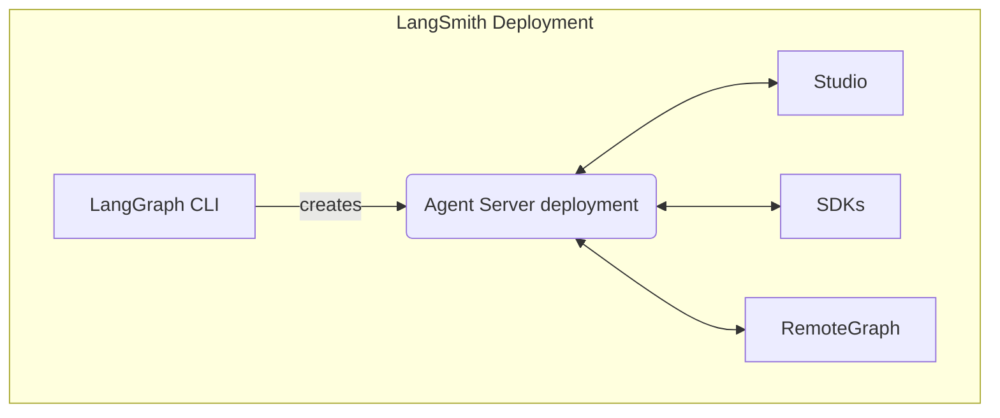

<Info>
**先决条件**
* [LangSmith](/langsmith/home)
* [Agent Server](/langsmith/agent-server)
* [LangGraph CLI](/langsmith/cli)
</Info>

Studio 是一个专门的智能体（Agent）集成开发环境（IDE），用于可视化、交互和调试实现了 Agent Server API 协议的智能体系统。Studio 还与[追踪](/langsmith/observability-concepts)、[评估](/langsmith/evaluation)和[提示词工程](/langsmith/prompt-engineering)功能集成。

## 功能特性

Studio 的主要功能包括：

* 可视化您的图架构
* [运行并与您的智能体交互](/langsmith/use-studio#run-application)
* [管理助手](/langsmith/use-studio#manage-assistants)
* [管理线程](/langsmith/use-studio#manage-threads)
* [迭代提示词](/langsmith/observability-studio)
* [在数据集上运行实验](/langsmith/observability-studio#run-experiments-over-a-dataset)
* 管理[长期记忆](/oss/concepts/memory)
* 通过[时间旅行](/oss/langgraph/use-time-travel)调试智能体状态

Studio 适用于部署在 [LangSmith](/langsmith/deployment-quickstart) 上的图，也适用于通过 [Agent Server](/langsmith/local-server) 在本地运行的图。

Studio 支持两种模式：

### 图模式

图模式提供了完整的功能集，当您希望获取智能体执行的尽可能多的细节时非常有用，包括遍历的节点、中间状态以及 LangSmith 集成功能（例如添加到数据集和 Playground）。

### 聊天模式

聊天模式是一个更简洁的用户界面，用于迭代和测试专门用于聊天的智能体。它适用于业务用户和希望测试智能体整体行为的用户。聊天模式仅支持状态包含或继承自 [`MessagesState`](/oss/langgraph/use-graph-api#messagesstate) 的图。

## 了解更多

* 查看本指南，了解如何[开始使用](/langsmith/quick-start-studio) Studio。

## 视频指南
<iframe
  className="w-full aspect-video rounded-xl"
  src="https://www.youtube.com/embed/Mi1gSlHwZLM?si=oWCeHQ640zPHoLwn"
  title="YouTube video player"
  frameBorder="0"
  allow="accelerometer; autoplay; clipboard-write; encrypted-media; gyroscope; picture-in-picture"
  allowFullScreen
></iframe>
