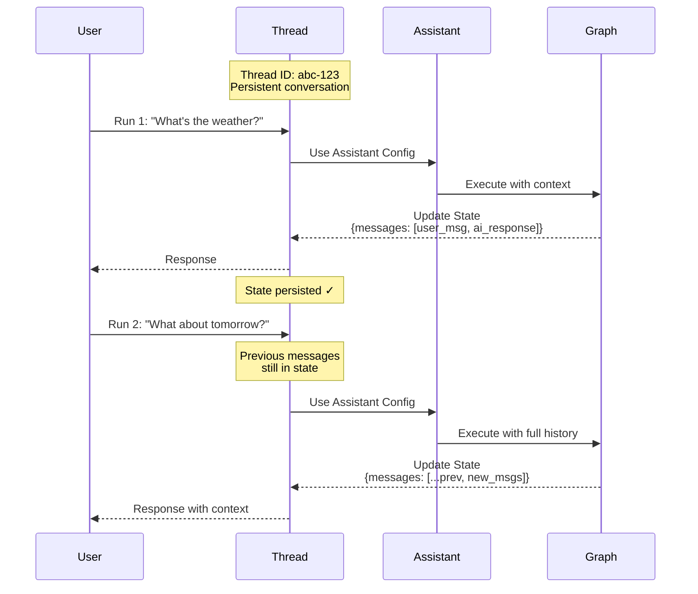

本指南将向您展示如何创建、查看和检查 _线程_。线程与 [助手](/langsmith/assistants) 协同工作，以实现您 [已部署图](/langsmith/deployments) 的 [有状态](/oss/langgraph/persistence) 执行。

## 理解线程

线程是一个持久的对话容器，可在多次运行之间维护状态。每次在线程上执行运行时，图都会使用线程的当前状态处理输入，并用新信息更新该状态。

线程通过保留运行之间的对话历史和上下文来实现有状态的交互。如果没有线程，每次运行都将是无状态的，无法记住之前的交互。线程特别适用于：

- 需要助手记住讨论内容的多轮对话。
- 需要在多个步骤中保持上下文的长时间运行任务。
- 每个用户拥有自己对话历史的用户特定状态管理。

下图说明了线程如何在两次运行之间维护状态。第二次运行可以访问第一次运行中的消息，使助手能够理解“明天呢？”的上下文指的是第一次运行中的天气查询：



- 线程维护一个具有唯一线程 ID 的持久对话。
- 每次运行都将助手的配置应用于图执行。
- 每次运行后状态都会更新，并持久化供后续运行使用。
- 后续运行可以访问完整的对话历史。

<Note>
- **[助手](/langsmith/assistants)** 定义了图执行的配置（模型、提示词、工具）。创建运行时，您可以指定 **图 ID**（例如 `"agent"`）以使用默认助手，或指定 **助手 ID**（UUID）以使用特定配置。
- **线程** 维护状态和对话历史。
- **运行** 将助手和线程结合起来，以特定的配置和状态执行您的图。
</Note>

## 创建线程

要使用状态持久化运行您的图，您必须首先创建一个线程：

<Tabs>
<Tab title="SDK">

### 空线程

要创建一个新线程，请使用以下方法之一：

<CodeGroup>
```python Python
from langgraph_sdk import get_client

# 使用您的部署 URL 初始化客户端
client = get_client(url=<DEPLOYMENT_URL>)

# 创建一个空线程
# 这将创建一个没有初始状态的新线程
thread = await client.threads.create()

print(thread)
```

```javascript JavaScript
import { Client } from "@langchain/langgraph-sdk";

// 使用您的部署 URL 初始化客户端
const client = new Client({ apiUrl: <DEPLOYMENT_URL> });

// 创建一个空线程
// 这将创建一个没有初始状态的新线程
const thread = await client.threads.create();

console.log(thread);
```

```bash cURL
curl --request POST \
    --url <DEPLOYMENT_URL>/threads \
    --header 'Content-Type: application/json' \
    --data '{}'
```
</CodeGroup>

更多信息，请参考 @[Python][ThreadsClient.create] 和 @[JS][ThreadsClient.create] SDK 文档，或 [REST API](/langsmith/agent-server-api/threads/create-thread) 参考。

输出：

```json
{
  "thread_id": "123e4567-e89b-12d3-a456-426614174000",
  "created_at": "2025-05-12T14:04:08.268Z",
  "updated_at": "2025-05-12T14:04:08.268Z",
  "metadata": {},
  "status": "idle",
  "values": {}
}
```

### 复制线程

或者，如果您在应用程序中已经有一个线程，并且希望复制其状态，可以使用 `copy` 方法。这将创建一个独立的线程，其历史记录在操作时与原始线程完全相同：

<CodeGroup>
```python Python
# 复制一个现有线程
# 新线程在复制时将拥有与原始线程相同的状态
copied_thread = await client.threads.copy(thread["thread_id"])
```

```javascript JavaScript
// 复制一个现有线程
// 新线程在复制时将拥有与原始线程相同的状态
const copiedThread = await client.threads.copy(thread["thread_id"]);
```

```bash cURL
curl --request POST --url <DEPLOYMENT_URL>/threads/thread["thread_id"]/copy \
--header 'Content-Type: application/json'
```
</CodeGroup>

更多信息，请参考 @[Python][ThreadsClient.copy] 和 @[JS][ThreadsClient.copy] SDK 文档，或 [REST API](/langsmith/agent-server-api/threads/copy-thread) 参考。

### 预填充状态

您可以通过向 `create` 方法提供 `supersteps` 列表来创建一个具有任意预定义状态的线程。`supersteps` 描述了一系列状态更新，用于建立线程的初始状态。这在以下情况下非常有用：

- 创建具有现有对话历史的线程。
- 从另一个系统迁移对话。
- 设置具有特定初始状态的测试场景。
- 从之前的会话恢复对话。

有关检查点和状态管理的更多信息，请参考 [LangGraph 持久化文档](/oss/langgraph/persistence)。

<CodeGroup>
```python Python
from langgraph_sdk import get_client

# 初始化客户端
client = get_client(url=<DEPLOYMENT_URL>)

# 创建一个具有预填充对话历史的线程
# supersteps 定义了一系列构建初始状态的状态更新
thread = await client.threads.create(
  graph_id="agent",  # 指定此线程用于哪个图
  supersteps=[
    {
      updates: [
        {
          values: {},
          as_node: '__input__',  # 初始输入节点
        },
      ],
    },
    {
      updates: [
        {
          values: {
            messages: [
              {
                type: 'human',
                content: 'hello',
              },
            ],
          },
          as_node: '__start__',  # 用户的第一条消息
        },
      ],
    },
    {
      updates: [
        {
          values: {
            messages: [
              {
                content: 'Hello! How can I assist you today?',
                type: 'ai',
              },
            ],
          },
          as_node: 'call_model',  # 助手的响应
        },
      ],
    },
  ])

print(thread)
```

```javascript JavaScript
import { Client } from "@langchain/langgraph-sdk";

// 初始化客户端
const client = new Client({ apiUrl: <DEPLOYMENT_URL> });

// 创建一个具有预填充对话历史的线程
// supersteps 定义了一系列构建初始状态的状态更新
const thread = await client.threads.create({
    graphId: 'agent',  // 指定此线程用于哪个图
    supersteps: [
    {
      updates: [
        {
          values: {},
          asNode: '__input__',  // 初始输入节点
        },
      ],
    },
    {
      updates: [
        {
          values: {
            messages: [
              {
                type: 'human',
                content: 'hello',
              },
            ],
          },
          asNode: '__start__',  // 用户的第一条消息
        },
      ],
    },
    {
      updates: [
        {
          values: {
            messages: [
              {
                content: 'Hello! How can I assist you today?',
                type: 'ai',
              },
            ],
          },
          asNode: 'call_model',  // 助手的响应
        },
      ],
    },
  ],
});

console.log(thread);
```

```bash cURL
curl --request POST \
    --url <DEPLOYMENT_URL>/threads \
    --header 'Content-Type: application/json' \
    --data '{"metadata":{"graph_id":"agent"},"supersteps":[{"updates":[{"values":{},"as_node":"__input__"}]},{"updates":[{"values":{"messages":[{"type":"human","content":"hello"}]},"as_node":"__start__"}]},{"updates":[{"values":{"messages":[{"content":"Hello\u0021 How can I assist you today?","type":"ai"}]},"as_node":"call_model"}]}]}'
```
</CodeGroup>

输出：

```json
{
  "thread_id": "f15d70a1-27d4-4793-a897-de5609920b7d",
  "created_at": "2025-05-12T15:37:08.935038+00:00",
  "updated_at": "2025-05-12T15:37:08.935046+00:00",
  "metadata": {
    "graph_id": "agent"
  },
  "status": "idle",
  "config": {},
  "values": {
    "messages": [
      {
        "content": "hello",
        "additional_kwargs": {},
        "response_metadata": {},
        "type": "human",
        "name": null,
        "id": "8701f3be-959c-4b7c-852f-c2160699b4ab",
        "example": false
      },
      {
        "content": "Hello! How can I assist you today?",
        "additional_kwargs": {},
        "response_metadata": {},
        "type": "ai",
        "name": null,
        "id": "4d8ea561-7ca1-409a-99f7-6b67af3e1aa3",
        "example": false,
        "tool_calls": [],
        "invalid_tool_calls": [],
        "usage_metadata": null
      }
    ]
  }
}
```

</Tab>
<Tab title="UI">

您也可以直接从 [LangSmith UI](https://smith.langchain.com) 创建线程：

1.  导航到您的 [部署](/langsmith/deployments)。
2.  选择 **Threads** 选项卡。
3.  点击 **+ New thread**。
4.  可选地为线程提供元数据或初始状态。
5.  点击 **Create thread**。

新创建的线程将出现在线程表中，并可立即用于运行。

</Tab>
</Tabs>

## 列出线程

<Tabs>
<Tab title="SDK">

要列出线程，请使用 `search` 方法。这将列出应用程序中与提供的过滤器匹配的线程：

### 按线程状态过滤

使用 `status` 字段根据线程状态过滤线程。支持的值有 `idle`、`busy`、`interrupted` 和 `error`。例如，要查看 `idle` 线程：

<CodeGroup>
```python Python
# 搜索空闲线程
# 状态过滤器接受：idle, busy, interrupted, error
print(await client.threads.search(status="idle", limit=1))
```

```javascript JavaScript
# 搜索空闲线程
# 状态过滤器接受：idle, busy, interrupted, error
console.log(await client.threads.search({ status: "idle", limit: 1 }));
```

```bash cURL
curl --request POST \
--url <DEPLOYMENT_URL>/threads/search \
--header 'Content-Type: application/json' \
--data '{"status": "idle", "limit": 1}'
```
</CodeGroup>

更多信息，请参考 @[Python][ThreadsClient.search] 和 @[JS][ThreadsClient.search] SDK 文档，或 [REST API](/langsmith/agent-server-api/threads/search-threads) 参考。

输出：

```json
[
  {
    "thread_id": "cacf79bb-4248-4d01-aabc-938dbd60ed2c",
    "created_at": "2024-08-14T17:36:38.921660+00:00",
    "updated_at": "2024-08-14T17:36:38.921660+00:00",
    "metadata": {
      "graph_id": "agent"
    },
    "status": "idle",
    "config": {
      "configurable": {}
    }
  }
]
```

### 按元数据过滤

`search` 方法允许您根据元数据进行过滤。这对于查找与特定图、用户或您添加到线程的自定义元数据相关联的线程非常有用：

<CodeGroup>
```python Python
# 搜索具有特定元数据的线程
# 元数据过滤对于按图、用户或自定义标签组织线程很有用
print((await client.threads.search(metadata={"graph_id":"agent"}, limit=1)))
```

```javascript JavaScript
// 搜索具有特定元数据的线程
// 元数据过滤对于按图、用户或自定义标签组织线程很有用
console.log((await client.threads.search({ metadata: { "graph_id": "agent" }, limit: 1 })));
```

```bash cURL
curl --request POST \
--url <DEPLOYMENT_URL>/threads/search \
--header 'Content-Type: application/json' \
--data '{"metadata": {"graph_id":"agent"}, "limit": 1}'
```
</CodeGroup>

输出：

```json
[
  {
    "thread_id": "cacf79bb-4248-4d01-aabc-938dbd60ed2c",
    "created_at": "2024-08-14T17:36:38.921660+00:00",
    "updated_at": "2024-08-14T17:36:38.921660+00:00",
    "metadata": {
      "graph_id": "agent"
    },
    "status": "idle",
    "config": {
      "configurable": {}
    }
  }
]
```

### 排序

SDK 还支持使用 `sort_by` 和 `sort_order` 参数按 `thread_id`、`status`、`created_at` 和 `updated_at` 对线程进行排序。

</Tab>
<Tab title="UI">

您也可以通过 [LangSmith UI](https://smith.langchain.com) 查看和管理部署中的线程：

1.  导航到您的 [部署](/langsmith/deployments)。
2.  选择 **Threads** 选项卡。

这将加载您部署中所有线程的表格。

**按线程状态过滤：** 在顶部栏中选择一个状态，以按 `idle`、`busy`、`interrupted` 或 `error` 过滤线程。

**排序线程：** 点击任何列标题的箭头图标，按该属性（`thread_id`、`status`、`created_at` 或 `updated_at`）排序。

</Tab>
</Tabs>

## 检查线程

<Tabs>
<Tab title="SDK">

### 获取线程

要查看给定 `thread_id` 的特定线程，请使用 @[`get`][ThreadsClient.get] 方法：

<CodeGroup>
```python Python
# 通过 ID 检索特定线程
# 返回线程元数据，包括状态、创建时间和元数据
print((await client.threads.get(thread["thread_id"])))
```

```javascript JavaScript
// 通过 ID 检索特定线程
// 返回线程元数据，包括状态、创建时间和元数据
console.log((await client.threads.get(thread["thread_id"])));
```

```bash cURL
curl --request GET \
--url <DEPLOYMENT_URL>/threads/thread["thread_id"] \
--header 'Content-Type: application/json'
```
</CodeGroup>

输出：

```json
{
  "thread_id": "cacf79bb-4248-4d01-aabc-938dbd60ed2c",
  "created_at": "2024-08-14T17:36:38.921660+00:00",
  "updated_at": "2024-08-14T17:36:38.921660+00:00",
  "metadata": {
    "graph_id": "agent"
  },
  "status": "idle",
  "config": {
    "configurable": {}
  }
}
```

更多信息，请参考 @[Python][ThreadsClient.get] 和 @[JS][ThreadsClient.get] SDK 文档，或 [REST API](/langsmith/agent-server-api/threads/get-thread) 参考。

### 检查线程状态

要查看给定线程的当前状态，请使用 @[`get_state`][ThreadsClient.get_state] 方法。这将返回当前值、要执行的下一个节点以及检查点信息：

<CodeGroup>
```python Python
# 获取线程的当前状态
# 返回值、下一个节点、任务、检查点信息和元数据
print((await client.threads.get_state(thread["thread_id"])))
```

```javascript JavaScript
// 获取线程的当前状态
// 返回值、下一个节点、任务、检查点信息和元数据
console.log((await client.threads.getState(thread["thread_id"])));
```

```bash cURL
curl --request GET \
--url <DEPLOYMENT_URL>/threads/thread["thread_id"]/state \
--header 'Content-Type: application/json'
```
</CodeGroup>

输出：

```json
{
  "values": {
    "messages": [
      {
        "content": "hello",
        "additional_kwargs": {},
        "response_metadata": {},
        "type": "human",
        "name": null,
        "id": "8701f3be-959c-4b7c-852f-c2160699b4ab",
        "example": false
      },
      {
        "content": "Hello! How can I assist you today?",
        "additional_kwargs": {},
        "response_metadata": {},
        "type": "ai",
        "name": null,
        "id": "4d8ea561-7ca1-409a-99f7-6b67af3e1aa3",
        "example": false,
        "tool_calls": [],
        "invalid_tool_calls": [],
        "usage_metadata": null
      }
    ]
  },
  "next": [],
  "tasks": [],
  "metadata": {
    "thread_id": "f15d70a1-27d4-4793-a897-de5609920b7d",
    "checkpoint_id": "1f02f46
