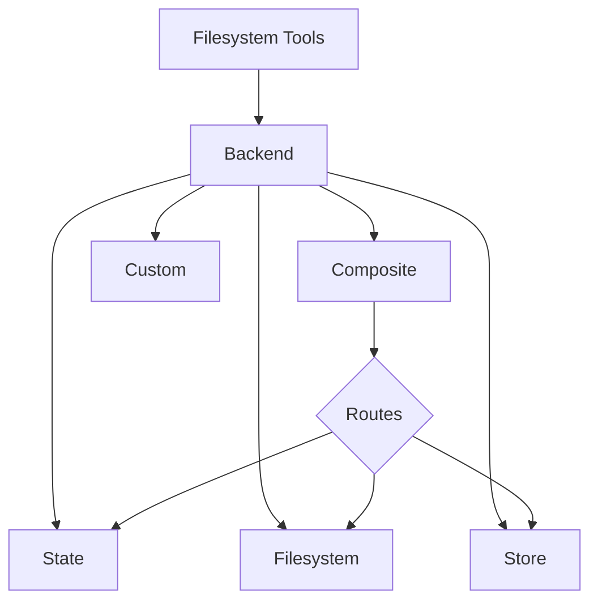

Deep agents 通过 `ls`、`read_file`、`write_file`、`edit_file`、`glob` 和 `grep` 等工具向 agent 暴露一个文件系统接口。这些工具通过一个可插拔的后端运行。



本页将解释如何[选择后端](#specify-a-backend)、[将不同路径路由到不同后端](#route-to-different-backends)、[实现你自己的虚拟文件系统](#use-a-virtual-filesystem)（例如 S3 或 Postgres）、[添加策略钩子](#add-policy-hooks)以及[遵守后端协议](#protocol-reference)。

## 快速开始

以下是几个预构建的文件系统后端，你可以快速用于你的 deep agent：

| 内置后端 | 描述 |
|---|---|
| [默认](#statebackend-ephemeral) | `agent = create_deep_agent()` <br></br> 临时存储在状态中。agent 的默认文件系统后端存储在 `langgraph` 状态中。请注意，此文件系统仅在*单个线程*内持久化。 |
| [本地文件系统持久化](#filesystembackend-local-disk) | `agent = create_deep_agent(backend=FilesystemBackend(root_dir="/Users/nh/Desktop/"))` <br></br>这使 deep agent 能够访问你本地机器的文件系统。你可以指定 agent 有权访问的根目录。请注意，任何提供的 `root_dir` 必须是绝对路径。 |
| [持久化存储（LangGraph store）](#storebackend-langgraph-store) | `agent = create_deep_agent(backend=lambda rt: StoreBackend(rt))` <br></br>这使 agent 能够访问*跨线程持久化*的长期存储。这对于存储长期记忆或适用于 agent 多次执行的指令非常有用。 |
| [复合](#compositebackend-router) | 默认临时存储，`/memories/` 持久化。复合后端具有最大的灵活性。你可以指定文件系统中的不同路由指向不同的后端。请参阅下面的复合路由示例，这是一个可以直接粘贴使用的例子。 |

## 内置后端

### StateBackend（临时存储）

:::python
```python
# 默认情况下我们提供一个 StateBackend
agent = create_deep_agent()

# 底层实现如下
from deepagents.backends import StateBackend

agent = create_deep_agent(
    backend=(lambda rt: StateBackend(rt))   # 注意，工具通过 runtime.state 访问 State
)
```
:::

:::js
```typescript
import { createDeepAgent, StateBackend } from "deepagents";

// 默认情况下我们提供一个 StateBackend
const agent = createDeepAgent();

// 底层实现如下
const agent2 = createDeepAgent({
  backend: (rt) => new StateBackend(rt),   // 注意，工具通过 runtime.state 访问 State
});
```
:::

**工作原理：**
- 将文件存储在 LangGraph agent 状态中，供当前线程使用。
- 通过检查点在同一线程上的多次 agent 轮次中持久化。

**最适合：**
- 作为 agent 编写中间结果的草稿板。
- 自动清除大型工具输出，agent 随后可以分块读回。

### FilesystemBackend（本地磁盘）

:::python
```python
from deepagents.backends import FilesystemBackend

agent = create_deep_agent(
    backend=FilesystemBackend(root_dir=".", virtual_mode=True)
)
```
:::

:::js
```typescript
import { createDeepAgent, FilesystemBackend } from "deepagents";

const agent = createDeepAgent({
  backend: new FilesystemBackend({ rootDir: ".", virtualMode: true }),
});
```
:::

**工作原理：**
- 在可配置的 `root_dir` 下读取/写入真实文件。
- 你可以选择设置 `virtual_mode=True` 来沙盒化并将路径规范化为 `root_dir` 下的路径。
- 使用安全的路径解析，尽可能防止不安全的符号链接遍历，可以使用 ripgrep 进行快速的 `grep`。

**最适合：**
- 你机器上的本地项目
- CI 沙盒
- 挂载的持久化卷

### StoreBackend（LangGraph Store）

:::python
```python
from langgraph.store.memory import InMemoryStore
from deepagents.backends import StoreBackend

agent = create_deep_agent(
    backend=(lambda rt: StoreBackend(rt)),   # 注意，工具通过 runtime.store 访问 Store
    store=InMemoryStore()
)
```
:::

:::js
```typescript
import { createDeepAgent, StoreBackend } from "deepagents";
import { InMemoryStore } from "@langchain/langgraph";

const store = new InMemoryStore()
const agent = createDeepAgent({
  backend: (rt) => new StoreBackend(rt),
  store
});
```
:::

**工作原理：**
- 将文件存储在运行时提供的 LangGraph `BaseStore` 中，实现跨线程的持久化存储。

**最适合：**
- 当你已经运行配置了 LangGraph store 时（例如，Redis、Postgres 或 `BaseStore` 背后的云实现）。
- 当你通过 LangSmith Deployment 部署你的 agent 时（会自动为你的 agent 配置一个 store）。

### CompositeBackend（路由器）

:::python
```python
from deepagents import create_deep_agent
from deepagents.backends import CompositeBackend, StateBackend, StoreBackend
from langgraph.store.memory import InMemoryStore

composite_backend = lambda rt: CompositeBackend(
    default=StateBackend(rt),
    routes={
        "/memories/": StoreBackend(rt),
    }
)

agent = create_deep_agent(
    backend=composite_backend,
    store=InMemoryStore()  # Store 传递给 create_deep_agent，而不是 backend
)
```
:::

:::js
```typescript
import { createDeepAgent, CompositeBackend, StateBackend, StoreBackend } from "deepagents";
import { InMemoryStore } from "@langchain/langgraph";

const compositeBackend = (rt) => new CompositeBackend(
  new StateBackend(rt),
  {
    "/memories/": new StoreBackend(rt),
  }
);

const store = new InMemoryStore()
const agent = createDeepAgent({ backend: compositeBackend, store });
```
:::

**工作原理：**
- 根据路径前缀将文件操作路由到不同的后端。
- 在列表和搜索结果中保留原始路径前缀。

**最适合：**
- 当你希望为 agent 提供临时存储和跨线程存储时，CompositeBackend 允许你同时提供 StateBackend 和 StoreBackend。
- 当你有多个信息源希望作为单个文件系统的一部分提供给 agent 时。
    - 例如，你在一个 Store 的 `/memories/` 下存储了长期记忆，并且还有一个自定义后端，可以在 `/docs/` 访问文档。

## 指定后端

- 将后端传递给 `create_deep_agent(backend=...)`。文件系统中间件将其用于所有工具。
- 你可以传递以下任一：
  - 一个实现了 `BackendProtocol` 的实例（例如，`FilesystemBackend(root_dir=".")`），或者
  - 一个工厂函数 `BackendFactory = Callable[[ToolRuntime], BackendProtocol]`（适用于需要运行时访问的后端，如 `StateBackend` 或 `StoreBackend`）。
- 如果省略，默认为 `lambda rt: StateBackend(rt)`。

## 路由到不同后端

将命名空间的不同部分路由到不同的后端。通常用于持久化 `/memories/*` 并保持其他所有内容为临时存储。

:::python
```python
from deepagents import create_deep_agent
from deepagents.backends import CompositeBackend, StateBackend, FilesystemBackend

composite_backend = lambda rt: CompositeBackend(
    default=StateBackend(rt),
    routes={
        "/memories/": FilesystemBackend(root_dir="/deepagents/myagent", virtual_mode=True),
    },
)

agent = create_deep_agent(backend=composite_backend)
```
:::

:::js
```typescript
import { createDeepAgent, CompositeBackend, FilesystemBackend, StateBackend } from "deepagents";

const compositeBackend = (rt) => new CompositeBackend(
  new StateBackend(rt),
  {
    "/memories/": new FilesystemBackend({ rootDir: "/deepagents/myagent", virtualMode: true }),
  },
);

const agent = createDeepAgent({ backend: compositeBackend });
```
:::

行为：
- `/workspace/plan.md` → StateBackend（临时存储）
- `/memories/agent.md` → FilesystemBackend 下的 `/deepagents/myagent`
- `ls`、`glob`、`grep` 聚合结果并显示原始路径前缀。

注意：
- 更长的前缀优先（例如，路由 `"/memories/projects/"` 可以覆盖 `"/memories/"`）。
- 对于 StoreBackend 路由，确保 agent 运行时提供了 store（`runtime.store`）。

## 使用虚拟文件系统

构建一个自定义后端，将远程或数据库文件系统（例如 S3 或 Postgres）投影到工具命名空间中。

设计指南：

- 路径是绝对的（`/x/y.txt`）。决定如何将它们映射到你的存储键/行。
- 高效实现 `ls_info` 和 `glob_info`（在可用的情况下使用服务器端列表，否则使用本地过滤器）。
- 对于缺失的文件或无效的正则表达式模式，返回用户可读的错误字符串。
- 对于外部持久化，在结果中设置 `files_update=None`；只有状态后端才应返回 `files_update` 字典。

S3 风格示例：

:::python
```python
from deepagents.backends.protocol import BackendProtocol, WriteResult, EditResult
from deepagents.backends.utils import FileInfo, GrepMatch

class S3Backend(BackendProtocol):
    def __init__(self, bucket: str, prefix: str = ""):
        self.bucket = bucket
        self.prefix = prefix.rstrip("/")

    def _key(self, path: str) -> str:
        return f"{self.prefix}{path}"

    def ls_info(self, path: str) -> list[FileInfo]:
        # 列出 _key(path) 下的对象；构建 FileInfo 条目（path, size, modified_at）
        ...

    def read(self, file_path: str, offset: int = 0, limit: int = 2000) -> str:
        # 获取对象；返回带行号的内容或错误字符串
        ...

    def grep_raw(self, pattern: str, path: str | None = None, glob: str | None = None) -> list[GrepMatch] | str:
        # 可选地服务器端过滤；否则列出并扫描内容
        ...

    def glob_info(self, pattern: str, path: str = "/") -> list[FileInfo]:
        # 在键上应用相对于 path 的 glob 模式
        ...

    def write(self, file_path: str, content: str) -> WriteResult:
        # 强制执行仅创建语义；返回 WriteResult(path=file_path, files_update=None)
        ...

    def edit(self, file_path: str, old_string: str, new_string: str, replace_all: bool = False) -> EditResult:
        # 读取 → 替换（根据 replace_all 处理唯一性）→ 写入 → 返回出现次数
        ...
```
:::

Postgres 风格示例：

- 表 `files(path text primary key, content text, created_at timestamptz, modified_at timestamptz)`
- 将工具操作映射到 SQL：
  - `ls_info` 使用 `WHERE path LIKE $1 || '%'`
  - `glob_info` 在 SQL 中过滤或获取后在 Python 中应用 glob
  - `grep_raw` 可以通过扩展名或最后修改时间获取候选行，然后扫描行

## 添加策略钩子

通过子类化或包装后端来强制执行企业规则。

阻止在选定前缀下写入/编辑（子类化）：

:::python
```python
from deepagents.backends.filesystem import FilesystemBackend
from deepagents.backends.protocol import WriteResult, EditResult

class GuardedBackend(FilesystemBackend):
    def __init__(self, *, deny_prefixes: list[str], **kwargs):
        super().__init__(**kwargs)
        self.deny_prefixes = [p if p.endswith("/") else p + "/" for p in deny_prefixes]

    def write(self, file_path: str, content: str) -> WriteResult:
        if any(file_path.startswith(p) for p in self.deny_prefixes):
            return WriteResult(error=f"Writes are not allowed under {file_path}")
        return super().write(file_path, content)

    def edit(self, file_path: str, old_string: str, new_string: str, replace_all: bool = False) -> EditResult:
        if any(file_path.startswith(p) for p in self.deny_prefixes):
            return EditResult(error=f"Edits are not allowed under {file_path}")
        return super().edit(file_path, old_string, new_string, replace_all)
```
:::

通用包装器（适用于任何后端）：

:::python
```python
from deepagents.backends.protocol import BackendProtocol, WriteResult, EditResult
from deepagents.backends.utils import FileInfo, GrepMatch

class PolicyWrapper(BackendProtocol):
    def __init__(self, inner: BackendProtocol, deny_prefixes: list[str] | None = None):
        self.inner = inner
        self.deny_prefixes = [p if p.endswith("/") else p + "/" for p in (deny_prefixes or [])]

    def _deny(self, path: str) -> bool:
        return any(path.startswith(p) for p in self.deny_prefixes)

    def ls_info(self, path: str) -> list[FileInfo]:
        return self.inner.ls_info(path)
    def read(self, file_path: str, offset: int = 0, limit: int = 2000) -> str:
        return self.inner.read(file_path, offset=offset, limit=limit)
    def grep_raw(self, pattern: str, path: str | None = None, glob: str | None = None) -> list[GrepMatch] | str:
        return self.inner.grep_raw(pattern, path, glob)
    def glob_info(self, pattern: str, path: str = "/") -> list[FileInfo]:
        return self.inner.glob_info(pattern, path)
    def write(self, file_path: str, content: str) -> WriteResult:
        if self._deny(file_path):
            return WriteResult(error=f"Writes are not allowed under {file_path}")
        return self.inner.write(file_path, content)
    def edit(self, file_path: str, old_string: str, new_string: str, replace_all: bool = False) -> EditResult:
        if self._deny(file_path):
            return EditResult(error=f"Edits are not allowed under {file_path}")
        return self.inner.edit(file_path, old_string, new_string, replace_all)
```
:::

## 协议参考

后端必须实现 `BackendProtocol`。

必需的端点：
- `ls_info(path: str) -> list[FileInfo]`
  - 返回至少包含 `path` 的条目。在可用时包含 `is_dir`、`size`、`modified_at`。按 `path` 排序以获得确定性输出。
- `read(file_path: str, offset: int = 0, limit: int = 2000) -> str`
  - 返回带行号的内容。文件缺失时，返回 `"Error: File '/x' not found"`。
- `grep_raw(pattern: str, path: Optional[str] = None, glob: Optional[str] = None) -> list[GrepMatch] | str`
  - 返回结构化的匹配项。对于无效的正则表达式，返回类似 `"Invalid regex pattern: ..."` 的字符串（不要引发异常）。
- `glob_info(pattern: str, path: str = "/") -> list[FileInfo]`
  - 将匹配的文件作为 `FileInfo` 条目返回（如果没有则返回空列表）。
- `write(file_path: str, content: str) -> WriteResult`
  - 仅创建。冲突时，返回 `WriteResult(error=...)`。成功时，设置 `path`，对于状态后端设置 `files_update={...}`；外部后端应使用 `files_update=None`。
- `edit(file_path: str, old_string: str, new_string: str, replace_all: bool = False) -> EditResult`
  - 除非 `replace_all=True`，否则强制执行 `old_string` 的唯一性。如果未找到，返回错误。成功时包含 `occurrences`。

支持的类型：
- `WriteResult(error, path, files_update)`
- `EditResult(error, path, files_update, occurrences)`
- `FileInfo` 包含字段：`path`（必需），可选 `is_dir`、`size`、`modified_at`。
- `GrepMatch` 包含字段：`path`、`line`、`text`。
