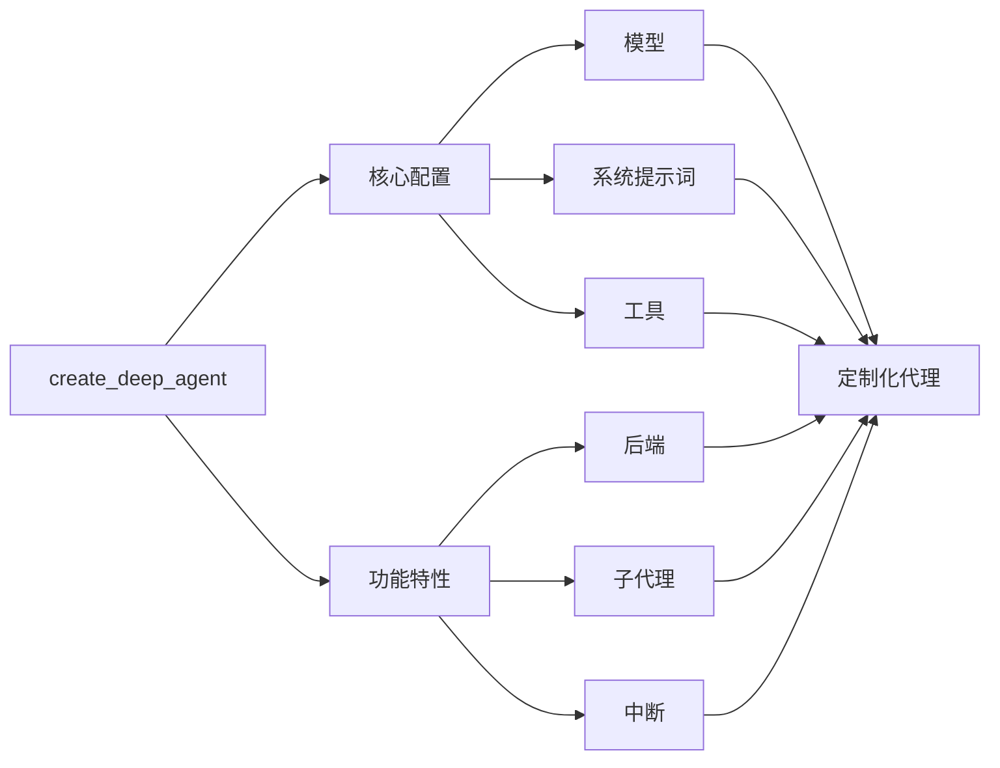

## 模型

默认情况下，`deepagents` 使用 [`claude-sonnet-4-5-20250929`](https://platform.claude.com/docs/en/about-claude/models/overview)。你可以通过传递任何受支持的 <Tooltip tip="遵循 `provider:model` 格式的字符串（例如 openai:gpt-5）" cta="查看映射关系" href="https://reference.langchain.com/python/langchain/models/#langchain.chat_models.init_chat_model(model)">模型标识符字符串</Tooltip> 或 [LangChain 模型对象](/oss/integrations/chat) 来自定义所使用的模型。

:::python
<CodeGroup>
    ```python 模型字符串
    from langchain.chat_models import init_chat_model
    from deepagents import create_deep_agent

    model = init_chat_model(model="gpt-5")
    agent = create_deep_agent(model=model)
    ```

    ```python LangChain 模型对象
    from langchain_ollama import ChatOllama
    from langchain.chat_models import init_chat_model
    from deepagents import create_deep_agent

    model = init_chat_model(
        model=ChatOllama(
            model="llama3.1",
            temperature=0,
            # 其他参数...
        )
    )
    agent = create_deep_agent(model=model)
    ```
</CodeGroup>
:::

:::js
```typescript
import { ChatAnthropic } from "@langchain/anthropic";
import { ChatOpenAI } from "@langchain/openai";
import { createDeepAgent } from "deepagents";

// 使用 Anthropic
const agent = createDeepAgent({
  model: new ChatAnthropic({
    model: "claude-sonnet-4-20250514",
    temperature: 0,
  }),
});

// 使用 OpenAI
const agent2 = createDeepAgent({
  model: new ChatOpenAI({
    model: "gpt-5",
    temperature: 0,
  }),
});
```
:::

## 系统提示词

深度代理内置了一个受 Claude Code 系统提示词启发的系统提示词。默认的系统提示词包含了关于如何使用内置规划工具、文件系统工具和子代理的详细说明。

为特定用例定制的每个深度代理都应包含针对该用例的自定义系统提示词。

:::python
```python
from deepagents import create_deep_agent

research_instructions = """\
你是一位专家研究员。你的工作是进行 \
深入研究，然后撰写一份完善的报告。 \
"""

agent = create_deep_agent(
    system_prompt=research_instructions,
)
```
:::

:::js
```typescript
import { createDeepAgent } from "deepagents";

const researchInstructions = `你是一位专家研究员。你的工作是进行深入研究，然后撰写一份完善的报告。`;

const agent = createDeepAgent({
  systemPrompt: researchInstructions,
});
```
:::

## 工具

与工具调用代理类似，深度代理也拥有一组可以访问的顶层工具。

:::python
```python
import os
from typing import Literal
from tavily import TavilyClient
from deepagents import create_deep_agent

tavily_client = TavilyClient(api_key=os.environ["TAVILY_API_KEY"])

def internet_search(
    query: str,
    max_results: int = 5,
    topic: Literal["general", "news", "finance"] = "general",
    include_raw_content: bool = False,
):
    """运行网络搜索"""
    return tavily_client.search(
        query,
        max_results=max_results,
        include_raw_content=include_raw_content,
        topic=topic,
    )

agent = create_deep_agent(
    tools=[internet_search]
)
```
:::

:::js
```typescript
import { tool } from "langchain";
import { TavilySearch } from "@langchain/tavily";
import { createDeepAgent } from "deepagents";
import { z } from "zod";

const internetSearch = tool(
  async ({
    query,
    maxResults = 5,
    topic = "general",
    includeRawContent = false,
  }: {
    query: string;
    maxResults?: number;
    topic?: "general" | "news" | "finance";
    includeRawContent?: boolean;
  }) => {
    const tavilySearch = new TavilySearch({
      maxResults,
      tavilyApiKey: process.env.TAVILY_API_KEY,
      includeRawContent,
      topic,
    });
    return await tavilySearch._call({ query });
  },
  {
    name: "internet_search",
    description: "运行网络搜索",
    schema: z.object({
      query: z.string().describe("搜索查询"),
      maxResults: z.number().optional().default(5),
      topic: z
        .enum(["general", "news", "finance"])
        .optional()
        .default("general"),
      includeRawContent: z.boolean().optional().default(false),
    }),
  },
);

const agent = createDeepAgent({
  tools: [internetSearch],
});
```
:::

除了你提供的任何工具外，深度代理还可以访问许多默认工具：

- `write_todos` – 更新代理的待办事项列表
- `ls` – 列出代理文件系统中的所有文件
- `read_file` – 从代理的文件系统中读取文件
- `write_file` – 在代理的文件系统中写入新文件
- `edit_file` – 编辑代理文件系统中的现有文件
- `task` – 生成一个子代理来处理特定任务
