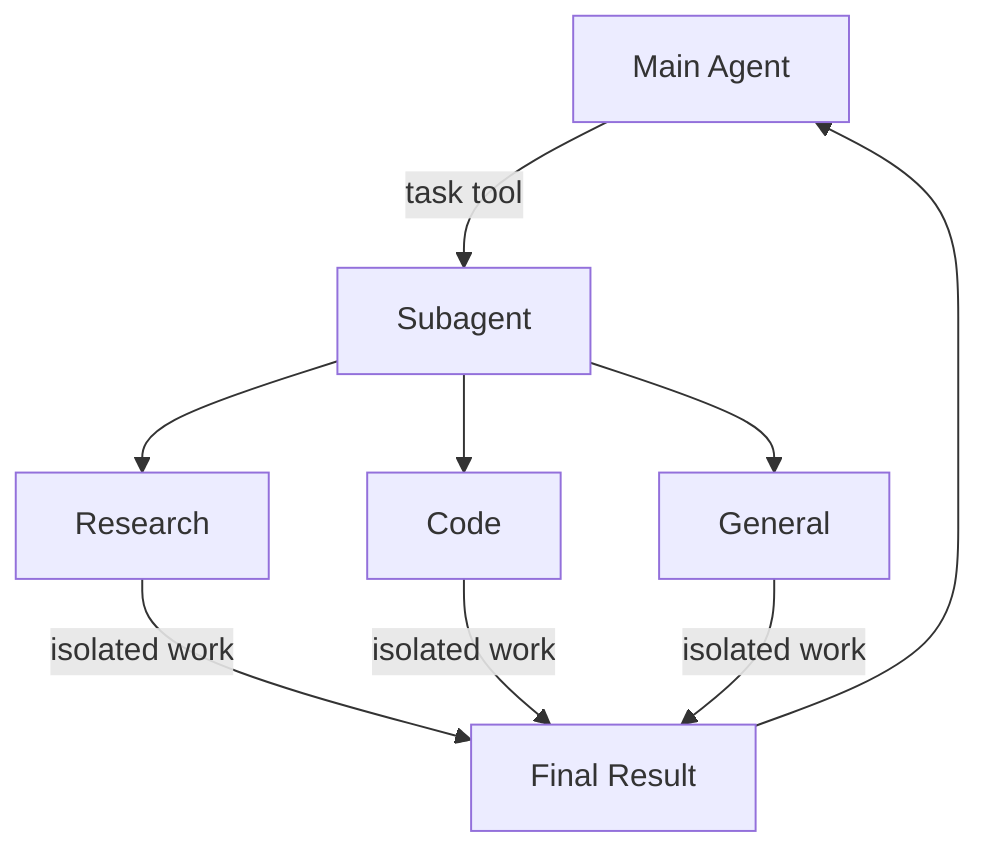

深度智能体可以创建子智能体来委派工作。您可以在 `subagents` 参数中指定自定义子智能体。子智能体对于[上下文隔离](https://www.dbreunig.com/2025/06/26/how-to-fix-your-context.html#context-quarantine)（保持主智能体上下文清洁）和提供专门指令非常有用。



## 为什么使用子智能体？

子智能体解决了**上下文膨胀问题**。当智能体使用具有大量输出的工具（网络搜索、文件读取、数据库查询）时，上下文窗口会迅速被中间结果填满。子智能体隔离了这些详细工作——主智能体只接收最终结果，而不是产生该结果的数十个工具调用。

**何时使用子智能体：**
- ✅ 会弄乱主智能体上下文的多步骤任务
- ✅ 需要自定义指令或工具的专业领域
- ✅ 需要不同模型能力的任务
- ✅ 当您希望主智能体专注于高层协调时

**何时不使用子智能体：**
- ❌ 简单的单步任务
- ❌ 当您需要维护中间上下文时
- ❌ 当开销超过收益时

## 配置

`subagents` 应该是一个字典列表或 `CompiledSubAgent` 对象。有两种类型：

### SubAgent（基于字典）

对于大多数用例，将子智能体定义为字典：

**必填字段：**
- **name** (`str`): 子智能体的唯一标识符。主智能体在调用 `task()` 工具时使用此名称。
- **description** (`str`): 此子智能体的功能。要具体且以行动为导向。主智能体使用此描述来决定何时委派。
- **system_prompt** (`str`): 子智能体的指令。包括工具使用指导和输出格式要求。
- **tools** (`List[Callable]`): 子智能体可以使用的工具。保持最小化，只包含所需内容。

**可选字段：**
- **model** (`str | BaseChatModel`): 覆盖主智能体的模型。使用格式 `"provider:model-name"`（例如，`"openai:gpt-4o"`）。
- **middleware** (`List[Middleware]`): 用于自定义行为、日志记录或速率限制的额外中间件。
- **interrupt_on** (`Dict[str, bool]`): 为特定工具配置人工介入。需要检查点。

### CompiledSubAgent

对于复杂的工作流，使用预构建的 LangGraph 图：

**字段：**
- **name** (`str`): 唯一标识符
- **description** (`str`): 此子智能体的功能
- **runnable** (`Runnable`): 一个已编译的 LangGraph 图（必须先调用 `.compile()`）

## 使用 SubAgent

:::python
```python
import os
from typing import Literal
from tavily import TavilyClient
from deepagents import create_deep_agent

tavily_client = TavilyClient(api_key=os.environ["TAVILY_API_KEY"])

def internet_search(
    query: str,
    max_results: int = 5,
    topic: Literal["general", "news", "finance"] = "general",
    include_raw_content: bool = False,
):
    """Run a web search"""
    return tavily_client.search(
        query,
        max_results=max_results,
        include_raw_content=include_raw_content,
        topic=topic,
    )

research_subagent = {
    "name": "research-agent",
    "description": "Used to research more in depth questions",
    "system_prompt": "You are a great researcher",
    "tools": [internet_search],
    "model": "openai:gpt-4o",  # Optional override, defaults to main agent model
}
subagents = [research_subagent]

agent = create_deep_agent(
    model="claude-sonnet-4-5-20250929",
    subagents=subagents
)
```
:::

:::js
```typescript
import { tool } from "langchain";
import { TavilySearch } from "@langchain/tavily";
import { createDeepAgent } from "deepagents";
import { ChatAnthropic } from "@langchain/anthropic";
import { z } from "zod";

const internetSearch = tool(
  async ({
    query,
    maxResults = 5,
    topic = "general",
    includeRawContent = false,
  }: {
    query: string;
    maxResults?: number;
    topic?: "general" | "news" | "finance";
    includeRawContent?: boolean;
  }) => {
    const tavilySearch = new TavilySearch({
      maxResults,
      tavilyApiKey: process.env.TAVILY_API_KEY,
      includeRawContent,
      topic,
    });
    return await tavilySearch._call({ query });
  },
  {
    name: "internet_search",
    description: "Run a web search",
    schema: z.object({
      query: z.string().describe("The search query"),
      maxResults: z.number().optional().default(5),
      topic: z
        .enum(["general", "news", "finance"])
        .optional()
        .default("general"),
      includeRawContent: z.boolean().optional().default(false),
    }),
  },
);

const researchSubagent = {
  name: "research-agent",
  description: "Used to research more in depth questions",
  systemPrompt: "You are a great researcher",
  tools: [internetSearch],
  model: new ChatAnthropic({model:"claude-sonnet-4-5-20250929"}),  // Optional override, defaults to main agent model
};
const subagents = [researchSubagent];

const agent = createDeepAgent({
  model: new ChatAnthropic({model:"claude-sonnet-4-5-20250929"}),
  subagents: subagents,
});
```
:::

## 使用 CompiledSubAgent

对于更复杂的用例，您可以提供自己预构建的 LangGraph 图作为子智能体：

:::python
```python
from deepagents import create_deep_agent, CompiledSubAgent
from langchain.agents import create_agent

# Create a custom agent graph
custom_graph = create_agent(
    model=your_model,
    tools=specialized_tools,
    prompt="You are a specialized agent for data analysis..."
)

# Use it as a custom subagent
custom_subagent = CompiledSubAgent(
    name="data-analyzer",
    description="Specialized agent for complex data analysis tasks",
    runnable=custom_graph
)

subagents = [custom_subagent]

agent = create_deep_agent(
    model="claude-sonnet-4-5-20250929",
    tools=[internet_search],
    system_prompt=research_instructions,
    subagents=subagents
)
```
:::

:::js
```typescript
import { createDeepAgent, CompiledSubAgent } from "deepagents";
import { createAgent } from "langchain";

// Create a custom agent graph
const customGraph = createAgent({
  model: yourModel,
  tools: specializedTools,
  prompt: "You are a specialized agent for data analysis...",
});

// Use it as a custom subagent
const customSubagent: CompiledSubAgent = {
  name: "data-analyzer",
  description: "Specialized agent for complex data analysis tasks",
  runnable: customGraph,
};

const subagents = [customSubagent];

const agent = createDeepAgent({
  model: "claude-sonnet-4-5-20250929",
  tools: [internetSearch],
  systemPrompt: researchInstructions,
  subagents: subagents,
});
```
:::

## 通用子智能体

除了任何用户定义的子智能体之外，深度智能体始终可以访问一个 `general-purpose` 子智能体。此子智能体：
- 具有与主智能体相同的系统提示
- 可以访问所有相同的工具
- 使用相同的模型（除非被覆盖）

### 何时使用它

通用子智能体非常适合不需要专门行为的上下文隔离。主智能体可以将复杂的多步骤任务委派给此子智能体，并获得简洁的结果，而不会因中间工具调用而膨胀。

<Card title="示例">
    主智能体不是自己进行 10 次网络搜索并用结果填满其上下文，而是委派给通用子智能体：`task(name="general-purpose", task="Research quantum computing trends")`。子智能体在内部执行所有搜索，并仅返回摘要。
</Card>

## 最佳实践

### 编写清晰的描述

主智能体使用描述来决定调用哪个子智能体。要具体：

✅ **良好：** `"分析财务数据并生成带有置信度评分的投资见解"`

❌ **不佳：** `"处理财务事务"`

### 保持系统提示详细

包括关于如何使用工具和格式化输出的具体指导：

:::python
```python
research_subagent = {
    "name": "research-agent",
    "description": "使用网络搜索进行深入研究并综合发现",
    "system_prompt": """您是一位细致的研究员。您的工作是：

    1. 将研究问题分解为可搜索的查询
    2. 使用 internet_search 查找相关信息
    3. 将发现综合成全面但简洁的摘要
    4. 在提出主张时引用来源

    输出格式：
    - 摘要（2-3 段）
    - 关键发现（要点列表）
    - 来源（带 URL）

    将您的回复控制在 500 字以内以保持上下文清洁。""",
    "tools": [internet_search],
}
```
:::

:::js
```typescript
const researchSubagent = {
  name: "research-agent",
  description: "使用网络搜索进行深入研究并综合发现",
  systemPrompt: `您是一位细致的研究员。您的工作是：

  1. 将研究问题分解为可搜索的查询
  2. 使用 internet_search 查找相关信息
  3. 将发现综合成全面但简洁的摘要
  4. 在提出主张时引用来源

  输出格式：
  - 摘要（2-3 段）
  - 关键发现（要点列表）
  - 来源（带 URL）

  将您的回复控制在 500 字以内以保持上下文清洁。`,
  tools: [internetSearch],
};
```
:::

### 最小化工具集

只给予智能体它们需要的工具。这可以提高专注度和安全性：

:::python
```python
# ✅ 良好：专注的工具集
email_agent = {
    "name": "email-sender",
    "tools": [send_email, validate_email],  # 仅与电子邮件相关
}

# ❌ 不佳：工具太多
email_agent = {
    "name": "email-sender",
    "tools": [send_email, web_search, database_query, file_upload],  # 不专注
}
```
:::

:::js
```typescript
// ✅ 良好：专注的工具集
const emailAgent = {
  name: "email-sender",
  tools: [sendEmail, validateEmail],  // 仅与电子邮件相关
};

// ❌ 不佳：工具太多
const emailAgentBad = {
  name: "email-sender",
  tools: [sendEmail, webSearch, databaseQuery, fileUpload],  // 不专注
};
```
:::

### 根据任务选择模型

不同的模型擅长不同的任务：

:::python
```python
subagents = [
    {
        "name": "contract-reviewer",
        "description": "审查法律文件和合同",
        "system_prompt": "您是一位专业的法律审查员...",
        "tools": [read_document, analyze_contract],
        "model": "claude-sonnet-4-5-20250929",  # 大上下文用于长文档
    },
    {
        "name": "financial-analyst",
        "description": "分析财务数据和市场趋势",
        "system_prompt": "您是一位专业的财务分析师...",
        "tools": [get_stock_price, analyze_fundamentals],
        "model": "openai:gpt-5",  # 更适合数值分析
    },
]
```
:::

:::js
```typescript
const subagents = [
  {
    name: "contract-reviewer",
    description: "审查法律文件和合同",
    systemPrompt: "您是一位专业的法律审查员...",
    tools: [readDocument, analyzeContract],
    model: "claude-sonnet-4-5-20250929",  // 大上下文用于长文档
  },
  {
    name: "financial-analyst",
    description: "分析财务数据和市场趋势",
    systemPrompt: "您是一位专业的财务分析师...",
    tools: [getStockPrice, analyzeFundamentals],
    model: "gpt-5",  // 更适合数值分析
  },
];
```
:::

### 返回简洁的结果

指示子智能体返回摘要，而不是原始数据：

:::python
```python
data_analyst = {
    "system_prompt": """分析数据并返回：
    1. 关键见解（3-5 个要点）
    2. 总体置信度评分
    3. 建议的后续行动

    请勿包含：
    - 原始数据
    - 中间计算
    - 详细的工具输出

    将回复控制在 300 字以内。"""
}
```
:::

:::js
```typescript
const dataAnalyst = {
  systemPrompt: `分析数据并返回：
  1. 关键见解（3-5 个要点）
  2. 总体置信度评分
  3. 建议的后续行动

  请勿包含：
  - 原始数据
  - 中间计算
  - 详细的工具输出

  将回复控制在 300 字以内。`,
};
```
:::

## 常见模式

### 多个专业子智能体

为不同领域创建专门的子智能体：

:::python
```python
from deepagents import create_deep_agent

subagents = [
    {
        "name": "data-collector",
        "description": "从各种来源收集原始数据",
        "system_prompt": "收集关于该主题的全面数据",
        "tools": [web_search, api_call, database_query],
    },
    {
        "name": "data-analyzer",
        "description": "分析收集的数据以获取见解",
        "system_prompt": "分析数据并提取关键见解",
        "tools": [statistical_analysis],
    },
    {
        "name": "report-writer",
        "description": "根据分析撰写精炼的报告",
        "system_prompt": "根据见解创建专业报告",
        "tools": [format_document],
    },
]

agent = create_deep_agent(
    model="claude-sonnet-4-5-20250929",
    system_prompt="您协调数据分析和报告。使用子智能体处理专门任务。",
    subagents=subagents
)
```
:::

:::js
```typescript
import { createDeepAgent } from "deepagents";

const subagents = [
  {
    name: "data-collector",
    description: "从各种来源收集原始数据",
    systemPrompt: "收集关于该主题的全面数据",
    tools: [webSearch, apiCall, databaseQuery],
  },
  {
    name: "data-analyzer",
    description: "分析收集的数据以获取见解",
    systemPrompt: "分析数据并提取关键见解",
    tools: [statisticalAnalysis],
  },
  {
    name: "report-writer",
    description: "根据分析撰写精炼的报告",
    systemPrompt: "根据见解创建专业报告",
    tools: [formatDocument],
  },
];

const agent = createDeepAgent({
  model: "claude-sonnet-4-5-20250929",
  systemPrompt: "您协调数据分析和报告。使用子智能体处理专门任务。",
  subagents: subagents,
});
```
:::

**工作流程：**
1. 主智能体创建高层计划
2. 将数据收集委派给 data-collector
3. 将结果传递给 data-analyzer
4. 将见解发送给 report-writer
5. 编译最终输出

每个子智能体都在专注于其任务的清洁上下文中工作。

## 故障排除

### 子智能体未被调用

**问题**：主智能体尝试自己完成工作而不是委派。

**解决方案**：

1. **使描述更具体：**

   :::python
   ```python
   # ✅ 良好
   {"name": "research-specialist", "description": "使用网络搜索对特定主题进行深入研究。当您需要需要多次搜索的详细信息时使用。"}

   # ❌ 不佳
   {"name": "helper", "description": "帮助处理事务"}
   ```
   :::

   :::js
   ```typescript
   // ✅ 良好
   { name: "research-specialist", description: "使用网络搜索对特定主题进行深入研究。当您需要需要多次搜索的详细信息时使用。" }

   // ❌ 不佳
   { name: "helper", description: "帮助处理事务" }
   ```
   :::

2. **指示主智能体进行委派：**

   :::python
   ```python
   agent = create_deep_agent(
       system_prompt="""...您的指令...

       重要提示：对于复杂任务，请使用 task() 工具委派给您的子智能体。
       这可以保持您的上下文清洁并改善结果。""",
       subagents=[...]
   )
   ```
   :::

   :::js
   ```typescript
   const agent = createDeepAgent({
     systemPrompt: `...您的指令...

     重要提示：对于复杂任务，请使用 task() 工具委派给您的子智能体。
     这可以保持您的上下文清洁并改善结果。`,
     subagents: [...]
   });
   ```
   :::

### 上下文仍然膨胀

**问题**：尽管使用了子智能体，上下文仍然被填满。

**解决方案**：

1. **指示子智能体返回简洁的结果：**

   :::python
   ```python
   system_prompt="""...

   重要提示：仅返回必要的摘要。
   请勿包含原始数据、中间搜索结果或详细的工具输出。
   您的回复应控制在 500 字以内。"""
   ```
   :::

   :::js
   ```typescript
   systemPrompt: `...

   重要提示：仅返回必要的摘要。
   请
