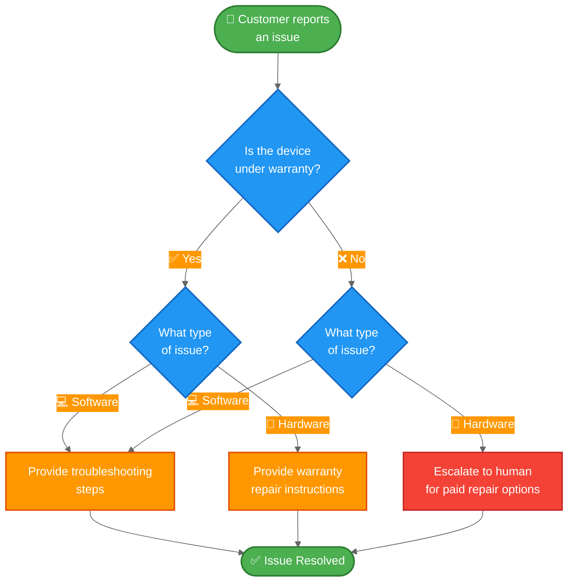

import ChatModelTabsPy from '/snippets/chat-model-tabs.mdx';
import ChatModelTabsJs from '/snippets/chat-model-tabs-js.mdx';

[状态机模式](/oss/langchain/multi-agent/handoffs)描述了智能体在任务的不同状态间移动时其行为发生变化的工作流。本教程展示了如何通过使用工具调用来动态更改单个智能体的配置，从而基于当前状态实现状态机——根据当前状态更新其可用工具和指令。状态可以由多个来源确定：智能体的过往操作（工具调用）、外部状态（例如 API 调用结果），甚至初始用户输入（例如，通过运行分类器来确定用户意图）。

在本教程中，你将构建一个客户支持智能体，其功能如下：

- 在继续之前收集保修信息。
- 将问题分类为硬件或软件问题。
- 提供解决方案或升级到人工支持。
- 在多轮对话中维护会话状态。

与[子智能体模式](/oss/langchain/multi-agent/subagents-personal-assistant)（其中子智能体作为工具被调用）不同，**状态机模式**使用单个智能体，其配置根据工作流进度而变化。每个“步骤”只是同一个底层智能体的不同配置（系统提示词 + 工具），根据状态动态选择。

以下是我们将要构建的工作流：



## 设置

### 安装

本教程需要 `langchain` 包：

:::python
<CodeGroup>
```bash pip
pip install langchain
```
```bash uv
uv add langchain
```
```bash conda
conda install langchain -c conda-forge
```
</CodeGroup>
:::

:::js
<CodeGroup>
```bash npm
npm install langchain
```
```bash yarn
yarn add langchain
```
```bash pnpm
pnpm add langchain
```
</CodeGroup>
:::

更多详情，请参阅我们的[安装指南](/oss/langchain/install)。

### LangSmith

设置 [LangSmith](https://smith.langchain.com) 以检查智能体内部发生的情况。然后设置以下环境变量：

:::python
<CodeGroup>
```bash bash
export LANGSMITH_TRACING="true"
export LANGSMITH_API_KEY="..."
```
```python python
import getpass
import os

os.environ["LANGSMITH_TRACING"] = "true"
os.environ["LANGSMITH_API_KEY"] = getpass.getpass()
```
</CodeGroup>
:::

:::js
<CodeGroup>
```bash bash
export LANGSMITH_TRACING="true"
export LANGSMITH_API_KEY="..."
```
```typescript typescript
process.env.LANGSMITH_TRACING = "true";
process.env.LANGSMITH_API_KEY = "...";
```
</CodeGroup>
:::

### 选择 LLM

从 LangChain 的集成套件中选择一个聊天模型：

:::python
<ChatModelTabsPy />
:::

:::js
<ChatModelTabsJs />
:::

## 1. 定义自定义状态

首先，定义一个自定义状态模式，用于跟踪当前处于哪个步骤：

```python
from langchain.agents import AgentState
from typing_extensions import NotRequired
from typing import Literal

# 定义可能的工作流步骤
SupportStep = Literal["warranty_collector", "issue_classifier", "resolution_specialist"]  # [!code highlight]

class SupportState(AgentState):  # [!code highlight]
    """客户支持工作流的状态。"""
    current_step: NotRequired[SupportStep]  # [!code highlight]
    warranty_status: NotRequired[Literal["in_warranty", "out_of_warranty"]]
    issue_type: NotRequired[Literal["hardware", "software"]]
```

`current_step` 字段是状态机模式的核心——它决定了在每一轮中加载哪个配置（提示词 + 工具）。

## 2. 创建管理工作流状态的工具

创建用于更新工作流状态的工具。这些工具允许智能体记录信息并转换到下一步。

关键在于使用 `Command` 来更新状态，包括 `current_step` 字段：

```python
from langchain.tools import tool, ToolRuntime
from langchain.messages import ToolMessage
from langgraph.types import Command

@tool
def record_warranty_status(
    status: Literal["in_warranty", "out_of_warranty"],
    runtime: ToolRuntime[None, SupportState],
) -> Command:  # [!code highlight]
    """记录客户的保修状态并转换到问题分类步骤。"""
    return Command(  # [!code highlight]
        update={  # [!code highlight]
            "messages": [
                ToolMessage(
                    content=f"Warranty status recorded as: {status}",
                    tool_call_id=runtime.tool_call_id,
                )
            ],
            "warranty_status": status,
            "current_step": "issue_classifier",  # [!code highlight]
        }
    )


@tool
def record_issue_type(
    issue_type: Literal["hardware", "software"],
    runtime: ToolRuntime[None, SupportState],
) -> Command:  # [!code highlight]
    """记录问题类型并转换到解决方案专家步骤。"""
    return Command(  # [!code highlight]
        update={  # [!code highlight]
            "messages": [
                ToolMessage(
                    content=f"Issue type recorded as: {issue_type}",
                    tool_call_id=runtime.tool_call_id,
                )
            ],
            "issue_type": issue_type,
            "current_step": "resolution_specialist",  # [!code highlight]
        }
    )


@tool
def escalate_to_human(reason: str) -> str:
    """将案例升级给人工支持专家。"""
    # 在实际系统中，这将创建工单、通知工作人员等。
    return f"Escalating to human support. Reason: {reason}"


@tool
def provide_solution(solution: str) -> str:
    """为客户的问题提供解决方案。"""
    return f"Solution provided: {solution}"
```

注意 `record_warranty_status` 和 `record_issue_type` 如何返回 `Command` 对象，这些对象既更新数据（`warranty_status`、`issue_type`）也更新 `current_step`。这就是状态机的工作原理——工具控制工作流的进展。

## 3. 定义步骤配置

为每个步骤定义提示词和工具。首先，为每个步骤定义提示词：

<Accordion title="查看完整的提示词定义">

```python
# 将提示词定义为常量以便引用
WARRANTY_COLLECTOR_PROMPT = """You are a customer support agent helping with device issues.

CURRENT STAGE: Warranty verification

At this step, you need to:
1. Greet the customer warmly
2. Ask if their device is under warranty
3. Use record_warranty_status to record their response and move to the next step

Be conversational and friendly. Don't ask multiple questions at once."""

ISSUE_CLASSIFIER_PROMPT = """You are a customer support agent helping with device issues.

CURRENT STAGE: Issue classification
CUSTOMER INFO: Warranty status is {warranty_status}

At this step, you need to:
1. Ask the customer to describe their issue
2. Determine if it's a hardware issue (physical damage, broken parts) or software issue (app crashes, performance)
3. Use record_issue_type to record the classification and move to the next step

If unclear, ask clarifying questions before classifying."""

RESOLUTION_SPECIALIST_PROMPT = """You are a customer support agent helping with device issues.

CURRENT STAGE: Resolution
CUSTOMER INFO: Warranty status is {warranty_status}, issue type is {issue_type}

At this step, you need to:
1. For SOFTWARE issues: provide troubleshooting steps using provide_solution
2. For HARDWARE issues:
   - If IN WARRANTY: explain warranty repair process using provide_solution
   - If OUT OF WARRANTY: escalate_to_human for paid repair options

Be specific and helpful in your solutions."""
```

</Accordion>

然后使用字典将步骤名称映射到其配置：

```python
# 步骤配置：将步骤名称映射到（提示词，工具，所需状态）
STEP_CONFIG = {
    "warranty_collector": {
        "prompt": WARRANTY_COLLECTOR_PROMPT,
        "tools": [record_warranty_status],
        "requires": [],
    },
    "issue_classifier": {
        "prompt": ISSUE_CLASSIFIER_PROMPT,
        "tools": [record_issue_type],
        "requires": ["warranty_status"],
    },
    "resolution_specialist": {
        "prompt": RESOLUTION_SPECIALIST_PROMPT,
        "tools": [provide_solution, escalate_to_human],
        "requires": ["warranty_status", "issue_type"],
    },
}
```

这种基于字典的配置使得：
- 一目了然地查看所有步骤
- 添加新步骤（只需添加另一个条目）
- 理解工作流依赖关系（`requires` 字段）
- 使用带有状态变量的提示词模板（例如 `{warranty_status}`）

## 4. 创建基于步骤的中间件

创建一个中间件，从状态中读取 `current_step` 并应用相应的配置。我们将使用 `@wrap_model_call` 装饰器来实现一个清晰的实现：

```python
from langchain.agents.middleware import wrap_model_call, ModelRequest, ModelResponse
from typing import Callable


@wrap_model_call  # [!code highlight]
def apply_step_config(
    request: ModelRequest,
    handler: Callable[[ModelRequest], ModelResponse],
) -> ModelResponse:
    """根据当前步骤配置智能体行为。"""
    # 获取当前步骤（首次交互默认为 warranty_collector）
    current_step = request.state.get("current_step", "warranty_collector")  # [!code highlight]

    # 查找步骤配置
    stage_config = STEP_CONFIG[current_step]  # [!code highlight]

    # 验证所需状态是否存在
    for key in stage_config["requires"]:
        if request.state.get(key) is None:
            raise ValueError(f"{key} must be set before reaching {current_step}")

    # 使用状态值格式化提示词（支持 {warranty_status}、{issue_type} 等）
    system_prompt = stage_config["prompt"].format(**request.state)

    # 注入系统提示词和步骤特定工具
    request = request.override(  # [!code highlight]
        system_prompt=system_prompt,  # [!code highlight]
        tools=stage_config["tools"],  # [!code highlight]
    )

    return handler(request)
```

这个中间件：

1.  **读取当前步骤**：从状态中获取 `current_step`（默认为 "warranty_collector"）。
2.  **查找配置**：在 `STEP_CONFIG` 中找到匹配的条目。
3.  **验证依赖关系**：确保所需的状态字段存在。
4.  **格式化提示词**：将状态值注入到提示词模板中。
5.  **应用配置**：覆盖系统提示词和可用工具。

`request.override()` 方法是关键——它允许我们根据状态动态更改智能体的行为，而无需创建单独的智能体实例。

## 5. 创建智能体

现在使用基于步骤的中间件和一个用于状态持久化的检查点器来创建智能体：

```python
from langchain.agents import create_agent
from langgraph.checkpoint.memory import InMemorySaver

# 从所有步骤配置中收集所有工具
all_tools = [
    record_warranty_status,
    record_issue_type,
    provide_solution,
    escalate_to_human,
]

# 使用基于步骤的配置创建智能体
agent = create_agent(
    model,
    tools=all_tools,
    state_schema=SupportState,  # [!code highlight]
    middleware=[apply_step_config],  # [!code highlight]
    checkpointer=InMemorySaver(),  # [!code highlight]
)
```

<Note>
**为什么需要检查点器？** 检查点器在对话轮次之间维护状态。没有它，`current_step` 状态将在用户消息之间丢失，从而破坏工作流。
</Note>

## 6. 测试工作流

测试完整的工作流：

```python
from langchain.messages import HumanMessage
import uuid

# 此对话线程的配置
thread_id = str(uuid.uuid4())
config = {"configurable": {"thread_id": thread_id}}

# 第 1 轮：初始消息 - 从 warranty_collector 步骤开始
print("=== Turn 1: Warranty Collection ===")
result = agent.invoke(
    {"messages": [HumanMessage("Hi, my phone screen is cracked")]},
    config
)
for msg in result['messages']:
    msg.pretty_print()

# 第 2 轮：用户回应保修情况
print("\n=== Turn 2: Warranty Response ===")
result = agent.invoke(
    {"messages": [HumanMessage("Yes, it's still under warranty")]},
    config
)
for msg in result['messages']:
    msg.pretty_print()
print(f"Current step: {result.get('current_step')}")

# 第 3 轮：用户描述问题
print("\n=== Turn 3: Issue Description ===")
result = agent.invoke(
    {"messages": [HumanMessage("The screen is physically cracked from dropping it")]},
    config
)
for msg in result['messages']:
    msg.pretty_print()
print(f"Current step: {result.get('current_step')}")

# 第 4 轮：解决方案
print("\n=== Turn 4: Resolution ===")
result = agent.invoke(
    {"messages": [HumanMessage("What should I do?")]},
    config
)
for msg in result['messages']:
    msg.pretty_print()
```

预期流程：
1.  **保修验证步骤**：询问保修状态
2.  **问题分类步骤**：询问问题，确定为硬件问题
3.  **解决方案步骤**：提供保修维修说明

## 7. 理解状态转换

让我们追踪每一轮发生了什么：

### 第 1 轮：初始消息
```python
{
    "messages": [HumanMessage("Hi, my phone screen is cracked")],
    "current_step": "warranty_collector"  # 默认值
}
```

中间件应用：
- 系统提示词：`WARRANTY_COLLECTOR_PROMPT`
- 工具：`[record_warranty_status]`

### 第 2 轮：保修记录后
工具调用：`record_warranty_status("in_warranty")` 返回：
```python
Command(update={
    "warranty_status": "in_warranty",
    "current_step": "issue_classifier"  # 状态转换！
})
```

下一轮，中间件应用：
- 系统提示词：`ISSUE_CLASSIFIER_PROMPT`（使用 `warranty_status="in_warranty"` 格式化）
- 工具：`[record_issue_type]`

### 第 3 轮：问题分类后
工具调用：`record_issue_type("hardware")` 返回：
```python
Command(update={
    "issue_type": "hardware",
    "current_step": "resolution_specialist"  # 状态转换！
})
```

下一轮，中间件应用：
- 系统提示词：`RESOLUTION_SPECIALIST_PROMPT`（使用 `warranty_status` 和 `issue_type` 格式化）
- 工具：`[provide_solution, escalate_to_human]`

关键见解：**工具通过更新 `current_step` 来驱动工作流**，而**中间件通过在下轮应用适当的配置来响应**。

## 8. 管理消息历史记录

随着智能体在步骤中前进，消息历史记录会增长。使用[摘要中间件](/oss/langchain/short-term-memory#summarize-messages)来压缩较早的消息，同时保留对话上下文：

```python
from langchain.agents import create_agent
from langchain.agents.middleware import SummarizationMiddleware  # [!code highlight]
from langgraph.checkpoint.memory import InMemorySaver

agent = create_agent(
    model,
    tools=all_tools,
    state_schema=SupportState,
    middleware=[
        apply_step_config,
        SummarizationMiddleware(  # [!code highlight]
            model="gpt-4o-mini",
            trigger=("tokens", 4000),
            keep=("messages", 10)
        )
    ],
    checkpointer=InMemorySaver(),
)
```

有关其他内存管理技术，请参阅[短期记忆指南
