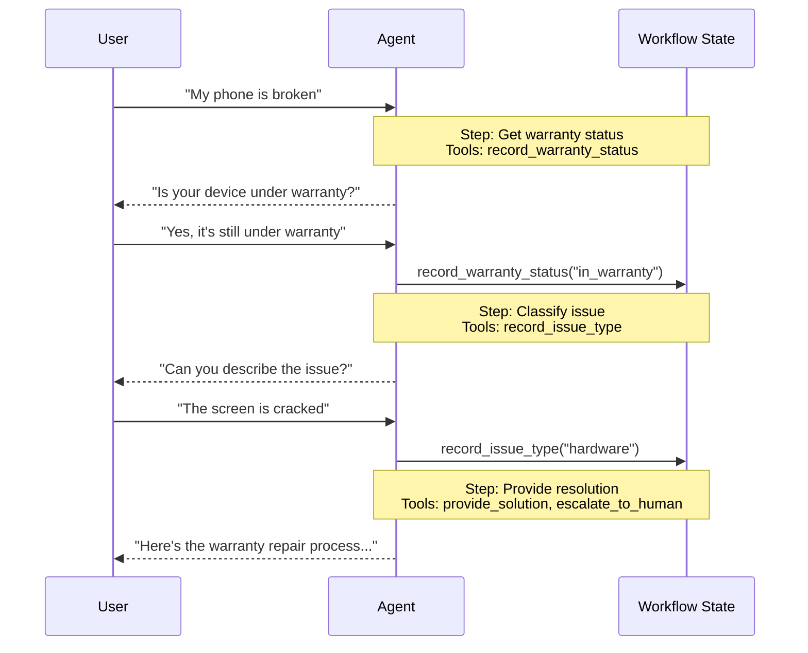

在**交接（handoffs）**架构中，行为会根据状态动态变化。其核心机制是：[工具](/oss/langchain/tools)更新一个在多个对话轮次中持久存在的状态变量（例如 `current_step` 或 `active_agent`），系统读取此变量以调整行为——要么应用不同的配置（系统提示词、工具），要么路由到不同的[智能体（agent）](/oss/langchain/agents)。此模式既支持不同智能体之间的交接，也支持单个智能体内部的动态配置变更。

<Tip>
**交接（handoffs）** 一词由 [OpenAI](https://openai.github.io/openai-agents-python/handoffs/) 创造，用于描述使用工具调用（例如 `transfer_to_sales_agent`）在智能体或状态之间转移控制权。
</Tip>



## 关键特性

*   **状态驱动行为**：行为基于状态变量（例如 `current_step` 或 `active_agent`）变化。
*   **基于工具的转换**：工具更新状态变量以在不同状态间移动。
*   **直接用户交互**：每个状态的配置直接处理用户消息。
*   **持久化状态**：状态在对话轮次间持续存在。

## 何时使用

当你需要强制执行顺序约束（仅在满足前提条件后解锁功能）、智能体需要在不同状态下直接与用户对话，或者你正在构建多阶段对话流程时，请使用交接模式。此模式对于需要按特定顺序收集信息的客户支持场景特别有价值——例如，在处理退款前收集保修 ID。

## 基础实现

核心机制是一个返回 [`Command`](/oss/langgraph/graph-api#command) 来更新状态的[工具](/oss/langchain/tools)，从而触发向新步骤或新智能体的转换：

:::python
```python
from langchain.tools import tool
from langchain.messages import ToolMessage
from langgraph.types import Command

@tool
def transfer_to_specialist(runtime) -> Command:
    """Transfer to the specialist agent."""
    return Command(
        update={
            "messages": [
                ToolMessage(  # [!code highlight]
                    content="Transferred to specialist",
                    tool_call_id=runtime.tool_call_id  # [!code highlight]
                )
            ],
            "current_step": "specialist"  # Triggers behavior change
        }
    )
```
:::
:::js
```typescript
import { tool } from "@langchain/core/tools";
import { Command } from "@langchain/langgraph";
import { ToolMessage } from "@langchain/core/messages";
import { z } from "zod";

const transferToSpecialist = tool(
  async (_, config) => {
    return new Command({
      update: {
        messages: [
          new ToolMessage({  // [!code highlight]
            content: "Transferred to specialist",
            tool_call_id: config.toolCall?.id!  // [!code highlight]
          })
        ],
        currentStep: "specialist"  // Triggers behavior change
      }
    });
  },
  {
    name: "transfer_to_specialist",
    description: "Transfer to the specialist agent.",
    schema: z.object({})
  }
);
```
:::

<Note>
**为什么包含 `ToolMessage`？** 当 LLM 调用一个工具时，它期望得到一个响应。带有匹配 `tool_call_id` 的 `ToolMessage` 完成了这个请求-响应周期——没有它，对话历史就会变得格式错误。每当你的交接工具更新消息时，这都是必需的。
</Note>

关于完整实现，请参阅下面的教程。

<Card
    title="教程：使用交接模式构建客户支持系统"
    icon="people-arrows"
    href="/oss/langchain/multi-agent/handoffs-customer-support"
    arrow cta="了解更多"
>
    学习如何使用交接模式构建一个客户支持智能体，其中单个智能体在不同配置之间转换。
</Card>

## 实现方法

有两种实现交接的方式：**[使用中间件的单智能体](#single-agent-with-middleware)**（一个具有动态配置的智能体）或**[多智能体子图](#multiple-agent-subgraphs)**（作为图节点的不同智能体）。

### 使用中间件的单智能体

单个智能体根据状态改变其行为。中间件拦截每个模型调用，并动态调整系统提示词和可用工具。工具更新状态变量以触发转换：

:::python
```python
from langchain.tools import ToolRuntime, tool
from langchain.messages import ToolMessage
from langgraph.types import Command

@tool
def record_warranty_status(
    status: str,
    runtime: ToolRuntime[None, SupportState]
) -> Command:
    """Record warranty status and transition to next step."""
    return Command(
        update={
            "messages": [
                ToolMessage(
                    content=f"Warranty status recorded: {status}",
                    tool_call_id=runtime.tool_call_id
                )
            ],
            "warranty_status": status,
            "current_step": "specialist"  # Update state to trigger transition
        }
    )
```
:::
:::js
```typescript
import { tool } from "@langchain/core/tools";
import { Command } from "@langchain/langgraph";
import { ToolMessage } from "@langchain/core/messages";
import { z } from "zod";

const recordWarrantyStatus = tool(
  async ({ status }, config) => {
    return new Command({
      update: {
        messages: [
          new ToolMessage({
            content: `Warranty status recorded: ${status}`,
            tool_call_id: config.toolCall?.id!
          })
        ],
        warrantyStatus: status,
        currentStep: "specialist"  // Update state to trigger transition
      }
    });
  },
  {
    name: "record_warranty_status",
    description: "Record warranty status and transition to next step.",
    schema: z.object({
      status: z.string()
    })
  }
);
```
:::

<Accordion title="完整示例：使用中间件的客户支持">

:::python
```python
from langchain.agents import AgentState, create_agent
from langchain.agents.middleware import wrap_model_call, ModelRequest, ModelResponse
from langchain.tools import tool, ToolRuntime
from langchain.messages import ToolMessage
from langgraph.types import Command
from typing import Callable

# 1. Define state with current_step tracker
class SupportState(AgentState):  # [!code highlight]
    """Track which step is currently active."""
    current_step: str = "triage"  # [!code highlight]
    warranty_status: str | None = None

# 2. Tools update current_step via Command
@tool
def record_warranty_status(
    status: str,
    runtime: ToolRuntime[None, SupportState]
) -> Command:  # [!code highlight]
    """Record warranty status and transition to next step."""
    return Command(update={  # [!code highlight]
        "messages": [  # [!code highlight]
            ToolMessage(
                content=f"Warranty status recorded: {status}",
                tool_call_id=runtime.tool_call_id
            )
        ],
        "warranty_status": status,
        # Transition to next step
        "current_step": "specialist"    # [!code highlight]
    })

# 3. Middleware applies dynamic configuration based on current_step
@wrap_model_call  # [!code highlight]
def apply_step_config(
    request: ModelRequest,
    handler: Callable[[ModelRequest], ModelResponse]
) -> ModelResponse:
    """Configure agent behavior based on current_step."""
    step = request.state.get("current_step", "triage")  # [!code highlight]

    # Map steps to their configurations
    configs = {
        "triage": {
            "prompt": "Collect warranty information...",
            "tools": [record_warranty_status]
        },
        "specialist": {
            "prompt": "Provide solutions based on warranty: {warranty_status}",
            "tools": [provide_solution, escalate]
        }
    }

    config = configs[step]
    request = request.override(  # [!code highlight]
        system_prompt=config["prompt"].format(**request.state),  # [!code highlight]
        tools=config["tools"]  # [!code highlight]
    )
    return handler(request)

# 4. Create agent with middleware
agent = create_agent(
    model,
    tools=[record_warranty_status, provide_solution, escalate],
    state_schema=SupportState,
    middleware=[apply_step_config],  # [!code highlight]
    checkpointer=InMemorySaver()  # Persist state across turns  # [!code highlight]
)
```
:::
:::js
```typescript
import { tool, createAgent, AgentState } from "langchain";
import { wrapModelCall, ModelRequest, ModelResponse } from "langchain/agents/middleware";
import { Command } from "@langchain/langgraph";
import { ToolMessage } from "langchain/messages";
import * as z from "zod";

// 1. Define state with current_step tracker
const SupportState = z.object({  // [!code highlight]
  currentStep: z.string().default("triage"),  // [!code highlight]
  warrantyStatus: z.string().optional()
});

// 2. Tools update currentStep via Command
const recordWarrantyStatus = tool(
  async ({ status }, config) => {
    return new Command({  // [!code highlight]
      update: {  // [!code highlight]
        messages: [  // [!code highlight]
          new ToolMessage({
            content: `Warranty status recorded: ${status}`,
            tool_call_id: config.toolCall?.id!
          })
        ],
        warrantyStatus: status,
        // Transition to next step
        currentStep: "specialist",  // [!code highlight]
      }
    });
  },
  {
    name: "record_warranty_status",
    description: "Record warranty status and transition",
    schema: z.object({ status: z.string() })
  }
);

// 3. Middleware applies dynamic configuration based on currentStep
const applyStepConfig = wrapModelCall(  // [!code highlight]
  async (request: ModelRequest, handler) => {
    const step = request.state.currentStep || "triage";  // [!code highlight]

    // Map steps to their configurations
    const configs = {
      triage: {
        prompt: "Collect warranty information...",
        tools: [recordWarrantyStatus]
      },
      specialist: {
        prompt: `Provide solutions based on warranty: ${request.state.warrantyStatus}`,
        tools: [provideSolution, escalate]
      }
    };

    const config = configs[step];
    request = request.override({  // [!code highlight]
      systemPrompt: config.prompt,  // [!code highlight]
      tools: config.tools  // [!code highlight]
    });
    return handler(request);
  }
);

// 4. Create agent with middleware
const agent = createAgent({
  model,
  tools: [recordWarrantyStatus, provideSolution, escalate],
  stateSchema: SupportState,
  middleware: [applyStepConfig],  // [!code highlight]
  checkpointer: new InMemorySaver()  // Persist state across turns  // [!code highlight]
});
```
:::

</Accordion>

### 多智能体子图

多个不同的智能体作为单独的节点存在于图中。交接工具使用 `Command.PARENT` 在智能体节点之间导航，以指定接下来执行哪个节点。

<Warning>
子图交接需要仔细的**[上下文工程（context engineering）](/oss/langchain/context-engineering)**。与单智能体中间件（消息历史自然流动）不同，你必须明确决定哪些消息在智能体之间传递。如果处理不当，智能体将收到格式错误的对话历史或臃肿的上下文。请参阅下面的[上下文工程](#context-engineering)。
</Warning>

:::python
```python
from langchain.messages import AIMessage, ToolMessage
from langchain.tools import tool, ToolRuntime
from langgraph.types import Command

@tool
def transfer_to_sales(
    runtime: ToolRuntime,
) -> Command:
    """Transfer to the sales agent."""
    last_ai_message = next(  # [!code highlight]
        msg for msg in reversed(runtime.state["messages"]) if isinstance(msg, AIMessage)  # [!code highlight]
    )  # [!code highlight]
    transfer_message = ToolMessage(  # [!code highlight]
        content="Transferred to sales agent",  # [!code highlight]
        tool_call_id=runtime.tool_call_id,  # [!code highlight]
    )  # [!code highlight]
    return Command(
        goto="sales_agent",
        update={
            "active_agent": "sales_agent",
            "messages": [last_ai_message, transfer_message],  # [!code highlight]
        },
        graph=Command.PARENT
    )
```
:::
:::js
```typescript
import { tool, ToolRuntime } from "@langchain/core/tools";
import { AIMessage, ToolMessage } from "@langchain/core/messages";
import { Command } from "@langchain/langgraph";
import { z } from "zod";

const transferToSales = tool(
  async (_, { runtime }: { runtime: ToolRuntime }) => {
    const lastAiMessage = [...runtime.state.messages]  // [!code highlight]
      .reverse()  // [!code highlight]
      .find((msg): msg is AIMessage => msg instanceof AIMessage);  // [!code highlight]
    const transferMessage = new ToolMessage({  // [!code highlight]
      content: "Transferred to sales agent",  // [!code highlight]
      tool_call_id: runtime.toolCallId  // [!code highlight]
    });  // [!code highlight]
    return new Command({
      goto: "sales_agent",
      update: {
        activeAgent: "sales_agent",
        messages: [lastAiMessage, transferMessage].filter(Boolean),  // [!code highlight]
      },
      graph: Command.PARENT
    });
  },
  {
    name: "transfer_to_sales",
    description: "Transfer to the sales agent.",
    schema: z.object({})
  }
);
```
:::

<Accordion title="完整示例：具有交接功能的销售和支持系统">

此示例展示了一个包含独立销售和支持智能体的多智能体系统。每个智能体都是一个独立的图节点，交接工具允许智能体将会话转移给对方。

:::python
```python
from typing import Literal

from langchain.agents import AgentState, create_agent
from langchain.messages import AIMessage, ToolMessage
from langchain.tools import tool, ToolRuntime
from langgraph.graph import StateGraph, START, END
from langgraph.types import Command
from typing_extensions import NotRequired


# 1. Define state with active_agent tracker
class MultiAgentState(AgentState):
    active_agent: NotRequired[str]


# 2. Create handoff tools
@tool
def transfer_to_sales(
    runtime: ToolRuntime,
) -> Command:
    """Transfer to the sales agent."""
    last_ai_message = next(  # [!code highlight]
        msg for msg in reversed(runtime.state["messages"]) if isinstance(msg, AIMessage)  # [!code highlight]
    )  # [!code highlight]
    transfer_message = ToolMessage(  # [!code highlight]
        content="Transferred to sales agent from support agent",  # [!code highlight]
        tool_call_id=runtime.tool_call_id,  # [!code highlight]
    )  # [!code highlight]
    return Command(
        goto="sales_agent",
        update={
            "active_agent": "sales_agent",
            "messages": [last_ai_message, transfer_message],  # [!code highlight]
        },
        graph=Command.PARENT,
    )


@tool
def transfer_to_support(
    runtime: ToolRuntime,
) -> Command:
    """Transfer to the support agent."""
    last_ai_message = next(  # [!code highlight]
        msg for msg in reversed(runtime.state["messages"]) if isinstance(msg, AIMessage)  # [!code highlight]
    )  # [!code highlight]
    transfer_message = ToolMessage(  # [!code highlight]
        content="Transferred to support agent from sales agent",  # [!code highlight]
        tool_call_id=runtime.tool_call_id,  # [!code highlight]
    )  # [!code highlight]
    return Command(
        goto="support_agent",
        update={
            "active_agent": "support_agent",
            "messages": [last_ai_message, transfer_message],  # [!code highlight]
        },
        graph=Command.PARENT,
    )


# 3. Create agents with handoff tools
sales_agent = create_agent(
    model="anthropic:claude-sonnet-4-20250514",
    tools=[transfer_to_support],
    system_prompt="You are a sales agent. Help with sales inquiries. If asked about technical issues or support, transfer to the support agent.",
)

support_agent = create_agent(
    model="anthropic:claude-sonnet-4-20250514",
    tools=[transfer_to_sales],
    system_prompt="You are a support agent. Help with technical issues. If asked about pricing or purchasing, transfer to the sales agent.",
)


# 4. Create agent nodes that invoke the agents
def call_sales_agent(state: MultiAgentState) -> Command:
    """Node that calls the sales agent."""
    response = sales_agent.invoke(state)
    return response


def call_support_agent(state: MultiAgentState) -> Command:
    """Node that calls the support agent."""
    response = support_agent.invoke(state)
    return response


# 5. Create router that checks if we should end or continue
def route_after_agent(
    state: MultiAgentState,
) -> Literal["sales_agent", "support_agent", "__end
