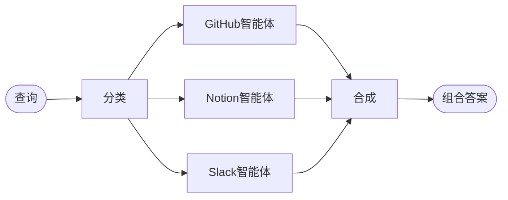

import ChatModelTabsPy from '/snippets/chat-model-tabs.mdx';
import ChatModelTabsJs from '/snippets/chat-model-tabs-js.mdx';

## 概述

**路由器模式**是一种[多智能体](/oss/langchain/multi-agent)架构，其中路由步骤对输入进行分类，并将其定向到专门的智能体，然后将结果合成为一个组合响应。当您组织的知识分布在不同的**垂直领域**（每个领域都需要自己的智能体，配备专门的工具和提示词）时，这种模式表现出色。

在本教程中，您将构建一个多源知识库路由器，通过一个真实的企业场景来展示这些优势。该系统将协调三个专家：

- 一个**GitHub智能体**，用于搜索代码、问题和拉取请求。
- 一个**Notion智能体**，用于搜索内部文档和维基。
- 一个**Slack智能体**，用于搜索相关线程和讨论。

当用户询问“如何验证API请求？”时，路由器将查询分解为特定于源的子问题，将它们并行路由到相关智能体，并将结果合成为一个连贯的答案。



### 为什么使用路由器？

路由器模式提供了几个优势：

- **并行执行**：同时查询多个源，与顺序方法相比减少了延迟。
- **专业化智能体**：每个垂直领域都有针对其领域优化的专用工具和提示词。
- **选择性路由**：并非每个查询都需要每个源——路由器智能地选择相关垂直领域。
- **针对性子问题**：每个智能体收到针对其领域定制的问题，提高了结果质量。
- **清晰合成**：来自多个源的结果被组合成单一、连贯的响应。

### 概念

我们将涵盖以下概念：

- [多智能体系统](/oss/langchain/multi-agent)
- 用于工作流编排的 [StateGraph](/oss/langchain/graphs)
- 用于并行执行的 [Send API](/oss/langchain/send)

<Tip>
**路由器 vs. 子智能体**：[子智能体模式](/oss/langchain/multi-agent/subagents) 也可以路由到多个智能体。当您需要专门的预处理、自定义路由逻辑或希望显式控制并行执行时，请使用路由器模式。当您希望LLM动态决定调用哪些智能体时，请使用子智能体模式。
</Tip>

## 设置

### 安装

本教程需要 `langchain` 和 `langgraph` 包：

:::python
<CodeGroup>
```bash pip
pip install langchain langgraph
```
```bash uv
uv add langchain langgraph
```
```bash conda
conda install langchain langgraph -c conda-forge
```
</CodeGroup>
:::

:::js
<CodeGroup>
```bash npm
npm install langchain @langchain/langgraph
```
```bash yarn
yarn add langchain @langchain/langgraph
```
```bash pnpm
pnpm add langchain @langchain/langgraph
```
</CodeGroup>
:::

更多详情，请参阅我们的[安装指南](/oss/langchain/install)。

### LangSmith

设置 [LangSmith](https://smith.langchain.com) 以检查智能体内部发生的情况。然后设置以下环境变量：

:::python
<CodeGroup>
```bash bash
export LANGSMITH_TRACING="true"
export LANGSMITH_API_KEY="..."
```
```python python
import getpass
import os

os.environ["LANGSMITH_TRACING"] = "true"
os.environ["LANGSMITH_API_KEY"] = getpass.getpass()
```
</CodeGroup>
:::

:::js
<CodeGroup>
```bash bash
export LANGSMITH_TRACING="true"
export LANGSMITH_API_KEY="..."
```
```typescript typescript
process.env.LANGSMITH_TRACING = "true";
process.env.LANGSMITH_API_KEY = "...";
```
</CodeGroup>
:::

### 选择LLM

从LangChain的集成套件中选择一个聊天模型：

:::python
<ChatModelTabsPy />
:::

:::js
<ChatModelTabsJs />
:::

## 1. 定义状态

首先，定义状态模式。我们使用三种类型：

- **`AgentInput`**：传递给每个子智能体的简单状态（仅查询）
- **`AgentOutput`**：每个子智能体返回的结果（源名称 + 结果）
- **`RouterState`**：主工作流状态，跟踪查询、分类、结果和最终答案

:::python
```python
from typing import Annotated, Literal, TypedDict
import operator


class AgentInput(TypedDict):
    """每个子智能体的简单输入状态。"""
    query: str


class AgentOutput(TypedDict):
    """每个子智能体的输出。"""
    source: str
    result: str


class Classification(TypedDict):
    """单个路由决策：调用哪个智能体以及使用什么查询。"""
    source: Literal["github", "notion", "slack"]
    query: str


class RouterState(TypedDict):
    query: str
    classifications: list[Classification]
    results: Annotated[list[AgentOutput], operator.add]  # Reducer收集并行结果
    final_answer: str
```
:::

:::js
```typescript
import { Annotation } from "@langchain/langgraph";

// 每个子智能体的简单输入状态
interface AgentInput {
  query: string;
}

// 每个子智能体的输出
interface AgentOutput {
  source: string;
  result: string;
}

// 单个路由决策
interface Classification {
  source: "github" | "notion" | "slack";
  query: string;
}

const RouterState = Annotation.Root({
  query: Annotation<string>(),
  classifications: Annotation<Classification[]>(),
  results: Annotation<AgentOutput[]>({
    reducer: (current, update) => current.concat(update),  // 收集并行结果
    default: () => [],
  }),
  finalAnswer: Annotation<string>(),
});
```
:::

`results` 字段使用 **reducer**（Python中为 `operator.add`，JS中为concat函数）将并行智能体执行的输出收集到单个列表中。

## 2. 为每个垂直领域定义工具

为每个知识领域创建工具。在生产系统中，这些工具将调用实际的API。在本教程中，我们使用返回模拟数据的存根实现。我们在3个垂直领域中定义了7个工具：GitHub（搜索代码、问题、PR）、Notion（搜索文档、获取页面）和Slack（搜索消息、获取线程）。

:::python
```python expandable
from langchain.tools import tool


@tool
def search_code(query: str, repo: str = "main") -> str:
    """在GitHub仓库中搜索代码。"""
    return f"Found code matching '{query}' in {repo}: authentication middleware in src/auth.py"


@tool
def search_issues(query: str) -> str:
    """搜索GitHub问题和拉取请求。"""
    return f"Found 3 issues matching '{query}': #142 (API auth docs), #89 (OAuth flow), #203 (token refresh)"


@tool
def search_prs(query: str) -> str:
    """搜索拉取请求以获取实现细节。"""
    return f"PR #156 added JWT authentication, PR #178 updated OAuth scopes"


@tool
def search_notion(query: str) -> str:
    """在Notion工作区中搜索文档。"""
    return f"Found documentation: 'API Authentication Guide' - covers OAuth2 flow, API keys, and JWT tokens"


@tool
def get_page(page_id: str) -> str:
    """通过ID获取特定的Notion页面。"""
    return f"Page content: Step-by-step authentication setup instructions"


@tool
def search_slack(query: str) -> str:
    """搜索Slack消息和线程。"""
    return f"Found discussion in #engineering: 'Use Bearer tokens for API auth, see docs for refresh flow'"


@tool
def get_thread(thread_id: str) -> str:
    """获取特定的Slack线程。"""
    return f"Thread discusses best practices for API key rotation"
```
:::

:::js
```typescript expandable
import { tool } from "langchain";
import { z } from "zod";

const searchCode = tool(
  async ({ query, repo }) => {
    return `Found code matching '${query}' in ${repo || "main"}: authentication middleware in src/auth.py`;
  },
  {
    name: "search_code",
    description: "Search code in GitHub repositories.",
    schema: z.object({
      query: z.string(),
      repo: z.string().optional().default("main"),
    }),
  }
);

const searchIssues = tool(
  async ({ query }) => {
    return `Found 3 issues matching '${query}': #142 (API auth docs), #89 (OAuth flow), #203 (token refresh)`;
  },
  {
    name: "search_issues",
    description: "Search GitHub issues and pull requests.",
    schema: z.object({
      query: z.string(),
    }),
  }
);

const searchPrs = tool(
  async ({ query }) => {
    return `PR #156 added JWT authentication, PR #178 updated OAuth scopes`;
  },
  {
    name: "search_prs",
    description: "Search pull requests for implementation details.",
    schema: z.object({
      query: z.string(),
    }),
  }
);

const searchNotion = tool(
  async ({ query }) => {
    return `Found documentation: 'API Authentication Guide' - covers OAuth2 flow, API keys, and JWT tokens`;
  },
  {
    name: "search_notion",
    description: "Search Notion workspace for documentation.",
    schema: z.object({
      query: z.string(),
    }),
  }
);

const getPage = tool(
  async ({ pageId }) => {
    return `Page content: Step-by-step authentication setup instructions`;
  },
  {
    name: "get_page",
    description: "Get a specific Notion page by ID.",
    schema: z.object({
      pageId: z.string(),
    }),
  }
);

const searchSlack = tool(
  async ({ query }) => {
    return `Found discussion in #engineering: 'Use Bearer tokens for API auth, see docs for refresh flow'`;
  },
  {
    name: "search_slack",
    description: "Search Slack messages and threads.",
    schema: z.object({
      query: z.string(),
    }),
  }
);

const getThread = tool(
  async ({ threadId }) => {
    return `Thread discusses best practices for API key rotation`;
  },
  {
    name: "get_thread",
    description: "Get a specific Slack thread.",
    schema: z.object({
      threadId: z.string(),
    }),
  }
);
```
:::

## 3. 创建专业化智能体

为每个垂直领域创建一个智能体。每个智能体都有特定领域的工具和针对其知识源优化的提示词。所有三个都遵循相同的模式——只有工具和系统提示词不同。

:::python
```python expandable
from langchain.agents import create_agent
from langchain.chat_models import init_chat_model

model = init_chat_model("openai:gpt-4o")

github_agent = create_agent(
    model,
    tools=[search_code, search_issues, search_prs],
    system_prompt=(
        "You are a GitHub expert. Answer questions about code, "
        "API references, and implementation details by searching "
        "repositories, issues, and pull requests."
    ),
)

notion_agent = create_agent(
    model,
    tools=[search_notion, get_page],
    system_prompt=(
        "You are a Notion expert. Answer questions about internal "
        "processes, policies, and team documentation by searching "
        "the organization's Notion workspace."
    ),
)

slack_agent = create_agent(
    model,
    tools=[search_slack, get_thread],
    system_prompt=(
        "You are a Slack expert. Answer questions by searching "
        "relevant threads and discussions where team members have "
        "shared knowledge and solutions."
    ),
)
```
:::

:::js
```typescript expandable
import { createAgent } from "langchain";
import { ChatOpenAI } from "@langchain/openai";

const llm = new ChatOpenAI({ model: "gpt-4o" });

const githubAgent = createAgent({
  model: llm,
  tools: [searchCode, searchIssues, searchPrs],
  systemPrompt: `
You are a GitHub expert. Answer questions about code,
API references, and implementation details by searching
repositories, issues, and pull requests.
  `.trim(),
});

const notionAgent = createAgent({
  model: llm,
  tools: [searchNotion, getPage],
  systemPrompt: `
You are a Notion expert. Answer questions about internal
processes, policies, and team documentation by searching
the organization's Notion workspace.
  `.trim(),
});

const slackAgent = createAgent({
  model: llm,
  tools: [searchSlack, getThread],
  systemPrompt: `
You are a Slack expert. Answer questions by searching
relevant threads and discussions where team members have
shared knowledge and solutions.
  `.trim(),
});
```
:::

## 4. 构建路由器工作流

现在使用 StateGraph 构建路由器工作流。该工作流有四个主要步骤：

1. **分类**：分析查询并确定调用哪些智能体以及使用什么子问题
2. **路由**：使用 `Send` 并行分发到选定的智能体
3. **查询智能体**：每个智能体接收一个简单的 `AgentInput` 并返回一个 `AgentOutput`
4. **合成**：将收集到的结果组合成一个连贯的响应

:::python
```python
from pydantic import BaseModel, Field
from langgraph.graph import StateGraph, START, END
from langgraph.types import Send

router_llm = init_chat_model("openai:gpt-4o-mini")


# 为分类器定义结构化输出模式
class ClassificationResult(BaseModel):  # [!code highlight]
    """将用户查询分类为智能体特定子问题的结果。"""
    classifications: list[Classification] = Field(
        description="要调用的智能体列表及其针对性的子问题"
    )


def classify_query(state: RouterState) -> dict:
    """分类查询并确定要调用哪些智能体。"""
    structured_llm = router_llm.with_structured_output(ClassificationResult)  # [!code highlight]

    result = structured_llm.invoke([
        {
            "role": "system",
            "content": """Analyze this query and determine which knowledge bases to consult.
For each relevant source, generate a targeted sub-question optimized for that source.

Available sources:
- github: Code, API references, implementation details, issues, pull requests
- notion: Internal documentation, processes, policies, team wikis
- slack: Team discussions, informal knowledge sharing, recent conversations

Return ONLY the sources that are relevant to the query. Each source should have
a targeted sub-question optimized for that specific knowledge domain.

Example for "How do I authenticate API requests?":
- github: "What authentication code exists? Search for auth middleware, JWT handling"
- notion: "What authentication documentation exists? Look for API auth guides"
(slack omitted because it's not relevant for this technical question)"""
        },
        {"role": "user", "content": state["query"]}
    ])

    return {"classifications": result.classifications}


def route_to_agents(state: RouterState) -> list[Send]:
    """根据分类分发到智能体。"""
    return [
        Send(c["source"], {"query": c["query"]})  # [!code highlight]
        for c in state["classifications"]
    ]


def query_github(state: AgentInput) -> dict:
    """查询GitHub智能体。"""
    result = github_agent.invoke({
        "messages": [{"role": "user", "content": state["query"]}]  # [!code highlight]
    })
    return {"results": [{"source": "github", "result": result["messages"][-1].content}]}


def query_notion(state: AgentInput) -> dict:
    """查询Notion智能体。"""
    result = notion_agent.invoke({
        "messages": [{"role": "user", "content": state["query"]}]  # [!code highlight]
    })
    return {"results": [{"source": "notion", "result": result["messages"][-1].content}]}


def query_slack(state: AgentInput) -> dict:
    """查询Slack智能体。"""
    result = slack_agent.invoke({
        "messages": [{"role": "user", "content": state["query"]}]  # [!code highlight]
    })
    return {"results": [{"source": "slack", "result": result["messages"][-1].content}]}


def synthesize_results(state: RouterState) -> dict:
    """将所有智能体的结果组合成一个连贯的答案。"""
    if not state["results"]:
        return {"final_answer": "No results found from any knowledge source."}

    # 为合成格式化结果
    formatted = [
        f"**From {r['source'].title()}:**\n{r['result']}"
        for r in state["results"]
    ]

    synthesis_response = router_llm.invoke([
        {
            "role": "system",
            "content": f"""Synthesize these search results to answer the original question: "{state['query']}"

- Combine information from multiple sources without redundancy
- Highlight the most relevant and actionable information
- Note any discrepancies between sources
- Keep the response concise and well-organized"""
        },
        {"role": "user", "content": "\n\n".join(formatted)}
    ])

    return {"final_answer": synthesis_response.content}
```
:::

:::js
```typescript
import { StateGraph, START, END, Send } from "@langchain/langgraph";
import { z } from "zod";

const routerLlm = new ChatOpenAI({ model: "gpt-4o-mini" });


// 为分类器定义结构化输出模式
const ClassificationResultSchema = z.object({  // [!code highlight]
  classifications: z.array(z.object({
    source: z.enum(["github", "notion", "slack"]),
    query: z.string(),
  })).describe("List of agents to invoke with their targeted sub-questions"),
});


async function
