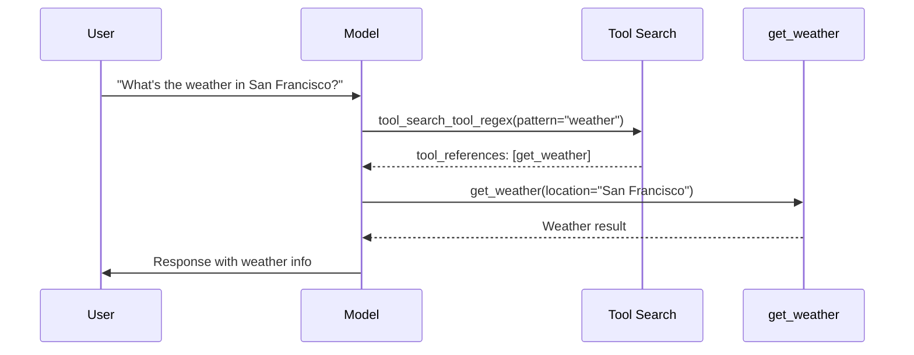

您可以在 [Claude](https://platform.claude.com/docs/en/about-claude/models/overview) 文档中找到有关 Anthropic 最新模型、其成本、上下文窗口和支持的输入类型的信息。

<Tip>
    **API 参考**

    有关所有功能和配置选项的详细文档，请参阅 @[`ChatAnthropic`] API 参考。
</Tip>

<Info>
    **AWS Bedrock 和 Google VertexAI**

    请注意，某些 Anthropic 模型也可以通过 AWS Bedrock 和 Google VertexAI 访问。请参阅 [`ChatBedrock`](/oss/integrations/chat/bedrock/) 和 [`ChatVertexAI`](/oss/integrations/chat/google_vertex_ai#anthropic-on-vertex-ai) 集成，以通过这些服务使用 Anthropic 模型。
</Info>

## 概述

### 集成详情

| 类 | 包 | 可序列化 | JS/TS 支持 | 下载量 | 最新版本 |
| :--- | :--- | :---: |  :---: | :---: | :---: |
| @[`ChatAnthropic`] | @[`langchain-anthropic`] | beta | ✅ [(npm)](https://js.langchain.com/docs/integrations/chat/anthropic) | <a href="https://pypi.org/project/langchain-anthropic/" target="_blank"></a> | <a href="https://pypi.org/project/langchain-anthropic/" target="_blank"></a> |

### 模型特性

| [工具调用](/oss/langchain/tools) | [结构化输出](/oss/langchain/structured-output) | [图像输入](/oss/langchain/messages#multimodal) | 音频输入 | 视频输入 | [令牌级流式传输](/oss/langchain/streaming/) | 原生异步 | [令牌使用量](/oss/langchain/models#token-usage) | [对数概率](/oss/langchain/models#log-probabilities) |
| :---: | :---: | :---: |  :---: | :---: | :---: | :---: | :---: | :---: |
| ✅ | ✅ | ✅ | ❌ | ❌ | ✅ | ✅ | ✅ | ❌ |

## 设置

要访问 Anthropic (Claude) 模型，您需要安装 `langchain-anthropic` 集成包并获取一个 [Claude](https://platform.claude.com/docs/en/get-started#prerequisites) API 密钥。

### 安装

<CodeGroup>
    

```bash pip
    pip install -U langchain-anthropic
    ```


    

```bash uv
    uv add langchain-anthropic
    ```


</CodeGroup>

### 凭证

前往 [Claude 控制台](https://console.anthropic.com) 注册并生成 Claude API 密钥。完成后，设置 `ANTHROPIC_API_KEY` 环境变量：


```python
import getpass
import os

if "ANTHROPIC_API_KEY" not in os.environ:
    os.environ["ANTHROPIC_API_KEY"] = getpass.getpass("Enter your Anthropic API key: ")
```


要为您的模型调用启用自动追踪，请设置您的 [LangSmith](https://docs.langchain.com/langsmith/home) API 密钥：


```python
os.environ["LANGSMITH_API_KEY"] = getpass.getpass("Enter your LangSmith API key: ")
os.environ["LANGSMITH_TRACING"] = "true"
```


## 实例化

现在我们可以实例化我们的模型对象并生成聊天补全：


```python
from langchain_anthropic import ChatAnthropic

model = ChatAnthropic(
    model="claude-haiku-4-5-20251001",
    # temperature=,
    # max_tokens=,
    # timeout=,
    # max_retries=,
    # ...
)
```


有关所有可用实例化参数的详细信息，请参阅 @[`ChatAnthropic`] API 参考。

{/* TODO: 展示与代理或不同 base_url 的使用 */}

## 调用

<AccordionGroup>
    <Accordion
        title="调用"
    >
        

```python
        messages = [
            (
                "system",
                "You are a helpful translator. Translate the user sentence to French.",
            ),
            (
                "human",
                "I love programming.",
            ),
        ]
        model.invoke(messages)
        ```


        

```python
        print(ai_msg.text)
        ```


        

```text
        J'adore la programmation.
        ```


    </Accordion>
    <Accordion
        title="流式传输"
    >
        

```python
        for chunk in model.stream(messages):
            print(chunk.text, end="")
        ```


        

```python
        AIMessageChunk(content="J", id="run-272ff5f9-8485-402c-b90d-eac8babc5b25")
        AIMessageChunk(content="'", id="run-272ff5f9-8485-402c-b90d-eac8babc5b25")
        AIMessageChunk(content="a", id="run-272ff5f9-8485-402c-b90d-eac8babc5b25")
        AIMessageChunk(content="ime", id="run-272ff5f9-8485-402c-b90d-eac8babc5b25")
        AIMessageChunk(content=" la", id="run-272ff5f9-8485-402c-b90d-eac8babc5b25")
        AIMessageChunk(content=" programm", id="run-272ff5f9-8485-402c-b90d-eac8babc5b25")
        AIMessageChunk(content="ation", id="run-272ff5f9-8485-402c-b90d-eac8babc5b25")
        AIMessageChunk(content=".", id="run-272ff5f9-8485-402c-b90d-eac8babc5b25")
        ```


        要从流中聚合完整的消息：

        

```python
        stream = model.stream(messages)
        full = next(stream)
        for chunk in stream:
            full += chunk
        full
        ```


        

```python
        AIMessageChunk(content="J'aime la programmation.", id="run-b34faef0-882f-4869-a19c-ed2b856e6361")
        ```


    </Accordion>
    <Accordion
        title="异步"
    >
        

```python
        await model.ainvoke(messages)

        # stream
        async for chunk in (await model.astream(messages))

        # batch
        await model.abatch([messages])
        ```


        

```python
        AIMessage(
            content="J'aime la programmation.",
            response_metadata={
                "id": "msg_01Trik66aiQ9Z1higrD5XFx3",
                "model": "claude-sonnet-4-5-20250929",
                "stop_reason": "end_turn",
                "stop_sequence": None,
                "usage": {"input_tokens": 25, "output_tokens": 11},
            },
            id="run-5886ac5f-3c2e-49f5-8a44-b1e92808c929-0",
            usage_metadata={
                "input_tokens": 25,
                "output_tokens": 11,
                "total_tokens": 36,
            },
        )
        ```


    </Accordion>
</AccordionGroup>

在我们的 [模型](/oss/langchain/models#invocation) 指南中了解更多关于支持的调用方法。

## 内容块

当使用工具、[扩展思考](#extended-thinking) 和其他功能时，来自单个 Anthropic @[`AIMessage`] 的内容可以是单个字符串，也可以是 Anthropic 内容块的列表。

例如，当 Anthropic 模型调用工具时，工具调用是消息内容的一部分（同时也暴露在标准化的 @[`AIMessage.tool_calls`] 中）：


```python
from langchain_anthropic import ChatAnthropic
from typing_extensions import Annotated

model = ChatAnthropic(model="claude-haiku-4-5-20251001")


def get_weather(
    location: Annotated[str, ..., "Location as city and state."]
) -> str:
    """Get the weather at a location."""
    return "It's sunny."


model_with_tools = model.bind_tools([get_weather])
response = model_with_tools.invoke("Which city is hotter today: LA or NY?")
response.content
```


```python
[{'text': "I'll help you compare the temperatures of Los Angeles and New York by checking their current weather. I'll retrieve the weather for both cities.",
  'type': 'text'},
 {'id': 'toolu_01CkMaXrgmsNjTso7so94RJq',
  'input': {'location': 'Los Angeles, CA'},
  'name': 'get_weather',
  'type': 'tool_use'},
 {'id': 'toolu_01SKaTBk9wHjsBTw5mrPVSQf',
  'input': {'location': 'New York, NY'},
  'name': 'get_weather',
  'type': 'tool_use'}]
```


使用 `content_blocks` 将以 LangChain 的标准格式呈现内容，该格式与其他模型提供商保持一致。阅读更多关于 [内容块](/oss/langchain/messages#standard-content-blocks) 的信息。


```python
response.content_blocks
```


您还可以使用 `tool_calls` 属性以标准格式专门访问工具调用：


```python
response.tool_calls
```


```python
[{'name': 'GetWeather',
  'args': {'location': 'Los Angeles, CA'},
  'id': 'toolu_01Ddzj5PkuZkrjF4tafzu54A'},
 {'name': 'GetWeather',
  'args': {'location': 'New York, NY'},
  'id': 'toolu_012kz4qHZQqD4qg8sFPeKqpP'}]
```


## 工具

Anthropic 的工具使用功能允许您定义外部函数，Claude 可以在对话期间调用这些函数。这实现了动态信息检索、计算以及与外部系统的交互。

有关如何将工具绑定到模型实例的详细信息，请参阅 @[`ChatAnthropic.bind_tools`]。

<Note>
    有关 Claude 内置工具（代码执行、网页浏览、文件 API 等）的信息，请参阅 [内置工具](#built-in-tools)。
</Note>


```python
from pydantic import BaseModel, Field


class GetWeather(BaseModel):
    '''Get the current weather in a given location'''

    location: str = Field(..., description="The city and state, e.g. San Francisco, CA")


class GetPopulation(BaseModel):
    '''Get the current population in a given location'''

    location: str = Field(..., description="The city and state, e.g. San Francisco, CA")


model_with_tools = model.bind_tools([GetWeather, GetPopulation]) # [!code highlight]
ai_msg = model_with_tools.invoke("Which city is hotter today and which is bigger: LA or NY?")
ai_msg.tool_calls
```


```python
[
    {
        "name": "GetWeather",
        "args": {"location": "Los Angeles, CA"},
        "id": "toolu_01KzpPEAgzura7hpBqwHbWdo",
    },
    {
        "name": "GetWeather",
        "args": {"location": "New York, NY"},
        "id": "toolu_01JtgbVGVJbiSwtZk3Uycezx",
    },
    {
        "name": "GetPopulation",
        "args": {"location": "Los Angeles, CA"},
        "id": "toolu_01429aygngesudV9nTbCKGuw",
    },
    {
        "name": "GetPopulation",
        "args": {"location": "New York, NY"},
        "id": "toolu_01JPktyd44tVMeBcPPnFSEJG",
    },
]
```


### 严格工具使用

<Info>
    严格工具使用需要：

    - Claude Sonnet 4.5 或 Opus 4.1。
    - `langchain-anthropic>=1.1.0`
</Info>

Anthropic 支持选择加入的 [工具调用的严格模式模式](https://platform.claude.com/docs/en/build-with-claude/structured-outputs)。这通过约束解码保证工具名称和参数经过验证并正确类型化。

没有严格模式时，Claude 偶尔会生成无效的工具输入，从而破坏您的应用程序：

- **类型不匹配**：`passengers: "2"` 而不是 `passengers: 2`
- **缺少必填字段**：省略您的函数期望的字段
- **无效的枚举值**：超出允许集合的值
- **模式违规**：嵌套对象与预期结构不匹配

严格工具使用保证符合模式的工具调用：

- 工具输入严格遵循您的 `input_schema`
- 保证字段类型和必填字段
- 消除对格式错误输入的错误处理
- 使用的工具 `name` 始终来自提供的工具

| 使用严格工具使用 | 使用标准工具调用 |
|---------------------|---------------------------|
| 构建可靠性至关重要的智能体工作流 | 简单的单轮工具调用 |
| 具有许多参数或嵌套对象的工具 | 原型设计和实验 |
| 需要特定类型（例如 `int` 与 `str`）的函数 |  |

要启用严格工具使用，请在调用 @[`bind_tools`][ChatAnthropic.bind_tools] 时指定 `strict=True`。


```python
from langchain_anthropic import ChatAnthropic

model = ChatAnthropic(model="claude-sonnet-4-5-20250929")

def get_weather(location: str) -> str:
    """Get the weather at a location."""
    return "It's sunny."

model_with_tools = model.bind_tools([get_weather], strict=True)  # [!code highlight]
```


<Accordion
    title="示例：类型安全的预订系统"
>
    考虑一个 `passengers` 必须是整数的预订系统：

    

```python
    from langchain_anthropic import ChatAnthropic
    from typing import Literal

    model = ChatAnthropic(model="claude-sonnet-4-5-20250929")

    def book_flight(
        destination: str,
        departure_date: str,
        passengers: int, # [!code highlight]
        cabin_class: Literal["economy", "business", "first"]
    ) -> str:
        """Book a flight to a destination.

        Args:
            destination: The destination city
            departure_date: Date in YYYY-MM-DD format
            passengers: Number of passengers (must be an integer)
            cabin_class: The cabin class for the flight
        """
        return f"Booked {passengers} passengers to {destination}"

    model_with_tools = model.bind_tools(
        [book_flight],
        strict=True, # [!code highlight]
        tool_choice="any",
    )
    response = model_with_tools.invoke("Book 2 passengers to Tokyo, business class, 2025-01-15")

    # With strict=True, passengers is guaranteed to be int, not "2" or "two"
    print(response.tool_calls[0]["args"]["passengers"])
    ```


    

```text
    2
    ```


</Accordion>

严格工具使用有一些需要注意的 JSON 模式限制。有关详细信息，请参阅 [Claude 文档](https://platform.claude.com/docs/en/build-with-claude/structured-outputs#json-schema-limitations)。

如果您的工具模式使用了不支持的功能，您将收到 400 错误。在这些情况下，请简化模式或使用标准（非严格）工具调用。

### 输入示例

对于复杂的工具，您可以提供使用示例，以帮助 Claude 正确理解如何使用它们。这是通过在工具的 `extras` 参数中设置 `input_examples` 来完成的。


```python
from langchain_anthropic import ChatAnthropic
from langchain.tools import tool

@tool(
    extras={ # [!code highlight]
        "input_examples": [ # [!code highlight]
            { # [!code highlight]
                "query": "weather report", # [!code highlight]
                "location": "San Francisco", # [!code highlight]
                "format": "detailed" # [!code highlight]
            }, # [!code highlight]
            { # [!code highlight]
                "query": "temperature", # [!code highlight]
                "location": "New York", # [!code highlight]
                "format": "brief" # [!code highlight]
            } # [!code highlight]
        ] # [!code highlight]
    } # [!code highlight]
)
def search_weather_data(query: str, location: str, format: str = "brief") -> str:
    """Search weather database with specific query and format preferences.

    Args:
        query: The type of weather information to retrieve
        location: City or region to search
        format: Output format, either 'brief' or 'detailed'
    """
    return f"{format.title()} {query} for {location}: Data found"

model = ChatAnthropic(model="claude-sonnet-4-5-20250929")
model_with_tools = model.bind_tools([search_weather_data])

response = model_with_tools.invoke(
    "Get me a detailed weather report for Seattle"
)
```


`extras` 参数还支持：
- `defer_loading` (bool)：为 [工具搜索](#tool-search) 按需加载工具
- `cache_control` (dict)：为工具启用 [提示缓存](#caching-tools)

### 令牌高效工具使用

Anthropic 支持 [令牌高效工具使用](https://platform.claude.com/docs/en/agents-and-tools/tool-use/token-efficient-tool-use) 功能。默认情况下，所有 Claude 4 及更高版本的模型都支持此功能。

<Accordion title="在 Claude 3.7 上启用令牌高效工具使用">
    要在 Claude 3.7 上使用令牌高效工具使用，请在实例化模型时指定 `token-efficient-tools-2025-02-19` beta 头：

    

```python
    from langchain_anthropic import ChatAnthropic
    from langchain.tools import tool

    model = ChatAnthropic(
        model="claude-3-7-sonnet-20250219",
        betas=["token-efficient-tools-2025-02-19"],  # [!code highlight]
    )


    @tool
    def get_weather(location: str) -> str:
        """Get the weather at a location."""
        return "It's sunny."


    model_with_tools = model.bind_tools([get_weather])
    response = model_with_tools.invoke("What's the weather in San Francisco?")
    print(response.tool_calls)
    print(f"\nTotal tokens: {response.usage_metadata['total_tokens']}")
    ```


    

```python
    [{'name': 'get_weather', 'args': {'location': 'San Francisco'}, 'id': 'toolu_01EoeE1qYaePcmNbUvMsWtmA', 'type': 'tool_call'}]

    Total tokens: 408
    ```


</Accordion>

<Tip>
    Anthropic 会自动缓存工具描述，以减少后续调用的令牌使用量。有关详细信息，请参阅 [缓存工具](#caching-tools)。
</Tip>

### 细粒度工具流式传输

Anthropic 支持 [细粒度工具流式传输](https://platform.claude.com/docs/en/agents-and-tools/tool-use/fine-grained-tool-streaming)，这是一项测试版功能，可在流式传输具有大参数的工具调用时减少延迟。

细粒度流式传输不是在整个参数值传输之前进行缓冲，而是在参数数据可用时立即发送。对于大型工具参数，这可以将初始延迟从 15 秒减少到大约 3 秒。

<Warning>
    细粒度流式传输可能会返回无效或部分 JSON 输入，尤其是在响应在完成之前达到 `max_tokens` 时。请为不完整的 JSON 数据实施适当的错误处理。
</Warning>

要启用细粒度工具流式传输，请在初始化模型时指定 `fine-grained-tool-streaming-2025-05-14` beta 头：


```python
from langchain_anthropic import ChatAnthropic

model = ChatAnthropic(
    model="claude-sonnet-4-5-20250929",
    betas=["fine-grained-tool-streaming-2025-05-14"],  # [!code highlight]
)

def write_document(title: str, content: str) -> str:
    """Write a document with the given title and content."""
    return f"Document '{title}' written successfully"

model_with_tools = model.bind_tools([write_document])

# Stream tool calls with reduced latency
for chunk in model_with_tools.stream(
    "Write a detailed technical document about the benefits of streaming APIs"
):
    print(chunk.content)
```


流式数据以 `input_json_delta` 块的形式到达 `chunk.content` 中。您可以累积这些块来构建完整的工具参数：


```python
import json

accumulated_json = ""

for chunk in model_with_tools.stream("Write a document about AI"):
    for block in chunk.content:
        if isinstance(block, dict) and block.get("type") == "input_json_delta":
            accumulated_json += block.get("partial_json", "")
            try:
                # Try to parse accumulated JSON
                parsed = json.loads(accumulated_json)
                print(f"Complete args: {parsed}")
            except json.JSONDecodeError:
                # JSON is still incomplete, continue accumulating
                pass
```


```python
Complete args: {'title': 'Artificial Intelligence: An Overview', 'content': '# Artificial Intelligence: An Overview...
```


### 编程式工具调用

<Info>
    编程式工具调用需要：

    - Claude Sonnet 4.5 或 Opus 4.5。
    - `langchain-anthropic>=1.3.0`

    您必须指定 `advanced-tool-use-2025-11-20` beta 头来启用编程式工具调用。
</Info>

可以将工具配置为可从 Claude 的 [代码执行](#code-execution) 环境中调用，从而在涉及大数据处理或多工具工作流的上下文中减少延迟和令牌消耗。

有关详细信息，请参阅 Claude 的 [编程式工具调用指南](https://platform.claude.com/docs/en/agents-and-tools/tool-use/programmatic-tool-calling)。要使用此功能：

- 在您的工具集中包含 [代码执行](#code-execution) 内置工具
- 在您希望以编程方式调用的工具上指定 `extras={"allowed_callers": ["code_execution_20250825"]}`

请参阅下面的完整示例，使用 [`create_agent`](/oss/langchain/agents)。

<Tip>
    您可以在初始化时指定 `reuse_last_container` 以自动重用先前模型响应中的代码执行容器。
</Tip>


```python
from langchain.agents import create_agent
from langchain.tools import tool
from langchain_anthropic import ChatAnthropic


@tool(extras={"allowed_callers": ["code_execution_20250825"]}) # [!code highlight]
def get_weather(location: str) -> str:
    """Get the weather at a location."""
    return "It's sunny."

tools = [
    {"type": "code_execution_20250825", "name": "code_execution"}, # [!code highlight]
    get_weather,
]

model = ChatAnthropic(
    model="claude-sonnet-4-5",
    betas=["advanced-tool-use-2025-11-20"], # [!code highlight]
    reuse_last_container=True,  # [!code highlight]
)

agent = create_agent(model, tools=tools)

input_query = {
    "role": "user",
    "content": "What's the weather in Boston?",
}

result = agent.invoke({"messages": [input_query]})
```


## 多模态

Claude 支持图像和 PDF 输入作为内容块，既支持 Anthropic 的原生格式（请参阅 [视觉](https://platform.claude.com/docs/en/build-with-claude/vision) 和 [PDF 支持](https://platform.claude.com/docs/en/build-with-claude/pdf-support) 的文档），也支持 LangChain 的 [标准格式](/oss/langchain/messages#multimodal)。

### 支持的输入方法

| 方法 | 图像 | PDF |
|--------|:-----:|:---:|
| Base64 内联数据 | ✅ | ✅ |
| HTTP/HTTPS URL | ✅ | ✅ |
| [文件 API](https://platform.claude.com/docs/en/build-with-claude/files) | ✅ | ✅ |

<Tip>
    文件 API 也可用于将文件上传到容器，以便与 Claude 的内置代码执行工具一起使用。有关详细信息，请参阅 [代码执行](#code-execution) 部分。
</Tip>

### 图像输入

使用带有列表内容格式的 @[`HumanMessage`] 提供图像输入以及文本。

<CodeGroup>
    

```python URL
    from langchain_anthropic import ChatAnthropic
    from langchain.messages import HumanMessage

    model = ChatAnthropic(model="claude-sonnet-4-5-20250929")

    message = HumanMessage(
        content=[
            {"type": "text", "text": "Describe the image at the URL."},
            {
                "type": "image",
                "url": "https://upload.wikimedia.org/wikipedia/commons/thumb/d/dd/Gfp-wisconsin-madison-the-nature-boardwalk.jpg/2560px-Gfp-wisconsin-madison-the-nature-boardwalk.jpg",
            },
        ]
    )
    response = model.invoke([message])
    ```


    

```python Base64 encoded
    import base64
    import httpx
    from langchain_anthropic import ChatAnthropic
    from langchain.messages import HumanMessage

    model = ChatAnthropic(model="claude-sonnet-4-5-20250929")

    image_url = "https://picsum.photos/id/237/200/300"
    image_data = base64.b64encode(httpx.get(image_url, follow_redirects=True).content).decode("utf-8")

    message = HumanMessage(
        content=[
            {"type": "text", "text": "Describe the image."},
            { # [!code highlight]
                "type": "image", # [!code highlight]
                "base64": image_data, # [!code highlight]
                "mime_type": "image/jpeg", # [!code highlight]
            }, # [!code highlight]
        ]
    )
    response = model.invoke([message])
    ```


    

```python Files API
    import anthropic
    from langchain_anthropic import ChatAnthropic
    from langchain.messages import HumanMessage

    client = anthropic.Anthropic()
    file = client.beta.files.upload(
        file=("image.png", open("/path/to/image.png", "rb"), "image/png"),
    )

    model = ChatAnthropic(
        model="claude-sonnet-4-5-20250929",
        betas=["files-api-2025-04-14"], # [!code highlight]
    )

    message = HumanMessage(
        content=[
            {"type": "text", "text": "Describe this image."},
            {
                "type": "image",
                "file_id": file.id, # [!code highlight]
            },
        ]
    )
    response = model.invoke([message])
    ```


</CodeGroup>

### PDF 输入

提供 PDF 文件输入以及文本。

<CodeGroup>
    

```python URL
    from langchain_anthropic import ChatAnthropic
    from langchain.messages import HumanMessage

    model = ChatAnthropic(model="claude-sonnet-4-5-20250929")

    message = HumanMessage(
        content=[
            {"type": "text", "text": "Summarize this document."},
            {
                "type": "file",
                "url": "https://www.w3.org/WAI/ER/tests/xhtml/testfiles/resources/pdf/dummy.pdf",
                "mime_type": "application/pdf",
            },
        ]
    )
    response = model.invoke([message])
    ```


    

```python Base64 encoded
    import base64
    import httpx
    from langchain_anthropic import ChatAnthropic
    from langchain.messages import HumanMessage

    model = ChatAnthropic(model="claude-sonnet-4-5-20250929")

    pdf_url = "https://www.w3.org/WAI/ER/tests/xhtml/testfiles/resources/pdf/dummy.pdf"
    pdf_data = base64.b64encode(httpx.get(pdf_url).content).decode("utf-8")

    message = HumanMessage(
        content=[
            {"type": "text", "text": "Summarize this document."},
            {
                "type": "file",
                "base64": pdf_data, # [!code highlight]
                "mime_type": "application/pdf", # [!code highlight]
            },
        ]
    )
    response = model.invoke([message])
    ```


    

```python Files API
    import anthropic
    from langchain_anthropic import ChatAnthropic
    from langchain.messages import HumanMessage

    client = anthropic.Anthropic()
    file = client.beta.files.upload(
        file=("document.pdf", open("/path/to/document.pdf", "rb"), "application/pdf"),
    )

    model = ChatAnthropic(
        model="claude-sonnet-4-5-20250929",
        betas=["files-api-2025-04-14"], # [!code highlight]
    )

    message = HumanMessage(
        content=[
            {"type": "text", "text": "Summarize this document."},
            {
                "type": "file",
                "file_id": file.id, # [!code highlight]
            },
        ]
    )
    response = model.invoke([message])
    ```


</CodeGroup>

## 扩展思考

某些 Claude 模型支持 [扩展思考](https://platform.claude.com/docs/en/build-with-claude/extended-thinking) 功能，该功能将输出导致其最终答案的逐步推理过程。

请参阅 [Claude 文档](https://platform.claude.com/docs/en/build-with-claude/extended-thinking#supported-models) 中的兼容模型。

要使用扩展思考，请在初始化 @[`ChatAnthropic`] 时指定 `thinking` 参数。如果需要，也可以在调用期间作为参数传入。

您需要指定令牌预算才能使用此功能。请参阅下面的使用示例：

<CodeGroup>
    

```python Initialization param
    import json
    from langchain_anthropic import ChatAnthropic

    model = ChatAnthropic(
        model="claude-sonnet-4-5-20250929",
        max_tokens=5000,
        thinking={"type": "enabled", "budget_tokens": 2000}, # [!code highlight]
    )

    response = model.invoke("What is the cube root of 50.653?")
    print(json.dumps(response.content_blocks, indent=2))
    ```


    

```python Invocation param
    import json
    from langchain_anthropic import ChatAnthropic

    model = ChatAnthropic(model="claude-sonnet-4-5-20250929")

    response = model.invoke(
        "What is the cube root of 50.653?",
        max_tokens=5000,
        thinking={"type": "enabled", "budget_tokens": 2000} # [!code highlight]
    )
    print(json.dumps(response.content_blocks, indent=2))
    ```


</CodeGroup>


```json
[
  {
    "type": "reasoning",
    "reasoning": "To find the cube root of 50.653, I need to find the value of $x$ such that $x^3 = 50.653$.\n\nI can try to estimate this first. \n$3^3 = 27$\n$4^3 = 64$\n\nSo the cube root of 50.653 will be somewhere between 3 and 4, but closer to 4.\n\nLet me try to compute this more precisely. I can use the cube root function:\n\ncube root of 50.653 = 50.653^(1/3)\n\nLet me calculate this:\n50.653^(1/3) \u2248 3.6998\n\nLet me verify:\n3.6998^3 \u2248 50.6533\n\nThat's very close to 50.653, so I'm confident that the cube root of 50.653 is approximately 3.6998.\n\nActually, let me compute this more precisely:\n50.653^(1/3) \u2248 3.69981\n\nLet me verify once more:\n3.69981^3 \u2248 50.652998\n\nThat's extremely close to 50.653, so I'll say that the cube root of 50.653 is approximately 3.69981.",
    "extras": {"signature": "ErUBCkYIBxgCIkB0UjV..."}
  },
  {
    "type": "text",
    "text": "The cube root of 50.653 is approximately 3.6998.\n\nTo verify: 3.6998\u00b3 = 50.6530, which is very close to our original number.",
  }
]
```


<Warning>
    Claude Messages API 在 Claude Sonnet 3.7 和 Claude 4 模型之间处理思考的方式不同。

    有关更多信息，请参阅 [Claude 文档](https://platform.claude.com/docs/en/build-with-claude/extended-thinking#differences-in-thinking-across-model-versions)。
</Warning>

## 努力程度

某些 Claude 模型支持 [努力程度](https://platform.claude.com/docs/en/build-with-claude/effort) 功能，该功能控制 Claude 在响应时使用的令牌数量。这对于平衡响应质量与延迟和成本非常有用。


```python
from langchain_anthropic import ChatAnthropic

model = ChatAnthropic(
    model="claude-opus-4-5-20251101",
    effort="medium",  # # Options: "high", "medium", "low" [!code highlight]
)

response = model.invoke("Analyze the trade-offs between microservices and monolithic architectures")
```


<Note>
    将 `effort` 设置为 `"high"` 产生的行为与完全省略该参数完全相同。
</Note>

有关何时使用不同努力程度级别以及查看支持的模型的详细信息，请参阅 [Claude 文档](https://platform.claude.com/docs/en/build-with-claude/effort)。

## 引用

Anthropic 支持 [引用](https://platform.claude.com/docs/en/build-with-claude/citations) 功能，该功能允许 Claude 根据用户提供的源文档为其答案附加上下文。

当查询中包含启用了 `"citations": {"enabled": True}` 的 [文档](https://platform.claude.com/docs/en/build-with-claude/citations#document-types) 或 `search_result` 内容块时，Claude 可能会在其响应中生成引用。

### 简单示例

在此示例中，我们传递一个 [纯文本文档](https://platform.claude.com/docs/en/build-with-claude/citations#plain-text-documents)。在后台，Claude [自动分块](https://platform.claude.com/docs/en/build-with-claude/citations#plain-text-documents) 输入文本为句子，这些句子在生成引用时使用。


```python
from langchain_anthropic import ChatAnthropic

model = ChatAnthropic(model="claude-haiku-4-5-20251001")

messages = [
    {
        "role": "user",
        "content": [
            {
                "type": "document",
                "source": {
                    "type": "text",
                    "media_type": "text/plain",
                    "data": "The grass is green. The sky is blue.",
                },
                "title": "My Document",
                "context": "This is a trustworthy document.",
                "citations": {"enabled": True},
            },
            {"type": "text", "text": "What color is the grass and sky?"},
        ],
    }
]
response = model.invoke(messages)
response.content
```


```python
[{'text': 'Based on the document, ', 'type': 'text'},
 {'text': 'the grass is green',
  'type': 'text',
  'citations': [{'type': 'char_location',
    'cited_text': 'The grass is green. ',
    'document_index': 0,
    'document_title': 'My Document',
    'start_char_index': 0,
    'end_char_index': 20}]},
 {'text': ', and ', 'type': 'text'},
 {'text': 'the sky is blue',
  'type': 'text',
  'citations': [{'type': 'char_location',
    'cited_text': 'The sky is blue.',
    'document_index': 0,
    'document_title': 'My Document',
    'start_char_index': 20,
    'end_char_index': 36}]},
 {'text': '.', 'type': 'text'}]
```


### 在工具结果中（智能体 RAG）

Claude 支持一个 `search_result` 内容块，表示来自知识库或其他自定义源查询的可引用结果。这些内容块既可以作为顶层内容（如上述示例）传递给 Claude，也可以作为工具结果的一部分传递。这允许 Claude 使用工具调用的结果来引用其响应的元素。

要在工具调用响应中传递搜索结果，请定义一个返回 Anthropic 原生格式的 `search_result` 内容块列表的工具。例如：


```python
def retrieval_tool(query: str) -> list[dict]:
    """Access my knowledge base."""

    # Run a search (e.g., with a LangChain vector store)
    results = vector_store.similarity_search(query=query, k=2)

    # Package results into search_result blocks
    return [
        {
            "type": "search_result",
            # Customize fields as desired, using document metadata or otherwise
            "title": "My Document Title",
            "source": "Source description or provenance",
            "citations": {"enabled": True},
            "content": [{"type": "text", "text": doc.page_content}],
        }
        for doc in results
    ]
```


<Accordion title="使用 LangGraph 的端到端示例">
    这里我们演示一个端到端示例，其中我们使用示例文档填充一个 LangChain [向量存储](/oss/integrations/vectorstores/)，并为 Claude 配备一个查询这些文档的工具。

    这里的工具接受一个搜索查询和一个 `category` 字符串字面量，但可以使用任何有效的工具签名。

    此示例需要安装 `langchain-openai` 和 `numpy`：

    

```bash
    pip install langchain-openai numpy
    ```


    

```python
    from typing import Literal

    from langchain.chat_models import init_chat_model
    from langchain.embeddings import init_embeddings
    from langchain_core.documents import Document
    from langchain_core.vectorstores import InMemoryVectorStore
    from langgraph.checkpoint.memory import InMemorySaver
    from langchain.agents import create_agent


    # Set up vector store
    # Ensure you set your OPENAI_API_KEY environment variable
    embeddings = init_embeddings("openai:text-embedding-3-small")
    vector_store = InMemoryVectorStore(embeddings)

    document_1 = Document(
        id="1",
        page_content=(
            "To request vacation days, submit a leave request form through the "
            "HR portal. Approval will be sent by email."
        ),
        metadata={
            "category": "HR Policy",
            "doc_title": "Leave Policy",
            "provenance": "Leave Policy - page 1",
        },
    )
    document_2 = Document(
        id="2",
        page_content="Managers will review vacation requests within 3 business days.",
        metadata={
            "category": "HR Policy",
            "doc_title": "Leave Policy",
            "provenance": "Leave Policy - page 2",
        },
    )
    document_3 = Document(
        id="3",
        page_content=(
            "Employees with over 6 months tenure are eligible for 20 paid vacation days "
            "per year."
        ),
        metadata={
            "category": "Benefits Policy",
            "doc_title": "Benefits Guide 2025",
            "provenance": "Benefits Policy - page 1",
        },
    )

    documents = [document_1, document_2, document_3]
    vector_store.add_documents(documents=documents)


    # Define tool
    async def retrieval_tool(
        query: str, category: Literal["HR Policy", "Benefits Policy"]
    ) -> list[dict]:
        """Access my knowledge base."""

        def _filter_function(doc: Document) -> bool:
            return doc.metadata.get("category") == category

        results = vector_store.similarity_search(
            query=query, k=2, filter=_filter_function
        )

        return [
            {
                "type": "search_result",
                "title": doc.metadata["doc_title"],
                "source": doc.metadata["provenance"],
                "citations": {"enabled": True},
                "content": [{"type": "text", "text": doc.page_content}],
            }
            for doc in results
        ]


    # Create agent
    model = init_chat_model("claude-haiku-4-5-20251001")

    checkpointer = InMemorySaver()
    agent = create_agent(model, [retrieval_tool], checkpointer=checkpointer)


    # Invoke on a query
    config = {"configurable": {"thread_id": "session_1"}}

    input_message = {
        "role": "user",
        "content": "How do I request vacation days?",
    }
    async for step in agent.astream(
        {"messages": [input_message]},
        config,
        stream_mode="values",
    ):
        step["messages"][-1].pretty_print()
    ```


</Accordion>

### 与文本分割器一起使用

Anthropic 还允许您使用[自定义文档](https://platform.claude.com/docs/en/build-with-claude/citations#custom-content-documents)类型指定自己的分割。为此，可以使用 LangChain 的[文本分割器](/oss/integrations/splitters/)来生成有意义的分割。请参阅以下示例，我们将 LangChain 的 `README.md`（一个 Markdown 文档）进行分割，并将其作为上下文传递给 Claude：

此示例需要安装 @[`langchain-text-splitters`]：


```bash
pip install langchain-text-splitters
```


```python expandable
import requests
from langchain_anthropic import ChatAnthropic
from langchain_text_splitters import MarkdownTextSplitter


def format_to_anthropic_documents(documents: list[str]):
    return {
        "type": "document",
        "source": {
            "type": "content",
            "content": [{"type": "text", "text": document} for document in documents],
        },
        "citations": {"enabled": True},
    }


# Pull readme
get_response = requests.get(
    "https://raw.githubusercontent.com/langchain-ai/langchain/master/README.md"
)
readme = get_response.text

# Split into chunks
splitter = MarkdownTextSplitter(
    chunk_overlap=0,
    chunk_size=50,
)
documents = splitter.split_text(readme)

# Construct message
message = {
    "role": "user",
    "content": [
        format_to_anthropic_documents(documents),
        {"type": "text", "text": "Give me a link to LangChain's tutorials."},
    ],
}

# Query model
model = ChatAnthropic(model="claude-haiku-4-5-20251001")
response = model.invoke([message])
```


## 提示缓存

Anthropic 支持对提示中的元素进行[缓存](https://platform.claude.com/docs/en/build-with-claude/prompt-caching)，包括消息、工具定义、工具结果、图像和文档。这允许您重复使用大型文档、指令、[少样本文档](/langsmith/create-few-shot-evaluators)和其他数据，以减少延迟和成本。

要在提示的某个元素上启用缓存，请使用 `cache_control` 键标记其关联的内容块。请参阅以下示例：

<Warning>
    只有特定的 Claude 模型支持提示缓存。详情请参阅 [Claude 文档](https://platform.claude.com/docs/en/build-with-claude/prompt-caching#supported-models)。
</Warning>

### 消息


```python expandable
import requests
from langchain_anthropic import ChatAnthropic


model = ChatAnthropic(model="claude-sonnet-4-5-20250929")

# Pull LangChain readme
get_response = requests.get(
    "https://raw.githubusercontent.com/langchain-ai/langchain/master/README.md"
)
readme = get_response.text

messages = [
    {
        "role": "system",
        "content": [
            {
                "type": "text",
                "text": "You are a technology expert.",
            },
            {
                "type": "text",
                "text": f"{readme}",
                "cache_control": {"type": "ephemeral"},  # [!code highlight]
            },
        ],
    },
    {
        "role": "user",
        "content": "What's LangChain, according to its README?",
    },
]

response_1 = model.invoke(messages)
response_2 = model.invoke(messages)

usage_1 = response_1.usage_metadata["input_token_details"]
usage_2 = response_2.usage_metadata["input_token_details"]

print(f"First invocation:\n{usage_1}")
print(f"\nSecond:\n{usage_2}")
```


```python
First invocation:
{'cache_read': 0, 'cache_creation': 1458}

Second:
{'cache_read': 1458, 'cache_creation': 0}
```


或者，您可以在调用时启用提示缓存。您可能希望根据运行时条件（例如上下文长度）有条件地进行缓存。这对于应用程序级别决定缓存什么内容非常有用。


```python
response = model.invoke(
    messages,
    cache_control={"type": "ephemeral"},  # [!code highlight]
)
```


<Tip>
    **扩展缓存**

    默认缓存生存期为 5 分钟。如果这太短，您可以通过启用 `"extended-cache-ttl-2025-04-11"` beta 标头并在消息上指定 `"cache_control": {"type": "ephemeral", "ttl": "1h"}` 来应用一小时缓存。

    <Accordion
        title="示例"
    >
        

```python
        model = ChatAnthropic(
            model="claude-sonnet-4-5-20250929",
            betas=["extended-cache-ttl-2025-04-11"],  # [!code highlight]
        )

        messages = [
            {
                "role": "user",
                "content": [
                    {
                        "type": "text",
                        "text": f"{long_text}",
                        "cache_control": {"type": "ephemeral", "ttl": "1h"}, # [!code highlight]
                    },
                ],
            }
        ]
        ```


        缓存的令牌计数详细信息将包含在响应的 @[`usage_metadata`][UsageMetadata] 的 @[`InputTokenDetails`] 中：

        

```python
        response = model.invoke(messages)
        response.usage_metadata
        ```


        

```json
        {
            "input_tokens": 1500,
            "output_tokens": 200,
            "total_tokens": 1700,
            "input_token_details": {
                "cache_read": 0,
                "cache_creation": 1000,
                "ephemeral_1h_input_tokens": 750,
                "ephemeral_5m_input_tokens": 250,
            }
        }
        ```


    </Accordion>

</Tip>

### 缓存工具


```python expandable
from langchain_anthropic import ChatAnthropic
from langchain.tools import tool


# For demonstration purposes, we artificially expand the
# tool description.
description = (
    "Get the weather at a location. "
    f"By the way, check out this readme: {readme}"
)


@tool(description=description, extras={"cache_control": {"type": "ephemeral"}})  # [!code highlight]
def get_weather(location: str) -> str:
    return "It's sunny."


model = ChatAnthropic(model="claude-sonnet-4-5-20250929")
model_with_tools = model.bind_tools([get_weather])
query = "What's the weather in San Francisco?"

response_1 = model_with_tools.invoke(query)
response_2 = model_with_tools.invoke(query)

usage_1 = response_1.usage_metadata["input_token_details"]
usage_2 = response_2.usage_metadata["input_token_details"]

print(f"First invocation:\n{usage_1}")
print(f"\nSecond:\n{usage_2}")
```


```python
First invocation:
{'cache_read': 0, 'cache_creation': 1809}

Second:
{'cache_read': 1809, 'cache_creation': 0}
```


### 对话应用中的增量缓存

提示缓存可用于[多轮对话](https://platform.claude.com/docs/en/build-with-claude/prompt-caching#continuing-a-multi-turn-conversation)，以维护早期消息的上下文而无需冗余处理。

我们可以通过用 `cache_control` 标记最终消息来启用增量缓存。Claude 将自动为后续消息使用先前缓存的最长前缀。

下面，我们实现了一个包含此功能的简单聊天机器人。我们遵循 LangChain 的[聊天机器人教程](/oss/langchain/quickstart)，但添加了一个自定义的[归约器](/oss/langgraph/graph-api#reducers)，该归约器自动用 `cache_control` 标记每个用户消息中的最后一个内容块：

<Accordion title="具有增量提示缓存的聊天机器人">
    

```python expandable
    import requests
    from langchain_anthropic import ChatAnthropic
    from langgraph.checkpoint.memory import MemorySaver
    from langgraph.graph import START, StateGraph, add_messages
    from typing_extensions import Annotated, TypedDict


    model = ChatAnthropic(model="claude-sonnet-4-5-20250929")

    # Pull LangChain readme
    get_response = requests.get(
        "https://raw.githubusercontent.com/langchain-ai/langchain/master/README.md"
    )
    readme = get_response.text


    def messages_reducer(left: list, right: list) -> list:
        # Update last user message
        for i in range(len(right) - 1, -1, -1):
            if right[i].type == "human":
                right[i].content[-1]["cache_control"] = {"type": "ephemeral"}
                break

        return add_messages(left, right)


    class State(TypedDict):
        messages: Annotated[list, messages_reducer]


    workflow = StateGraph(state_schema=State)


    # Define the function that calls the model
    def call_model(state: State):
        response = model.invoke(state["messages"])
        return {"messages": [response]}


    # Define the (single) node in the graph
    workflow.add_edge(START, "model")
    workflow.add_node("model", call_model)

    # Add memory
    memory = MemorySaver()
    app = workflow.compile(checkpointer=memory)
    ```


    

```python
    from langchain.messages import HumanMessage

    config = {"configurable": {"thread_id": "abc123"}}

    query = "Hi! I'm Bob."

    input_message = HumanMessage([{"type": "text", "text": query}])
    output = app.invoke({"messages": [input_message]}, config)
    output["messages"][-1].pretty_print()
    print(f"\n{output['messages'][-1].usage_metadata['input_token_details']}")
    ```


    

```python
    ================================== Ai Message ==================================

    Hello, Bob! It's nice to meet you. How are you doing today? Is there something I can help you with?

    {'cache_read': 0, 'cache_creation': 0, 'ephemeral_5m_input_tokens': 0, 'ephemeral_1h_input_tokens': 0}
    ```


    

```python
    query = f"Check out this readme: {readme}"

    input_message = HumanMessage([{"type": "text", "text": query}])
    output = app.invoke({"messages": [input_message]}, config)
    output["messages"][-1].pretty_print()
    print(f"\n{output['messages'][-1].usage_metadata['input_token_details']}")
    ```


    

```text
    ================================== Ai Message ==================================

    I can see you've shared the README from the LangChain GitHub repository. This is the documentation for LangChain, which is a popular framework for building applications powered by Large Language Models (LLMs). Here's a summary of what the README contains:

    LangChain is:
    - A framework for developing LLM-powered applications
    - Helps chain together components and integrations to simplify AI application development
    - Provides a standard interface for models, embeddings, vector stores, etc.

    Key features/benefits:
    - Real-time data augmentation (connect LLMs to diverse data sources)
    - Model interoperability (swap models easily as needed)
    - Large ecosystem of integrations

    The LangChain ecosystem includes:
    - LangSmith - For evaluations and observability
    - LangGraph - For building complex agents with customizable architecture
    - LangSmith - For deployment and scaling of agents

    The README also mentions installation instructions (`pip install -U langchain`) and links to various resources including tutorials, how-to guides, conceptual guides, and API references.

    Is there anything specific about LangChain you'd like to know more about, Bob?

    {'cache_read': 0, 'cache_creation': 1846, 'ephemeral_5m_input_tokens': 1846, 'ephemeral_1h_input_tokens': 0}
    ```


    

```python
    query = "What was my name again?"

    input_message = HumanMessage([{"type": "text", "text": query}])
    output = app.invoke({"messages": [input_message]}, config)
    output["messages"][-1].pretty_print()
    print(f"\n{output['messages'][-1].usage_metadata['input_token_details']}")
    ```


    

```text
    ================================== Ai Message ==================================

    Your name is Bob. You introduced yourself at the beginning of our conversation.

    {'cache_read': 1846, 'cache_creation': 278, 'ephemeral_5m_input_tokens': 278, 'ephemeral_1h_input_tokens': 0}
    ```


    在 [LangSmith 跟踪记录](https://smith.langchain.com/public/4d0584d8-5f9e-4b91-8704-93ba2ccf416a/r)中，切换"原始输出"将显示发送到聊天模型的确切消息，包括 `cache_control` 键。
</Accordion>

## 令牌计数

您可以在将消息发送到模型之前，使用 @[`get_num_tokens_from_messages()`][ChatAnthropic.get_num_tokens_from_messages] 计算消息中的令牌数。这使用了 Anthropic 官方的[令牌计数 API](https://platform.claude.com/docs/en/build-with-claude/token-counting)。

<AccordionGroup>
    <Accordion
        title="消息令牌计数"
    >
        

```python
        from langchain_anthropic import ChatAnthropic
        from langchain.messages import HumanMessage, SystemMessage

        model = ChatAnthropic(model="claude-sonnet-4-5-20250929")

        messages = [
            SystemMessage(content="You are a scientist"),
            HumanMessage(content="Hello, Claude"),
        ]

        token_count = model.get_num_tokens_from_messages(messages)
        print(token_count)
        ```


        

```text
        14
        ```


    </Accordion>
    <Accordion
        title="工具令牌计数"
    >
        您也可以在使用工具时计数令牌：

        

```python
        from langchain.tools import tool

        @tool(parse_docstring=True)
        def get_weather(location: str) -> str:
            """Get the current weather in a given location

            Args:
                location: The city and state, e.g. San Francisco, CA
            """
            return "Sunny"

        messages = [
            HumanMessage(content="What's the weather like in San Francisco?"),
        ]

        token_count = model.get_num_tokens_from_messages(messages, tools=[get_weather])
        print(token_count)
        ```


        

```text
        586
        ```


    </Accordion>
</AccordionGroup>

## 上下文管理

Anthropic 支持上下文编辑功能，该功能将自动管理模型的上下文窗口（例如，通过清除工具结果）。

详情和配置选项请参阅 [Claude 文档](https://platform.claude.com/docs/en/build-with-claude/context-editing)。

<Info>
    **上下文管理自 `langchain-anthropic>=0.3.21` 起支持**

    您必须指定 `context-management-2025-06-27` beta 标头才能将上下文管理应用于您的模型调用。
</Info>


```python
from langchain_anthropic import ChatAnthropic


model = ChatAnthropic(
    model="claude-sonnet-4-5-20250929",
    betas=["context-management-2025-06-27"], # [!code highlight]
    context_management={"edits": [{"type": "clear_tool_uses_20250919"}]}, # [!code highlight]
)
model_with_tools = model.bind_tools([{"type": "web_search_20250305", "name": "web_search"}])
response = model_with_tools.invoke("Search for recent developments in AI")
```


## 扩展上下文窗口

Claude Sonnet 4 和 4.5 支持 100 万令牌的上下文窗口，此功能处于测试阶段，适用于使用层级 4 的组织以及具有自定义速率限制的组织。

要启用扩展上下文窗口，请指定 `context-1m-2025-08-07` beta 标头：


```python
from langchain_anthropic import ChatAnthropic
from langchain.messages import HumanMessage

model = ChatAnthropic(
    model="claude-sonnet-4-5-20250929",
    betas=["context-1m-2025-08-07"],  # [!code highlight]
)

long_document = """
This is a very long document that would benefit from the extended 1M
context window...
[imagine this continues for hundreds of thousands of tokens]
"""

messages = [
    HumanMessage(f"""
Please analyze this document and provide a summary:

{long_document}

What are the key themes and main conclusions?
""")
]

response = model.invoke(messages)
```


详情请参阅 [Claude 文档](https://platform.claude.com/docs/en/build-with-claude/context-windows#1-m-token-context-window)。

## 结构化输出

<Info>
    结构化输出需要：

    - Claude Sonnet 4.5 或 Opus 4.1。
    - `langchain-anthropic>=1.1.0`
</Info>

Anthropic 支持原生的[结构化输出功能](https://platform.claude.com/docs/en/build-with-claude/structured-outputs)，该功能保证其响应符合给定的模式。

您可以在单个模型调用中访问此功能，也可以通过指定 LangChain [代理](/oss/langchain/agents)的[响应格式](/oss/langchain/structured-output)来访问。请参阅以下示例。

<Accordion title="单个模型调用">

使用 [`with_structured_output`](/oss/langchain/models#structured-output) 方法生成结构化模型响应。指定 `method="json_schema"` 以启用 Anthropic 的原生结构化输出功能；否则该方法默认使用函数调用。


```python
from langchain_anthropic import ChatAnthropic
from pydantic import BaseModel, Field

model = ChatAnthropic(model="claude-sonnet-4-5-20250929")

class Movie(BaseModel):
    """A movie with details."""
    title: str = Field(..., description="The title of the movie")
    year: int = Field(..., description="The year the movie was released")
    director: str = Field(..., description="The director of the movie")
    rating: float = Field(..., description="The movie's rating out of 10")

model_with_structure = model.with_structured_output(Movie, method="json_schema")  # [!code highlight]
response = model_with_structure.invoke("Provide details about the movie Inception")
response
```


```python
Movie(title='Inception', year=2010, director='Christopher Nolan', rating=8.8)
```


</Accordion>

<Accordion title="代理响应格式">

使用 [`ProviderStrategy`](/oss/langchain/agents#providerstrategy) 指定 `response_format`，以便在生成最终响应时启用 Anthropic 的结构化输出功能。


```python
from langchain.agents import create_agent
from langchain.agents.structured_output import ProviderStrategy
from pydantic import BaseModel

class Weather(BaseModel):
    temperature: float
    condition: str

def weather_tool(location: str) -> str:
    """Get the weather at a location."""
    return "Sunny and 75 degrees F."

agent = create_agent(
    model="anthropic:claude-sonnet-4-5",
    tools=[weather_tool],
    response_format=ProviderStrategy(Weather),  # [!code highlight]
)

result = agent.invoke({
    "messages": [{"role": "user", "content": "What's the weather in SF?"}]
})

result["structured_response"]
```


```python
Weather(temperature=75.0, condition='Sunny')
```


</Accordion>

## 内置工具

Anthropic 支持多种内置的客户端和服务器端[工具](/oss/langchain/tools/)。

服务器端工具（例如，[网络搜索](#web-search)）被传递给模型并由 Anthropic 执行。客户端工具（例如，[bash 工具](#bash-tool)）要求您在应用程序中实现回调执行逻辑并将结果返回给模型。

无论哪种情况，您都可以通过在模型实例上使用 @[`bind_tools`][ChatAnthropic.bind_tools] 来使工具对您的聊天模型可访问。

重要的是，客户端工具要求您实现执行逻辑。相关示例请参阅以下部分。

<Info>
    **中间件与工具**

    对于客户端工具（例如 [bash](#bash-tool)、[文本编辑器](#text-editor)、[内存](#memory-tool)），您可以选择使用[中间件](/oss/integrations/middleware/anthropic)，它提供了生产就绪的实现，包含内置的执行、状态管理和安全策略。

    当您需要开箱即用的解决方案时，请使用中间件；当您需要自定义执行逻辑或希望直接使用 @[`bind_tools`][ChatAnthropic.bind_tools] 时，请使用下面记录的工具。
</Info>

<Note>
    **Beta 工具**

    如果将 beta 工具绑定到您的聊天模型，LangChain 将自动为您添加所需的 beta 标头。
</Note>

### Bash 工具

Claude 支持一个客户端 [bash 工具](https://platform.claude.com/docs/en/agents-and-tools/tool-use/bash-tool)，允许它在持久的 bash 会话中执行 shell 命令。这支持系统操作、脚本执行和命令行自动化。

<Note>
    **重要：您必须提供执行环境**

    LangChain 处理 API 集成（发送/接收工具调用），但**您负责**：

    - 设置沙盒计算环境（Docker、虚拟机等）
    - 实现命令执行和输出捕获
    - 在代理循环中将结果传回给 Claude

    实现指南请参阅 [Claude bash 工具文档](https://platform.claude.com/docs/en/agents-and-tools/tool-use/bash-tool)。
</Note>

<Info>
    **要求：**

    - Claude 4 模型或 Claude Sonnet 3.7
</Info>

<Tabs>
    <Tab title="Anthropic 类型">
        

```python expandable
        import subprocess

        from anthropic.types.beta import BetaToolBash20250124Param  # [!code highlight]
        from langchain_anthropic import ChatAnthropic
        from langchain.messages import HumanMessage, ToolMessage
        from langchain.tools import tool

        tool_spec = BetaToolBash20250124Param(  # [!code highlight]
            name="bash",  # [!code highlight]
            type="bash_20250124",  # [!code highlight]
        )  # [!code highlight]


        @tool(extras={"provider_tool_definition": tool_spec})  # [!code highlight]
        def bash(*, command: str, restart: bool = False, **kw):
            """Execute a bash command."""
            if restart:
                return "Bash session restarted"
            try:
                result = subprocess.run(
                    command,
                    shell=True,
                    capture_output=True,
                    text=True,
                    timeout=30,
                )
                return result.stdout + result.stderr
            except Exception as e:
                return f"Error: {e}"


        model = ChatAnthropic(model="claude-sonnet-4-5-20250929")
        model_with_bash = model.bind_tools([bash]) # [!code highlight]

        # Initial request
        messages = [HumanMessage("List all files in the current directory")]
        response = model_with_bash.invoke(messages)
        print(response.content_blocks)

        # Tool execution loop
        while response.tool_calls:
            # Execute each tool call
            tool_messages = []
            for tool_call in response.tool_calls:
                result = bash.invoke(tool_call)
                tool_messages.append(result)

            # Continue conversation with tool results
            messages = [*messages, response, *tool_messages]
            response = model_with_bash.invoke(messages)
            print(response.content_blocks)
        ```


    </Tab>

    <Tab title="create_agent">
        

```python expandable
        import subprocess

        from anthropic.types.beta import BetaToolBash20250124Param # [!code highlight]
        from langchain.agents import create_agent
        from langchain_anthropic import ChatAnthropic
        from langchain.tools import tool

        tool_spec = BetaToolBash20250124Param( # [!code highlight]
            name="bash", # [!code highlight]
            type="bash_20250124", # [!code highlight]
        ) # [!code highlight]


        @tool(extras={"provider_tool_definition": tool_spec}) # [!code highlight]
        def bash(*, command: str, restart: bool = False, **kw):
            """Execute a bash command."""
            if restart:
                return "Bash session restarted"
            result = subprocess.run(
                command,
                shell=True,
                capture_output=True,
                text=True,
            )
            return result.stdout + result.stderr


        agent = create_agent(
            model=ChatAnthropic(model="claude-sonnet-4-5-20250929"),
            tools=[bash],  # [!code highlight]
        )

        result = agent.invoke({"messages": [{"role": "user", "content": "List files"}]})

        for message in result["messages"]:
            message.pretty_print()
        ```


    </Tab>

    <Tab title="字典">
        

```python
        from langchain_anthropic import ChatAnthropic

        model = ChatAnthropic(model="claude-sonnet-4-5-20250929")

        bash_tool = { # [!code highlight]
            "type": "bash_20250124", # [!code highlight]
            "name": "bash", # [!code highlight]
        } # [!code highlight]

        model_with_bash = model.bind_tools([bash_tool]) # [!code highlight]
        response = model_with_bash.invoke(
            "List all Python files in the current directory"
        )
        # You must handle execution of the bash command in response.tool_calls via a tool execution loop
        ```


        使用 @[`create_agent`] 会自动处理工具执行循环。

        `response.tool_calls` 将包含 Claude 想要执行的 bash 命令。您必须在您的环境中运行此命令并将结果传回。

        

```python
        [{'type': 'text',
        'text': "I'll list the Python files in the current directory for you."},
        {'type': 'tool_call',
        'name': 'bash',
        'args': {'command': 'ls -la *.py'},
        'id': 'toolu_01ABC123...'}]
        ```


    </Tab>
</Tabs>


Bash 工具支持两个参数：
- `command`（必需）：要执行的 bash 命令
- `restart`（可选）：设置为 `true` 以重启 bash 会话

<Tip>
    对于"开箱即用"的实现，请考虑使用 [`ClaudeBashToolMiddleware`](/oss/integrations/middleware/anthropic#bash-tool)，它提供了持久会话、Docker 隔离、输出编辑以及开箱即用的启动/关闭命令。
</Tip>

### 代码执行

Claude 可以使用服务器端[代码执行工具](https://platform.claude.com/docs/en/agents-and-tools/tool-use/code-execution-tool)在沙盒环境中执行代码。

<Info>
    Anthropic 的 `2025-08-25` 代码执行工具自 `langchain-anthropic>=1.0.3` 起支持。

    旧版 [`2025-05-22`](https://platform.claude.com/docs/en/agents-and-tools/tool-use/code-execution-tool#upgrade-to-latest-tool-version) 工具自 `langchain-anthropic>=0.3.14` 起支持。
</Info>

<Note>
    代码沙盒没有互联网访问权限，因此您只能使用环境中预安装的包。更多信息请参阅 [Claude 文档](https://platform.claude.com/docs/en/agents-and-tools/tool-use/code-execution-tool#networking-and-security)。
</Note>

<Tabs>
    <Tab title="Anthropic 类型">
        

```python
        from anthropic.types.beta import BetaCodeExecutionTool20250825Param # [!code highlight]
        from langchain_anthropic import ChatAnthropic

        model = ChatAnthropic(
            model="claude-sonnet-4-5-20250929",
            # (Optional) Enable the param below to automatically
            # pass back in container IDs from previous response
            reuse_last_container=True,
        )

        code_tool = BetaCodeExecutionTool20250825Param( # [!code highlight]
            name="code_execution", # [!code highlight]
            type="code_execution_20250825", # [!code highlight]
        ) # [!code highlight]
        model_with_tools = model.bind_tools([code_tool]) # [!code highlight]

        response = model_with_tools.invoke(
            "Calculate the mean and standard deviation of [1, 2, 3, 4, 5, 6, 7, 8, 9, 10]"
        )
        ```


    </Tab>

    <Tab title="create_agent">
        

```python
        from anthropic.types.beta import BetaCodeExecutionTool20250825Param # [!code highlight]
        from langchain.agents import create_agent
        from langchain_anthropic import ChatAnthropic

        code_tool = BetaCodeExecutionTool20250825Param( # [!code highlight]
            name="code_execution", # [!code highlight]
            type="code_execution_20250825", # [!code highlight]
        ) # [!code highlight]

        agent = create_agent(
            model=ChatAnthropic(model="claude-sonnet-4-5-20250929"),
            tools=[code_tool],  # [!code highlight]
        )

        result = agent.invoke({
            "messages": [{"role": "user", "content": "Calculate mean and std of [1,2,3,4,5]"}]
        })

        for message in result["messages"]:
            message.pretty_print()
        ```


    </Tab>

    <Tab title="字典">
        

```python
        from langchain_anthropic import ChatAnthropic

        model = ChatAnthropic(
            model="claude-sonnet-4-5-20250929",
        )

        code_tool = {"type": "code_execution_20250825", "name": "code_execution"} # [!code highlight]
        model_with_tools = model.bind_tools([code_tool])

        response = model_with_tools.invoke(
            "Calculate the mean and standard deviation of [1, 2, 3, 4, 5, 6, 7, 8, 9, 10]"
        )
        ```


    </Tab>
</Tabs>

<Accordion title="与文件 API 一起使用">
    使用文件 API，Claude 可以编写代码来访问文件以进行数据分析和其他目的。请参阅以下示例：

    

```python
    import anthropic
    from anthropic.types.beta import BetaCodeExecutionTool20250825Param # [!code highlight]
    from langchain_anthropic import ChatAnthropic


    client = anthropic.Anthropic()
    file = client.beta.files.upload(
        file=open("/path/to/sample_data.csv", "rb")
    )
    file_id = file.id


    # Run inference
    model = ChatAnthropic(
        model="claude-sonnet-4-5-20250929",
    )

    code_tool = BetaCodeExecutionTool20250825Param( # [!code highlight]
        name="code_execution", # [!code highlight]
        type="code_execution_20250825", # [!code highlight]
    ) # [!code highlight]
    model_with_tools = model.bind_tools([code_tool])

    input_message = {
        "role": "user",
        "content": [
            {
                "type": "text",
                "text": "Please plot these data and tell me what you see.",
            },
            {
                "type": "container_upload",
                "file_id": file_id,
            },
        ]
    }
    response = model_with_tools.invoke([input_message])
    ```


    请注意，Claude 可能会生成文件作为其代码执行的一部分。您可以使用文件 API 访问这些文件：

    

```python
    # Take all file outputs for demonstration purposes
    file_ids = []
    for block in response.content:
        if block["type"] == "bash_code_execution_tool_result":
            file_ids.extend(
                content["file_id"]
                for content in block.get("content", {}).get("content", [])
                if "file_id" in content
            )

    for i, file_id in enumerate(file_ids):
        file_content = client.beta.files.download(file_id)
        file_content.write_to_file(f"/path/to/file_{i}.png")
    ```


    <Note>
        **可用的工具版本：**

        - `code_execution_20250522`（旧版）
        - `code_execution_20250825`（推荐）
    </Note>
</Accordion>

### 计算机使用

Claude 支持客户端[计算机使用](https://platform.claude.com/docs/en/agents-and-tools/tool-use/computer-use-tool)功能，允许它通过屏幕截图、鼠标控制和键盘输入与桌面环境交互。

<Note>
    **重要：您必须提供执行环境**

    LangChain 处理 API 集成（发送/接收工具调用），但**您负责**：
    - 设置沙盒计算环境（Linux 虚拟机、Docker 容器等）
    - 实现虚拟显示（例如，Xvfb）
    - 执行 Claude 的工具调用（屏幕截图、鼠标点击、键盘输入）
    - 在代理循环中将结果传回给 Claude

    Anthropic 提供了一个[参考实现](https://github.com/anthropics/anthropic-quickstarts/tree/main/computer-use-demo)来帮助您入门。
</Note>

<Info>
    **要求：**

    - Claude Opus 4.5、Claude 4 或 Claude Sonnet 3.7
</Info>

<Tabs>
    <Tab title="Anthropic 类型">
        

```python expandable
        import base64
        from typing import Literal

        from anthropic.types.beta import BetaToolComputerUse20250124Param # [!code highlight]
        from langchain_anthropic import ChatAnthropic
        from langchain.messages import HumanMessage, ToolMessage
        from langchain.tools import tool

        DISPLAY_WIDTH = 1024
        DISPLAY_HEIGHT = 768

        tool_spec = BetaToolComputerUse20250124Param( # [!code highlight]
            name="computer", # [!code highlight]
            type="computer_20250124", # [!code highlight]
            display_width_px=DISPLAY_WIDTH, # [!code highlight]
            display_height_px=DISPLAY_HEIGHT, # [!code highlight]
            display_number=1, # [!code highlight]
        ) # [!code highlight]

        @tool(extras={"provider_tool_definition": tool_spec}) # [!code highlight]
        def computer(
            *,
            action: Literal[
                "key", "type", "mouse_move", "left_click", "left_click_drag",
                "right_click", "middle_click", "double_click", "screenshot",
                "cursor_position", "scroll"
            ],
            coordinate: list[int] | None = None,
            text: str | None = None,
            **kw
        ):
            """Control the computer display."""
            if action == "screenshot":
                # Take screenshot and return base64-encoded image
                # Implementation depends on your display setup (e.g., Xvfb, pyautogui)
                return {"type": "image", "data": "base64_screenshot_data..."}
            elif action == "left_click" and coordinate:
                # Execute click at coordinate
                return f"Clicked at {coordinate}"
            elif action == "type" and text:
                # Type text
                return f"Typed: {text}"
            # ... implement other actions
            return f"Executed {action}"

        model = ChatAnthropic(model="claude-sonnet-4-5-20250929")
        model_with_computer = model.bind_tools([computer]) # [!code highlight]

        # Initial request
        messages = [HumanMessage("Take a screenshot to see what's on the screen")]
        response = model_with_computer.invoke(messages)
        print(response.content_blocks)

        # Tool execution loop
        while response.tool_calls:
            tool_messages = []
            for tool_call in response.tool_calls:
                result = computer.invoke(tool_call["args"])
                tool_messages.append(
                    ToolMessage(content=str(result), tool_call_id=tool_call["id"])
                )

            messages = [*messages, response, *tool_messages]
            response = model_with_computer.invoke(messages)
            print(response.content_blocks)
        ```


    </Tab>

    <Tab title="create_agent">
        

```python expandable
        from typing import Literal

        from anthropic.types.beta import BetaToolComputerUse20250124Param # [!code highlight]
        from langchain.agents import create_agent
        from langchain_anthropic import ChatAnthropic
        from langchain.tools import tool

        tool_spec = BetaToolComputerUse20250124Param( # [!code highlight]
            name="computer", # [!code highlight]
            type="computer_20250124", # [!code highlight]
            display_width_px=1024, # [!code highlight]
            display_height_px=768, # [!code highlight]
        ) # [!code highlight]


        @tool(extras={"provider_tool_definition": tool_spec}) # [!code highlight]
        def computer(
            *,
            action: Literal[
                "key", "type", "mouse_move", "left_click", "left_click_drag",
                "right_click", "middle_click", "double_click", "screenshot",
                "cursor_position", "scroll"
            ],
            coordinate: list[int] | None = None,
            text: str | None = None,
            **kw
        ):
            """Control the computer display."""
            if action == "screenshot":
                return {"type": "image", "data": "base64_screenshot_data..."}
            elif action == "left_click" and coordinate:
                return f"Clicked at {coordinate}"
            elif action == "type" and text:
                return f"Typed: {text}"
            return f"Executed {action}"


        agent = create_agent(
            model=ChatAnthropic(model="claude-sonnet-4-5-20250929"),
            tools=[computer],  # [!code highlight]
        )

        result = agent.invoke({
            "messages": [{"role": "user", "content": "Take a screenshot"}]
        })

        for message in result["messages"]:
            message.pretty_print()
        ```


    </Tab>

    <Tab title="字典">
        

```python
        from langchain_anthropic import ChatAnthropic

        model = ChatAnthropic(model="claude-sonnet-4-5-20250929")

        computer_tool = {
            "type": "computer_20250124",
            "name": "computer",
            "display_width_px": 1024,
            "display_height_px": 768,
            "display_number": 1,
        }

        model_with_computer = model.bind_tools([computer_tool]) # [!code highlight]
        response = model_with_computer.invoke(
            "Take a screenshot to see what's on the screen"
        )
        # You must handle execution of the computer actions in response.tool_calls via a tool execution loop
        ```


        使用 @[`create_agent`] 会自动处理工具执行循环。

        `response.tool_calls` 将包含 Claude 想要执行的计算机操作。您必须在您的环境中执行此操作并将结果传回。

        

```python
        [{'type': 'text',
        'text': "I'll take a screenshot to see what's currently on the screen."},
        {'type': 'tool_call',
        'name': 'computer',
        'args': {'action': 'screenshot'},
        'id': 'toolu_01RNsqAE7dDZujELtacNeYv9'}]
        ```


    </Tab>
</Tabs>

<Note>
    **可用的工具版本：**

    - `computer_20250124`（适用于 Claude 4 和 Claude Sonnet 3.7）
    - `computer_20251124`（适用于 Claude Opus 4.5）
</Note>

### 远程 MCP

Claude 可以使用服务器端 [MCP 连接器工具](https://platform.claude.com/docs/en/agents-and-tools/mcp-connector)进行模型生成的远程 MCP 服务器调用。

<Info>
    **远程 MCP 自 `langchain-anthropic>=0.3.14` 起支持**
</Info>

<Tabs>
    <Tab title="Anthropic 类型">
        

```python
        from anthropic.types.beta import BetaMCPToolsetParam # [!code highlight]
        from langchain_anthropic import ChatAnthropic

        mcp_servers = [
            {
                "type": "url",
                "url": "https://docs.langchain.com/mcp",
                "name": "LangChain Docs",
            }
        ]

        model = ChatAnthropic(
            model="claude-sonnet-4-5-20250929",
            mcp_servers=mcp_servers, # [!code highlight]
        )

        mcp_tool = BetaMCPToolsetParam( # [!code highlight]
            type="mcp_toolset", # [!code highlight]
            mcp_server_name="LangChain Docs", # [!code highlight]
        ) # [!code highlight]

        response = model.invoke(
            "What are LangChain content blocks?",
            tools=[mcp_tool], # [!code highlight]
        )
        ```


    </Tab>

    <Tab title="create_agent">
        

```python
        from anthropic.types.beta import BetaMCPToolsetParam # [!code highlight]
        from langchain.agents import create_agent
        from langchain_anthropic import ChatAnthropic

        mcp_servers = [
            {
                "type": "url",
                "url": "https://docs.langchain.com/mcp",
                "name": "LangChain Docs",
            }
        ]

        mcp_tool = BetaMCPToolsetParam( # [!code highlight]
            type="mcp_toolset", # [!code highlight]
            mcp_server_name="LangChain Docs", # [!code highlight]
        ) # [!code highlight]

        agent = create_agent(
            model=ChatAnthropic(
                model="claude-sonnet-4-5-20250929",
                mcp_servers=mcp_servers,  # [!code highlight]
            ),
            tools=[mcp_tool],  # [!code highlight]
        )

        result = agent.invoke({
            "messages": [{"role": "user", "content": "What are LangChain content blocks?"}]
        })

        for message in result["messages"]:
            message.pretty_print()
        ```


    </Tab>

    <Tab title="字典">
        

```python
        from langchain_anthropic import ChatAnthropic

        mcp_servers = [
            {
                "type": "url",
                "url": "https://docs.langchain.com/mcp",
                "name": "LangChain Docs",
                # "tool_configuration": {  # optional configuration
                #     "enabled": True,
                #     "allowed_tools": ["ask_question"],
                # },
                # "authorization_token": "PLACEHOLDER",  # optional authorization if needed
            }
        ]

        model = ChatAnthropic(
            model="claude-sonnet-4-5-20250929",
            mcp_servers=mcp_servers, # [!code highlight]
        )

        response = model.invoke(
            "What are LangChain content blocks?",
            tools=[{"type": "mcp_toolset", "mcp_server_name": "LangChain Docs"}], # [!code highlight]
        )
        response.content_blocks
        ```


    </Tab>
</Tabs>

### 文本编辑器

Claude 支持一个客户端文本编辑器工具，可用于查看和修改本地文本文件。详情请参阅[此处](https://platform.claude.com/docs/en/agents-and-tools/tool-use/text-editor-tool)的文档。

<Tabs>
    <Tab title="Anthropic 类型">
        

```python expandable
        from typing import Literal

        from anthropic.types.beta import BetaToolTextEditor20250728Param # [!code highlight]
        from langchain_anthropic import ChatAnthropic
        from langchain.messages import HumanMessage, ToolMessage
        from langchain.tools import tool

        tool_spec = BetaToolTextEditor20250728Param( # [!code highlight]
            name="str_replace_based_edit_tool", # [!code highlight]
            type="text_editor_20250728", # [!code highlight]
        ) # [!code highlight]

        # Simple in-memory file storage for demonstration
        files: dict[str, str] = {
            "/workspace/primes.py": "def is_prime(n):\n    if n < 2\n        return False\n    return True"
        }

        @tool(extras={"provider_tool_definition": tool_spec}) # [!code highlight]
        def str_replace_based_edit_tool(
            *,
            command: Literal["view", "create", "str_replace", "insert", "undo_edit"],
            path: str,
            file_text: str | None = None,
            old_str: str | None = None,
            new_str: str | None = None,
            insert_line: int | None = None,
            view_range: list[int] | None = None,
            **kw
        ):
            """View and edit text files."""
            if command == "view":
                if path not in files:
                    return f"Error: File {path} not found"
                content = files[path]
                if view_range:
                    lines = content.splitlines()
                    start, end = view_range[0] - 1, view_range[1]
                    return "\n".join(lines[start:end])
                return content
            elif command == "create":
                files[path] = file_text or ""
                return f"Created {path}"
            elif command == "str_replace" and old_str is not None:
                if path not in files:
                    return f"Error: File {path} not found"
                files[path] = files[path].replace(old_str, new_str or "", 1)
                return f"Replaced in {path}"
            # ... implement other commands
            return f"Executed {command} on {path}"

        model = ChatAnthropic(model="claude-sonnet-4-5-20250929")
        model_with_tools = model.bind_tools([str_replace_based_edit_tool]) # [!code highlight]

        # Initial request
        messages = [HumanMessage("There's a syntax error in my primes.py file. Can you fix it?")]
        response = model_with_tools.invoke(messages)
        print(response.content_blocks)

        # Tool execution loop
        while response.tool_calls:
            tool_messages = []
            for tool_call in response.tool_calls:
                result = str_replace_based_edit_tool.invoke(tool_call["args"])
                tool_messages.append(
                    ToolMessage(content=result, tool_call_id=tool_call["id"])
                )

            messages = [*messages, response, *tool_messages]
            response = model_with_tools.invoke(messages)
            print(response.content_blocks)
        ```


    </Tab>

    <Tab title="create_agent">
        

```python expandable
        from typing import Literal

        from anthropic.types.beta import BetaToolTextEditor20250728Param # [!code highlight]
        from langchain.agents import create_agent
        from langchain_anthropic import ChatAnthropic
        from langchain.tools import tool

        # Simple in-memory file storage
        files: dict[str, str] = {
            "/workspace/primes.py": "def is_prime(n):\n    if n < 2\n        return False\n    return True"
        }

        tool_spec = BetaToolTextEditor20250728Param( # [!code highlight]
            name="str_replace_based_edit_tool", # [!code highlight]
            type="text_editor_20250728", # [!code highlight]
        ) # [!code highlight]


        @tool(extras={"provider_tool_definition": tool_spec}) # [!code highlight]
        def str_replace_based_edit_tool(
            *,
            command: Literal["view", "create", "str_replace", "insert", "undo_edit"],
            path: str,
            file_text: str | None = None,
            old_str: str | None = None,
            new_str: str | None = None,
            **kw
        ):
            """View and edit text files."""
            if command == "view":
                return files.get(path, f"Error: File {path} not found")
            elif command == "create":
                files[path] = file_text or ""
                return f"Created {path}"
            elif command == "str_replace" and old_str is not None:
                if path not in files:
                    return f"Error: File {path} not found"
                files[path] = files[path].replace(old_str, new_str or "", 1)
                return f"Replaced in {path}"
            return f"Executed {command} on {path}"


        agent = create_agent(
            model=ChatAnthropic(model="claude-sonnet-4-5-20250929"),
            tools=[str_replace_based_edit_tool],  # [!code highlight]
        )

        result = agent.invoke({
            "messages": [{"role": "user", "content": "Fix the syntax error in /workspace/primes.py"}]
        })

        for message in result["messages"]:
            message.pretty_print()
        ```


    </Tab>

    <Tab title="字典">
        

```python
        from langchain_anthropic import ChatAnthropic

        model = ChatAnthropic(model="claude-sonnet-4-5-20250929")

        editor_tool = {"type": "text_editor_20250728", "name": "str_replace_based_edit_tool"} # [!code highlight]

        model_with_tools = model.bind_tools([editor_tool]) # [!code highlight]

        response = model_with_tools.invoke(
            "There's a syntax error in my primes.py file. Can you help me fix it?"
        )
        # You must handle execution of the text editor commands in response.tool_calls via a tool execution loop
        ```


        使用 @[`create_agent`] 会自动处理工具执行循环。

        

```python
        [{'name': 'str_replace_based_edit_tool',
        'args': {'command': 'view', 'path': '/root'},
        'id': 'toolu_011BG5RbqnfBYkD8qQonS9k9',
        'type': 'tool_call'}]
        ```


    </Tab>
</Tabs>

<Note>
    **可用的工具版本：**

    - `text_editor_20250124`（旧版）
    - `text_editor_20250728`（推荐）
</Note>

<Tip>
    对于"开箱即用"的实现，请考虑使用 [`StateClaudeTextEditorMiddleware`](/oss/integrations/middleware/anthropic#text-editor) 或 [`FilesystemClaudeTextEditorMiddleware`](/oss/integrations/middleware/anthropic#text-editor)，它们提供 LangGraph 状态集成或文件系统持久化、路径验证和其他功能。
</Tip>

### 网络抓取

Claude 可以使用服务器端[网络抓取工具](https://platform.claude.com/docs/en/agents-and-tools/tool-use/web-fetch-tool)从指定的网页和 PDF 文档中检索完整内容，并通过引文来支撑其响应。

<Tabs>
    <Tab title="Anthropic 类型">
        

```python
        from anthropic.types.beta import BetaWebFetchTool20250910Param # [!code highlight]
        from langchain_anthropic import ChatAnthropic

        model = ChatAnthropic(model="claude-haiku-4-5-20251001")

        fetch_tool = BetaWebFetchTool20250910Param( # [!code highlight]
            name="web_fetch", # [!code highlight]
            type="web_fetch_20250910", # [!code highlight]
            max_uses=3, # [!code highlight]
        ) # [!code highlight]

        model_with_tools = model.bind_tools([fetch_tool]) # [!code highlight]

        response = model_with_tools.invoke(
            "Please analyze the content at https://docs.langchain.com/"
        )
        ```


    </Tab>

    <Tab title="create_agent">
        

```python
        from anthropic.types.beta import BetaWebFetchTool20250910Param # [!code highlight]
        from langchain.agents import create_agent
        from langchain_anthropic import ChatAnthropic

        fetch_tool = BetaWebFetchTool20250910Param( # [!code highlight]
            name="web_fetch", # [!code highlight]
            type="web_fetch_20250910", # [!code highlight]
            max_uses=3, # [!code highlight]
        ) # [!code highlight]

        agent = create_agent(
            model=ChatAnthropic(model="claude-haiku-4-5-20251001"),
            tools=[fetch_tool],  # [!code highlight]
        )

        result = agent.invoke({
            "messages": [{"role": "user", "content": "Analyze https://docs.langchain.com/"}]
        })

        for message in result["messages"]:
            message.pretty_print()
        ```


    </Tab>

    <Tab title="字典">
        

```python
        from langchain_anthropic import ChatAnthropic

        model = ChatAnthropic(model="claude-haiku-4-5-20251001")

        fetch_tool = {"type": "web_fetch_20250910", "name": "web_fetch", "max_uses": 3} # [!code highlight]

        model_with_tools = model.bind_tools([fetch_tool]) # [!code highlight]

        response = model_with_tools.invoke(
            "Please analyze the content at https://docs.langchain.com/"
        )
        ```


    </Tab>
</Tabs>

### 网络搜索

Claude 可以使用服务器端[网络搜索工具](https://platform.claude.com/docs/en/agents-and-tools/tool-use/web-search-tool)运行搜索并通过引文来支撑其响应。

<Info>
    **网络搜索工具自 `langchain-anthropic>=0.3.13` 起支持**
</Info>

<Tabs>
    <Tab title="Anthropic 类型">
        

```python
        from anthropic.types.beta import BetaWebSearchTool20250305Param # [!code highlight]
        from langchain_anthropic import ChatAnthropic

        model = ChatAnthropic(model="claude-sonnet-4-5-20250929")

        search_tool = BetaWebSearchTool20250305Param( # [!code highlight]
            name="web_search", # [!code highlight]
            type="web_search_20250305", # [!code highlight]
            max_uses=3, # [!code highlight]
        ) # [!code highlight]

        model_with_tools = model.bind_tools([search_tool]) # [!code highlight]

        response = model_with_tools.invoke("How do I update a web app to TypeScript 5.5?")
        ```


    </Tab>

<Tab title="create_agent">

```python
        from anthropic.types.beta import BetaWebSearchTool20250305Param # [!code highlight]
        from langchain.agents import create_agent
        from langchain_anthropic import ChatAnthropic

        search_tool = BetaWebSearchTool20250305Param( # [!code highlight]
            name="web_search", # [!code highlight]
            type="web_search_20250305", # [!code highlight]
            max_uses=3, # [!code highlight]
        ) # [!code highlight]

        agent = create_agent(
            model=ChatAnthropic(model="claude-sonnet-4-5-20250929"),
            tools=[search_tool],  # [!code highlight]
        )

        result = agent.invoke({
            "messages": [{"role": "user", "content": "How do I update a web app to TypeScript 5.5?"}]
        })

        for message in result["messages"]:
            message.pretty_print()
        ```

</Tab>

<Tab title="Dict">

```python
        from langchain_anthropic import ChatAnthropic

        model = ChatAnthropic(model="claude-sonnet-4-5-20250929")

        search_tool = {"type": "web_search_20250305", "name": "web_search", "max_uses": 3} # [!code highlight]

        model_with_tools = model.bind_tools([search_tool]) # [!code highlight]

        response = model_with_tools.invoke("How do I update a web app to TypeScript 5.5?")
        ```

</Tab>
</Tabs>

### 记忆工具

Claude 支持记忆工具，用于在客户端跨对话线程存储和检索上下文。详情请参阅[此处](https://platform.claude.com/docs/en/agents-and-tools/tool-use/memory-tool)的文档。

<Info>
    **Anthropic 内置的记忆工具自 `langchain-anthropic>=0.3.21` 起支持**
</Info>

<Tabs>
    <Tab title="Anthropic 类型">

```python expandable
        from typing import Literal

        from anthropic.types.beta import BetaMemoryTool20250818Param  # [!code highlight]
        from langchain_anthropic import ChatAnthropic
        from langchain.messages import HumanMessage, ToolMessage
        from langchain.tools import tool

        tool_spec = BetaMemoryTool20250818Param(  # [!code highlight]
            name="memory",  # [!code highlight]
            type="memory_20250818",  # [!code highlight]
        )  # [!code highlight]

        # Simple in-memory storage for demonstration purposes
        memory_store: dict[str, str] = {
            "/memories/interests": "User enjoys Python programming and hiking"
        }


        @tool(extras={"provider_tool_definition": tool_spec})  # [!code highlight]
        def memory(
            *,
            command: Literal["view", "create", "str_replace", "insert", "delete", "rename"],
            path: str,
            content: str | None = None,
            old_str: str | None = None,
            new_str: str | None = None,
            insert_line: int | None = None,
            new_path: str | None = None,
            **kw,
        ):
            """Manage persistent memory across conversations."""
            if command == "view":
                if path == "/memories":
                    # List all memories
                    return "\n".join(memory_store.keys()) or "No memories stored"
                return memory_store.get(path, f"No memory at {path}")
            elif command == "create":
                memory_store[path] = content or ""
                return f"Created memory at {path}"
            elif command == "str_replace" and old_str is not None:
                if path in memory_store:
                    memory_store[path] = memory_store[path].replace(old_str, new_str or "", 1)
                return f"Updated {path}"
            elif command == "delete":
                memory_store.pop(path, None)
                return f"Deleted {path}"
            # ... implement other commands
            return f"Executed {command} on {path}"


        model = ChatAnthropic(model="claude-sonnet-4-5-20250929")
        model_with_tools = model.bind_tools([memory]) # [!code highlight]

        # Initial request
        messages = [HumanMessage("What are my interests?")]
        response = model_with_tools.invoke(messages)
        print(response.content_blocks)

        # Tool execution loop
        while response.tool_calls:
            tool_messages = []
            for tool_call in response.tool_calls:
                result = memory.invoke(tool_call["args"])
                tool_messages.append(ToolMessage(content=result, tool_call_id=tool_call["id"]))

            messages = [*messages, response, *tool_messages]
            response = model_with_tools.invoke(messages)
            print(response.content_blocks)
        ```

```python
        [{'type': 'text',
        'text': "I'll check my memory to see what information I have about your interests."},
        {'type': 'tool_call',
        'name': 'memory',
        'args': {'command': 'view', 'path': '/memories'},
        'id': 'toolu_01XeP9sxx44rcZHFNqXSaKqh'}]
        ```

    </Tab>

    <Tab title="create_agent">

```python expandable
        from typing import Literal

        from anthropic.types.beta import BetaMemoryTool20250818Param # [!code highlight]
        from langchain.agents import create_agent
        from langchain_anthropic import ChatAnthropic
        from langchain.tools import tool

        # Simple in-memory storage
        memory_store: dict[str, str] = {
            "/memories/interests": "User enjoys Python programming and hiking"
        }

        tool_spec = BetaMemoryTool20250818Param( # [!code highlight]
            name="memory", # [!code highlight]
            type="memory_20250818", # [!code highlight]
        ) # [!code highlight]


        @tool(extras={"provider_tool_definition": tool_spec}) # [!code highlight]
        def memory(
            *,
            command: Literal["view", "create", "str_replace", "insert", "delete", "rename"],
            path: str,
            content: str | None = None,
            old_str: str | None = None,
            new_str: str | None = None,
            **kw
        ):
            """Manage persistent memory across conversations."""
            if command == "view":
                if path == "/memories":
                    return "\n".join(memory_store.keys()) or "No memories stored"
                return memory_store.get(path, f"No memory at {path}")
            elif command == "create":
                memory_store[path] = content or ""
                return f"Created memory at {path}"
            elif command == "str_replace" and old_str is not None:
                if path in memory_store:
                    memory_store[path] = memory_store[path].replace(old_str, new_str or "", 1)
                return f"Updated {path}"
            elif command == "delete":
                memory_store.pop(path, None)
                return f"Deleted {path}"
            return f"Executed {command} on {path}"


        agent = create_agent(
            model=ChatAnthropic(model="claude-sonnet-4-5-20250929"),
            tools=[memory],  # [!code highlight]
        )

        result = agent.invoke({
            "messages": [{"role": "user", "content": "What are my interests?"}]
        })

        for message in result["messages"]:
            message.pretty_print()
        ```

        使用 @[`create_agent`] 会自动处理工具执行循环。
    </Tab>

    <Tab title="Dict">

```python
        from langchain_anthropic import ChatAnthropic

        model = ChatAnthropic(
            model="claude-sonnet-4-5-20250929",
        )
        model_with_tools = model.bind_tools([{"type": "memory_20250818", "name": "memory"}]) # [!code highlight]

        response = model_with_tools.invoke("What are my interests?")
        response.content_blocks
        # You must handle execution of the memory commands in response.tool_calls via a tool execution loop
        ```

```python
        [{'type': 'text',
        'text': "I'll check my memory to see what information I have about your interests."},
        {'type': 'tool_call',
        'name': 'memory',
        'args': {'command': 'view', 'path': '/memories'},
        'id': 'toolu_01XeP9sxx44rcZHFNqXSaKqh'}]
        ```

    </Tab>
</Tabs>

<Tip>
    对于"开箱即用"的实现，可以考虑使用 [`StateClaudeMemoryMiddleware`](/oss/integrations/middleware/anthropic#memory) 或 [`FilesystemClaudeMemoryMiddleware`](/oss/integrations/middleware/anthropic#memory)，它们提供了 LangGraph 状态集成或文件系统持久化、自动系统提示注入以及其他功能。
</Tip>

### 工具搜索

Claude 支持服务器端[工具搜索](https://platform.claude.com/docs/en/agents-and-tools/tool-use/tool-search-tool)功能，可实现动态工具发现和加载。Claude 可以搜索您的工具目录并仅加载所需的工具，而不是预先将所有工具定义加载到上下文窗口中。

这在以下情况下很有用：

- 您的系统中有 10 个以上的可用工具
- 工具定义消耗了大量令牌
- 在使用大型工具集时遇到工具选择准确性问题

有两种工具搜索变体：

- **正则表达式** (`tool_search_tool_regex_20251119`): Claude 构建正则表达式模式来搜索工具
- **BM25** (`tool_search_tool_bm25_20251119`): Claude 使用自然语言查询来搜索工具

使用 `extras` 参数在 LangChain 工具上指定 `defer_loading`：

<Tabs>
    <Tab title="Anthropic 类型">

```python expandable
        from anthropic.types.beta import BetaToolSearchToolRegex20251119Param # [!code highlight]
        from langchain_anthropic import ChatAnthropic
        from langchain.tools import tool

        @tool(extras={"defer_loading": True}) # [!code highlight]
        def get_weather(location: str, unit: str = "fahrenheit") -> str:
            """Get the current weather for a location.

            Args:
                location: City name
                unit: Temperature unit (celsius or fahrenheit)
            """
            return f"Weather in {location}: Sunny"

        @tool(extras={"defer_loading": True}) # [!code highlight]
        def search_files(query: str) -> str:
            """Search through files in the workspace.

            Args:
                query: Search query
            """
            return f"Found files matching '{query}'"

        model = ChatAnthropic(model="claude-sonnet-4-5-20250929")

        tool_search = BetaToolSearchToolRegex20251119Param( # [!code highlight]
            name="tool_search_tool_regex", # [!code highlight]
            type="tool_search_tool_regex_20251119", # [!code highlight]
        ) # [!code highlight]

        model_with_tools = model.bind_tools([
            tool_search, # [!code highlight]
            get_weather,
            search_files,
        ])
        response = model_with_tools.invoke("What's the weather in San Francisco?")
        ```

    </Tab>

    <Tab title="create_agent">

```python expandable
        from anthropic.types.beta import BetaToolSearchToolRegex20251119Param # [!code highlight]
        from langchain.agents import create_agent
        from langchain_anthropic import ChatAnthropic
        from langchain.tools import tool

        tool_search = BetaToolSearchToolRegex20251119Param( # [!code highlight]
            name="tool_search_tool_regex", # [!code highlight]
            type="tool_search_tool_regex_20251119", # [!code highlight]
        ) # [!code highlight]


        @tool(extras={"defer_loading": True}) # [!code highlight]
        def get_weather(location: str, unit: str = "fahrenheit") -> str:
            """Get the current weather for a location.

            Args:
                location: City name
                unit: Temperature unit (celsius or fahrenheit)
            """
            return f"Weather in {location}: Sunny"


        @tool(extras={"defer_loading": True}) # [!code highlight]
        def search_files(query: str) -> str:
            """Search through files in the workspace.

            Args:
                query: Search query
            """
            return f"Found files matching '{query}'"


        agent = create_agent(
            model=ChatAnthropic(model="claude-sonnet-4-5-20250929"),
            tools=[
                tool_search,  # [!code highlight]
                get_weather,
                search_files,
            ],
        )

        result = agent.invoke({
            "messages": [{"role": "user", "content": "What's the weather in San Francisco?"}]
        })

        for message in result["messages"]:
            message.pretty_print()
        ```

    </Tab>

    <Tab title="Dict">

```python
        from langchain_anthropic import ChatAnthropic
        from langchain.tools import tool

        @tool(extras={"defer_loading": True})  # [!code highlight]
        def get_weather(location: str, unit: str = "fahrenheit") -> str:
            """Get the current weather for a location.

            Args:
                location: City name
                unit: Temperature unit (celsius or fahrenheit)
            """
            return f"Weather in {location}: Sunny"

        @tool(extras={"defer_loading": True})  # [!code highlight]
        def search_files(query: str) -> str:
            """Search through files in the workspace.

            Args:
                query: Search query
            """
            return f"Found files matching '{query}'"

        model = ChatAnthropic(model="claude-sonnet-4-5-20250929")

        model_with_tools = model.bind_tools([
            {"type": "tool_search_tool_regex_20251119", "name": "tool_search_tool_regex"}, # [!code highlight]
            get_weather,
            search_files,
        ])
        response = model_with_tools.invoke("What's the weather in San Francisco?")
        ```

    </Tab>
</Tabs>



**要点：**

- 带有 `defer_loading: True` 的工具仅在 Claude 通过搜索发现它们时才会被加载
- 将您最常用的 3-5 个工具保持为非延迟加载，以获得最佳性能
- 两种变体都会搜索工具名称、描述、参数名称和参数描述

有关工具搜索的更多详细信息，包括与 MCP 服务器和客户端实现的用法，请参阅 [Claude 文档](https://platform.claude.com/docs/en/agents-and-tools/tool-use/tool-search-tool)。

## 响应元数据

```python
ai_msg = model.invoke(messages)
ai_msg.response_metadata
```

```python
{
    "id": "msg_013xU6FHEGEq76aP4RgFerVT",
    "model": "claude-sonnet-4-5-20250929",
    "stop_reason": "end_turn",
    "stop_sequence": None,
    "usage": {"input_tokens": 25, "output_tokens": 11},
}
```

## 令牌使用元数据

```python
ai_msg = model.invoke(messages)
ai_msg.usage_metadata
```

```python
{"input_tokens": 25, "output_tokens": 11, "total_tokens": 36}
```

默认情况下，流式传输期间将包含包含令牌使用情况的消息块：

```python
stream = model.stream(messages)
full = next(stream)
for chunk in stream:
    full += chunk
full.usage_metadata
```

```python
{"input_tokens": 25, "output_tokens": 11, "total_tokens": 36}
```

可以通过在流方法中或初始化 `ChatAnthropic` 时设置 `stream_usage=False` 来禁用这些功能。

---

## API 参考

有关所有功能和配置选项的详细文档，请前往 @[`ChatAnthropic`] API 参考。

