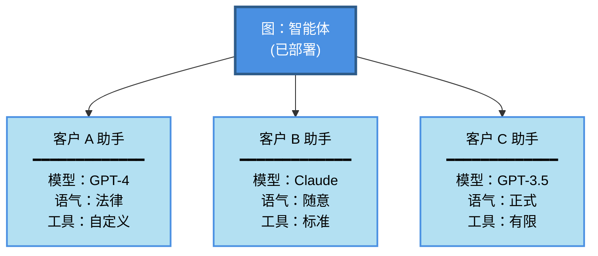
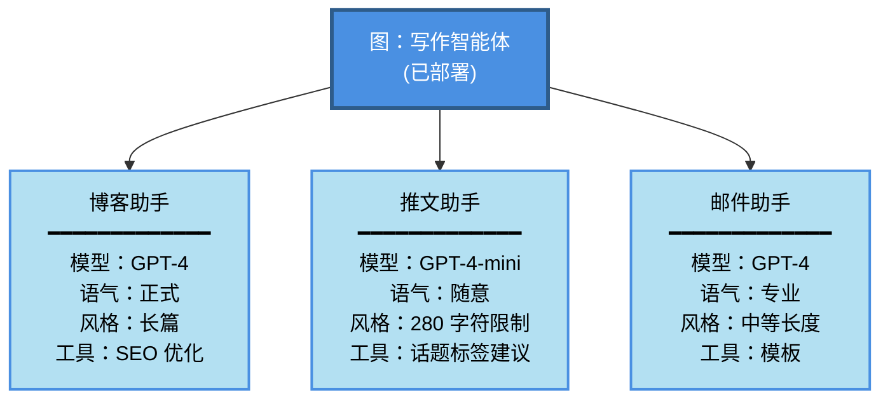
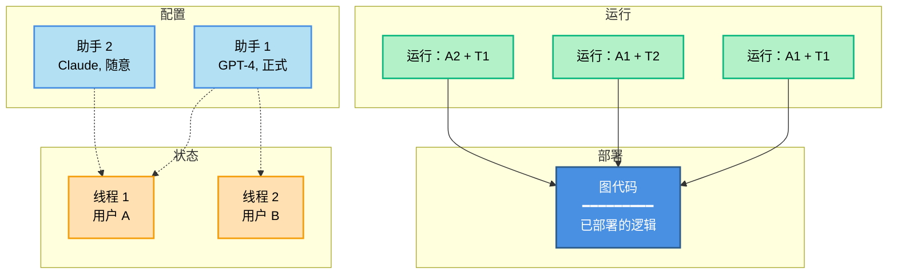

**助手（Assistants）** 允许你将配置（例如提示词、LLM 选择、工具）与图（graph）的核心逻辑分开管理。这使你能够创建多个具有相同图架构但运行时行为不同的专用版本。通过配置变化（而非图结构更改），每个助手都针对不同的[使用场景](#when-to-use-assistants)进行了优化。

例如，想象一个基于通用图架构构建的通用写作智能体。虽然结构保持不变，但不同的写作风格（如博客文章和推文）需要量身定制的配置以优化性能。为了支持这些变化，你可以创建多个助手（例如，一个用于博客，另一个用于推文），它们共享底层图，但在模型选择和系统提示词上有所不同。


Agent Server API 提供了多个端点用于创建和管理助手及其版本。更多详情请参阅 [API 参考](/langsmith/server-api-ref)。

<Info>
助手是 [LangSmith 部署](/langsmith/deployments) 中的一个概念。它们在开源的 LangGraph 库中不可用。
</Info>

## 何时使用助手

当你需要以不同配置部署相同的图架构时，助手是理想选择。常见的使用场景包括：

- **用户级个性化**
  - 为每个用户自定义模型选择、系统提示词或工具可用性。
  - 存储用户偏好，并自动应用于每次交互。
  - 允许用户在不同的 AI 个性或专业水平之间进行选择。

- **客户或组织特定配置**
  - 为不同的客户或组织维护独立的配置。
  - 为每个客户定制行为，而无需部署单独的基础设施。
  - 将配置更改隔离到特定客户。



- **环境特定配置**
  - 为开发、预发布和生产环境使用不同的模型或设置。
  - 在提升到生产环境之前，在预发布环境中测试配置更改。
  - 在非生产环境中使用较小的模型以降低成本。

- **A/B 测试和实验**
  - 比较不同的提示词、模型或参数设置。
  - 逐步向一部分用户推出配置更改。
  - 衡量不同配置变体之间的性能差异。

- **专用任务变体**
  - 为通用智能体创建特定领域的版本。
  - 针对不同语言、地区或行业优化配置。
  - 保持一致的图逻辑，同时改变执行细节。



## 助手如何与部署协同工作

当你使用 LangSmith 部署部署一个图时，[Agent Server](/langsmith/agent-server) 会自动创建一个与该图的默认配置绑定的**默认助手**。然后，你可以为同一个图创建额外的助手，每个助手都有自己的配置。

如果你的部署在 [`langgraph.json`](/langmsith/application-structure#configuration-file) 中定义了多个图，每个图都会获得自己的默认助手：

```json
{
    "graphs": {
        "graph_id_1": "path_to_graph_id_1",  // 为 graph_id_1 创建默认助手
        "graph_id_2": "path_to_graph_id_2"   // 为 graph_id_2 创建默认助手
    }
}
```

也就是说，可以有多个默认助手——部署中定义的每个图对应一个。

助手有几个关键特性：

- **[通过 API 和 UI 管理](/langsmith/configuration-cloud)**：使用 Agent Server/LangGraph SDK 或 [LangSmith UI](https://smith.langchain.com) 创建、列出、更新、版本化和获取助手。
- **一个图，多个助手**：单个已部署的图可以支持多个助手，每个助手具有不同的配置（例如，提示词、模型、工具）。
- **[版本化](#versioning) 配置**：每个助手通过版本控制维护自己的配置历史。编辑助手会创建一个新版本，你可以提升或回滚到任何版本。
- **[配置](#configuration) 更新无需更改图**：通过助手配置更新提示词、模型选择和其他设置，从而实现快速迭代，而无需修改或重新部署图代码。

<Note>
调用助手时，你可以在 [`langgraph.json`](/langsmith/application-structure#configuration-file) 中指定：
- **图 ID**（例如 `"agent"`）：使用该图的默认助手
- **助手 ID**（UUID）：使用特定的助手配置

这种灵活性允许你快速使用默认设置进行测试，或精确控制使用哪个配置。
</Note>

### 配置

助手建立在 LangGraph 开源的[配置](/oss/langgraph/graph-api#runtime-context)概念之上。

虽然配置在开源的 LangGraph 库中可用，但助手仅存在于 [LangSmith 部署](/langsmith/deployments)中，因为它们与你的已部署图紧密耦合。部署后，[Agent Server](/langsmith/agent-server) 将使用图的默认配置设置自动为每个图创建一个默认助手。

实际上，助手只是具有特定配置的图的一个*实例*。因此，多个助手可以引用同一个图，但可以包含不同的配置（例如，提示词、模型、工具）。LangSmith 部署 API 提供了多个端点用于创建和管理助手。有关如何创建助手的更多详细信息，请参阅 [API 参考](/langsmith/server-api-ref) 和 [此操作指南](/langsmith/configuration-cloud)。

### 版本控制

助手支持版本控制以跟踪随时间的变化。创建助手后，后续编辑将自动创建新版本。

- 每次更新都会创建助手的新版本。
- 你可以将任何版本提升为活动版本。
- 回滚到以前的版本就像将其设置为活动版本一样简单。
- 所有版本都保留以供参考和回滚。

<Warning>
更新助手时，必须提供完整的配置负载。更新端点从头开始创建新版本，不会与以前的版本合并。请确保包含要保留的所有配置字段。
</Warning>

有关如何管理助手版本的更多详细信息，请参阅[管理助手指南](/langsmith/configuration-cloud#create-a-new-version-for-your-assistant)。

### 执行

*运行（run）* 是对助手的调用。当你执行一个运行时，需要指定使用哪个助手（通过图 ID 使用默认助手，或通过助手 ID 使用特定配置）。



此图展示了**运行**如何将助手与线程结合以执行图：

- **图**（蓝色）：包含你的智能体逻辑的已部署代码
- **助手**（浅蓝色）：配置选项（模型、提示词、工具）
- **线程**（橙色）：用于对话历史的状态容器
- **运行**（绿色）：将助手 + 线程配对执行的实例

**组合示例：**
- **运行：A1 + T1**：将助手 1 的配置应用于用户 A 的对话
- **运行：A1 + T2**：同一助手服务用户 B（不同对话）
- **运行：A2 + T1**：将不同的助手应用于用户 A 的对话（配置切换）

执行运行时：

- 每个运行可以有自己的输入、配置覆盖和元数据。
- 运行可以是无状态的（无线程）或有状态的（在[线程](/oss/langgraph/persistence#threads)上执行以实现对话持久化）。
- 多个运行可以使用相同的助手配置。
- 助手的配置会影响底层图的执行方式。

Agent Server API 提供了多个端点用于创建和管理运行。更多详细信息，请参阅 [API 参考](/langsmith/server-api-ref)。

## 视频指南

<iframe
  className="w-full aspect-video rounded-xl"
  src="https://www.youtube.com/embed/fMsQX6pwXkE?si=6Q28l0taGOynO7sU"
  title="YouTube video player"
  frameBorder="0"
  allow="accelerometer; autoplay; clipboard-write; encrypted-media; gyroscope; picture-in-picture"
  allowFullScreen
></iframe>
