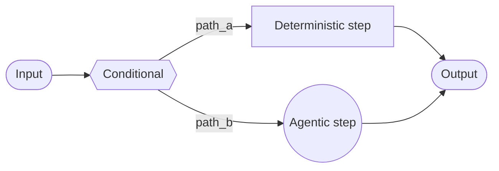
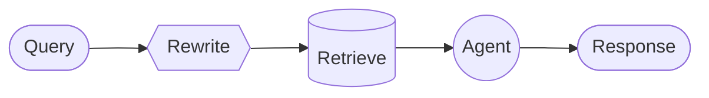

在**自定义工作流**架构中，您可以使用 [LangGraph](/oss/langgraph/overview) 定义自己的定制执行流程。您对图结构拥有完全的控制权——包括顺序步骤、条件分支、循环和并行执行。



## 主要特点

*   对图结构拥有完全控制权
*   混合确定性逻辑与智能体行为
*   支持顺序步骤、条件分支、循环和并行执行
*   可将其他模式作为节点嵌入到您的工作流中

## 何时使用

当标准模式（子智能体、技能等）不符合您的要求、您需要混合确定性逻辑与智能体行为，或者您的用例需要复杂路由或多阶段处理时，请使用自定义工作流。

工作流中的每个节点可以是一个简单函数、一个 LLM 调用，或者是一个包含[工具](/oss/langchain/tools)的完整[智能体](/oss/langchain/agents)。您还可以在自定义工作流中组合其他架构——例如，将一个多智能体系统作为单个节点嵌入。

有关自定义工作流的完整示例，请参阅下面的教程。

<Card
    title="教程：构建一个带路由的多源知识库"
    icon="book"
    href="/oss/langchain/multi-agent/router-knowledge-base"
    arrow cta="了解更多"
>
    [路由模式](/oss/langchain/multi-agent/router) 是自定义工作流的一个例子。本教程将逐步指导您构建一个路由器，该路由器可以并行查询 GitHub、Notion 和 Slack，然后综合结果。
>
</Card>

## 基础实现

核心思路是，您可以在任何 LangGraph 节点内直接调用 LangChain 智能体，从而将自定义工作流的灵活性与预构建智能体的便利性结合起来：

:::python
```python
from langchain.agents import create_agent
from langgraph.graph import StateGraph, START, END

agent = create_agent(model="openai:gpt-4o", tools=[...])

def agent_node(state: State) -> dict:
    """A LangGraph node that invokes a LangChain agent."""
    result = agent.invoke({
        "messages": [{"role": "user", "content": state["query"]}]
    })
    return {"answer": result["messages"][-1].content}

# Build a simple workflow
workflow = (
    StateGraph(State)
    .add_node("agent", agent_node)
    .add_edge(START, "agent")
    .add_edge("agent", END)
    .compile()
)
```
:::
:::js
```typescript
import { z } from "zod";
import { createAgent } from "langchain";
import { StateGraph, START, END, MessagesZodState } from "@langchain/langgraph";

const agent = createAgent({ model: "openai:gpt-4o", tools: [...] });
const State = MessagesZodState.extend({
  query: z.string(),
});

async function agentNode(state: z.infer<typeof State>) {
  // A LangGraph node that invokes a LangChain agent
  const result = await agent.invoke({
    messages: [{ role: "user", content: state.query }]
  });
  return { answer: result.messages.at(-1)?.content };
}

// Build a simple workflow
const workflow = new StateGraph(State)
  .addNode("agent", agentNode)
  .addEdge(START, "agent")
  .addEdge("agent", END)
  .compile();
```
:::

## 示例：RAG 管道

一个常见的用例是将[检索](/oss/langchain/retrieval)与智能体相结合。此示例构建了一个 WNBA 数据助手，它可以从知识库中检索信息，并能获取实时新闻。

<Accordion title="自定义 RAG 工作流">

该工作流展示了三种类型的节点：

-   **模型节点**（重写）：使用[结构化输出](/oss/langchain/structured-output)重写用户查询以获得更好的检索效果。
-   **确定性节点**（检索）：执行向量相似性搜索——不涉及 LLM。
-   **智能体节点**（智能体）：基于检索到的上下文进行推理，并可以通过工具获取额外信息。



<提示>
您可以使用 LangGraph 状态在工作流步骤之间传递信息。这允许工作流的每个部分读取和更新结构化字段，从而轻松地在节点之间共享数据和上下文。
</提示>

:::python
```python
from typing import TypedDict
from pydantic import BaseModel
from langgraph.graph import StateGraph, START, END
from langchain.agents import create_agent
from langchain.tools import tool
from langchain_openai import ChatOpenAI, OpenAIEmbeddings
from langchain_core.vectorstores import InMemoryVectorStore

class State(TypedDict):
    question: str
    rewritten_query: str
    documents: list[str]
    answer: str

# 包含阵容、比赛结果和球员数据的 WNBA 知识库
embeddings = OpenAIEmbeddings()
vector_store = InMemoryVectorStore(embeddings)
vector_store.add_texts([
    # 阵容
    "New York Liberty 2024 roster: Breanna Stewart, Sabrina Ionescu, Jonquel Jones, Courtney Vandersloot.",
    "Las Vegas Aces 2024 roster: A'ja Wilson, Kelsey Plum, Jackie Young, Chelsea Gray.",
    "Indiana Fever 2024 roster: Caitlin Clark, Aliyah Boston, Kelsey Mitchell, NaLyssa Smith.",
    # 比赛结果
    "2024 WNBA Finals: New York Liberty defeated Minnesota Lynx 3-2 to win the championship.",
    "June 15, 2024: Indiana Fever 85, Chicago Sky 79. Caitlin Clark had 23 points and 8 assists.",
    "August 20, 2024: Las Vegas Aces 92, Phoenix Mercury 84. A'ja Wilson scored 35 points.",
    # 球员数据
    "A'ja Wilson 2024 season stats: 26.9 PPG, 11.9 RPG, 2.6 BPG. Won MVP award.",
    "Caitlin Clark 2024 rookie stats: 19.2 PPG, 8.4 APG, 5.7 RPG. Won Rookie of the Year.",
    "Breanna Stewart 2024 stats: 20.4 PPG, 8.5 RPG, 3.5 APG.",
])
retriever = vector_store.as_retriever(search_kwargs={"k": 5})

@tool
def get_latest_news(query: str) -> str:
    """获取最新的 WNBA 新闻和更新。"""
    # 您的新闻 API 在这里
    return "Latest: The WNBA announced expanded playoff format for 2025..."

agent = create_agent(
    model="openai:gpt-4o",
    tools=[get_latest_news],
)

model = ChatOpenAI(model="gpt-4o")

class RewrittenQuery(BaseModel):
    query: str

def rewrite_query(state: State) -> dict:
    """重写用户查询以优化检索效果。"""
    system_prompt = """重写此查询以检索相关的 WNBA 信息。
知识库包含：球队阵容、带比分的比赛结果和球员统计数据（PPG、RPG、APG）。
重点关注提到的具体球员姓名、球队名称或统计类别。"""
    response = model.with_structured_output(RewrittenQuery).invoke([
        {"role": "system", "content": system_prompt},
        {"role": "user", "content": state["question"]}
    ])
    return {"rewritten_query": response.query}

def retrieve(state: State) -> dict:
    """根据重写后的查询检索文档。"""
    docs = retriever.invoke(state["rewritten_query"])
    return {"documents": [doc.page_content for doc in docs]}

def call_agent(state: State) -> dict:
    """使用检索到的上下文生成答案。"""
    context = "\n\n".join(state["documents"])
    prompt = f"Context:\n{context}\n\nQuestion: {state['question']}"
    response = agent.invoke({"messages": [{"role": "user", "content": prompt}]})
    return {"answer": response["messages"][-1].content_blocks}

workflow = (
    StateGraph(State)
    .add_node("rewrite", rewrite_query)
    .add_node("retrieve", retrieve)
    .add_node("agent", call_agent)
    .add_edge(START, "rewrite")
    .add_edge("rewrite", "retrieve")
    .add_edge("retrieve", "agent")
    .add_edge("agent", END)
    .compile()
)

result = workflow.invoke({"question": "Who won the 2024 WNBA Championship?"})
print(result["answer"])
```
:::
:::js
```typescript
import { StateGraph, Annotation, START, END } from "@langchain/langgraph";
import { createAgent, tool } from "langchain";
import { ChatOpenAI, OpenAIEmbeddings } from "@langchain/openai";
import { MemoryVectorStore } from "@langchain/classic/vectorstores/memory";
import * as z from "zod";

const State = Annotation.Root({
  question: Annotation<string>(),
  rewrittenQuery: Annotation<string>(),
  documents: Annotation<string[]>(),
  answer: Annotation<string>(),
});

// 包含阵容、比赛结果和球员数据的 WNBA 知识库
const embeddings = new OpenAIEmbeddings();
const vectorStore = await MemoryVectorStore.fromTexts(
  [
    // 阵容
    "New York Liberty 2024 roster: Breanna Stewart, Sabrina Ionescu, Jonquel Jones, Courtney Vandersloot.",
    "Las Vegas Aces 2024 roster: A'ja Wilson, Kelsey Plum, Jackie Young, Chelsea Gray.",
    "Indiana Fever 2024 roster: Caitlin Clark, Aliyah Boston, Kelsey Mitchell, NaLyssa Smith.",
    // 比赛结果
    "2024 WNBA Finals: New York Liberty defeated Minnesota Lynx 3-2 to win the championship.",
    "June 15, 2024: Indiana Fever 85, Chicago Sky 79. Caitlin Clark had 23 points and 8 assists.",
    "August 20, 2024: Las Vegas Aces 92, Phoenix Mercury 84. A'ja Wilson scored 35 points.",
    // 球员数据
    "A'ja Wilson 2024 season stats: 26.9 PPG, 11.9 RPG, 2.6 BPG. Won MVP award.",
    "Caitlin Clark 2024 rookie stats: 19.2 PPG, 8.4 APG, 5.7 RPG. Won Rookie of the Year.",
    "Breanna Stewart 2024 stats: 20.4 PPG, 8.5 RPG, 3.5 APG.",
  ],
  [{}, {}, {}, {}, {}, {}, {}, {}, {}],
  embeddings
);
const retriever = vectorStore.asRetriever({ k: 5 });

const getLatestNews = tool(
  async ({ query }) => {
    // 你的新闻 API 在这里
    return "Latest: The WNBA announced expanded playoff format for 2025...";
  },
  {
    name: "get_latest_news",
    description: "获取最新的 WNBA 新闻和更新",
    schema: z.object({ query: z.string() }),
  }
);

const agent = createAgent({
  model: "openai:gpt-4o",
  tools: [getLatestNews],
});

const model = new ChatOpenAI({ model: "gpt-4o" });

const RewrittenQuery = z.object({ query: z.string() });

async function rewriteQuery(state: typeof State.State) {
  const systemPrompt = `重写此查询以检索相关的 WNBA 信息。
知识库包含：球队阵容、带比分的比赛结果和球员统计数据（PPG、RPG、APG）。
重点关注提到的具体球员姓名、球队名称或统计类别。`;
  const response = await model.withStructuredOutput(RewrittenQuery).invoke([
    { role: "system", content: systemPrompt },
    { role: "user", content: state.question },
  ]);
  return { rewrittenQuery: response.query };
}

async function retrieve(state: typeof State.State) {
  const docs = await retriever.invoke(state.rewrittenQuery);
  return { documents: docs.map((doc) => doc.pageContent) };
}

async function callAgent(state: typeof State.State) {
  const context = state.documents.join("\n\n");
  const prompt = `上下文：\n${context}\n\n问题：${state.question}`;
  const response = await agent.invoke({
    messages: [{ role: "user", content: prompt }],
  });
  return { answer: response.messages.at(-1)?.contentBlocks };
}

const workflow = new StateGraph(State)
  .addNode("rewrite", rewriteQuery)
  .addNode("retrieve", retrieve)
  .addNode("agent", callAgent)
  .addEdge(START, "rewrite")
  .addEdge("rewrite", "retrieve")
  .addEdge("retrieve", "agent")
  .addEdge("agent", END)
  .compile();

const result = await workflow.invoke({
  question: "Who won the 2024 WNBA Championship?",
});
console.log(result.answer);
```
:::

</Accordion>
