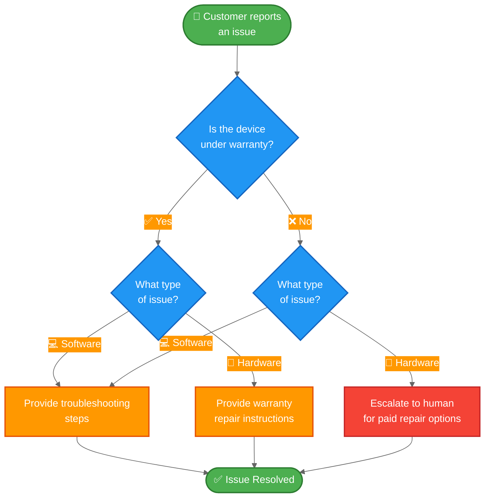

import ChatModelTabsPy from '/snippets/chat-model-tabs.mdx';
import ChatModelTabsJs from '/snippets/chat-model-tabs-js.mdx';

[状态机模式](/oss/langchain/multi-agent/handoffs)描述了智能体（agent）在任务的不同状态间移动时，其行为随之改变的工作流。本教程展示了如何通过工具调用（tool calls）来实现状态机，从而动态改变单个智能体的配置——根据当前状态更新其可用工具和指令。状态可以从多个来源确定：智能体的过往操作（工具调用）、外部状态（例如 API 调用结果），甚至是初始用户输入（例如，通过运行分类器来确定用户意图）。

在本教程中，你将构建一个客户支持智能体，其功能如下：

-   在继续之前收集保修信息。
-   将问题分类为硬件或软件问题。
-   提供解决方案或升级至人工支持。
-   在多轮对话中维持会话状态。

与[子智能体模式](/oss/langchain/multi-agent/subagents-personal-assistant)（其中子智能体作为工具被调用）不同，**状态机模式**使用单个智能体，其配置根据工作流进度而变化。每个“步骤”只是同一个底层智能体的不同配置（系统提示词 + 工具），根据状态动态选择。

以下是我们将要构建的工作流：



## 环境设置

### 安装

本教程需要 `langchain` 包：

:::python
<CodeGroup>
```bash pip
pip install langchain
```
```bash uv
uv add langchain
```
```bash conda
conda install langchain -c conda-forge
```
</CodeGroup>
:::

:::js
<CodeGroup>
```bash npm
npm install langchain
```
```bash yarn
yarn add langchain
```
```bash pnpm
pnpm add langchain
```
</CodeGroup>
:::

更多详情，请参阅我们的[安装指南](/oss/langchain/install)。

### LangSmith

设置 [LangSmith](https://smith.langchain.com) 以检查智能体内部发生的情况。然后设置以下环境变量：

:::python
<CodeGroup>
```bash bash
export LANGSMITH_TRACING="true"
export LANGSMITH_API_KEY="..."
```
```python python
import getpass
import os

os.environ["LANGSMITH_TRACING"] = "true"
os.environ["LANGSMITH_API_KEY"] = getpass.getpass()
```
</CodeGroup>
:::

:::js
<CodeGroup>
```bash bash
export LANGSMITH_TRACING="true"
export LANGSMITH_API_KEY="..."
```
```typescript typescript
process.env.LANGSMITH_TRACING = "true";
process.env.LANGSMITH_API_KEY = "...";
```
</CodeGroup>
:::

### 选择 LLM

从 LangChain 的集成套件中选择一个聊天模型：

:::python
<ChatModelTabsPy />
:::

:::js
<ChatModelTabsJs />
:::

## 1. 定义自定义状态

首先，定义一个自定义状态模式，用于跟踪当前处于哪个活动步骤：

:::python
```python
from langchain.agents import AgentState
from typing_extensions import NotRequired
from typing import Literal

# 定义可能的工作流步骤
SupportStep = Literal["warranty_collector", "issue_classifier", "resolution_specialist"]  # [!code highlight]

class SupportState(AgentState):  # [!code highlight]
    """客户支持工作流的状态。"""
    current_step: NotRequired[SupportStep]  # [!code highlight]
    warranty_status: NotRequired[Literal["in_warranty", "out_of_warranty"]]
    issue_type: NotRequired[Literal["hardware", "software"]]
```
:::

:::js
```typescript
import { z } from "zod";

// 定义可能的工作流步骤
const SupportStepSchema = z.enum(["warranty_collector", "issue_classifier", "resolution_specialist"]);  // [!code highlight]
const WarrantyStatusSchema = z.enum(["in_warranty", "out_of_warranty"]);
const IssueTypeSchema = z.enum(["hardware", "software"]);

// 客户支持工作流的状态
const SupportStateSchema = z.object({  // [!code highlight]
  currentStep: SupportStepSchema.optional(),  // [!code highlight]
  warrantyStatus: WarrantyStatusSchema.optional(),
  issueType: IssueTypeSchema.optional(),
});
```
:::

`current_step` 字段是状态机模式的核心——它决定了在每个回合加载哪个配置（提示词 + 工具）。

## 2. 创建管理工作流状态的工具

创建用于更新工作流状态的工具。这些工具允许智能体记录信息并转换到下一步。

关键点是使用 `Command` 来更新状态，包括 `current_step` 字段：

:::python
```python
from langchain.tools import tool, ToolRuntime
from langchain.messages import ToolMessage
from langgraph.types import Command

@tool
def record_warranty_status(
    status: Literal["in_warranty", "out_of_warranty"],
    runtime: ToolRuntime[None, SupportState],
) -> Command:  # [!code highlight]
    """记录客户的保修状态并转换到问题分类步骤。"""
    return Command(  # [!code highlight]
        update={  # [!code highlight]
            "messages": [
                ToolMessage(
                    content=f"Warranty status recorded as: {status}",
                    tool_call_id=runtime.tool_call_id,
                )
            ],
            "warranty_status": status,
            "current_step": "issue_classifier",  # [!code highlight]
        }
    )


@tool
def record_issue_type(
    issue_type: Literal["hardware", "software"],
    runtime: ToolRuntime[None, SupportState],
) -> Command:  # [!code highlight]
    """记录问题类型并转换到解决方案专家步骤。"""
    return Command(  # [!code highlight]
        update={  # [!code highlight]
            "messages": [
                ToolMessage(
                    content=f"Issue type recorded as: {issue_type}",
                    tool_call_id=runtime.tool_call_id,
                )
            ],
            "issue_type": issue_type,
            "current_step": "resolution_specialist",  # [!code highlight]
        }
    )


@tool
def escalate_to_human(reason: str) -> str:
    """将案例升级给人工支持专家。"""
    # 在实际系统中，这将创建工单、通知工作人员等。
    return f"Escalating to human support. Reason: {reason}"


@tool
def provide_solution(solution: str) -> str:
    """为客户的问题提供解决方案。"""
    return f"Solution provided: {solution}"
```
:::

:::js
```typescript
import { z } from "zod";
import { tool, ToolMessage, type ToolRuntime } from "langchain";
import { Command } from "@langchain/langgraph";

const recordWarrantyStatus = tool(
  async (input, config: ToolRuntime<typeof SupportStateSchema>) => {
    return new Command({ // [!code highlight]
      update: { // [!code highlight]
        messages: [
          new ToolMessage({
            content: `保修状态已记录为：${input.status}`,
            tool_call_id: config.toolCallId,
          }),
        ],
        warrantyStatus: input.status,
        currentStep: "issue_classifier", // [!code highlight]
      },
    });
  },
  {
    name: "record_warranty_status",
    description:
      "记录客户的保修状态并过渡到问题分类阶段。",
    schema: z.object({
      status: WarrantyStatusSchema,
    }),
  }
);

const recordIssueType = tool(
  async (input, config: ToolRuntime<typeof SupportStateSchema>) => {
    return new Command({ // [!code highlight]
      update: { // [!code highlight]
        messages: [
          new ToolMessage({
            content: `问题类型已记录为：${input.issueType}`,
            tool_call_id: config.toolCallId,
          }),
        ],
        issueType: input.issueType,
        currentStep: "resolution_specialist", // [!code highlight]
      },
    });
  },
  {
    name: "record_issue_type",
    description:
      "记录问题类型并过渡到解决方案专家阶段。",
    schema: z.object({
      issueType: IssueTypeSchema,
    }),
  }
);

const escalateToHuman = tool(
  async (input) => {
    // 在实际系统中，这将创建工单、通知工作人员等。
    return `正在升级至人工支持。原因：${input.reason}`;
  },
  {
    name: "escalate_to_human",
    description: "将案例升级至人工支持专家。",
    schema: z.object({
      reason: z.string(),
    }),
  }
);

const provideSolution = tool(
  async (input) => {
    return `提供的解决方案：${input.solution}`;
  },
  {
    name: "provide_solution",
    description: "为客户的问题提供解决方案。",
    schema: z.object({
      solution: z.string(),
    }),
  }
);
```
:::

请注意 `record_warranty_status` 和 `record_issue_type` 如何返回 `Command` 对象，这些对象既更新数据（`warranty_status`、`issue_type`）也更新 `current_step`。这就是状态机的工作方式——工具控制工作流的进展。

## 3. 定义步骤配置

为每个步骤定义提示词和工具。首先，定义每个步骤的提示词：

<Accordion title="查看完整的提示词定义">

:::python
```python
# 将提示词定义为常量以便引用
WARRANTY_COLLECTOR_PROMPT = """您是一名客户支持代理，正在帮助处理设备问题。

当前阶段：保修验证

在此步骤中，您需要：
1. 热情问候客户
2. 询问他们的设备是否在保修期内
3. 使用 record_warranty_status 记录他们的回复并进入下一步

保持对话性和友好性。不要一次问多个问题。"""

ISSUE_CLASSIFIER_PROMPT = """您是一名客户支持代理，正在帮助处理设备问题。

当前阶段：问题分类
客户信息：保修状态为 {warranty_status}

在此步骤中，您需要：
1. 请客户描述他们的问题
2. 确定是硬件问题（物理损坏、部件故障）还是软件问题（应用崩溃、性能问题）
3. 使用 record_issue_type 记录分类并进入下一步

如果不明确，请在分类前提出澄清性问题。"""

RESOLUTION_SPECIALIST_PROMPT = """您是一名客户支持代理，正在帮助处理设备问题。

当前阶段：解决方案
客户信息：保修状态为 {warranty_status}，问题类型为 {issue_type}

在此步骤中，您需要：
1. 对于软件问题：使用 provide_solution 提供故障排除步骤
2. 对于硬件问题：
   - 如果在保修期内：使用 provide_solution 解释保修维修流程
   - 如果超出保修期：使用 escalate_to_human 寻求付费维修选项

在解决方案中要具体且乐于助人。"""
```
:::

:::js
```typescript
// 将提示定义为常量以便引用
const WARRANTY_COLLECTOR_PROMPT = `您是一位帮助处理设备问题的客户支持代理。

当前阶段：保修验证

在此步骤中，您需要：
1. 热情问候客户
2. 询问他们的设备是否在保修期内
3. 使用 record_warranty_status 记录他们的回答并进入下一步

保持对话性和友好性。不要一次性提出多个问题。`;

const ISSUE_CLASSIFIER_PROMPT = `您是一位帮助处理设备问题的客户支持代理。

当前阶段：问题分类
客户信息：保修状态为 {warranty_status}

在此步骤中，您需要：
1. 请客户描述他们的问题
2. 判断是硬件问题（物理损坏、部件故障）还是软件问题（应用崩溃、性能问题）
3. 使用 record_issue_type 记录分类并进入下一步

如果不明确，请在分类前提出澄清性问题。`;

const RESOLUTION_SPECIALIST_PROMPT = `您是一位帮助处理设备问题的客户支持代理。

当前阶段：解决方案
客户信息：保修状态为 {warranty_status}，问题类型为 {issue_type}

在此步骤中，您需要：
1. 对于软件问题：使用 provide_solution 提供故障排除步骤
2. 对于硬件问题：
   - 如果在保修期内：使用 provide_solution 解释保修维修流程
   - 如果超出保修期：使用 escalate_to_human 转接人工处理付费维修选项

在解决方案中要具体且有用。`;
```
:::

</Accordion>

然后使用字典将步骤名称映射到其配置：

:::python
```python
# 步骤配置：将步骤名称映射到（提示、工具、所需状态）
STEP_CONFIG = {
    "warranty_collector": {
        "prompt": WARRANTY_COLLECTOR_PROMPT,
        "tools": [record_warranty_status],
        "requires": [],
    },
    "issue_classifier": {
        "prompt": ISSUE_CLASSIFIER_PROMPT,
        "tools": [record_issue_type],
        "requires": ["warranty_status"],
    },
    "resolution_specialist": {
        "prompt": RESOLUTION_SPECIALIST_PROMPT,
        "tools": [provide_solution, escalate_to_human],
        "requires": ["warranty_status", "issue_type"],
    },
}
```
:::

:::js
```typescript
// 步骤配置：将步骤名称映射到（提示、工具、所需状态）
const STEP_CONFIG = {
  warranty_collector: {
    prompt: WARRANTY_COLLECTOR_PROMPT,
    tools: [recordWarrantyStatus],
    requires: [],
  },
  issue_classifier: {
    prompt: ISSUE_CLASSIFIER_PROMPT,
    tools: [recordIssueType],
    requires: ["warrantyStatus"],
  },
  resolution_specialist: {
    prompt: RESOLUTION_SPECIALIST_PROMPT,
    tools: [provideSolution, escalateToHuman],
    requires: ["warrantyStatus", "issueType"],
  },
} as const;
```
:::

这种基于字典的配置使得：
- 一目了然地查看所有步骤
- 轻松添加新步骤（只需添加另一个条目）
- 理解工作流依赖关系（`requires` 字段）
- 使用带有状态变量的提示模板（例如 `{warranty_status}`）

## 4. 创建基于步骤的中间件

创建从状态中读取 `current_step` 并应用相应配置的中间件。我们将使用 `@wrap_model_call` 装饰器来实现一个简洁的实现：

:::python
```python
from langchain.agents.middleware import wrap_model_call, ModelRequest, ModelResponse
from typing import Callable


@wrap_model_call  # [!code highlight]
def apply_step_config(
    request: ModelRequest,
    handler: Callable[[ModelRequest], ModelResponse],
) -> ModelResponse:
    """根据当前步骤配置代理行为。"""
    # 获取当前步骤（首次交互默认为 warranty_collector）
    current_step = request.state.get("current_step", "warranty_collector")  # [!code highlight]

    # 查找步骤配置
    stage_config = STEP_CONFIG[current_step]  # [!code highlight]
```

# 验证必需状态是否存在
    for key in stage_config["requires"]:
        if request.state.get(key) is None:
            raise ValueError(f"{key} must be set before reaching {current_step}")

    # 使用状态值格式化提示（支持 {warranty_status}、{issue_type} 等）
    system_prompt = stage_config["prompt"].format(**request.state)

    # 注入系统提示和步骤特定工具
    request = request.override(  # [!code highlight]
        system_prompt=system_prompt,  # [!code highlight]
        tools=stage_config["tools"],  # [!code highlight]
    )

    return handler(request)
```
:::

:::js
```typescript
import { createMiddleware } from "langchain";

const applyStepMiddleware = createMiddleware({
  name: "applyStep",
  stateSchema: SupportStateSchema,
  wrapModelCall: async (request, handler) => {
    // 获取当前步骤（首次交互默认为 warranty_collector）
    const currentStep = request.state.currentStep ?? "warranty_collector"; // [!code highlight]

    // 查找步骤配置
    const stepConfig = STEP_CONFIG[currentStep]; // [!code highlight]

    // 验证必需状态是否存在
    for (const key of stepConfig.requires) {
      if (request.state[key] === undefined) {
        throw new Error(`${key} must be set before reaching ${currentStep}`);
      }
    }

    // 使用状态值格式化提示（支持 {warrantyStatus}、{issueType} 等）
    let systemPrompt: string = stepConfig.prompt;
    for (const [key, value] of Object.entries(request.state)) {
      systemPrompt = systemPrompt.replace(`{${key}}`, String(value ?? ""));
    }

    // 注入系统提示和步骤特定工具
    return handler({
      ...request, // [!code highlight]
      systemPrompt, // [!code highlight]
      tools: [...stepConfig.tools], // [!code highlight]
    });
  },
});
```
:::

此中间件：

1.  **读取当前步骤**：从状态中获取 `current_step`（默认为 "warranty_collector"）。
2.  **查找配置**：在 `STEP_CONFIG` 中找到匹配的条目。
3.  **验证依赖项**：确保必需的状态字段存在。
4.  **格式化提示**：将状态值注入到提示模板中。
5.  **应用配置**：覆盖系统提示和可用工具。

`request.override()` 方法是关键——它允许我们根据状态动态更改智能体的行为，而无需创建单独的智能体实例。

## 5. 创建智能体

现在，使用基于步骤的中间件和用于状态持久化的检查点创建智能体：

:::python
```python
from langchain.agents import create_agent
from langgraph.checkpoint.memory import InMemorySaver

# 从所有步骤配置中收集所有工具
all_tools = [
    record_warranty_status,
    record_issue_type,
    provide_solution,
    escalate_to_human,
]

# 使用基于步骤的配置创建智能体
agent = create_agent(
    model,
    tools=all_tools,
    state_schema=SupportState,  # [!code highlight]
    middleware=[apply_step_config],  # [!code highlight]
    checkpointer=InMemorySaver(),  # [!code highlight]
)
```
:::

:::js
```typescript
import { createAgent } from "langchain";
import { MemorySaver } from "@langchain/langgraph";
import { ChatOpenAI } from "@langchain/openai";

// 从所有步骤配置中收集所有工具
const allTools = [
  recordWarrantyStatus,
  recordIssueType,
  provideSolution,
  escalateToHuman,
];

// 初始化模型
const model = new ChatOpenAI({
  model: "gpt-5o-mini",
  temperature: 0.7,
});

// 使用基于步骤的配置创建智能体
const agent = createAgent({
  model,
  tools: allTools,
  stateSchema: SupportStateSchema,  // [!code highlight]
  middleware: [applyStepMiddleware],  // [!code highlight]
  checkpointer: new MemorySaver(),  // [!code highlight]
});
```

<Note>
**为什么需要检查点？** 检查点（checkpointer）在对话轮次间维护状态。没有它，`current_step` 状态会在用户消息之间丢失，从而破坏工作流。
</Note>

## 6. 测试工作流

测试完整的工作流：

:::python
```python
from langchain.messages import HumanMessage
import uuid

# Configuration for this conversation thread
thread_id = str(uuid.uuid4())
config = {"configurable": {"thread_id": thread_id}}

# Turn 1: Initial message - starts with warranty_collector step
print("=== Turn 1: Warranty Collection ===")
result = agent.invoke(
    {"messages": [HumanMessage("Hi, my phone screen is cracked")]},
    config
)
for msg in result['messages']:
    msg.pretty_print()

# Turn 2: User responds about warranty
print("\n=== Turn 2: Warranty Response ===")
result = agent.invoke(
    {"messages": [HumanMessage("Yes, it's still under warranty")]},
    config
)
for msg in result['messages']:
    msg.pretty_print()
print(f"Current step: {result.get('current_step')}")

# Turn 3: User describes the issue
print("\n=== Turn 3: Issue Description ===")
result = agent.invoke(
    {"messages": [HumanMessage("The screen is physically cracked from dropping it")]},
    config
)
for msg in result['messages']:
    msg.pretty_print()
print(f"Current step: {result.get('current_step')}")

# Turn 4: Resolution
print("\n=== Turn 4: Resolution ===")
result = agent.invoke(
    {"messages": [HumanMessage("What should I do?")]},
    config
)
for msg in result['messages']:
    msg.pretty_print()
```
:::

:::js
```typescript
import { HumanMessage } from "@langchain/core/messages";
import { v4 as uuidv4 } from "uuid";

// Configuration for this conversation thread
const threadId = uuidv4();
const config = { configurable: { thread_id: threadId } };

// Turn 1: Initial message - starts with warranty_collector step
console.log("=== Turn 1: Warranty Collection ===");
let result = await agent.invoke(
  { messages: [new HumanMessage("Hi, my phone screen is cracked")] },
  config
);
for (const msg of result.messages) {
  console.log(msg.content);
}

// Turn 2: User responds about warranty
console.log("\n=== Turn 2: Warranty Response ===");
result = await agent.invoke(
  { messages: [new HumanMessage("Yes, it's still under warranty")] },
  config
);
for (const msg of result.messages) {
  console.log(msg.content);
}
console.log(`Current step: ${result.currentStep}`);

// Turn 3: User describes the issue
console.log("\n=== Turn 3: Issue Description ===");
result = await agent.invoke(
  { messages: [new HumanMessage("The screen is physically cracked from dropping it")] },
  config
);
for (const msg of result.messages) {
  console.log(msg.content);
}
console.log(`Current step: ${result.currentStep}`);

// Turn 4: Resolution
console.log("\n=== Turn 4: Resolution ===");
result = await agent.invoke(
  { messages: [new HumanMessage("What should I do?")] },
  config
);
for (const msg of result.messages) {
  console.log(msg.content);
}
```
:::

预期流程：
1.  **保修验证步骤**：询问保修状态
2.  **问题分类步骤**：询问问题详情，确定为硬件问题
3.  **解决方案步骤**：提供保修维修指导

## 7. 理解状态转换

让我们追踪每一轮发生了什么：

### 第 1 轮：初始消息

:::python
```python
{
    "messages": [HumanMessage("Hi, my phone screen is cracked")],
    "current_step": "warranty_collector"  # Default value
}
```
:::

:::js
```typescript
{
  messages: [new HumanMessage("Hi, my phone screen is cracked")],
  currentStep: "warranty_collector"  // Default value
}
```
:::

中间件应用：
- 系统提示：`WARRANTY_COLLECTOR_PROMPT`
- 工具：`[record_warranty_status]`

### 第 2 轮：记录保修状态后

:::python
工具调用：`record_warranty_status("in_warranty")` 返回：
```python
Command(update={
    "warranty_status": "in_warranty",
    "current_step": "issue_classifier"  # State transition!
})
```
:::

:::js
工具调用：`recordWarrantyStatus("in_warranty")` 返回：
```typescript
new Command({
  update: {
    warrantyStatus: "in_warranty",
    currentStep: "issue_classifier"  // 状态转换！
  }
})
```
:::

下一轮，中间件应用：
- 系统提示：`ISSUE_CLASSIFIER_PROMPT`（使用 `warranty_status="in_warranty"` 格式化）
- 工具：`[record_issue_type]`

### 第 3 轮：问题分类后

:::python
工具调用：`record_issue_type("hardware")` 返回：
```python
Command(update={
    "issue_type": "hardware",
    "current_step": "resolution_specialist"  # 状态转换！
})
```
:::

:::js
工具调用：`recordIssueType("hardware")` 返回：
```typescript
new Command({
  update: {
    issueType: "hardware",
    currentStep: "resolution_specialist"  // 状态转换！
  }
})
```
:::

下一轮，中间件应用：
- 系统提示：`RESOLUTION_SPECIALIST_PROMPT`（使用 `warranty_status` 和 `issue_type` 格式化）
- 工具：`[provide_solution, escalate_to_human]`

关键洞察：**工具通过更新 `current_step` 来驱动工作流**，而**中间件通过在下轮应用适当的配置来响应**。

## 8. 管理消息历史

随着智能体（agent）逐步推进，消息历史会增长。使用[摘要中间件](/oss/langchain/short-term-memory#summarize-messages)来压缩较早的消息，同时保留对话上下文：

:::python
```python
from langchain.agents import create_agent
from langchain.agents.middleware import SummarizationMiddleware  # [!code highlight]
from langgraph.checkpoint.memory import InMemorySaver

agent = create_agent(
    model,
    tools=all_tools,
    state_schema=SupportState,
    middleware=[
        apply_step_config,
        SummarizationMiddleware(  # [!code highlight]
            model="gpt-4o-mini",
            trigger=("tokens", 4000),
            keep=("messages", 10)
        )
    ],
    checkpointer=InMemorySaver(),
)
```
:::

:::js
```typescript
import { createAgent, SummarizationMiddleware } from "langchain";  // [!code highlight]
import { MemorySaver } from "@langchain/langgraph";

const agent = createAgent({
  model,
  tools: allTools,
  stateSchema: SupportStateSchema,
  middleware: [
    applyStepMiddleware,
    new SummarizationMiddleware({  // [!code highlight]
      model: "gpt-4o-mini",
      trigger: { tokens: 4000 },
      keep: { messages: 10 },
    }),
  ],
  checkpointer: new MemorySaver(),
});
```
:::

有关其他记忆（memory）管理技术，请参阅[短期记忆指南](/oss/langchain/short-term-memory)。

## 9. 增加灵活性：返回

某些工作流需要允许用户返回之前的步骤以更正信息（例如，更改保修状态或问题分类）。然而，并非所有转换都有意义——例如，一旦退款已处理，通常无法返回。对于这个支持工作流，我们将添加工具以返回到保修验证和问题分类步骤。

<Tip>
如果你的工作流需要在大多数步骤之间进行任意转换，请考虑你是否真的需要一个结构化的工作流。这种模式在步骤遵循清晰的顺序进展、偶尔需要向后转换以进行更正时效果最佳。
</Tip>

向解决步骤添加“返回”工具：

:::python
```python
@tool
def go_back_to_warranty() -> Command:  # [!code highlight]
    """返回保修验证步骤。"""
    return Command(update={"current_step": "warranty_collector"})  # [!code highlight]


@tool
def go_back_to_classification() -> Command:  # [!code highlight]
    """返回问题分类步骤。"""
    return Command(update={"current_step": "issue_classifier"})  # [!code highlight]


# 更新 resolution_specialist 配置以包含这些工具
STEP_CONFIG["resolution_specialist"]["tools"].extend([
    go_back_to_warranty,
    go_back_to_classification
])
```
:::

:::js
```typescript
import { tool } from "langchain";
import { Command } from "@langchain/langgraph";
import { z } from "zod";

const goBackToWarranty = tool(  // [!code highlight]
  async () => {
    return new Command({ update: { currentStep: "warranty_collector" } });  // [!code highlight]
  },
  {
    name: "go_back_to_warranty",
    description: "Go back to warranty verification step.",
    schema: z.object({}),
  }
);

const goBackToClassification = tool(  // [!code highlight]
  async () => {
    return new Command({ update: { currentStep: "issue_classifier" } });  // [!code highlight]
  },
  {
    name: "go_back_to_classification",
    description: "Go back to issue classification step.",
    schema: z.object({}),
  }
);

// Update the resolution_specialist configuration to include these tools
STEP_CONFIG.resolution_specialist.tools.push(
  goBackToWarranty,
  goBackToClassification
);
```
:::

更新解决方案专家的提示词，提及这些工具：

:::python
```python
RESOLUTION_SPECIALIST_PROMPT = """You are a customer support agent helping with device issues.

CURRENT STAGE: Resolution
CUSTOMER INFO: Warranty status is {warranty_status}, issue type is {issue_type}

At this step, you need to:
1. For SOFTWARE issues: provide troubleshooting steps using provide_solution
2. For HARDWARE issues:
   - If IN WARRANTY: explain warranty repair process using provide_solution
   - If OUT OF WARRANTY: escalate_to_human for paid repair options

If the customer indicates any information was wrong, use:
- go_back_to_warranty to correct warranty status
- go_back_to_classification to correct issue type

Be specific and helpful in your solutions."""
```
:::

:::js
```typescript
const RESOLUTION_SPECIALIST_PROMPT = `You are a customer support agent helping with device issues.

CURRENT STAGE: Resolution
CUSTOMER INFO: Warranty status is {warrantyStatus}, issue type is {issueType}

At this step, you need to:
1. For SOFTWARE issues: provide troubleshooting steps using provide_solution
2. For HARDWARE issues:
   - If IN WARRANTY: explain warranty repair process using provide_solution
   - If OUT OF WARRANTY: escalate_to_human for paid repair options

If the customer indicates any information was wrong, use:
- go_back_to_warranty to correct warranty status
- go_back_to_classification to correct issue type

Be specific and helpful in your solutions.`;
```
:::

现在智能体可以处理更正了：

:::python
```python
result = agent.invoke(
    {"messages": [HumanMessage("Actually, I made a mistake - my device is out of warranty")]},
    config
)
# Agent will call go_back_to_warranty and restart the warranty verification step
```
:::

:::js
```typescript
const result = await agent.invoke(
  { messages: [new HumanMessage("Actually, I made a mistake - my device is out of warranty")] },
  config
);
// Agent will call go_back_to_warranty and restart the warranty verification step
```
:::

## 完整示例

以下是一个可运行脚本中的所有内容：

<Expandable title="Complete code" defaultOpen={false}>
:::python
```python
"""
Customer Support State Machine Example

This example demonstrates the state machine pattern.
A single agent dynamically changes its behavior based on the current_step state,
creating a state machine for sequential information collection.
"""

import uuid

from langgraph.checkpoint.memory import InMemorySaver
from langgraph.types import Command
from typing import Callable, Literal
from typing_extensions import NotRequired

from langchain.agents import AgentState, create_agent
from langchain.agents.middleware import wrap_model_call, ModelRequest, ModelResponse, SummarizationMiddleware
from langchain.chat_models import init_chat_model
from langchain.messages import HumanMessage, ToolMessage
from langchain.tools import tool, ToolRuntime

model = init_chat_model("anthropic:claude-3-5-sonnet-latest")

# 定义可能的工作流步骤
SupportStep = Literal["warranty_collector", "issue_classifier", "resolution_specialist"]


class SupportState(AgentState):
    """客户支持工作流的状态。"""

    current_step: NotRequired[SupportStep]
    warranty_status: NotRequired[Literal["in_warranty", "out_of_warranty"]]
    issue_type: NotRequired[Literal["hardware", "software"]]


@tool
def record_warranty_status(
    status: Literal["in_warranty", "out_of_warranty"],
    runtime: ToolRuntime[None, SupportState],
) -> Command:
    """记录客户的保修状态并过渡到问题分类步骤。"""
    return Command(
        update={
            "messages": [
                ToolMessage(
                    content=f"保修状态已记录为: {status}",
                    tool_call_id=runtime.tool_call_id,
                )
            ],
            "warranty_status": status,
            "current_step": "issue_classifier",
        }
    )


@tool
def record_issue_type(
    issue_type: Literal["hardware", "software"],
    runtime: ToolRuntime[None, SupportState],
) -> Command:
    """记录问题类型并过渡到解决方案专家步骤。"""
    return Command(
        update={
            "messages": [
                ToolMessage(
                    content=f"问题类型已记录为: {issue_type}",
                    tool_call_id=runtime.tool_call_id,
                )
            ],
            "issue_type": issue_type,
            "current_step": "resolution_specialist",
        }
    )


@tool
def escalate_to_human(reason: str) -> str:
    """将案例升级给人工支持专员。"""
    # 在实际系统中，这将创建工单、通知工作人员等。
    return f"正在升级给人工支持。原因: {reason}"


@tool
def provide_solution(solution: str) -> str:
    """为客户的问题提供解决方案。"""
    return f"提供的解决方案: {solution}"


# 将提示定义为常量
WARRANTY_COLLECTOR_PROMPT = """您是一名客户支持代理，正在帮助处理设备问题。

当前步骤: 保修验证

在此步骤中，您需要：
1. 热情问候客户
2. 询问他们的设备是否在保修期内
3. 使用 record_warranty_status 记录他们的回答并进入下一步

请保持对话性和友好。不要一次性问多个问题。"""

ISSUE_CLASSIFIER_PROMPT = """您是一名客户支持代理，正在帮助处理设备问题。

当前步骤: 问题分类
客户信息: 保修状态为 {warranty_status}

在此步骤中，您需要：
1. 请客户描述他们的问题
2. 判断是硬件问题（物理损坏、部件故障）还是软件问题（应用崩溃、性能问题）
3. 使用 record_issue_type 记录分类并进入下一步

如果不明确，请在分类前询问澄清性问题。"""

RESOLUTION_SPECIALIST_PROMPT = """您是一名客户支持代理，正在帮助处理设备问题。

当前步骤: 解决方案
客户信息: 保修状态为 {warranty_status}，问题类型为 {issue_type}

在此步骤中，您需要：
1. 对于软件问题：使用 provide_solution 提供故障排除步骤
2. 对于硬件问题：
   - 如果在保修期内：使用 provide_solution 解释保修维修流程
   - 如果超出保修期：使用 escalate_to_human 获取付费维修选项

在您的解决方案中请具体且提供帮助。"""


# 步骤配置：将步骤名称映射到 (提示, 工具, 所需状态)
STEP_CONFIG = {
    "warranty_collector": {
        "prompt": WARRANTY_COLLECTOR_PROMPT,
        "tools": [record_warranty_status],
        "requires": [],
    },
    "issue_classifier": {
        "prompt": ISSUE_CLASSIFIER_PROMPT,
        "tools": [record_issue_type],
        "requires": ["warranty_status"],
    },
    "resolution_specialist": {
        "prompt": RESOLUTION_SPECIALIST_PROMPT,
        "tools": [provide_solution, escalate_to_human],
        "requires": ["warranty_status", "issue_type"],
    },
}

@wrap_model_call
def apply_step_config(
    request: ModelRequest,
    handler: Callable[[ModelRequest], ModelResponse],
) -> ModelResponse:
    """根据当前步骤配置智能体行为。"""
    # 获取当前步骤（首次交互默认为 warranty_collector）
    current_step = request.state.get("current_step", "warranty_collector")

    # 查找步骤配置
    step_config = STEP_CONFIG[current_step]

    # 验证所需状态是否存在
    for key in step_config["requires"]:
        if request.state.get(key) is None:
            raise ValueError(f"在到达 {current_step} 之前必须设置 {key}")

    # 使用状态值格式化提示词
    system_prompt = step_config["prompt"].format(**request.state)

    # 注入系统提示词和步骤特定工具
    request = request.override(
        system_prompt=system_prompt,
        tools=step_config["tools"],
    )

    return handler(request)


# 从所有步骤配置中收集所有工具
all_tools = [
    record_warranty_status,
    record_issue_type,
    provide_solution,
    escalate_to_human,
]

# 创建具有基于步骤的配置和摘要功能的智能体
agent = create_agent(
    model,
    tools=all_tools,
    state_schema=SupportState,
    middleware=[
        apply_step_config,
        SummarizationMiddleware(
            model="gpt-4o-mini",
            trigger=("tokens", 4000),
            keep=("messages", 10)
        )
    ],
    checkpointer=InMemorySaver(),
)


# ============================================================================
# 测试工作流
# ============================================================================

if __name__ == "__main__":
    thread_id = str(uuid.uuid4())
    config = {"configurable": {"thread_id": thread_id}}

    result = agent.invoke(
        {"messages": [HumanMessage("Hi, my phone screen is cracked")]},
        config
    )

    result = agent.invoke(
        {"messages": [HumanMessage("Yes, it's still under warranty")]},
        config
    )

    result = agent.invoke(
        {"messages": [HumanMessage("The screen is physically cracked from dropping it")]},
        config
    )

    result = agent.invoke(
        {"messages": [HumanMessage("What should I do?")]},
        config
    )
    for msg in result['messages']:
        msg.pretty_print()
```
:::

:::js
```typescript
import { createMiddleware, createAgent } from "langchain";

import { z } from "zod";
import { v4 as uuidv4 } from "uuid";
import { tool, ToolMessage, type ToolRuntime, HumanMessage } from "langchain";
import { Command, MemorySaver } from "@langchain/langgraph";
import { ChatOpenAI } from "@langchain/openai";

// 定义可能的工作流步骤
const SupportStepSchema = z.enum([
  "warranty_collector",
  "issue_classifier",
  "resolution_specialist",
]);
const WarrantyStatusSchema = z.enum(["in_warranty", "out_of_warranty"]);
const IssueTypeSchema = z.enum(["hardware", "software"]);

// 客户支持工作流的状态
const SupportStateSchema = z.object({

  currentStep: SupportStepSchema.optional(),
  warrantyStatus: WarrantyStatusSchema.optional(),
  issueType: IssueTypeSchema.optional(),
});

const recordWarrantyStatus = tool(
  async (input, config: ToolRuntime<typeof SupportStateSchema>) => {
    return new Command({

      update: {

        messages: [
          new ToolMessage({
            content: `Warranty status recorded as: ${input.status}`,
            tool_call_id: config.toolCallId,
          }),
        ],
        warrantyStatus: input.status,
        currentStep: "issue_classifier",
      },
    });
  },
  {
    name: "record_warranty_status",
    description:
      "记录客户的保修状态并过渡到问题分类。",
    schema: z.object({
      status: WarrantyStatusSchema,
    }),
  }
);

const recordIssueType = tool(
  async (input, config: ToolRuntime<typeof SupportStateSchema>) => {
    return new Command({

      update: {

messages: [
          new ToolMessage({
            content: `问题类型已记录为：${input.issueType}`,
            tool_call_id: config.toolCallId,
          }),
        ],
        issueType: input.issueType,
        currentStep: "resolution_specialist",
      },
    });
  },
  {
    name: "record_issue_type",
    description:
      "记录问题类型并转交给解决方案专家。",
    schema: z.object({
      issueType: IssueTypeSchema,
    }),
  }
);

const escalateToHuman = tool(
  async (input) => {
    // 在实际系统中，这里会创建工单、通知工作人员等。
    return `正在升级至人工支持。原因：${input.reason}`;
  },
  {
    name: "escalate_to_human",
    description: "将案例升级至人工支持专家。",
    schema: z.object({
      reason: z.string(),
    }),
  }
);

const provideSolution = tool(
  async (input) => {
    return `提供的解决方案：${input.solution}`;
  },
  {
    name: "provide_solution",
    description: "为客户的问题提供解决方案。",
    schema: z.object({
      solution: z.string(),
    }),
  }
);

// 将提示定义为常量以便引用
const WARRANTY_COLLECTOR_PROMPT = `您是一位帮助处理设备问题的客户支持代理。

当前阶段：保修验证

在此步骤中，您需要：
1. 热情问候客户
2. 询问他们的设备是否在保修期内
3. 使用 record_warranty_status 记录他们的回复并进入下一步

保持对话性和友好性。不要一次性提出多个问题。`;

const ISSUE_CLASSIFIER_PROMPT = `您是一位帮助处理设备问题的客户支持代理。

当前阶段：问题分类
客户信息：保修状态为 {warranty_status}

在此步骤中，您需要：
1. 请客户描述他们的问题
2. 判断是硬件问题（物理损坏、部件故障）还是软件问题（应用崩溃、性能问题）
3. 使用 record_issue_type 记录分类并进入下一步

如果不明确，请在分类前提出澄清性问题。`;

const RESOLUTION_SPECIALIST_PROMPT = `您是一位帮助处理设备问题的客户支持代理。

当前阶段：解决方案
客户信息：保修状态为 {warranty_status}，问题类型为 {issue_type}

在此步骤中，您需要：
1. 对于软件问题：使用 provide_solution 提供故障排除步骤
2. 对于硬件问题：
   - 如果在保修期内：使用 provide_solution 解释保修维修流程
   - 如果超出保修期：使用 escalate_to_human 寻求付费维修选项

在解决方案中要具体且有用。`;

// 步骤配置：将步骤名称映射到（提示、工具、所需状态）
const STEP_CONFIG = {
  warranty_collector: {
    prompt: WARRANTY_COLLECTOR_PROMPT,
    tools: [recordWarrantyStatus],
    requires: [],
  },
  issue_classifier: {
    prompt: ISSUE_CLASSIFIER_PROMPT,
    tools: [recordIssueType],
    requires: ["warrantyStatus"],
  },
  resolution_specialist: {
    prompt: RESOLUTION_SPECIALIST_PROMPT,
    tools: [provideSolution, escalateToHuman],
    requires: ["warrantyStatus", "issueType"],
  },
} as const;

const applyStepMiddleware = createMiddleware({
  name: "applyStep",
  stateSchema: SupportStateSchema,
  wrapModelCall: async (request, handler) => {
    // 获取当前步骤（首次交互默认为 warranty_collector）
    const currentStep = request.state.currentStep ?? "warranty_collector";

    // 查找步骤配置
    const stepConfig = STEP_CONFIG[currentStep];

    // 验证所需状态是否存在
    for (const key of stepConfig.requires) {
      if (request.state[key] === undefined) {
        throw new Error(`在进入 ${currentStep} 之前必须设置 ${key}`);
      }
    }

// 使用状态值格式化提示（支持 {warrantyStatus}、{issueType} 等）
    let systemPrompt: string = stepConfig.prompt;
    for (const [key, value] of Object.entries(request.state)) {
      systemPrompt = systemPrompt.replace(`{${key}}`, String(value ?? ""));
    }

    // 注入系统提示和步骤特定工具
    return handler({
      ...request,
      systemPrompt,
      tools: [...stepConfig.tools],
    });
  },
});

// 从所有步骤配置中收集所有工具
const allTools = [
  recordWarrantyStatus,
  recordIssueType,
  provideSolution,
  escalateToHuman,
];

const model = new ChatOpenAI({
  model: "gpt-5-mini",
});

// 使用基于步骤的配置创建智能体
const agent = createAgent({
  model,
  tools: allTools,
  middleware: [applyStepMiddleware],
  checkpointer: new MemorySaver(),
});

// 此对话线程的配置
const threadId = uuidv4();
const config = { configurable: { thread_id: threadId } };

// 第 1 轮：初始消息 - 从 warranty_collector 步骤开始
console.log("=== Turn 1: Warranty Collection ===");
let result = await agent.invoke(
  { messages: [new HumanMessage("Hi, my phone screen is cracked")] },
  config
);
for (const msg of result.messages) {
  console.log(msg.content);
}

// 第 2 轮：用户回复关于保修的信息
console.log("\n=== Turn 2: Warranty Response ===");
result = await agent.invoke(
  { messages: [new HumanMessage("Yes, it's still under warranty")] },
  config
);
for (const msg of result.messages) {
  console.log(msg.content);
}
console.log(`Current step: ${result.currentStep}`);

// 第 3 轮：用户描述问题
console.log("\n=== Turn 3: Issue Description ===");
result = await agent.invoke(
  {
    messages: [
      new HumanMessage("The screen is physically cracked from dropping it"),
    ],
  },
  config
);
for (const msg of result.messages) {
  console.log(msg.content);
}
console.log(`Current step: ${result.currentStep}`);

// 第 4 轮：解决方案
console.log("\n=== Turn 4: Resolution ===");
result = await agent.invoke(
  { messages: [new HumanMessage("What should I do?")] },
  config
);
for (const msg of result.messages) {
  console.log(msg.content);
}
```
:::
</Expandable>

## 后续步骤

- 了解用于集中编排的[子智能体模式](/oss/langchain/multi-agent/subagents-personal-assistant)
- 探索[中间件](/oss/langchain/middleware)以获取更多动态行为
- 阅读[多智能体概述](/oss/langchain/multi-agent)以比较不同模式
- 使用 [LangSmith](https://smith.langchain.com) 来调试和监控您的多智能体系统
