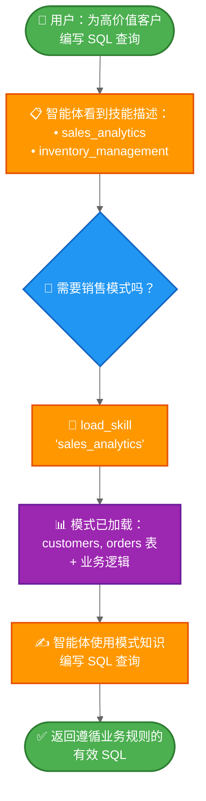

import ChatModelTabsPy from '/snippets/chat-model-tabs.mdx';
import ChatModelTabsJs from '/snippets/chat-model-tabs-js.mdx';

本教程展示了如何使用**渐进式披露**——一种上下文管理技术，智能体按需加载信息而非预先加载——来实现**技能**（基于提示的专用指令）。智能体通过工具调用加载技能，而不是动态更改系统提示，仅发现并加载每个任务所需的技能。

**使用场景：** 假设您正在构建一个智能体，以帮助在大型企业的不同业务垂直领域编写 SQL 查询。您的组织可能为每个垂直领域设置了独立的数据存储，或者拥有一个包含数千张表的单一单体数据库。无论哪种情况，预先加载所有模式都会超出上下文窗口的容量。渐进式披露通过仅在需要时加载相关模式来解决此问题。这种架构还使不同的产品所有者和利益相关者能够独立贡献和维护其特定业务垂直领域的技能。

**您将构建的内容：** 一个具有两种技能（销售分析和库存管理）的 SQL 查询助手。智能体在其系统提示中看到轻量级的技能描述，然后仅在用户查询相关时，才通过工具调用加载完整的数据库模式和业务逻辑。

<Note>
有关包含查询执行、错误纠正和验证的更完整 SQL 智能体示例，请参阅我们的 [SQL 智能体教程](/oss/langchain/sql-agent)。本教程重点介绍可应用于任何领域的渐进式披露模式。
</Note>

<Tip>
渐进式披露由 Anthropic 推广，作为构建可扩展智能体技能系统的一种技术。这种方法采用三级架构（元数据 → 核心内容 → 详细资源），智能体仅在需要时加载信息。有关此技术的更多信息，请参阅 [使用 Agent Skills 为智能体配备应对现实世界的能力](https://www.anthropic.com/engineering/equipping-agents-for-the-real-world-with-agent-skills)。
</Tip>

## 工作原理

以下是用户请求 SQL 查询时的流程：



**为什么使用渐进式披露：**
- **减少上下文使用** - 仅加载任务所需的 2-3 项技能，而非所有可用技能
- **实现团队自治** - 不同的团队可以独立开发专门的技能（类似于其他多智能体架构）
- **高效扩展** - 添加数十或数百项技能而不会使上下文不堪重负
- **简化对话历史** - 单一智能体，单一对话线程

**什么是技能：** 技能，正如 Claude Code 所推广的那样，主要是基于提示的：它们是针对特定业务任务的、自包含的专用指令单元。在 Claude Code 中，技能以文件系统上的目录和文件形式暴露，通过文件操作被发现。技能通过提示指导行为，可以提供工具使用信息，或包含供编码智能体执行的示例代码。

<Tip>
具有渐进式披露功能的技能可以看作是一种 [RAG（检索增强生成）](/oss/langchain/rag) 形式，其中每个技能都是一个检索单元——尽管不一定由嵌入或关键词搜索支持，而是由用于浏览内容的工具支持（如文件操作，或在本教程中，直接查找）。
</Tip>

**权衡：**
- **延迟**：按需加载技能需要额外的工具调用，这会增加首次需要每个技能的请求的延迟
- **工作流控制**：基本实现依赖提示来指导技能使用——如果没有自定义逻辑，你无法强制执行硬性约束，例如“始终先尝试技能 A，再尝试技能 B”

<Tip>
**实现你自己的技能系统**

在构建你自己的技能实现时（正如我们在本教程中所做），核心概念是渐进式披露——按需加载信息。除此之外，你在实现上拥有完全的灵活性：

- **存储**：数据库、S3、内存数据结构或任何后端
- **发现**：直接查找（本教程）、用于大型技能集合的 RAG、文件系统扫描或 API 调用
- **加载逻辑**：自定义延迟特性，并添加逻辑以搜索技能内容或对相关性进行排序
- **副作用**：定义技能加载时发生的情况，例如暴露与该技能关联的工具（在第 8 节中介绍）

这种灵活性让你可以根据性能、存储和工作流控制方面的特定需求进行优化。
</Tip>

## 设置

### 安装

本教程需要 `langchain` 包：

:::python
<CodeGroup>
```bash pip
pip install langchain
```
```bash uv
uv add langchain
```
```bash conda
conda install langchain -c conda-forge
```
</CodeGroup>
:::

:::js
<CodeGroup>
```bash npm
npm install langchain
```
```bash yarn
yarn add langchain
```
```bash pnpm
pnpm add langchain
```
</CodeGroup>
:::

更多详情，请参阅我们的 [安装指南](/oss/langchain/install)。

### LangSmith

设置 [LangSmith](https://smith.langchain.com) 以检查你的智能体内部发生的情况。然后设置以下环境变量：

:::python
<CodeGroup>
```bash bash
export LANGSMITH_TRACING="true"
export LANGSMITH_API_KEY="..."
```
```python python
import getpass
import os

os.environ["LANGSMITH_TRACING"] = "true"
os.environ["LANGSMITH_API_KEY"] = getpass.getpass()
```
</CodeGroup>
:::

:::js
<CodeGroup>
```bash bash
export LANGSMITH_TRACING="true"
export LANGSMITH_API_KEY="..."
```
```typescript typescript
process.env.LANGSMITH_TRACING = "true";
process.env.LANGSMITH_API_KEY = "...";
```
</CodeGroup>
:::

### 选择 LLM

从 LangChain 的集成套件中选择一个聊天模型：

:::python
<ChatModelTabsPy />
:::

:::js
<ChatModelTabsJs />
:::

## 1. 定义技能

首先，定义技能的结构。每个技能都有一个名称、一个简要描述（显示在系统提示中）和完整内容（按需加载）：

:::python
```python
from typing import TypedDict

class Skill(TypedDict):  # [!code highlight]
    """A skill that can be progressively disclosed to the agent."""
    name: str  # Unique identifier for the skill
    description: str  # 1-2 sentence description to show in system prompt
    content: str  # Full skill content with detailed instructions
```
:::

:::js
```typescript
import { z } from "zod";

// 一种可以逐步向智能体（agent）披露的技能
const SkillSchema = z.object({  // [!code highlight]
  name: z.string(),  // 技能的唯一标识符
  description: z.string(),  // 在系统提示中显示的 1-2 句描述
  content: z.string(),  // 包含详细说明的完整技能内容
});

type Skill = z.infer<typeof SkillSchema>;
```
:::

现在为 SQL 查询助手定义示例技能。这些技能设计为**描述轻量**（预先展示给智能体）但**内容详细**（仅在需要时加载）：

<Accordion title="查看完整的技能定义">

:::python
```python
SKILLS: list[Skill] = [
    {
        "name": "sales_analytics",
        "description": "用于销售数据分析的数据库模式和业务逻辑，包括客户、订单和收入。",
        "content": """# 销售分析模式

## 表

### customers
- customer_id (PRIMARY KEY)
- name
- email
- signup_date
- status (active/inactive)
- customer_tier (bronze/silver/gold/platinum)

### orders
- order_id (PRIMARY KEY)
- customer_id (FOREIGN KEY -> customers)
- order_date
- status (pending/completed/cancelled/refunded)
- total_amount
- sales_region (north/south/east/west)

### order_items
- item_id (PRIMARY KEY)
- order_id (FOREIGN KEY -> orders)
- product_id
- quantity
- unit_price
- discount_percent

## 业务逻辑

**活跃客户**: status = 'active' AND signup_date <= CURRENT_DATE - INTERVAL '90 days'

**收入计算**: 仅统计状态为 'completed' 的订单。使用 orders 表中的 total_amount，该金额已考虑折扣。

**客户终身价值 (CLV)**: 客户所有已完成订单金额的总和。

**高价值订单**: total_amount > 1000 的订单

## 示例查询

-- 获取上一季度按收入排名的前 10 名客户
SELECT
    c.customer_id,
    c.name,
    c.customer_tier,
    SUM(o.total_amount) as total_revenue
FROM customers c
JOIN orders o ON c.customer_id = o.customer_id
WHERE o.status = 'completed'
  AND o.order_date >= CURRENT_DATE - INTERVAL '3 months'
GROUP BY c.customer_id, c.name, c.customer_tier
ORDER BY total_revenue DESC
LIMIT 10;
""",
    },
    {
        "name": "inventory_management",
        "description": "用于库存跟踪的数据库模式和业务逻辑，包括产品、仓库和库存水平。",
        "content": """# 库存管理模式

## 表

### products
- product_id (PRIMARY KEY)
- product_name
- sku
- category
- unit_cost
- reorder_point (minimum stock level before reordering)
- discontinued (boolean)

### warehouses
- warehouse_id (PRIMARY KEY)
- warehouse_name
- location
- capacity

### inventory
- inventory_id (PRIMARY KEY)
- product_id (FOREIGN KEY -> products)
- warehouse_id (FOREIGN KEY -> warehouses)
- quantity_on_hand
- last_updated

### stock_movements
- movement_id (PRIMARY KEY)
- product_id (FOREIGN KEY -> products)
- warehouse_id (FOREIGN KEY -> warehouses)
- movement_type (inbound/outbound/transfer/adjustment)
- quantity (positive for inbound, negative for outbound)
- movement_date
- reference_number

## 业务逻辑

**可用库存**: inventory 表中 quantity_on_hand > 0 的记录

**需要补货的产品**: 所有仓库中 total quantity_on_hand 小于或等于产品 reorder_point 的产品

**仅限活跃产品**: 排除 discontinued = true 的产品，除非专门分析已停产的产品

**库存估值**: 每个产品的 quantity_on_hand * unit_cost

## 示例查询

-- 查找所有仓库中低于补货点的产品
SELECT
    p.product_id,
    p.product_name,
    p.reorder_point,
    SUM(i.quantity_on_hand) as total_stock,
    p.unit_cost,
    (p.reorder_point - SUM(i.quantity_on_hand)) as units_to_reorder
FROM products p
JOIN inventory i ON p.product_id = i.product_id
WHERE p.discontinued = false
GROUP BY p.product_id, p.product_name, p.reorder_point, p.unit_cost
HAVING SUM(i.quantity_on_hand) <= p.reorder_point
ORDER BY units_to_reorder DESC;
""",
    },
]
```
:::

:::js
```typescript
import { context } from "langchain";

const SKILLS: Skill[] = [
  {
    name: "sales_analytics",
    description:
      "用于销售数据分析（包括客户、订单和收入）的数据库模式和业务逻辑。",
    content: context`
    # 销售分析模式

    ## 表

    ### customers
    - customer_id (主键)
    - name
    - email
    - signup_date
    - status (active/inactive)
    - customer_tier (bronze/silver/gold/platinum)

    ### orders
    - order_id (主键)
    - customer_id (外键 -> customers)
    - order_date
    - status (pending/completed/cancelled/refunded)
    - total_amount
    - sales_region (north/south/east/west)

    ### order_items
    - item_id (主键)
    - order_id (外键 -> orders)
    - product_id
    - quantity
    - unit_price
    - discount_percent

    ## 业务逻辑

    **活跃客户**:
    status = 'active' AND signup_date <= CURRENT_DATE - INTERVAL '90 days'

    **收入计算**:
    仅统计状态为 'completed' 的订单。
    使用 orders 表中的 total_amount，该金额已考虑折扣。

    **客户终身价值 (CLV)**:
    客户所有已完成订单金额的总和。

    **高价值订单**:
    total_amount > 1000 的订单

    ## 示例查询

    -- 获取上一季度按收入排名的前 10 名客户
    SELECT
        c.customer_id,
        c.name,
        c.customer_tier,
        SUM(o.total_amount) as total_revenue
    FROM customers c
    JOIN orders o ON c.customer_id = o.customer_id
    WHERE o.status = 'completed'
    AND o.order_date >= CURRENT_DATE - INTERVAL '3 months'
    GROUP BY c.customer_id, c.name, c.customer_tier
    ORDER BY total_revenue DESC
    LIMIT 10;`,
  },
  {
    name: "inventory_management",
    description:
      "用于库存跟踪（包括产品、仓库和库存水平）的数据库模式和业务逻辑。",
    content: context`
    # 库存管理模式

    ## 表

    ### products
    - product_id (主键)
    - product_name
    - sku
    - category
    - unit_cost
    - reorder_point (补货前的最低库存水平)
    - discontinued (布尔值)

    ### warehouses
    - warehouse_id (主键)
    - warehouse_name
    - location
    - capacity

    ### inventory
    - inventory_id (主键)
    - product_id (外键 -> products)
    - warehouse_id (外键 -> warehouses)
    - quantity_on_hand
    - last_updated

    ### stock_movements
    - movement_id (主键)
    - product_id (外键 -> products)
    - warehouse_id (外键 -> warehouses)
    - movement_type (inbound/outbound/transfer/adjustment)
    - quantity (入库为正数，出库为负数)
    - movement_date
    - reference_number

    ## 业务逻辑

    **可用库存**:
    inventory 表中 quantity_on_hand > 0 的记录

    **需要补货的产品**:
    所有仓库中 quantity_on_hand 总和小于或等于产品 reorder_point 的产品

    **仅限活跃产品**:
    除非专门分析已停产产品，否则排除 discontinued = true 的产品

    **库存估值**:
    每个产品的 quantity_on_hand * unit_cost

    ## 示例查询

## 2. 创建技能加载工具

创建一个工具，用于按需加载完整的技能内容：

:::python
```python
from langchain.tools import tool

@tool  # [!code highlight]
def load_skill(skill_name: str) -> str:
    """将技能的完整内容加载到智能体（agent）的上下文中。

    当你需要关于如何处理特定类型请求的详细信息时使用此工具。这将为你提供该技能领域的全面说明、政策和指南。

    Args:
        skill_name: 要加载的技能名称（例如："expense_reporting", "travel_booking"）
    """
    # 查找并返回请求的技能
    for skill in SKILLS:
        if skill["name"] == skill_name:
            return f"Loaded skill: {skill_name}\n\n{skill['content']}"  # [!code highlight]

    # 未找到技能
    available = ", ".join(s["name"] for s in SKILLS)
    return f"Skill '{skill_name}' not found. Available skills: {available}"
```
:::

:::js
```typescript
import { tool } from "langchain";
import { z } from "zod";

const loadSkill = tool(  // [!code highlight]
  async ({ skillName }) => {
    // 查找并返回请求的技能
    const skill = SKILLS.find((s) => s.name === skillName);
    if (skill) {
      return `Loaded skill: ${skillName}\n\n${skill.content}`;  // [!code highlight]
    }

    // 未找到技能
    const available = SKILLS.map((s) => s.name).join(", ");
    return `Skill '${skillName}' not found. Available skills: ${available}`;
  },
  {
    name: "load_skill",
    description: `将技能的完整内容加载到智能体（agent）的上下文中。

当你需要关于如何处理特定类型请求的详细信息时使用此工具。这将为你提供该技能领域的全面说明、政策和指南。`,
    schema: z.object({
      skillName: z.string().describe("要加载的技能名称"),
    }),
  }
);
```
:::

`load_skill` 工具将完整的技能内容作为字符串返回，该字符串作为 ToolMessage 成为对话的一部分。有关创建和使用工具的更多详细信息，请参阅 [工具指南](/oss/langchain/tools)。

## 3. 构建技能中间件

创建自定义中间件，将技能描述注入到系统提示（system prompt）中。此中间件使技能可被发现，而无需预先加载其全部内容。

<Note>
本指南演示了如何创建自定义中间件。有关中间件概念和模式的全面指南，请参阅 [自定义中间件文档](/oss/langchain/middleware/custom)。
</Note>

:::python
```python
from langchain.agents.middleware import ModelRequest, ModelResponse, AgentMiddleware
from langchain.messages import SystemMessage
from typing import Callable

class SkillMiddleware(AgentMiddleware):  # [!code highlight]
    """将技能描述注入到系统提示（system prompt）中的中间件。"""

    # 将 load_skill 工具注册为类变量
    tools = [load_skill]  # [!code highlight]

    def __init__(self):
        """初始化并从 SKILLS 列表生成技能提示（prompt）。"""
        # 从 SKILLS 列表构建技能提示（prompt）
        skills_list = []
        for skill in SKILLS:
            skills_list.append(
                f"- **{skill['name']}**: {skill['description']}"
            )
        self.skills_prompt = "\n".join(skills_list)
```

def wrap_model_call(
        self,
        request: ModelRequest,
        handler: Callable[[ModelRequest], ModelResponse],
    ) -> ModelResponse:
        """同步：将技能描述注入系统提示。"""
        # 构建技能附录
        skills_addendum = ( # [!code highlight]
            f"\n\n## 可用技能\n\n{self.skills_prompt}\n\n" # [!code highlight]
            "当你需要处理特定类型请求的详细信息时，请使用 load_skill 工具。" # [!code highlight]
        )

        # 追加到系统消息内容块
        new_content = list(request.system_message.content_blocks) + [
            {"type": "text", "text": skills_addendum}
        ]
        new_system_message = SystemMessage(content=new_content)
        modified_request = request.override(system_message=new_system_message)
        return handler(modified_request)
```
:::

:::js
```typescript
import { createMiddleware } from "langchain";

// 从 SKILLS 列表构建技能提示
const skillsPrompt = SKILLS.map(
  (skill) => `- **${skill.name}**: ${skill.description}`
).join("\n");

const skillMiddleware = createMiddleware({  // [!code highlight]
  name: "skillMiddleware",
  tools: [loadSkill],  // [!code highlight]
  wrapModelCall: async (request, handler) => {
    // 构建技能附录
    const skillsAddendum =  // [!code highlight]
      `\n\n## 可用技能\n\n${skillsPrompt}\n\n` +  // [!code highlight]
      "当你需要处理特定类型请求的详细信息时，请使用 load_skill 工具。" +  // [!code highlight]
      "about handling a specific type of request.";  // [!code highlight]

    // 追加到系统提示
    const newSystemPrompt = request.systemPrompt + skillsAddendum;

    return handler({
      ...request,
      systemPrompt: newSystemPrompt,
    });
  },
});
```
:::

该中间件将技能描述附加到系统提示中，使智能体（agent）能够了解可用技能，而无需加载其完整内容。`load_skill` 工具被注册为类变量，使其对智能体可用。

<Note>
**生产环境考虑**：本教程为了简单起见，在 `__init__` 中加载技能列表。在生产系统中，你可能希望改为在 `before_agent` 钩子中加载技能，以便能够定期刷新技能以反映最新的更改（例如，当添加新技能或修改现有技能时）。详情请参阅 [before_agent 钩子文档](/oss/langchain/middleware/custom#before_agent)。
</Note>

## 4. 创建支持技能的智能体

现在创建一个带有技能中间件和用于状态持久化的检查点（checkpointer）的智能体：

:::python
```python
from langchain.agents import create_agent
from langgraph.checkpoint.memory import InMemorySaver

# 创建支持技能的智能体
agent = create_agent(
    model,
    system_prompt=(
        "你是一个 SQL 查询助手，帮助用户 "
        "编写针对业务数据库的查询。"
    ),
    middleware=[SkillMiddleware()],  # [!code highlight]
    checkpointer=InMemorySaver(),
)
```
:::

:::js
```typescript
import { createAgent } from "langchain";
import { MemorySaver } from "@langchain/langgraph";

// 创建支持技能的智能体
const agent = createAgent({
  model,
  systemPrompt:
    "你是一个 SQL 查询助手，帮助用户 " +
    "编写针对业务数据库的查询。",
  middleware: [skillMiddleware],  // [!code highlight]
  checkpointer: new MemorySaver(),
});
```
:::

现在，智能体在其系统提示中可以访问技能描述，并且可以在需要时调用 `load_skill` 来检索完整的技能内容。检查点（checkpointer）在多个回合中维护对话历史。

## 5. 测试渐进式披露

用一个需要特定技能知识的问题来测试智能体：

:::python
```python
import uuid

# 此对话线程的配置
thread_id = str(uuid.uuid4())
config = {"configurable": {"thread_id": thread_id}}

# 请求 SQL 查询
result = agent.invoke(  # [!code highlight]
    {
        "messages": [
            {
                "role": "user",
                "content": (
                    "编写一个 SQL 查询，查找上个月订单金额超过 1000 美元的所有客户"
                ),
            }
        ]
    },
    config
)

# 打印对话
for message in result["messages"]:
    if hasattr(message, 'pretty_print'):
        message.pretty_print()
    else:
        print(f"{message.type}: {message.content}")
```
:::

:::js
```typescript
import { v4 as uuidv4 } from "uuid";

// 此对话线程的配置
const threadId = uuidv4();
const config = { configurable: { thread_id: threadId } };

// 请求 SQL 查询
const result = await agent.invoke(  // [!code highlight]
  {
    messages: [
      {
        role: "user",
        content:
          "编写一个 SQL 查询，查找上个月订单金额超过 1000 美元的所有客户",
      },
    ],
  },
  config
);

// 打印对话
for (const message of result.messages) {
  console.log(`${message._getType()}: ${message.content}`);
}
```
:::

预期输出：

```
================================ Human Message =================================

编写一个 SQL 查询，查找上个月订单金额超过 1000 美元的所有客户
================================== Ai Message ==================================
工具调用：
  load_skill (call_abc123)
 调用 ID: call_abc123
  参数：
    skill_name: sales_analytics
================================= Tool Message =================================
名称: load_skill

已加载技能: sales_analytics

# 销售分析模式

## 表

### customers
- customer_id (主键)
- name
- email
- signup_date
- status (active/inactive)
- customer_tier (bronze/silver/gold/platinum)

### orders
- order_id (主键)
- customer_id (外键 -> customers)
- order_date
- status (pending/completed/cancelled/refunded)
- total_amount
- sales_region (north/south/east/west)

[... 其余模式 ...]

## 业务逻辑

**高价值订单**: `total_amount > 1000` 的订单
**收入计算**: 仅统计 `status = 'completed'` 的订单

================================== Ai Message ==================================

这是一个查找上个月订单金额超过 1000 美元的所有客户的 SQL 查询：

\`\`\`sql
SELECT DISTINCT
    c.customer_id,
    c.name,
    c.email,
    c.customer_tier
FROM customers c
JOIN orders o ON c.customer_id = o.customer_id
WHERE o.total_amount > 1000
  AND o.status = 'completed'
  AND o.order_date >= CURRENT_DATE - INTERVAL '1 month'
ORDER BY c.customer_id;
\`\`\`

此查询：
- 将客户与其订单连接
- 使用 total_amount 字段筛选高价值订单 (>$1000)
- 仅包含已完成的订单（根据业务逻辑）
- 限制为上个月的订单
- 返回不同的客户，以避免他们下多个符合条件的订单时出现重复
```

智能体（agent）在其系统提示中看到了轻量级的技能描述，识别出问题需要销售数据库知识，调用 `load_skill("sales_analytics")` 来获取完整的模式（schema）和业务逻辑，然后使用这些信息编写了一个遵循数据库约定的正确查询。

## 6. 高级：使用自定义状态添加约束

<Accordion title="可选：跟踪已加载技能并强制执行工具约束">

您可以添加约束，以强制规定某些工具仅在加载了特定技能后才可用。这需要在自定义智能体（agent）状态中跟踪哪些技能已被加载。

### 定义自定义状态

首先，扩展智能体（agent）状态以跟踪已加载的技能：

:::python
```python
from langchain.agents.middleware import AgentState

class CustomState(AgentState):  # [!code highlight]
    skills_loaded: NotRequired[list[str]]  # 跟踪哪些技能已被加载  # [!code highlight]
```
:::

:::js
```typescript
import { z } from "zod";

const CustomStateSchema = z.object({
  skillsLoaded: z.array(z.string()).optional(),  // 追踪已加载的技能  // [!code highlight]
});
```
:::

### 更新 load_skill 以修改状态

修改 `load_skill` 工具，使其在加载技能时更新状态：

:::python
```python
from langgraph.types import Command  # [!code highlight]
from langchain.tools import tool, ToolRuntime
from langchain.messages import ToolMessage  # [!code highlight]

@tool
def load_skill(skill_name: str, runtime: ToolRuntime) -> Command:  # [!code highlight]
    """将技能的完整内容加载到智能体的上下文中。

    当你需要关于如何处理特定类型请求的详细信息时使用此工具。这将为你提供该技能领域的全面说明、政策和指南。

    参数:
        skill_name: 要加载的技能名称
    """
    # 查找并返回请求的技能
    for skill in SKILLS:
        if skill["name"] == skill_name:
            skill_content = f"Loaded skill: {skill_name}\n\n{skill['content']}"

            # 更新状态以追踪已加载的技能
            return Command(  # [!code highlight]
                update={  # [!code highlight]
                    "messages": [  # [!code highlight]
                        ToolMessage(  # [!code highlight]
                            content=skill_content,  # [!code highlight]
                            tool_call_id=runtime.tool_call_id,  # [!code highlight]
                        )  # [!code highlight]
                    ],  # [!code highlight]
                    "skills_loaded": [skill_name],  # [!code highlight]
                }  # [!code highlight]
            )  # [!code highlight]

    # 未找到技能
    available = ", ".join(s["name"] for s in SKILLS)
    return Command(
        update={
            "messages": [
                ToolMessage(
                    content=f"Skill '{skill_name}' not found. Available skills: {available}",
                    tool_call_id=runtime.tool_call_id,
                )
            ]
        }
    )
```
:::

:::js
```typescript
import { tool, ToolMessage, type ToolRuntime } from "langchain";
import { Command } from "@langchain/langgraph";  // [!code highlight]
import { z } from "zod";

const loadSkill = tool(  // [!code highlight]
  async ({ skillName }, runtime: ToolRuntime<typeof CustomStateSchema>) => {
    // 查找并返回请求的技能
    const skill = SKILLS.find((s) => s.name === skillName);

    if (skill) {
      const skillContent = `Loaded skill: ${skillName}\n\n${skill.content}`;

      // 更新状态以追踪已加载的技能
      return new Command({  // [!code highlight]
        update: {  // [!code highlight]
          messages: [  // [!code highlight]
            new ToolMessage({  // [!code highlight]
              content: skillContent,  // [!code highlight]
              tool_call_id: runtime.toolCallId,  // [!code highlight]
            }),  // [!code highlight]
          ],  // [!code highlight]
          skillsLoaded: [skillName],  // [!code highlight]
        },  // [!code highlight]
      });  // [!code highlight]
    }

    // 未找到技能
    const available = SKILLS.map((s) => s.name).join(", ");
    return new Command({
      update: {
        messages: [
          new ToolMessage({
            content: `Skill '${skillName}' not found. Available skills: ${available}`,
            tool_call_id: runtime.toolCallId,
          }),
        ],
      },
    });
  },
  {
    name: "load_skill",
    description: `将技能的完整内容加载到智能体的上下文中。`,
    schema: z.object({
      skillName: z.string().describe("要加载的技能名称"),
    }),
  }
);
```
:::

### 创建受约束的工具

创建一个仅在特定技能加载后才可用的工具：

:::python
```python
@tool
def write_sql_query(  # [!code highlight]
    query: str,
    vertical: str,
    runtime: ToolRuntime,
) -> str:
    """为特定业务领域编写和验证 SQL 查询。

    此工具帮助格式化和验证 SQL 查询。你必须先加载相应的技能以理解数据库模式。

    Args:
        query: 要编写的 SQL 查询
        vertical: 业务领域（sales_analytics 或 inventory_management）
    """
    # 检查所需的技能是否已加载
    skills_loaded = runtime.state.get("skills_loaded", [])  # [!code highlight]

    if vertical not in skills_loaded:  # [!code highlight]
        return (  # [!code highlight]
            f"错误：在编写查询之前，你必须先加载 '{vertical}' 技能 "  # [!code highlight]
            f"以理解数据库模式。 "  # [!code highlight]
            f"使用 load_skill('{vertical}') 来加载模式。"  # [!code highlight]
        )  # [!code highlight]

    # 验证并格式化查询
    return (
        f"{vertical} 的 SQL 查询：\n\n"
        f"```sql\n{query}\n```\n\n"
        f"✓ 查询已根据 {vertical} 模式验证\n"
        f"准备对数据库执行。"
    )
```
:::

:::js
```typescript
const writeSqlQuery = tool(  // [!code highlight]
  async ({ query, vertical }, runtime: ToolRuntime<typeof CustomStateSchema>) => {
    // 检查所需的技能是否已加载
    const skillsLoaded = runtime.state.skillsLoaded ?? [];  // [!code highlight]

    if (!skillsLoaded.includes(vertical)) {  // [!code highlight]
      return (  // [!code highlight]
        `错误：在编写查询之前，你必须先加载 '${vertical}' 技能 ` +  // [!code highlight]
        `以理解数据库模式。 ` +  // [!code highlight]
        `使用 load_skill('${vertical}') 来加载模式。`  // [!code highlight]
      );  // [!code highlight]
    }

    // 验证并格式化查询
    return (
      `${vertical} 的 SQL 查询：\n\n` +
      `\`\`\`sql\n${query}\n\`\`\`\n\n` +
      `✓ 查询已根据 ${vertical} 模式验证\n` +
      `准备对数据库执行。`
    );
  },
  {
    name: "write_sql_query",
    description: `为特定业务领域编写和验证 SQL 查询。

此工具帮助格式化和验证 SQL 查询。你必须先加载相应的技能以理解数据库模式。`,
    schema: z.object({
      query: z.string().describe("要编写的 SQL 查询"),
      vertical: z.string().describe("业务领域（sales_analytics 或 inventory_management）"),
    }),
  }
);
```
:::

### 更新中间件和智能体

更新中间件以使用自定义状态模式：

:::python
```python
class SkillMiddleware(AgentMiddleware[CustomState]):  # [!code highlight]
    """将技能描述注入系统提示的中间件。"""

    state_schema = CustomState  # [!code highlight]
    tools = [load_skill, write_sql_query]  # [!code highlight]

    # ... 中间件实现的其余部分保持不变
```
:::

:::js
```typescript
const skillMiddleware = createMiddleware({  // [!code highlight]
  name: "skillMiddleware",
  stateSchema: CustomStateSchema,  // [!code highlight]
  tools: [loadSkill, writeSqlQuery],  // [!code highlight]
  // ... 中间件实现的其余部分保持不变
});
```
:::

使用注册了约束工具的中间件创建智能体：

:::python
```python
agent = create_agent(
    model,
    system_prompt=(
        "你是一个 SQL 查询助手，帮助用户 "
        "针对业务数据库编写查询。"
    ),
    middleware=[SkillMiddleware()],  # [!code highlight]
    checkpointer=InMemorySaver(),
)
```
:::

:::js
```typescript
const agent = createAgent({
  model,
  systemPrompt:
    "You are a SQL query assistant that helps users " +
    "write queries against business databases.",
  middleware: [skillMiddleware],  // [!code highlight]
  checkpointer: new MemorySaver(),
});
```
:::

现在，如果智能体在加载所需技能之前尝试使用 `write_sql_query`，它将收到一条错误消息，提示它首先加载适当的技能（例如 `sales_analytics` 或 `inventory_management`）。这确保了智能体在尝试验证查询之前拥有必要的模式知识。

</Accordion>

## 完整示例

<Accordion title="查看完整可运行脚本">

这是一个完整的、可运行的实现，结合了本教程中的所有部分：

:::python
```python
import uuid
from typing import TypedDict, NotRequired
from langchain.tools import tool
from langchain.agents import create_agent
from langchain.agents.middleware import ModelRequest, ModelResponse, AgentMiddleware
from langchain.messages import SystemMessage
from langgraph.checkpoint.memory import InMemorySaver
from typing import Callable

# Define skill structure
class Skill(TypedDict):
    """A skill that can be progressively disclosed to the agent."""
    name: str
    description: str
    content: str

# Define skills with schemas and business logic
SKILLS: list[Skill] = [
    {
        "name": "sales_analytics",
        "description": "Database schema and business logic for sales data analysis including customers, orders, and revenue.",
        "content": """# Sales Analytics Schema

## Tables

### customers
- customer_id (PRIMARY KEY)
- name
- email
- signup_date
- status (active/inactive)
- customer_tier (bronze/silver/gold/platinum)

### orders
- order_id (PRIMARY KEY)
- customer_id (FOREIGN KEY -> customers)
- order_date
- status (pending/completed/cancelled/refunded)
- total_amount
- sales_region (north/south/east/west)

### order_items
- item_id (PRIMARY KEY)
- order_id (FOREIGN KEY -> orders)
- product_id
- quantity
- unit_price
- discount_percent

## Business Logic

**Active customers**: status = 'active' AND signup_date <= CURRENT_DATE - INTERVAL '90 days'

**Revenue calculation**: Only count orders with status = 'completed'. Use total_amount from orders table, which already accounts for discounts.

**Customer lifetime value (CLV)**: Sum of all completed order amounts for a customer.

**High-value orders**: Orders with total_amount > 1000

## Example Query

-- Get top 10 customers by revenue in the last quarter
SELECT
    c.customer_id,
    c.name,
    c.customer_tier,
    SUM(o.total_amount) as total_revenue
FROM customers c
JOIN orders o ON c.customer_id = o.customer_id
WHERE o.status = 'completed'
  AND o.order_date >= CURRENT_DATE - INTERVAL '3 months'
GROUP BY c.customer_id, c.name, c.customer_tier
ORDER BY total_revenue DESC
LIMIT 10;
""",
    },
    {
        "name": "inventory_management",
        "description": "Database schema and business logic for inventory tracking including products, warehouses, and stock levels.",
        "content": """# Inventory Management Schema

## Tables

### products
- product_id (PRIMARY KEY)
- product_name
- sku
- category
- unit_cost
- reorder_point (minimum stock level before reordering)
- discontinued (boolean)

### warehouses
- warehouse_id (PRIMARY KEY)
- warehouse_name
- location
- capacity

### inventory
- inventory_id (PRIMARY KEY)
- product_id (FOREIGN KEY -> products)
- warehouse_id (FOREIGN KEY -> warehouses)
- quantity_on_hand
- last_updated

### stock_movements
- movement_id (PRIMARY KEY)
- product_id (FOREIGN KEY -> products)
- warehouse_id (FOREIGN KEY -> warehouses)
- movement_type (inbound/outbound/transfer/adjustment)
- quantity (positive for inbound, negative for outbound)
- movement_date
- reference_number

## Business Logic

**Available stock**: quantity_on_hand from inventory table where quantity_on_hand > 0

**需要补货的产品**：所有仓库中总在手数量（quantity_on_hand）小于或等于产品补货点（reorder_point）的产品

**仅限活跃产品**：排除已停产（discontinued = true）的产品，除非专门分析已停产项目

**库存估值**：每个产品的在手数量（quantity_on_hand） * 单位成本（unit_cost）

## 示例查询

-- 查找所有仓库中低于补货点的产品
SELECT
    p.product_id,
    p.product_name,
    p.reorder_point,
    SUM(i.quantity_on_hand) as total_stock,
    p.unit_cost,
    (p.reorder_point - SUM(i.quantity_on_hand)) as units_to_reorder
FROM products p
JOIN inventory i ON p.product_id = i.product_id
WHERE p.discontinued = false
GROUP BY p.product_id, p.product_name, p.reorder_point, p.unit_cost
HAVING SUM(i.quantity_on_hand) <= p.reorder_point
ORDER BY units_to_reorder DESC;
""",
    },
]

# 创建技能加载工具
@tool
def load_skill(skill_name: str) -> str:
    """将技能的完整内容加载到智能体（agent）的上下文中。

    当你需要关于如何处理特定类型请求的详细信息时使用此工具。这将为你提供该技能领域的全面说明、策略和指南。

    Args:
        skill_name: 要加载的技能名称（例如："sales_analytics", "inventory_management"）
    """
    # 查找并返回请求的技能
    for skill in SKILLS:
        if skill["name"] == skill_name:
            return f"已加载技能: {skill_name}\n\n{skill['content']}"

    # 未找到技能
    available = ", ".join(s["name"] for s in SKILLS)
    return f"未找到技能 '{skill_name}'。可用技能: {available}"

# 创建技能中间件
class SkillMiddleware(AgentMiddleware):
    """将技能描述注入系统提示（system prompt）的中间件。"""

    # 将 load_skill 工具注册为类变量
    tools = [load_skill]

    def __init__(self):
        """初始化并从 SKILLS 列表生成技能提示。"""
        # 从 SKILLS 列表构建技能提示
        skills_list = []
        for skill in SKILLS:
            skills_list.append(
                f"- **{skill['name']}**: {skill['description']}"
            )
        self.skills_prompt = "\n".join(skills_list)

    def wrap_model_call(
        self,
        request: ModelRequest,
        handler: Callable[[ModelRequest], ModelResponse],
    ) -> ModelResponse:
        """同步：将技能描述注入系统提示。"""
        # 构建技能附加内容
        skills_addendum = (
            f"\n\n## 可用技能\n\n{self.skills_prompt}\n\n"
            "当你需要关于处理特定类型请求的详细信息时，请使用 load_skill 工具。"
        )

        # 追加到系统消息内容块
        new_content = list(request.system_message.content_blocks) + [
            {"type": "text", "text": skills_addendum}
        ]
        new_system_message = SystemMessage(content=new_content)
        modified_request = request.override(system_message=new_system_message)
        return handler(modified_request)

# 初始化你的聊天模型（请替换为你的模型）
# 示例：from langchain_anthropic import ChatAnthropic
# model = ChatAnthropic(model="claude-3-5-sonnet-20241022")
from langchain_openai import ChatOpenAI
model = ChatOpenAI(model="gpt-4")

# 创建支持技能的智能体（agent）
agent = create_agent(
    model,
    system_prompt=(
        "你是一个 SQL 查询助手，帮助用户针对业务数据库编写查询。"
    ),
    middleware=[SkillMiddleware()],
    checkpointer=InMemorySaver(),
)

# 示例用法
if __name__ == "__main__":
    # 此对话线程的配置
    thread_id = str(uuid.uuid4())
    config = {"configurable": {"thread_id": thread_id}}

# 请求 SQL 查询
    result = agent.invoke(
        {
            "messages": [
                {
                    "role": "user",
                    "content": (
                        "编写一个 SQL 查询，查找上个月订单金额超过 1000 美元的所有客户"
                    ),
                }
            ]
        },
        config
    )

    # 打印对话
    for message in result["messages"]:
        if hasattr(message, 'pretty_print'):
            message.pretty_print()
        else:
            print(f"{message.type}: {message.content}")
```
:::

:::js
```typescript
import {
  tool,
  createAgent,
  createMiddleware,
  ToolMessage,
  context,
  type ToolRuntime,
} from "langchain";
import { MemorySaver, Command } from "@langchain/langgraph";
import { ChatOpenAI } from "@langchain/openai";
import { v4 as uuidv4 } from "uuid";
import { z } from "zod";

// 一个可以逐步向智能体（agent）披露的技能
const SkillSchema = z.object({
  name: z.string(), // 技能的唯一标识符
  description: z.string(), // 在系统提示中显示的 1-2 句描述
  content: z.string(), // 包含详细说明的完整技能内容
});

type Skill = z.infer<typeof SkillSchema>;

const SKILLS: Skill[] = [
  {
    name: "sales_analytics",
    description:
      "用于销售数据分析（包括客户、订单和收入）的数据库模式和业务逻辑。",
    content: context`
    # 销售分析模式

    ## 表

    ### customers
    - customer_id (主键)
    - name
    - email
    - signup_date
    - status (active/inactive)
    - customer_tier (bronze/silver/gold/platinum)

    ### orders
    - order_id (主键)
    - customer_id (外键 -> customers)
    - order_date
    - status (pending/completed/cancelled/refunded)
    - total_amount
    - sales_region (north/south/east/west)

    ### order_items
    - item_id (主键)
    - order_id (外键 -> orders)
    - product_id
    - quantity
    - unit_price
    - discount_percent

    ## 业务逻辑

    **活跃客户**: status = 'active' AND signup_date <= CURRENT_DATE - INTERVAL '90 days'

    **收入计算**:
    仅统计状态为 'completed' 的订单。使用 orders 表中的 total_amount，
    该金额已考虑折扣。

    **客户终身价值 (CLV)**:
    客户所有已完成订单金额的总和。

    **高价值订单**:
    total_amount > 1000 的订单

    ## 示例查询
    -- 获取上一季度收入排名前 10 的客户
    SELECT
        c.customer_id,
        c.name,
        c.customer_tier,
        SUM(o.total_amount) as total_revenue
    FROM customers c
    JOIN orders o ON c.customer_id = o.customer_id
    WHERE o.status = 'completed'
    AND o.order_date >= CURRENT_DATE - INTERVAL '3 months'
    GROUP BY c.customer_id, c.name, c.customer_tier
    ORDER BY total_revenue DESC
    LIMIT 10;`,
  },
  {
    name: "inventory_management",
    description:
      "用于库存跟踪（包括产品、仓库和库存水平）的数据库模式和业务逻辑。",
    content: context`
    # 库存管理模式

    ## 表

    ### products
    - product_id (主键)
    - product_name
    - sku
    - category
    - unit_cost
    - reorder_point (补货前的最低库存水平)
    - discontinued (布尔值)

    ### warehouses
    - warehouse_id (主键)
    - warehouse_name
    - location
    - capacity

    ### inventory
    - inventory_id (主键)
    - product_id (外键 -> products)
    - warehouse_id (外键 -> warehouses)
    - quantity_on_hand
    - last_updated

### stock_movements
- movement_id (主键)
- product_id (外键 -> products)
- warehouse_id (外键 -> warehouses)
- movement_type (入库/出库/调拨/调整)
- quantity (入库为正数，出库为负数)
- movement_date
- reference_number

## 业务逻辑

**可用库存**：
来自 inventory 表的 quantity_on_hand，其中 quantity_on_hand > 0

**需要补货的产品**：
所有仓库中 total quantity_on_hand 小于或等于产品 reorder_point 的产品

**仅限活跃产品**：
排除 discontinued = true 的产品，除非专门分析已停产的产品

**库存估值**：
每个产品的 quantity_on_hand * unit_cost

## 示例查询

-- 查找所有仓库中库存低于补货点的产品
SELECT
    p.product_id,
    p.product_name,
    p.reorder_point,
    SUM(i.quantity_on_hand) as total_stock,
    p.unit_cost,
    (p.reorder_point - SUM(i.quantity_on_hand)) as units_to_reorder
FROM products p
JOIN inventory i ON p.product_id = i.product_id
WHERE p.discontinued = false
GROUP BY p.product_id, p.product_name, p.reorder_point, p.unit_cost
HAVING SUM(i.quantity_on_hand) <= p.reorder_point
ORDER BY units_to_reorder DESC;`,
  },
];

// const loadSkill = tool(
//   async ({ skillName }) => {
//     // 查找并返回请求的技能
//     const skill = SKILLS.find((s) => s.name === skillName);
//     if (skill) {
//       return `已加载技能: ${skillName}\n\n${skill.content}`;
//     }

//     // 未找到技能
//     const available = SKILLS.map((s) => s.name).join(", ");
//     return `未找到技能 '${skillName}'。可用技能: ${available}`;
//   },
//   {
//     name: "load_skill",
//     description: `将技能的完整内容加载到智能体（agent）的上下文中。

// 当您需要关于如何处理特定类型请求的详细信息时使用此工具。这将为您提供该技能领域的全面说明、政策和指南。`,
//     schema: z.object({
//       skillName: z.string().describe("要加载的技能名称"),
//     }),
//   }
// );

// 从 SKILLS 列表构建技能提示
const skillsPrompt = SKILLS.map(
  (skill) => `- **${skill.name}**: ${skill.description}`
).join("\n");

const skillMiddleware = createMiddleware({
  name: "skillMiddleware",
  tools: [loadSkill],
  wrapModelCall: async (request, handler) => {
    // 构建技能附加内容
    const skillsAddendum =
      `\n\n## 可用技能\n\n${skillsPrompt}\n\n` +
      "当您需要关于如何处理特定类型请求的详细信息时，请使用 load_skill 工具。" +
      "这将为您提供该技能领域的全面说明、政策和指南。";

    // 附加到系统提示
    const newSystemPrompt = request.systemPrompt + skillsAddendum;

    return handler({
      ...request,
      systemPrompt: newSystemPrompt,
    });
  },
});

const model = new ChatOpenAI({
  model: "gpt-4o-mini",
  temperature: 0,
});

// 创建支持技能的智能体（agent）
const agent = createAgent({
  model,
  systemPrompt:
    "您是一个 SQL 查询助手，帮助用户针对业务数据库编写查询。",
  middleware: [skillMiddleware],
  checkpointer: new MemorySaver(),
});

// 此对话线程的配置
const threadId = uuidv4();
const config = { configurable: { thread_id: threadId } };

// 请求一个 SQL 查询
const result = await agent.invoke(
  {
    messages: [
      {
        role: "user",
        content:
          "编写一个 SQL 查询，查找上个月订单金额超过 1000 美元的所有客户",
      },
    ],
  },
  config
);

// 打印对话
for (const message of result.messages) {
  console.log(`${message.type}: ${message.content}`);
}
```

这个完整示例包括：
- 包含完整数据库模式的技能定义
- 用于按需加载的 `load_skill` 工具
- 将技能描述注入系统提示的 `SkillMiddleware`
- 带有中间件和检查点的智能体创建
- 展示智能体如何加载技能和编写 SQL 查询的示例用法

要运行此示例，您需要：
1. 安装所需包：`pip install langchain langchain-openai langgraph`
2. 设置您的 API 密钥（例如：`export OPENAI_API_KEY=...`）
3. 用您首选的 LLM 提供商替换模型初始化

</Accordion>

## 实现变体

<Accordion title="查看实现选项和权衡">

本教程将技能实现为通过工具调用加载的内存中 Python 字典。然而，有几种方法可以实现技能的渐进式披露：

**存储后端：**
- **内存中**（本教程）：技能定义为 Python 数据结构，访问速度快，无 I/O 开销
- **文件系统**（Claude Code 方法）：技能作为包含文件的目录，通过 `read_file` 等文件操作发现
- **远程存储**：技能存储在 S3、数据库、Notion 或 API 中，按需获取

**技能发现**（智能体如何了解存在哪些技能）：
- **系统提示列表**：系统提示中包含技能描述（本教程使用）
- **基于文件**：通过扫描目录发现技能（Claude Code 方法）
- **基于注册表**：查询技能注册服务或 API 以获取可用技能
- **动态查找**：通过工具调用列出可用技能

**渐进式披露策略**（如何加载技能内容）：
- **单次加载**：通过一次工具调用加载整个技能内容（本教程使用）
- **分页加载**：对于大型技能，分多个页面/块加载技能内容
- **基于搜索**：在特定技能内容中搜索相关部分（例如，对技能文件使用 grep/read 操作）
- **分层加载**：首先加载技能概述，然后深入特定子部分

**大小考虑**（未校准的心智模型 - 请根据您的系统进行优化）：
- **小型技能**（< 1K 令牌 / ~750 词）：可以直接包含在系统提示中，并通过提示缓存进行缓存以节省成本和加快响应速度
- **中型技能**（1-10K 令牌 / ~750-7.5K 词）：受益于按需加载以避免上下文开销（本教程）
- **大型技能**（> 10K 令牌 / ~7.5K 词，或 > 5-10% 的上下文窗口）：应使用分页、基于搜索的加载或分层探索等渐进式披露技术，以避免消耗过多上下文

选择取决于您的需求：内存中方式最快，但技能更新需要重新部署；而基于文件或远程存储则无需更改代码即可实现动态技能管理。

</Accordion>

## 渐进式披露与上下文工程

<Accordion title="结合少量样本提示和其他技术">

渐进式披露本质上是一种 **[上下文工程](/oss/langchain/context-engineering) 技术** - 您正在管理智能体何时可以获取哪些信息。本教程侧重于加载数据库模式，但相同的原则适用于其他类型的上下文。

### 结合少量样本提示

对于 SQL 查询用例，您可以扩展渐进式披露以动态加载与用户查询匹配的 **少量样本示例**：

**示例方法：**
1. 用户询问："查找过去 6 个月未下单的客户"
2. 智能体加载 `sales_analytics` 模式（如本教程所示）
3. 智能体还加载 2-3 个相关示例查询（通过语义搜索或基于标签的查找）：
   - 查找非活跃客户的查询
   - 基于日期过滤的查询
   - 连接客户和订单表的查询
4. 智能体使用模式知识和示例模式编写查询

这种渐进式披露（按需加载模式）与动态少样本提示（加载相关示例）的结合，创造了一种强大的上下文工程模式，能够扩展到大型知识库，同时提供高质量、有依据的输出。

</Accordion>

## 后续步骤

- 了解[中间件](/oss/langchain/middleware)以实现更动态的智能体行为
- 探索[上下文工程](/oss/langchain/context-engineering)技术以管理智能体上下文
- 探索[交接模式](/oss/langchain/multi-agent/handoffs-customer-support)以处理顺序工作流
- 阅读[子智能体模式](/oss/langchain/multi-agent/subagents-personal-assistant)以了解并行任务路由
- 查看[多智能体模式](/oss/langchain/multi-agent)以了解其他专用智能体方法
- 使用[LangSmith](https://smith.langchain.com)来调试和监控技能加载
