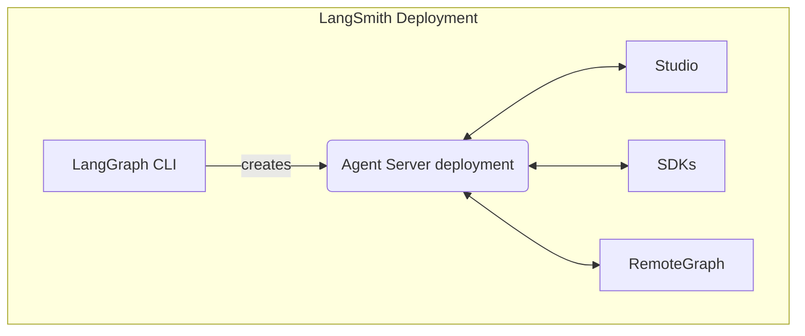

当运行自托管的 [LangSmith 部署](/langsmith/deploy-self-hosted-full-platform) 时，您的安装包含几个关键组件。这些工具和服务共同提供了一个完整的解决方案，用于在您自己的基础设施中构建、部署和管理图（包括智能体应用程序）：

- [Agent Server](/langsmith/agent-server): 定义了一个用于部署图和智能体的规范化 API 和运行时。它处理执行、状态管理和持久化，让您可以专注于构建逻辑，而非服务器基础设施。
- [LangGraph CLI](/langsmith/cli): 一个命令行界面，用于在本地构建、打包和与图交互，并为其部署做准备。
- [Studio](/langsmith/studio): 一个用于可视化、交互和调试的专用 IDE。它连接到本地 Agent Server，用于开发和测试您的图。
- [Python/JS SDK](/langsmith/sdk): Python/JS SDK 提供了一种编程方式，让您的应用程序可以与已部署的图和智能体进行交互。
- [RemoteGraph](/langsmith/use-remote-graph): 允许您像在本地运行一样与已部署的图进行交互。
- [Control Plane](/langsmith/control-plane): 用于创建、更新和管理 Agent Server 部署的 UI 和 API。
- [Data plane](/langsmith/data-plane): 执行您的图的运行时层，包括 Agent Server、其支持服务（PostgreSQL、Redis 等）以及从控制平面协调状态的监听器。
