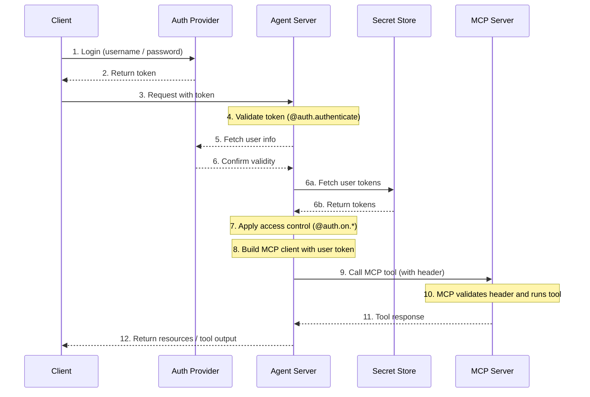

模型上下文协议（Model Context Protocol，MCP）是一种开放协议，用于以模型无关的格式描述工具和数据源，使 LLM 能够通过结构化 API 发现和使用它们。

[Agent Server](/langsmith/agent-server) 使用 [Streamable HTTP 传输](https://spec.modelcontextprotocol.io/specification/2025-03-26/basic/transports/#streamable-http) 实现了 MCP。这使得 LangGraph **智能体** 可以作为 **MCP 工具** 暴露出来，从而可以被任何支持 Streamable HTTP 的 MCP 兼容客户端使用。

MCP 端点位于 [Agent Server](/langsmith/agent-server) 的 `/mcp` 路径上。

您可以设置 [自定义身份验证中间件](/langsmith/custom-auth)，通过 MCP 服务器对用户进行身份验证，以访问 LangSmith 部署中用户作用域内的工具。

此流程的示例架构如下：



## 要求

要使用 MCP，请确保已安装以下依赖项：

* `langgraph-api >= 0.2.3`
* `langgraph-sdk >= 0.1.61`

使用以下命令安装：

::: code-group

```bash [pip]
pip install "langgraph-api>=0.2.3" "langgraph-sdk>=0.1.61"
```

```bash [uv]
uv add "langgraph-api>=0.2.3" "langgraph-sdk>=0.1.61"
```

:::

## 使用概述

要启用 MCP：

* 升级到使用 langgraph-api>=0.2.3。如果您正在部署 LangSmith，创建新修订版时会自动完成此操作。
* MCP 工具（智能体）将自动暴露。
* 与任何支持 Streamable HTTP 的 MCP 兼容客户端连接。

### 客户端

使用 MCP 兼容客户端连接到 Agent Server。以下示例展示了如何使用不同的编程语言进行连接。

<Tabs>

<Tab title="JavaScript/TypeScript">

```bash
npm install @modelcontextprotocol/sdk
```

> **注意**
> 将 `serverUrl` 替换为您的 Agent Server URL，并根据需要配置身份验证头。

```js
import { Client } from "@modelcontextprotocol/sdk/client/index.js";
import { StreamableHTTPClientTransport } from "@modelcontextprotocol/sdk/client/streamableHttp.js";

// 连接到 LangGraph MCP 端点
async function connectClient(url) {
    const baseUrl = new URL(url);
    const client = new Client({
        name: 'streamable-http-client',
        version: '1.0.0'
    });

    const transport = new StreamableHTTPClientTransport(baseUrl);
    await client.connect(transport);

    console.log("Connected using Streamable HTTP transport");
    console.log(JSON.stringify(await client.listTools(), null, 2));
    return client;
}

const serverUrl = "http://localhost:2024/mcp";

connectClient(serverUrl)
    .then(() => {
        console.log("Client connected successfully");
    })
    .catch(error => {
        console.error("Failed to connect client:", error);
    });
```

</Tab>

<Tab title="Python">

使用以下命令安装适配器：

```bash
pip install langchain-mcp-adapters
```

以下是如何连接到远程 MCP 端点并将智能体作为工具使用的示例：

```python
# Create server parameters for stdio connection
from mcp import ClientSession
from mcp.client.streamable_http import streamablehttp_client
import asyncio

from langchain_mcp_adapters.tools import load_mcp_tools
from langchain.agents import create_agent

server_params = {
    "url": "https://mcp-finance-agent.xxx.us.langgraph.app/mcp",
    "headers": {
        "X-Api-Key":"lsv2_pt_your_api_key"
    }
}

async def main():
    async with streamablehttp_client(**server_params) as (read, write, _):
        async with ClientSession(read, write) as session:
            # Initialize the connection
            await session.initialize()

            # Load the remote graph as if it was a tool
            tools = await load_mcp_tools(session)

            # Create and run a react agent with the tools
            agent = create_agent("gpt-4.1", tools)

            # Invoke the agent with a message
            agent_response = await agent.ainvoke({"messages": "What can the finance agent do for me?"})
            print(agent_response)

if __name__ == "__main__":
    asyncio.run(main())
```

</Tab>

</Tabs>

## 将智能体暴露为 MCP 工具

部署后，您的智能体将作为工具出现在 MCP 端点中，配置如下：

* **工具名称**：智能体的名称。
* **工具描述**：智能体的描述。
* **工具输入模式**：智能体的输入模式。

### 设置名称和描述

您可以在 `langgraph.json` 中设置智能体的名称和描述：

```json
{
    "graphs": {
        "my_agent": {
            "path": "./my_agent/agent.py:graph",
            "description": "A description of what the agent does"
        }
    },
    "env": ".env"
}
```

部署后，您可以使用 LangGraph SDK 更新名称和描述。

### 模式

定义清晰、最小化的输入和输出模式，以避免向 LLM 暴露不必要的内部复杂性。

默认的 [MessagesState](/oss/langgraph/graph-api#messagesstate) 使用 `AnyMessage`，它支持多种消息类型，但对于直接暴露给 LLM 来说过于通用。

相反，应定义使用显式类型化输入和输出结构的**自定义智能体或工作流**。

例如，一个回答文档问题的工作流可能如下所示：

```python
from langgraph.graph import StateGraph, START, END
from typing_extensions import TypedDict

# Define input schema
class InputState(TypedDict):
    question: str

# Define output schema
class OutputState(TypedDict):
    answer: str

# Combine input and output
class OverallState(InputState, OutputState):
    pass

# Define the processing node
def answer_node(state: InputState):
    # Replace with actual logic and do something useful
    return {"answer": "bye", "question": state["question"]}

# Build the graph with explicit schemas
builder = StateGraph(OverallState, input_schema=InputState, output_schema=OutputState)
builder.add_node(answer_node)
builder.add_edge(START, "answer_node")
builder.add_edge("answer_node", END)
graph = builder.compile()

# Run the graph
print(graph.invoke({"question": "hi"}))
```

更多详细信息，请参阅 [底层概念指南](/oss/langgraph/graph-api#state)。

## 在您的部署中使用用户作用域的 MCP 工具

<Tip>

<strong>先决条件</strong>
您已添加了自己的[自定义身份验证中间件](/langsmith/custom-auth)，该中间件填充了 `langgraph_auth_user` 对象，使其可通过可配置的上下文在图的每个节点中访问。

</Tip>

要使您的 LangSmith 部署能够使用用户作用域的工具，请从实现类似以下的代码片段开始：

```python
from langchain_mcp_adapters.client import MultiServerMCPClient

def mcp_tools_node(state, config):
    user = config["configurable"].get("langgraph_auth_user")
         , user["github_token"], user["email"], etc.

    client = MultiServerMCPClient({
        "github": {
            "transport": "streamable_http", # (1)
            "url": "https://my-github-mcp-server/mcp", # (2)
            "headers": {
                "Authorization": f"Bearer {user['github_token']}"
            }
        }
    })
    tools = await client.get_tools() # (3)

    # Your tool-calling logic here

    tool_messages = ...
    return {"messages": tool_messages}
```

1. MCP 仅支持向 `streamable_http` 和 `sse` `transport` 服务器发出的请求添加头信息。
2. 您的 MCP 服务器 URL。
3. 从您的 MCP 服务器获取可用工具。

_这也可以通过[在运行时重建您的图](/langsmith/graph-rebuild)来为新的运行使用不同的配置来实现_

## 会话行为

当前的 LangGraph MCP 实现不支持会话。每个 `/mcp` 请求都是无状态且独立的。

## 身份验证

`/mcp` 端点使用与 LangGraph API 其余部分相同的身份验证。有关设置详情，请参阅[身份验证指南](/langsmith/auth)。

## 禁用 MCP

要禁用 MCP 端点，请在您的 `langgraph.json` 配置文件中将 `disable_mcp` 设置为 `true`：

```json
{
  "$schema": "https://langgra.ph/schema.json",
  "http": {
    "disable_mcp": true
  }
}
```

这将阻止服务器暴露 `/mcp` 端点。
