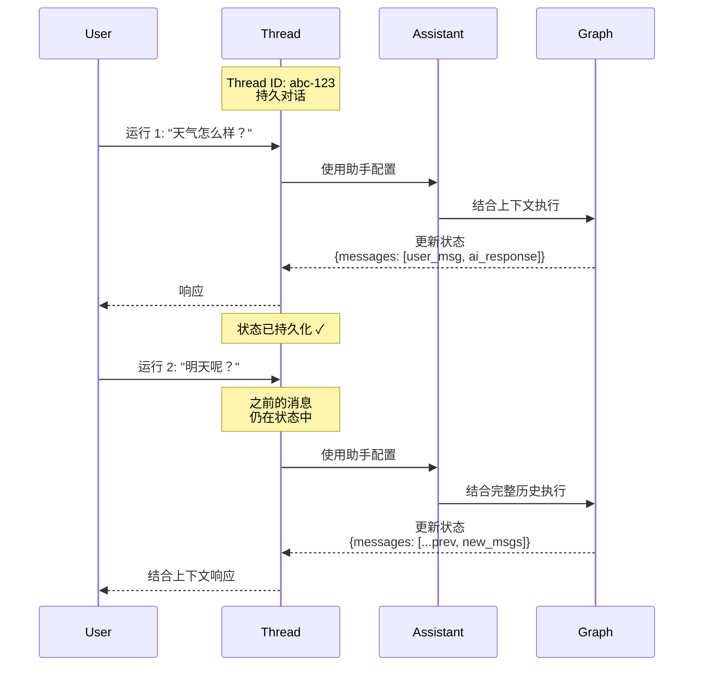

本指南将向您展示如何创建、查看和检查“线程（threads）”。线程与 [助手（assistants）](/langsmith/assistants) 配合使用，从而实现您 [已部署图（deployed graphs）](/langsmith/deployments) 的 [有状态（stateful）](/oss/langgraph/persistence) 执行。

## 理解线程

线程是一个持久的对话容器，可以在多次运行（runs）之间维护状态。每当您在线程上执行一次运行（run）时，图（graph）都会根据线程的当前状态处理输入，并使用新信息更新该状态。

线程通过在运行之间保留对话历史和上下文来实现有状态的交互。如果没有线程，每次运行都将是无状态的，无法记忆之前的交互。线程在以下场景中特别有用：

- **多轮对话**：助手需要记住之前讨论过的内容。
- **长时间运行的任务**：需要在多个步骤之间保持上下文。
- **用户特定的状态管理**：每个用户都有自己独立的对话历史。

下图说明了线程如何在两次运行之间维护状态。第二次运行可以访问第一次运行的消息，使助手能够理解“明天呢？”这一上下文指的是第一次运行中的天气查询：



- 线程使用唯一的线程 ID 来维护持久对话。
- 每次运行都会将助手的配置应用于图执行。
- 状态在每次运行后更新，并为后续运行持久化。
- 后续运行可以访问完整的对话历史。

<Note>

- <strong>[助手（Assistants）](/langsmith/assistants)</strong> 定义了图如何执行的配置（模型、提示词、工具）。在创建运行时，您可以指定 <strong>图 ID（graph ID）</strong>（例如 `"agent"`）来使用默认助手，或者指定 <strong>助手 ID（assistant ID）</strong>（UUID）来使用特定配置。
- <strong>线程（Threads）</strong> 维护状态和对话历史。
- <strong>运行（Runs）</strong> 将助手和线程结合起来，以特定的配置和状态执行您的图。

</Note>

## 创建线程

要运行带有状态持久化的图，您必须先创建一个线程：

<Tabs>

<Tab title="SDK">

### 空线程

要创建一个新线程，请使用以下方式之一：

::: code-group

```python [Python]
from langgraph_sdk import get_client

# 使用您的部署 URL 初始化客户端
client = get_client(url=<DEPLOYMENT_URL>)

# 创建一个空线程
# 这将创建一个没有任何初始状态的新线程
thread = await client.threads.create()

print(thread)
```

```javascript [JavaScript]
import { Client } from "@langchain/langgraph-sdk";

// 使用您的部署 URL 初始化客户端
const client = new Client({ apiUrl: <DEPLOYMENT_URL> });

// 创建一个空线程
// 这将创建一个没有任何初始状态的新线程
const thread = await client.threads.create();

console.log(thread);
```

```bash [cURL]
curl --request POST \
    --url <DEPLOYMENT_URL>/threads \
    --header 'Content-Type: application/json' \
    --data '{}'
```

:::

有关更多信息，请参阅 <a href="https://reference.langchain.com/python/langsmith/deployment/sdk/#langgraph_sdk.client.ThreadsClient.create" target="_blank" rel="noreferrer" class="link">Python</a> 和 <a href="https://reference.langchain.com/python/langsmith/deployment/sdk/#langgraph_sdk.client.ThreadsClient.create" target="_blank" rel="noreferrer" class="link">JS</a> SDK 文档，或 [REST API](/langsmith/agent-server-api/threads/create-thread) 参考。

输出示例：

```json
{
  "thread_id": "123e4567-e89b-12d3-a456-426614174000",
  "created_at": "2025-05-12T14:04:08.268Z",
  "updated_at": "2025-05-12T14:04:08.268Z",
  "metadata": {},
  "status": "idle",
  "values": {}
}
```

### 复制线程

或者，如果您应用程序中已经有一个线程并希望复制其状态，可以使用 `copy` 方法。这将创建一个独立的线程，其历史记录在操作时与原始线程完全相同：

::: code-group

```python [Python]
# 复制一个现有线程
# 新线程在复制时将拥有与原始线程相同的状态
copied_thread = await client.threads.copy(thread["thread_id"])
```

```javascript [JavaScript]
// 复制一个现有线程
// 新线程在复制时将拥有与原始线程相同的状态
const copiedThread = await client.threads.copy(thread["thread_id"]);
```

```bash [cURL]
curl --request POST --url <DEPLOYMENT_URL>/threads/thread["thread_id"]/copy \
--header 'Content-Type: application/json'
```

:::

有关更多信息，请参阅 <a href="https://reference.langchain.com/python/langsmith/deployment/sdk/#langgraph_sdk.client.ThreadsClient.copy" target="_blank" rel="noreferrer" class="link">Python</a> 和 <a href="https://reference.langchain.com/python/langsmith/deployment/sdk/#langgraph_sdk.client.ThreadsClient.copy" target="_blank" rel="noreferrer" class="link">JS</a> SDK 文档，或 [REST API](/langsmith/agent-server-api/threads/copy-thread) 参考。

### 预填充状态

您可以通过向 `create` 方法提供 `supersteps` 列表来创建一个具有任意预定义状态的线程。`supersteps` 描述了一系列状态更新，用于建立线程的初始状态。这在以下情况下非常有用：

- 创建带有现有对话历史的线程。
- 从另一个系统迁移对话。
- 设置具有特定初始状态的测试场景。
- 从之前的会话中恢复对话。

有关检查点（checkpoints）和状态管理的更多信息，请参阅 [LangGraph 持久化文档（persistence documentation）](/oss/langgraph/persistence)。

::: code-group

```python [Python]
from langgraph_sdk import get_client

# 初始化客户端
client = get_client(url=<DEPLOYMENT_URL>)

# 创建一个具有预填充对话历史的线程
# supersteps 定义了一系列构建初始状态的状态更新
thread = await client.threads.create(
  graph_id="agent",  # 指定此线程适用的图 ID
  supersteps=[
    {
      "updates": [
        {
          "values": {},
          "as_node": "__input__",  # 初始输入节点
        },
      ],
    },
    {
      "updates": [
        {
          "values": {
            "messages": [
              {
                "type": "human",
                "content": "你好",
              },
            ],
          },
          "as_node": "__start__",  # 用户的第一条消息
        },
      ],
    },
    {
      "updates": [
        {
          "values": {
            "messages": [
              {
                "content": "你好！今天我能为您提供什么帮助？",
                "type": "ai",
              },
            ],
          },
          "as_node": "call_model",  # 助手的响应
        },
      ],
    },
  ])

print(thread)
```

```javascript [JavaScript]
import { Client } from "@langchain/langgraph-sdk";

// 初始化客户端
const client = new Client({ apiUrl: <DEPLOYMENT_URL> });

// 创建一个具有预填充对话历史的线程
// supersteps 定义了一系列构建初始状态的状态更新
const thread = await client.threads.create({
    graphId: 'agent',  // 指定此线程适用的图 ID
    supersteps: [
    {
      updates: [
        {
          values: {},
          asNode: '__input__',  // 初始输入节点
        },
      ],
    },
    {
      updates: [
        {
          values: {
            messages: [
              {
                type: 'human',
                content: '你好',
              },
            ],
          },
          asNode: '__start__',  // 用户的第一条消息
        },
      ],
    },
    {
      updates: [
        {
          values: {
            messages: [
              {
                content: '你好！今天我能为您提供什么帮助？',
                type: 'ai',
              },
            ],
          },
          asNode: 'call_model',  // 助手的响应
        },
      ],
    },
  ],
});

console.log(thread);
```

```bash [cURL]
curl --request POST \
    --url <DEPLOYMENT_URL>/threads \
    --header 'Content-Type: application/json' \
    --data '{"metadata":{"graph_id":"agent"},"supersteps":[{"updates":[{"values":{},"as_node":"__input__"}]},{"updates":[{"values":{"messages":[{"type":"human","content":"hello"}]},"as_node":"__start__"}]},{"updates":[{"values":{"messages":[{"content":"Hello\u0021 How can I assist you today?","type":"ai"}]},"as_node":"call_model"}]}]}'
```

:::

输出示例：

```json
{
  "thread_id": "f15d70a1-27d4-4793-a897-de5609920b7d",
  "created_at": "2025-05-12T15:37:08.935038+00:00",
  "updated_at": "2025-05-12T15:37:08.935046+00:00",
  "metadata": {
    "graph_id": "agent"
  },
  "status": "idle",
  "config": {},
  "values": {
    "messages": [
      {
        "content": "hello",
        "additional_kwargs": {},
        "response_metadata": {},
        "type": "human",
        "name": null,
        "id": "8701f3be-959c-4b7c-852f-c2160699b4ab",
        "example": false
      },
      {
        "content": "Hello! How can I assist you today?",
        "additional_kwargs": {},
        "response_metadata": {},
        "type": "ai",
        "name": null,
        "id": "4d8ea561-7ca1-409a-99f7-6b67af3e1aa3",
        "example": false,
        "tool_calls": [],
        "invalid_tool_calls": [],
        "usage_metadata": null
      }
    ]
  }
}
```

</Tab>

<Tab title="UI">

您也可以直接从 [LangSmith UI](https://smith.langchain.com) 创建线程：

1. 导航到您的 [部署（deployment）](/langsmith/deployments)。
2. 选择 **Threads** 选项卡。
3. 点击 **+ New thread**。
4. （可选）为线程提供元数据或初始状态。
5. 点击 **Create thread**。

新创建的线程将出现在线程表格中，并可立即用于运行。

</Tab>

</Tabs>

## 列出线程

<Tabs>

<Tab title="SDK">

要列出线程，请使用 `search` 方法。这将列出应用程序中符合提供的过滤条件的线程：

### 按线程状态过滤

使用 `status` 字段根据线程状态过滤线程。支持的值包括 `idle`、`busy`、`interrupted` 和 `error`。例如，要查看 `idle` 线程：

::: code-group

```python [Python]
# 搜索空闲线程
# 状态过滤器接受：idle, busy, interrupted, error
print(await client.threads.search(status="idle", limit=1))
```

```javascript [JavaScript]
// 搜索空闲线程
// 状态过滤器接受：idle, busy, interrupted, error
console.log(await client.threads.search({ status: "idle", limit: 1 }));
```

```bash [cURL]
curl --request POST \
--url <DEPLOYMENT_URL>/threads/search \
--header 'Content-Type: application/json' \
--data '{"status": "idle", "limit": 1}'
```

:::

有关更多信息，请参阅 <a href="https://reference.langchain.com/python/langsmith/deployment/sdk/#langgraph_sdk.client.ThreadsClient.search" target="_blank" rel="noreferrer" class="link">Python</a> 和 <a href="https://reference.langchain.com/python/langsmith/deployment/sdk/#langgraph_sdk.client.ThreadsClient.search" target="_blank" rel="noreferrer" class="link">JS</a> SDK 文档，或 [REST API](/langsmith/agent-server-api/threads/search-threads) 参考。

输出示例：

```json
[
  {
    "thread_id": "cacf79bb-4248-4d01-aabc-938dbd60ed2c",
    "created_at": "2024-08-14T17:36:38.921660+00:00",
    "updated_at": "2024-08-14T17:36:38.921660+00:00",
    "metadata": {
      "graph_id": "agent"
    },
    "status": "idle",
    "config": {
      "configurable": {}
    }
  }
]
```

### 按元数据过滤

`search` 方法允许您根据元数据进行过滤。这对于查找与特定图（graph）、用户或您添加到线程的自定义元数据相关联的线程非常有用：

::: code-group

```python [Python]
# 搜索具有特定元数据的线程
# 元数据过滤对于按图、用户或自定义标签组织线程很有用
print((await client.threads.search(metadata={"graph_id":"agent"}, limit=1)))
```

```javascript [JavaScript]
// 搜索具有特定元数据的线程
// 元数据过滤对于按图、用户或自定义标签组织线程很有用
console.log((await client.threads.search({ metadata: { "graph_id": "agent" }, limit: 1 })));
```

```bash [cURL]
curl --request POST \
--url <DEPLOYMENT_URL>/threads/search \
--header 'Content-Type: application/json' \
--data '{"metadata": {"graph_id":"agent"}, "limit": 1}'
```

:::

输出示例：

```json
[
  {
    "thread_id": "cacf79bb-4248-4d01-aabc-938dbd60ed2c",
    "created_at": "2024-08-14T17:36:38.921660+00:00",
    "updated_at": "2024-08-14T17:36:38.921660+00:00",
    "metadata": {
      "graph_id": "agent"
    },
    "status": "idle",
    "config": {
      "configurable": {}
    }
  }
]
```

### 排序

SDK 还支持使用 `sort_by` 和 `sort_order` 参数按 `thread_id`、`status`、`created_at` 和 `updated_at` 进行线程排序。

</Tab>

<Tab title="UI">

您也可以通过 [LangSmith UI](https://smith.langchain.com) 查看和管理部署中的线程：

1. 导航到您的 [部署（deployment）](/langsmith/deployments)。
2. 选择 **Threads** 选项卡。

这将加载所在部署中所有线程的表格。

**按线程状态过滤**：在顶部栏中选择一个状态，以按 `idle`、`busy`、`interrupted` 或 `error` 过滤线程。

**排序线程**：点击任何列标题的箭头图标，按该属性（`thread_id`、`status`、`created_at` 或 `updated_at`）进行排序。

</Tab>

</Tabs>

## 检查线程

<Tabs>

<Tab title="SDK">

### 获取线程

要查看给定 `thread_id` 的特定线程，请使用 <a href="https://reference.langchain.com/python/langsmith/deployment/sdk/#langgraph_sdk.client.ThreadsClient.get" target="_blank" rel="noreferrer" class="link"><code>get</code></a> 方法：

::: code-group

```python [Python]
# 根据 ID 检索特定线程
# 返回线程元数据，包括状态、创建时间和元数据
print((await client.threads.get(thread["thread_id"])))
```

```javascript [JavaScript]
// 根据 ID 检索特定线程
// 返回线程元数据，包括状态、创建时间和元数据
console.log((await client.threads.get(thread["thread_id"])));
```

```bash [cURL]
curl --request GET \
--url <DEPLOYMENT_URL>/threads/thread["thread_id"] \
--header 'Content-Type: application/json'
```

:::

输出示例：

```json
{
  "thread_id": "cacf79bb-4248-4d01-aabc-938dbd60ed2c",
  "created_at": "2024-08-14T17:36:38.921660+00:00",
  "updated_at": "2024-08-14T17:36:38.921660+00:00",
  "metadata": {
    "graph_id": "agent"
  },
  "status": "idle",
  "config": {
    "configurable": {}
  }
}
```

有关更多信息，请参阅 <a href="https://reference.langchain.com/python/langsmith/deployment/sdk/#langgraph_sdk.client.ThreadsClient.get" target="_blank" rel="noreferrer" class="link">Python</a> 和 <a href="https://reference.langchain.com/python/langsmith/deployment/sdk/#langgraph_sdk.client.ThreadsClient.get" target="_blank" rel="noreferrer" class="link">JS</a> SDK 文档，或 [REST API](/langsmith/agent-server-api/threads/get-thread) 参考。

### 检查线程状态

要查看给定线程的当前状态，请使用 <a href="https://reference.langchain.com/python/langsmith/deployment/sdk/#langgraph_sdk.client.ThreadsClient.get_state" target="_blank" rel="noreferrer" class="link"><code>get_state</code></a> 方法。这将返回当前值、要执行的下一个节点以及检查点（checkpoint）信息：

::: code-group

```python [Python]
# 获取线程的当前状态
# 返回值（values）、下一个节点（next nodes）、任务（tasks）、检查点信息和元数据
print((await client.threads.get_state(thread["thread_id"])))
```

```javascript [JavaScript]
// 获取线程的当前状态
// 返回值（values）、下一个节点（next nodes）、任务（tasks）、检查点信息和元数据
console.log((await client.threads.getState(thread["thread_id"])));
```

```bash [cURL]
curl --request GET \
--url <DEPLOYMENT_URL>/threads/thread["thread_id"]/state \
--header 'Content-Type: application/json'
```

:::

输出示例：

```json
{
  "values": {
    "messages": [
      {
        "content": "hello",
        "additional_kwargs": {},
        "response_metadata": {},
        "type": "human",
        "name": null,
        "id": "8701f3be-959c-4b7c-852f-c2160699b4ab",
        "example": false
      },
      {
        "content": "Hello! How can I assist you today?",
        "additional_kwargs": {},
        "response_metadata": {},
        "type": "ai",
        "name": null,
        "id": "4d8ea561-7ca1-409a-99f7-6b67af3e1aa3",
        "example": false,
        "tool_calls": [],
        "invalid_tool_calls": [],
        "usage_metadata": null
      }
    ]
  },
  "next": [],
  "tasks": [],
  "metadata": {
    "thread_id": "f15d70a1-27d4-4793-a897-de5609920b7d",
    "checkpoint_id": "1f02f46f-7308-616c-8000-1b158a9a6955",
    "graph_id": "agent_with_quite_a_long_name",
    "source": "update",
    "step": 1,
    "writes": {
      "call_model": {
        "messages": [
          {
            "content": "Hello! How can I assist you today?",
            "type": "ai"
          }
        ]
      }
    },
    "parents": {}
  },
  "created_at": "2025-05-12T15:37:09.008055+00:00",
  "checkpoint": {
    "checkpoint_id": "1f02f46f-733f-6b58-8001-ea90dcabb1bd",
    "thread_id": "f15d70a1-27d4-4793-a897-de5609920b7d",
    "checkpoint_ns": ""
  },
  "parent_checkpoint": {
    "checkpoint_id": "1f02f46f-7308-616c-8000-1b158a9a6955",
    "thread_id": "f15d70a1-27d4-4793-a897-de5609920b7d",
    "checkpoint_ns": ""
  },
  "checkpoint_id": "1f02f46f-733f-6b58-8001-ea90dcabb1bd",
  "parent_checkpoint_id": "1f02f46f-7308-616c-8000-1b158a9a6955"
}
```

有关更多信息，请参阅 <a href="https://reference.langchain.com/python/langsmith/deployment/sdk/#langgraph_sdk.client.ThreadsClient.get_state" target="_blank" rel="noreferrer" class="link">Python</a> 和 <a href="https://reference.langchain.com/python/langsmith/deployment/sdk/#langgraph_sdk.client.ThreadsClient.get_state" target="_blank" rel="noreferrer" class="link">JS</a> SDK 文档，或 [REST API](/langsmith/agent-server-api/threads/get-thread-state) 参考。

（可选）要查看线程在给定检查点（checkpoint）时的状态，请传入检查点 ID。这对于检查线程在执行历史中特定时间点的状态非常有用。

首先，从线程的历史记录中获取检查点 ID：

::: code-group

```python [Python]
# 获取线程历史记录以查找检查点 ID
history = await client.threads.get_history(thread_id=thread["thread_id"])
checkpoint_id = history[0]["checkpoint_id"]  # 获取最近的一个检查点
```

```javascript [JavaScript]
// 获取线程历史记录以查找检查点 ID
const history = await client.threads.getHistory(thread["thread_id"]);
const checkpointId = history[0].checkpoint_id;  // 获取最近的一个检查点
```

```bash [cURL]
# 获取线程历史记录以查找检查点 ID
curl --request POST \
--url <DEPLOYMENT_URL>/threads/thread["thread_id"]/history \
--header 'Content-Type: application/json' \
--data '{"limit": 1}'
```

:::

然后使用该检查点 ID 获取该特定时间点的状态：

::: code-group

```python [Python]
# 获取特定检查点处的线程状态
# 对于检查历史状态或调试非常有用
thread_state = await client.threads.get_state(
  thread_id=thread["thread_id"],
  checkpoint_id=checkpoint_id
)
```

```javascript [JavaScript]
// 获取特定检查点处的线程状态
// 对于检查历史状态或调试非常有用
const threadState = await client.threads.getState(thread["thread_id"], checkpointId);
```

```bash [cURL]
curl --request GET \
--url <DEPLOYMENT_URL>/threads/thread["thread_id"]/state/<CHECKPOINT_ID> \
--header 'Content-Type: application/json'
```

:::

### 检查完整的线程历史记录

要查看线程的历史记录，请使用 <a href="https://reference.langchain.com/python/langsmith/deployment/sdk/#langgraph_sdk.client.ThreadsClient.get_history" target="_blank" rel="noreferrer" class="link"><code>get_history</code></a> 方法。这将返回线程经历过的每一个状态列表，允许您追踪完整的执行路径：

::: code-group

```python [Python]
# 获取线程的完整历史记录
# 返回线程执行过程中所有状态快照的列表
history = await client.threads.get_history(
  thread_id=thread["thread_id"],
  limit=10  # 可选：限制返回的状态数量
)

for state in history:
    print(f"检查点（Checkpoint）: {state['checkpoint_id']}")
    print(f"步骤（Step）: {state['metadata']['step']}")
```

```javascript [JavaScript]
// 获取线程的完整历史记录
// 返回线程执行过程中所有状态快照的列表
const history = await client.threads.getHistory(
  thread["thread_id"],
  {
    limit: 10  // 可选：限制返回的状态数量
  }
);

for (const state of history) {
  console.log(`检查点（Checkpoint）: ${state.checkpoint_id}`);
  console.log(`步骤（Step）: ${state.metadata.step}`);
}
```

```bash [cURL]
curl --request POST \
--url <DEPLOYMENT_URL>/threads/thread["thread_id"]/history \
--header 'Content-Type: application/json' \
--data '{"limit": 10}'
```

:::

此方法在以下场景中特别有用：
- 通过查看状态演变来调试执行流。
- 理解图（graph）执行中的决策点。
- 审计对话历史和状态更改。
- 回放或分析过去的交互。

有关更多信息，请参阅 <a href="https://reference.langchain.com/python/langsmith/deployment/sdk/#langgraph_sdk.client.ThreadsClient.get_history" target="_blank" rel="noreferrer" class="link">Python</a> 和 <a href="https://reference.langchain.com/python/langsmith/deployment/sdk/#langgraph_sdk.client.ThreadsClient.get_history" target="_blank" rel="noreferrer" class="link">JS</a> SDK 文档，或 [REST API](/langsmith/agent-server-api/threads/get-thread-history) 参考。

</Tab>

<Tab title="UI">

您也可以在 [LangSmith UI](https://smith.langchain.com) 中查看和检查线程：

1. 导航到您的 [部署（deployment）](/langsmith/deployments)。
2. 选择 **Threads** 选项卡以查看所有线程。
3. 点击某个线程以检查其当前状态。

要查看完整的线程历史记录并进行详细调试，请点击 **Open in Studio** 以在 [Studio](/langsmith/studio) 中开发线程。Studio 提供了一个可视化界面，用于探索线程的执行历史、状态更改和检查点详情。

</Tab>

</Tabs>

