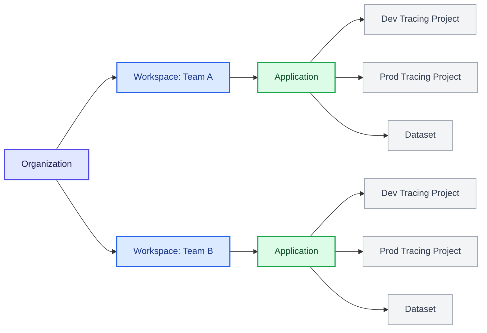
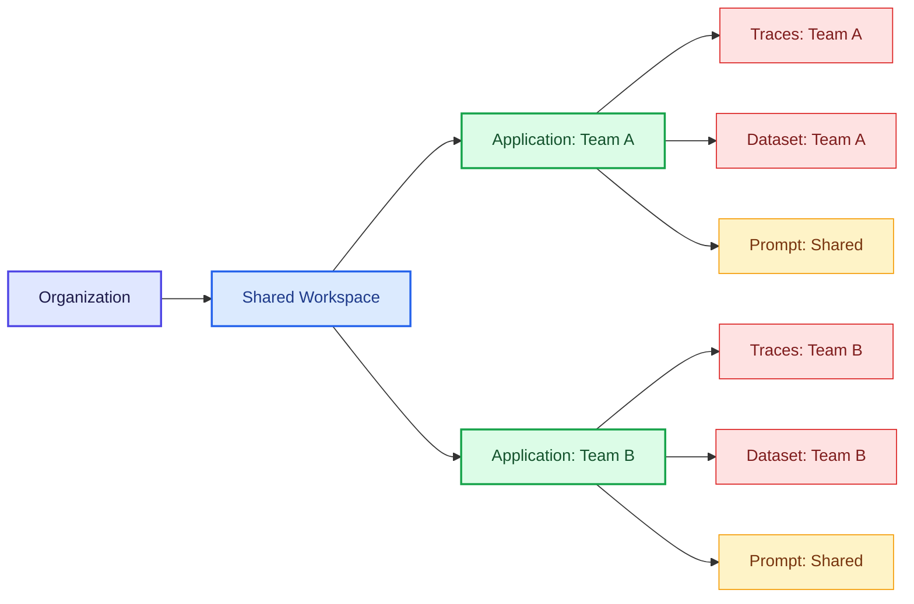
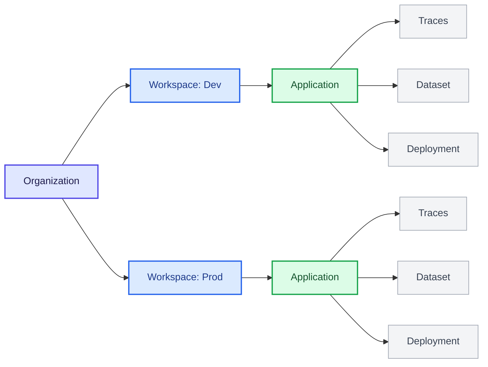

LangSmith 采用分层结构来组织您的工作：[_组织_](/langsmith/administration-overview#organizations)、[_工作空间_](/langsmith/administration-overview#workspaces)、[_应用_](/langsmith/administration-overview#applications) 和 [_资源_](/langsmith/administration-overview#resources)。这种结构使您能够在协作与访问控制之间取得平衡，让您可以根据团队需求选择适当的隔离级别。

LangSmith 的权限系统建立在此层次结构之上。通过 [基于角色的访问控制 (RBAC)](/langsmith/rbac)，用户 [_权限_](/langsmith/organization-workspace-operations) 的作用域限定在一个或多个工作空间，从而强制执行工作空间之间的隔离。通过更细粒度的 [基于属性的访问控制](/langsmith/organization-workspace-operations#access-policies)（ABAC，处于私有预览阶段），可以根据工作空间内的标签或应用等属性进一步限制或授予访问权限（例如，允许用户仅访问开发资源或仅访问与特定应用关联的资源）。

本页根据团队的隔离需求，解释了三种常见的工作空间组织方法：

- [以团队为中心的工作空间](#team-centric-workspaces)：每个团队一个工作空间（推荐给大多数客户）
- [协作式工作空间](#collaborative-workspaces)：每个工作空间包含多个团队
- [项目隔离的工作空间](#project-isolated-workspaces)：每个团队拥有多个工作空间（适用于严格的隔离要求）

<Tip>

有关设置组织和工作空间的详细信息，请参阅 [设置层次结构](/langsmith/set-up-hierarchy)。

</Tip>

## 以团队为中心的工作空间

<Callout icon="check" iconType="solid" color="#C7D2FE">

这是默认模型，也是推荐给大多数客户的选择。

</Callout>

此模型（每个团队一个工作空间）使用单个组织作为顶级边界。在组织内部，使用多个工作空间来隔离不同的团队或业务单元。每个工作空间代表特定团队的逻辑边界，并管理该团队可以访问的数据和资源。在工作空间内，团队使用多个应用来分组支持同一智能体（agent）的资源。一个应用还可能包含不同的资源，例如用于开发和生产环境的独立追踪项目。

- **优点：** 单一工作空间允许共享所有团队资源，使得团队内的协作和迭代变得直接。它还简化了从开发到生产的升级流程。例如，同一个[提示词](/langsmith/prompt-engineering)可以通过标签进行版本控制并升级到生产环境，无需复制或重复。
- **缺点：** 主要的权衡在于同一团队内不同环境之间的隔离性有限。开发、测试和生产资源共存于同一个应用程序中，因此团队必须依赖标签和约定来避免对生产环境造成意外影响。[RBAC](/langsmith/rbac) 的作用范围在工作空间级别。[ABAC](/langsmith/organization-workspace-operations#access-policies)（私有预览版）通过基于资源属性（例如，允许用户仅访问开发资源）限制访问，在工作空间内提供了更细粒度的权限。

## 协作工作空间

在此模型（每个工作空间多个团队）中，多个团队在组织内共享一个工作空间，并使用应用程序和[ABAC](/langsmith/organization-workspace-operations#access-policies)（私有预览版）来分离资源并管理访问。因此，诸如[提示词](/langsmith/prompt-engineering)和[部署](/langsmith/deployments)之类的共享资源可以在团队间重复使用，而对敏感资源（如[追踪记录](/langsmith/observability-concepts#traces)和[数据集](/langsmith/evaluation-concepts#datasets)）的访问则仅限于所属团队。

- **优点：** 提示词和部署等公共资源可以在团队间共享和重用，从而增强协作并减少重复工作。与以团队为中心的工作空间模型不同，协作不限于单个团队，可以跨越工作空间内的所有团队。
- **缺点：** 团队和环境之间的隔离性弱于多工作空间模型，并且依赖于ABAC的正确使用。配置错误的标签或策略可能导致敏感的[追踪记录](/langsmith/observability-concepts#traces)或[数据集](/langsmith/evaluation-concepts#datasets)在团队间暴露，并且在多个团队间管理权限会增加操作复杂性。

## 项目隔离的工作空间

<Callout icon="check" iconType="solid" color="#C7D2FE">

仅当需要严格隔离时才应使用此方法。

</Callout>

在此模型（每个团队多个工作空间）中，通过为单个团队创建多个工作空间来增强隔离性。工作空间可以按项目或按环境（例如，独立的开发和生产工作空间）进行组织。每个工作空间都是完全隔离的，拥有自己的用户、数据和资源，并且访问权限严格限定在该工作空间内。

- **优点：** 团队、项目和环境之间实现了强隔离。仅能访问开发工作区的用户无法查看或访问生产数据或任何生产资源，从而降低了意外更改或跨环境误用的风险。
- **缺点：** 资源无法跨工作区共享。即使是在将智能体（agent）从开发环境提升到生产环境时，重用[提示词（prompts）](/langsmith/prompt-engineering)、[数据集（datasets）](/langsmith/evaluation-concepts#datasets)或[实验（experiments）](/langsmith/evaluation-concepts#experiment)也需要在工作区之间手动复制，这会带来摩擦和重复工作。
