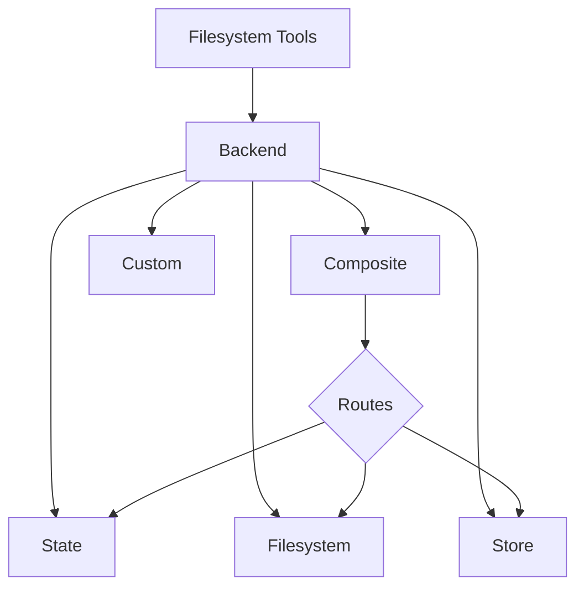

深度智能体通过工具如 `ls`、`read_file`、`write_file`、`edit_file`、`glob` 和 `grep` 向智能体暴露一个文件系统接口。这些工具通过一个可插拔的后端进行操作。



本页解释了如何[选择后端](#specify-a-backend)、[将不同路径路由到不同后端](#route-to-different-backends)、[实现你自己的虚拟文件系统](#use-a-virtual-filesystem)（例如 S3 或 Postgres）、[添加策略钩子](#add-policy-hooks)以及[遵守后端协议](#protocol-reference)。

## 快速开始

以下是几个预构建的文件系统后端，你可以快速与你的深度智能体一起使用：

| 内置后端 | 描述 |
|---|---|
| [默认](#statebackend-ephemeral) | `agent = create_deep_agent()` <br></br> 状态中的临时存储。智能体的默认文件系统后端存储在 `langgraph` 状态中。请注意，此文件系统仅_在单个线程内_持久化。 |
| [本地文件系统持久化](#filesystembackend-local-disk) | `agent = create_deep_agent(backend=FilesystemBackend(root_dir="/Users/nh/Desktop/"))` <br></br>这使深度智能体能够访问你本地机器的文件系统。你可以指定智能体有权访问的根目录。请注意，任何提供的 `root_dir` 必须是绝对路径。 |
| [持久化存储（LangGraph 存储）](#storebackend-langgraph-store) | `agent = create_deep_agent(backend=lambda rt: StoreBackend(rt))` <br></br>这使智能体能够访问_跨线程持久化_的长期存储。这非常适合存储长期记忆或适用于智能体多次执行的指令。 |
| [复合](#compositebackend-router) | 默认临时存储，`/memories/` 路径持久化。复合后端具有最大的灵活性。你可以指定文件系统中的不同路由指向不同的后端。请参阅下面的复合路由部分，获取一个可直接粘贴的示例。 |

## 内置后端

### StateBackend（临时存储）

```typescript
import { createDeepAgent, StateBackend } from "deepagents";

// 默认情况下，我们提供一个 StateBackend
const agent = createDeepAgent();

// 在底层，它看起来像这样
const agent2 = createDeepAgent({
  backend: (rt) => new StateBackend(rt),   // 请注意，工具通过 runtime.state 访问 State
});
```

**工作原理：**
- 将文件存储在 LangGraph 智能体状态的当前线程中。
- 通过检查点在同一个线程上的多个智能体轮次中持久化。

**最适合：**
- 作为智能体编写中间结果的暂存区。
- 自动驱逐大型工具输出，智能体随后可以分片读回。

### FilesystemBackend（本地磁盘）

```typescript
import { createDeepAgent, FilesystemBackend } from "deepagents";

const agent = createDeepAgent({
  backend: new FilesystemBackend({ rootDir: ".", virtualMode: true }),
});
```

**工作原理：**
- 在可配置的 `root_dir` 下读取/写入真实文件。
- 你可以选择性地设置 `virtual_mode=True` 来沙盒化并规范化 `root_dir` 下的路径。
- 使用安全的路径解析，尽可能防止不安全的符号链接遍历，可以使用 ripgrep 进行快速的 `grep`。

**最适合：**
- 本地机器上的项目
- CI 沙箱
- 已挂载的持久卷

### StoreBackend (LangGraph 存储)

```typescript
import { createDeepAgent, StoreBackend } from "deepagents";
import { InMemoryStore } from "@langchain/langgraph";

const store = new InMemoryStore()
const agent = createDeepAgent({
  backend: (rt) => new StoreBackend(rt),
  store
});
```

**工作原理：**
- 将文件存储在运行时提供的 LangGraph <a href="https://reference.langchain.com/javascript/classes/_langchain_langgraph-checkpoint.BaseStore.html" target="_blank" rel="noreferrer" class="link"><code>BaseStore</code></a> 中，实现跨线程的持久化存储。

**最适合：**
- 当你已经运行着一个配置好的 LangGraph 存储时（例如，Redis、Postgres 或 <a href="https://reference.langchain.com/javascript/classes/_langchain_langgraph-checkpoint.BaseStore.html" target="_blank" rel="noreferrer" class="link"><code>BaseStore</code></a> 背后的云实现）。
- 当你通过 LangSmith Deployment 部署你的智能体时（系统会自动为你的智能体配置一个存储）。

### CompositeBackend (路由器)

```typescript
import { createDeepAgent, CompositeBackend, StateBackend, StoreBackend } from "deepagents";
import { InMemoryStore } from "@langchain/langgraph";

const compositeBackend = (rt) => new CompositeBackend(
  new StateBackend(rt),
  {
    "/memories/": new StoreBackend(rt),
  }
);

const store = new InMemoryStore()
const agent = createDeepAgent({ backend: compositeBackend, store });
```

**工作原理：**
- 根据路径前缀将文件操作路由到不同的后端。
- 在列表和搜索结果中保留原始路径前缀。

**最适合：**
- 当你希望为智能体同时提供临时存储和跨线程存储时，`CompositeBackend` 允许你同时提供 `StateBackend` 和 `StoreBackend`。
- 当你拥有多个信息源，并希望将它们作为单个文件系统的一部分提供给智能体时。
    - 例如，你将长期记忆存储在某个 Store 的 `/memories/` 目录下，同时还有一个自定义后端，其文档可通过 `/docs/` 访问。

## 指定后端

- 将一个后端传递给 `create_deep_agent(backend=...)`。文件系统中间件会将其用于所有工具。
- 你可以传递以下任一选项：
    - 一个实现了 `BackendProtocol` 的实例（例如，`FilesystemBackend(root_dir=".")`），或者
    - 一个工厂函数 `BackendFactory = Callable[[ToolRuntime], BackendProtocol]`（适用于需要运行时（如 `StateBackend` 或 `StoreBackend`）的后端）。
- 如果省略，默认值为 `lambda rt: StateBackend(rt)`。

## 路由到不同的后端

将命名空间的不同部分路由到不同的后端。通常用于持久化 `/memories/*` 并保持其他所有内容为临时状态。

```typescript
import { createDeepAgent, CompositeBackend, FilesystemBackend, StateBackend } from "deepagents";

const compositeBackend = (rt) => new CompositeBackend(
  new StateBackend(rt),
  {
    "/memories/": new FilesystemBackend({ rootDir: "/deepagents/myagent", virtualMode: true }),
  },
);

const agent = createDeepAgent({ backend: compositeBackend });
```

行为：
- `/workspace/plan.md` → `StateBackend`（临时性）
- `/memories/agent.md` → `/deepagents/myagent` 下的 `FilesystemBackend`
- `ls`、`glob`、`grep` 聚合结果并显示原始路径前缀。

注意：
- 较长前缀优先（例如，路由 `"/memories/projects/"` 可以覆盖 `"/memories/"`）。
- 对于 StoreBackend 路由，确保智能体运行时提供一个存储（`runtime.store`）。

## 使用虚拟文件系统

构建自定义后端，将远程或数据库文件系统（例如 S3 或 Postgres）投影到工具命名空间中。

设计指南：

- 路径是绝对的（`/x/y.txt`）。决定如何将它们映射到您的存储键/行。
- 高效实现 `ls_info` 和 `glob_info`（在可用的情况下使用服务器端列表，否则使用本地过滤器）。
- 对于缺失的文件或无效的正则表达式模式，返回用户可读的错误字符串。
- 对于外部持久化，在结果中设置 `files_update=None`；只有状态后端应返回 `files_update` 字典。

S3 风格大纲：

Postgres 风格大纲：

- 表 `files(path text primary key, content text, created_at timestamptz, modified_at timestamptz)`
- 将工具操作映射到 SQL：
  - `ls_info` 使用 `WHERE path LIKE $1 || '%'`
  - `glob_info` 在 SQL 中过滤或获取后在 Python 中应用 glob
  - `grep_raw` 可以通过扩展名或最后修改时间获取候选行，然后扫描行

## 添加策略钩子

通过子类化或包装后端来强制执行企业规则。

阻止选定前缀下的写入/编辑（子类化）：

通用包装器（适用于任何后端）：

## 协议参考

后端必须实现 `BackendProtocol` 接口。

必需端点：
- `ls_info(path: str) -> list[FileInfo]`
  - 返回至少包含 `path` 的条目。在可用时包含 `is_dir`、`size`、`modified_at`。按 `path` 排序以确保确定性输出。
- `read(file_path: str, offset: int = 0, limit: int = 2000) -> str`
  - 返回带行号的内容。文件不存在时，返回 `"Error: File '/x' not found"`。
- `grep_raw(pattern: str, path: Optional[str] = None, glob: Optional[str] = None) -> list[GrepMatch] | str`
  - 返回结构化匹配结果。对于无效的正则表达式，返回类似 `"Invalid regex pattern: ..."` 的字符串（不要抛出异常）。
- `glob_info(pattern: str, path: str = "/") -> list[FileInfo]`
  - 将匹配的文件作为 `FileInfo` 条目返回（若无匹配则返回空列表）。
- `write(file_path: str, content: str) -> WriteResult`
  - 仅创建。冲突时，返回 `WriteResult(error=...)`。成功时，设置 `path`，对于状态后端设置 `files_update={...}`；外部后端应使用 `files_update=None`。
- `edit(file_path: str, old_string: str, new_string: str, replace_all: bool = False) -> EditResult`
  - 除非 `replace_all=True`，否则强制 `old_string` 的唯一性。如果未找到，返回错误。成功时包含 `occurrences`。

支持类型：
- `WriteResult(error, path, files_update)`
- `EditResult(error, path, files_update, occurrences)`
- `FileInfo` 包含字段：`path`（必需），可选 `is_dir`、`size`、`modified_at`。
- `GrepMatch` 包含字段：`path`、`line`、`text`。
