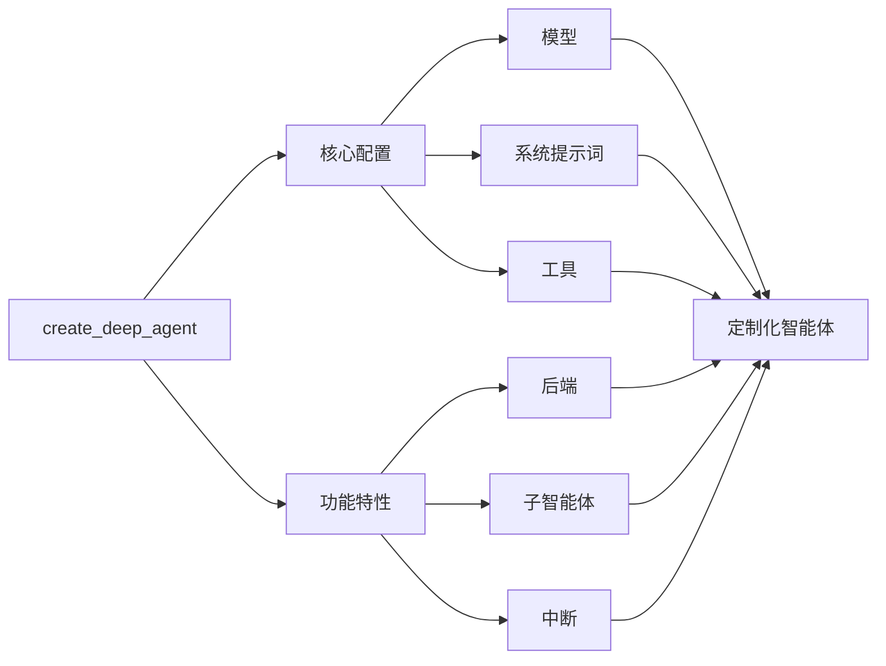

## 模型

默认情况下，`deepagents` 使用 [`claude-sonnet-4-5-20250929`](https://platform.claude.com/docs/en/about-claude/models/overview)。您可以通过传递任何受支持的 <Tooltip tip="遵循 `provider:model` 格式的字符串（例如 openai:gpt-5）" cta="查看映射关系" href="https://reference.langchain.com/python/langchain/models/#langchain.chat_models.init_chat_model(model)">模型标识符字符串</Tooltip> 或 [LangChain 模型对象](/oss/javascript/integrations/chat) 来自定义所使用的模型。

<Tip>

使用 `provider:model` 格式（例如 `openai:gpt-5`）可以快速在不同模型间切换。

</Tip>

```typescript
import { ChatAnthropic } from "@langchain/anthropic";
import { ChatOpenAI } from "@langchain/openai";
import { createDeepAgent } from "deepagents";

// 使用 Anthropic
const agent = createDeepAgent({
  model: new ChatAnthropic({
    model: "claude-sonnet-4-20250514",
    temperature: 0,
  }),
});

// 使用 OpenAI
const agent2 = createDeepAgent({
  model: new ChatOpenAI({
    model: "gpt-5",
    temperature: 0,
  }),
});
```

## 系统提示词

深度智能体（deep agents）内置了一个受 Claude Code 系统提示词启发的系统提示词。默认的系统提示词包含了关于如何使用内置规划工具、文件系统工具和子智能体的详细说明。

为特定用例定制的每个深度智能体都应包含针对该用例的自定义系统提示词。

```typescript
import { createDeepAgent } from "deepagents";

const researchInstructions = `你是一位专家研究员。你的工作是进行深入研究，然后撰写一份精炼的报告。`;

const agent = createDeepAgent({
  systemPrompt: researchInstructions,
});
```

## 工具

除了您提供的自定义工具外，深度智能体还包含用于规划、文件管理和生成子智能体的[内置工具](/oss/javascript/deepagents/overview#core-capabilities)。

```typescript
import { tool } from "langchain";
import { TavilySearch } from "@langchain/tavily";
import { createDeepAgent } from "deepagents";
import { z } from "zod";

const internetSearch = tool(
  async ({
    query,
    maxResults = 5,
    topic = "general",
    includeRawContent = false,
  }: {
    query: string;
    maxResults?: number;
    topic?: "general" | "news" | "finance";
    includeRawContent?: boolean;
  }) => {
    const tavilySearch = new TavilySearch({
      maxResults,
      tavilyApiKey: process.env.TAVILY_API_KEY,
      includeRawContent,
      topic,
    });
    return await tavilySearch._call({ query });
  },
  {
    name: "internet_search",
    description: "执行网络搜索",
    schema: z.object({
      query: z.string().describe("搜索查询"),
      maxResults: z.number().optional().default(5),
      topic: z
        .enum(["general", "news", "finance"])
        .optional()
        .default("general"),
      includeRawContent: z.boolean().optional().default(false),
    }),
  },
);

const agent = createDeepAgent({
  tools: [internetSearch],
});
```

