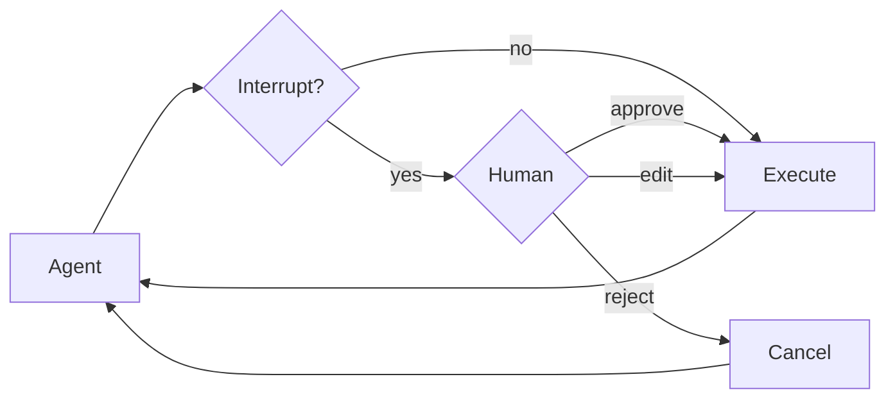

某些工具操作可能较为敏感，需要在执行前获得人工批准。Deep agents 通过 LangGraph 的中断功能支持人机协同工作流。您可以使用 `interrupt_on` 参数来配置哪些工具需要批准。



## 基本配置

`interrupt_on` 参数接受一个字典，将工具名称映射到中断配置。每个工具可以配置为：

- **`True`**：启用中断，使用默认行为（允许批准、编辑、拒绝）
- **`False`**：禁用此工具的中断
- **`{"allowed_decisions": [...]}`**：自定义配置，指定允许的决策

```typescript
import { tool } from "langchain";
import { createDeepAgent } from "deepagents";
import { MemorySaver } from "@langchain/langgraph";
import { z } from "zod";
import { v4 as uuidv4 } from 'uuid'; // install uuid package: npm install uuid

const deleteFile = tool(
  async ({ path }: { path: string }) => {
    return `Deleted ${path}`;
  },
  {
    name: "delete_file",
    description: "Delete a file from the filesystem.",
    schema: z.object({
      path: z.string(),
    }),
  },
);

const sendEmail = tool(
  async ({ to, subject, body }: { to: string; subject: string; body: string }) => {
    return `Sent email to ${to}`;
  },
  {
    name: "send_email",
    description: "Send an email.",
    schema: z.object({
      to: z.string(),
      subject: z.string(),
      body: z.string(),
    }),
  },
);

// Checkpointer is REQUIRED for human-in-the-loop
const checkpointer = new MemorySaver();

const agent = createDeepAgent({
  model: "claude-sonnet-4-5-20250929",
  tools: [deleteFile, sendEmail],
  interruptOn: {
    delete_file: true,  // Default: approve, edit, reject
    read_file: false,   // No interrupts needed
    send_email: { allowedDecisions: ["approve", "reject"] },  // No editing
  },
  checkpointer,  // Required!
});
```

## 决策类型

`allowed_decisions` 列表控制在审查工具调用时，人工可以采取哪些操作：

- **`"approve"`**：使用代理提出的原始参数执行工具
- **`"edit"`**：在执行前修改工具参数
- **`"reject"`**：完全跳过执行此工具调用

您可以为每个工具自定义可用的决策：

```typescript
const interruptOn = {
  // Sensitive operations: allow all options
  delete_file: { allowedDecisions: ["approve", "edit", "reject"] },

  // Moderate risk: approval or rejection only
  write_file: { allowedDecisions: ["approve", "reject"] },

  // Must approve (no rejection allowed)
  critical_operation: { allowedDecisions: ["approve"] },
};
```

## 处理中断

当中断被触发时，代理会暂停执行并返回控制权。检查结果中是否有中断，并相应处理。

```typescript
import { v4 as uuidv4 } from "uuid";
import { Command } from "@langchain/langgraph";

// Create config with thread_id for state persistence
const config = { configurable: { thread_id: uuidv4() } };

// Invoke the agent
let result = await agent.invoke({
  messages: [{ role: "user", content: "Delete the file temp.txt" }],
}, config);

// Check if execution was interrupted
if (result.__interrupt__) {
  // Extract interrupt information
  const interrupts = result.__interrupt__[0].value;
  const actionRequests = interrupts.actionRequests;
  const reviewConfigs = interrupts.reviewConfigs;

  // Create a lookup map from tool name to review config
  const configMap = Object.fromEntries(
    reviewConfigs.map((cfg) => [cfg.actionName, cfg])
  );

  // Display the pending actions to the user
  for (const action of actionRequests) {
    const reviewConfig = configMap[action.name];
    console.log(`Tool: ${action.name}`);
    console.log(`Arguments: ${JSON.stringify(action.args)}`);
    console.log(`Allowed decisions: ${reviewConfig.allowedDecisions}`);
  }

  // Get user decisions (one per actionRequest, in order)
  const decisions = [
    { type: "approve" }  // User approved the deletion
  ];

  // Resume execution with decisions
  result = await agent.invoke(
    new Command({ resume: { decisions } }),
    config  // Must use the same config!
  );
}

// Process final result
console.log(result.messages[result.messages.length - 1].content);
```

## 多个工具调用

当代理调用多个需要批准的工具时，所有中断会批量处理在一个单一的中断中。您必须按顺序为每个中断提供决策。

```typescript
const config = { configurable: { thread_id: uuidv4() } };

let result = await agent.invoke({
  messages: [{
    role: "user",
    content: "Delete temp.txt and send an email to admin@example.com"
  }]
}, config);

if (result.__interrupt__) {
  const interrupts = result.__interrupt__[0].value;
  const actionRequests = interrupts.actionRequests;

  // Two tools need approval
  console.assert(actionRequests.length === 2);

  // Provide decisions in the same order as actionRequests
  const decisions = [
    { type: "approve" },  // First tool: delete_file
    { type: "reject" }    // Second tool: send_email
  ];

  result = await agent.invoke(
    new Command({ resume: { decisions } }),
    config
  );
}
```

## 编辑工具参数

当 `"edit"` 在允许的决策中时，您可以在执行前修改工具参数：

```typescript
if (result.__interrupt__) {
  const interrupts = result.__interrupt__[0].value;
  const actionRequest = interrupts.actionRequests[0];

  // Original args from the agent
  console.log(actionRequest.args);  // { to: "everyone@company.com", ... }

  // User decides to edit the recipient
  const decisions = [{
    type: "edit",
    editedAction: {
      name: actionRequest.name,  // Must include the tool name
      args: { to: "team@company.com", subject: "...", body: "..." }
    }
  }];

  result = await agent.invoke(
    new Command({ resume: { decisions } }),
    config
  );
}
```

## 子代理中断

每个子代理都可以有自己的 `interrupt_on` 配置，这会覆盖主代理的设置：

```typescript
const agent = createDeepAgent({
  tools: [deleteFile, readFile],
  interruptOn: {
    delete_file: true,
    read_file: false,
  },
  subagents: [{
    name: "file-manager",
    description: "Manages file operations",
    systemPrompt: "You are a file management assistant.",
    tools: [deleteFile, readFile],
    interruptOn: {
      // Override: require approval for reads in this subagent
      delete_file: true,
      read_file: true,  // Different from main agent!
    }
  }],
  checkpointer
});
```

当子代理触发中断时，处理方式是相同的——检查 `__interrupt__` 并使用 `Command` 恢复。

## 最佳实践

### 始终使用检查点

人机协同需要一个检查点来在中断和恢复之间持久化代理状态：

### 使用相同的线程 ID

恢复时，必须使用具有相同 `thread_id` 的相同配置：

### 决策顺序与操作匹配

决策列表必须与 `action_requests` 的顺序匹配：

### 根据风险定制配置

根据工具的风险级别配置不同的中断设置：

