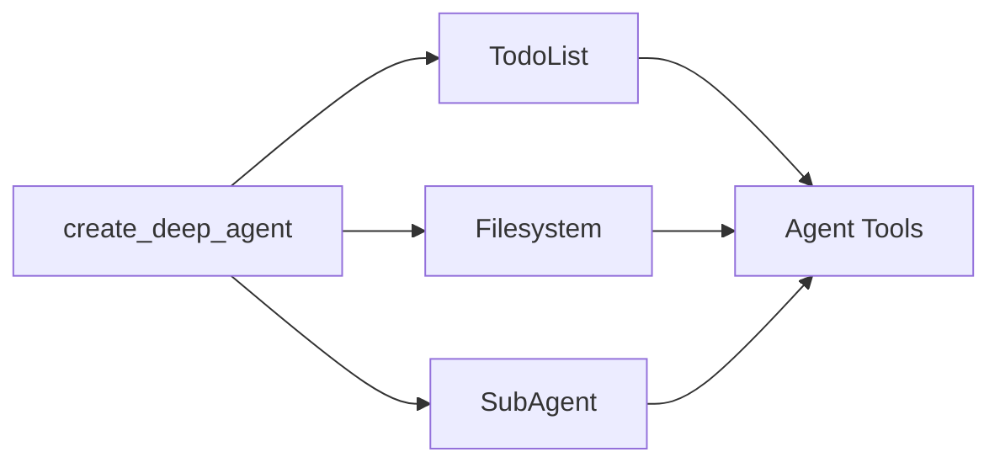

深度智能体（Deep Agent）采用模块化的中间件架构构建。深度智能体具备以下能力：

1. 规划工具
2. 用于存储上下文和长期记忆的文件系统
3. 生成子智能体（subagent）的能力

每个功能都作为独立的中间件实现。当你使用 `create_deep_agent` 创建深度智能体时，我们会自动为你的智能体附加 `TodoListMiddleware`、`FilesystemMiddleware` 和 `SubAgentMiddleware`。



中间件是可组合的——你可以根据需要为智能体添加任意数量的中间件。你也可以独立使用任何中间件。

以下部分将解释每个中间件提供的功能。

## 待办事项列表中间件

规划是解决复杂问题的关键。如果你最近使用过 Claude Code，你会注意到它在处理复杂的多部分任务之前，会先写下一个待办事项列表。你还会注意到，随着更多信息的输入，它能够动态地调整和更新这个待办事项列表。

`TodoListMiddleware` 为你的智能体提供了一个专门用于更新此待办事项列表的工具。在执行多部分任务之前和执行过程中，系统会提示智能体使用 `write_todos` 工具来跟踪它正在做什么以及还需要做什么。

```typescript
import { createAgent, todoListMiddleware } from "langchain";

// todoListMiddleware 默认包含在 createDeepAgent 中
// 如果你在构建自定义智能体，可以对其进行定制
const agent = createAgent({
  model: "claude-sonnet-4-5-20250929",
  middleware: [
    todoListMiddleware({
      // 可选：对系统提示的自定义补充
      systemPrompt: "Use the write_todos tool to...",
    }),
  ],
});
```

## 文件系统中间件

上下文工程是构建高效智能体的主要挑战。当使用返回可变长度结果的工具时（例如 `web_search` 和 RAG），这一点尤其困难，因为冗长的工具结果会迅速填满你的上下文窗口。

`FilesystemMiddleware` 提供了四个工具，用于与短期和长期记忆进行交互：

- `ls`：列出文件系统中的文件
- `read_file`：读取整个文件或文件的特定行数
- `write_file`：向文件系统写入新文件
- `edit_file`：编辑文件系统中的现有文件

```typescript
import { createAgent } from "langchain";
import { createFilesystemMiddleware } from "deepagents";
```

// FilesystemMiddleware 默认包含在 createDeepAgent 中
// 如果构建自定义智能体，可以对其进行定制
const agent = createAgent({
  model: "claude-sonnet-4-5-20250929",
  middleware: [
createFilesystemMiddleware({
backend: undefined,  // 可选：自定义后端（默认为 StateBackend）
systemPrompt: "在以下情况下写入文件系统...",  // 可选的自定义系统提示覆盖
customToolDescriptions: {
ls: "在以下情况下使用 ls 工具...",
read_file: "使用 read_file 工具来...",
},  // 可选：文件系统工具的自定义描述
}),
  ],
});
```
:::

### 短期与长期文件系统

默认情况下，这些工具会写入图状态中的本地“文件系统”。要启用跨线程的持久存储，请配置一个 `CompositeBackend`，将特定路径（如 `/memories/`）路由到 `StoreBackend`。

:::python

```python
from langchain.agents import create_agent
from deepagents.middleware import FilesystemMiddleware
from deepagents.backends import CompositeBackend, StateBackend, StoreBackend
from langgraph.store.memory import InMemoryStore

store = InMemoryStore()

agent = create_agent(
model="claude-sonnet-4-5-20250929",
store=store,
middleware=[
FilesystemMiddleware(
backend=lambda rt: CompositeBackend(
default=StateBackend(rt),
routes={"/memories/": StoreBackend(rt)}
),
custom_tool_descriptions={
"ls": "在以下情况下使用 ls 工具...",
"read_file": "使用 read_file 工具来..."
}  # 可选：文件系统工具的自定义描述
),
],
)
```
:::

:::js

```typescript

const store = new InMemoryStore();

const agent = createAgent({
  model: "claude-sonnet-4-5-20250929",
  store,
  middleware: [
createFilesystemMiddleware({
backend: (config) => new CompositeBackend(
new StateBackend(config),
{ "/memories/": new StoreBackend(config) }
),
systemPrompt: "在以下情况下写入文件系统...", // 可选的自定义系统提示覆盖
customToolDescriptions: {
ls: "在以下情况下使用 ls 工具...",
read_file: "使用 read_file 工具来...",
}, // 可选：文件系统工具的自定义描述
}),
  ],
});
```
:::

当你为 `/memories/` 配置一个带有 `StoreBackend` 的 `CompositeBackend` 时，任何以 **/memories/** 为前缀的文件都会被保存到持久存储中，并在不同的线程间保留。没有此前缀的文件则保留在临时状态存储中。

## 子智能体中间件

将任务交给子智能体处理可以隔离上下文，保持主（监督）智能体的上下文窗口清洁，同时仍能深入处理任务。

子智能体中间件允许你通过 `task` 工具提供子智能体。

:::python

```python
from langchain.tools import tool
from langchain.agents import create_agent
from deepagents.middleware.subagents import SubAgentMiddleware

@tool
def get_weather(city: str) -> str:
"""获取城市的天气。"""
return f"{city} 的天气是晴天。"

agent = create_agent(
model="claude-sonnet-4-5-20250929",
middleware=[
SubAgentMiddleware(
default_model="claude-sonnet-4-5-20250929",
default_tools=[],
subagents=[
{
"name": "weather",
"description": "这个子智能体可以获取城市的天气。",
"system_prompt": "使用 get_weather 工具来获取城市的天气。",
"tools": [get_weather],
"model": "gpt-4o",
"middleware": [],
}
],
)
],
)
```
:::

:::js

```typescript

const getWeather = tool(
  async ({ city }: { city: string }) => {
return `The weather in ${city} is sunny.`;
  },
  {
name: "get_weather",
description: "Get the weather in a city.",
schema: z.object({
city: z.string(),
}),
  },
);

const agent = createAgent({
  model: "claude-sonnet-4-5-20250929",
  middleware: [
createSubAgentMiddleware({
defaultModel: "claude-sonnet-4-5-20250929",
defaultTools: [],
subagents: [
{
name: "weather",
description: "This subagent can get weather in cities.",
systemPrompt: "Use the get_weather tool to get the weather in a city.",
tools: [getWeather],
model: "gpt-4o",
middleware: [],
},
],
}),
  ],
});
```
:::

子智能体（subagent）通过**名称**、**描述**、**系统提示**和**工具**来定义。您还可以为子智能体提供自定义的**模型**或额外的**中间件**。当您希望为子智能体提供一个额外的状态键（state key）与主智能体共享时，这尤其有用。

对于更复杂的用例，您也可以提供自己预先构建的 LangGraph 图（graph）作为子智能体。

:::python

```python
from langchain.agents import create_agent
from deepagents.middleware.subagents import SubAgentMiddleware
from deepagents import CompiledSubAgent
from langgraph.graph import StateGraph

# 创建一个自定义的 LangGraph 图
def create_weather_graph():
workflow = StateGraph(...)
    # 构建您的自定义图
return workflow.compile()

weather_graph = create_weather_graph()

# 将其包装在 CompiledSubAgent 中
weather_subagent = CompiledSubAgent(
name="weather",
description="This subagent can get weather in cities.",
runnable=weather_graph
)

agent = create_agent(
model="claude-sonnet-4-5-20250929",
middleware=[
SubAgentMiddleware(
default_model="claude-sonnet-4-5-20250929",
default_tools=[],
subagents=[weather_subagent],
)
],
)
```
:::

:::js

```typescript

const getWeather = tool(
  async ({ city }: { city: string }) => {
return `The weather in ${city} is sunny.`;
  },
  {
name: "get_weather",
description: "Get the weather in a city.",
schema: z.object({
city: z.string(),
}),
  },
);

const weatherSubagent: SubAgent = {
  name: "weather",
  description: "This subagent can get weather in cities.",
  systemPrompt: "Use the get_weather tool to get the weather in a city.",
  tools: [getWeather],
  model: "gpt-4o",
  middleware: [],
};

const agent = createAgent({
  model: "claude-sonnet-4-5-20250929",
  middleware: [
createSubAgentMiddleware({
defaultModel: "claude-sonnet-4-5-20250929",
defaultTools: [],
subagents: [weatherSubagent],
}),
  ],
});
```

除了任何用户定义的子智能体外，主智能体始终可以访问一个 `general-purpose`（通用）子智能体。该子智能体具有与主智能体相同的指令和所有可访问的工具。`general-purpose` 子智能体的主要目的是上下文隔离——主智能体可以将复杂的任务委托给该子智能体，并获得简洁的答案，而不会因中间工具调用而产生冗余信息。
