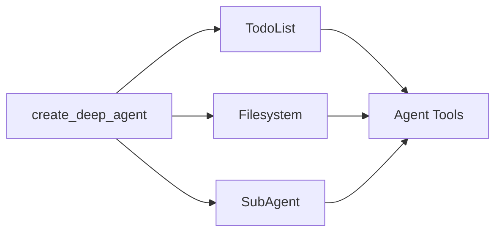

深度智能体（Deep agents）采用模块化的中间件架构构建。深度智能体具备以下能力：

1. 规划工具
2. 用于存储上下文和长期记忆的文件系统
3. 生成子智能体的能力

每个功能都作为独立的中间件实现。当你使用 `create_deep_agent` 创建深度智能体时，我们会自动将 `TodoListMiddleware`、`FilesystemMiddleware` 和 `SubAgentMiddleware` 附加到你的智能体上。



中间件是可组合的——你可以根据需要向智能体添加任意数量的中间件。你也可以独立使用任何中间件。

以下部分将解释每个中间件提供的功能。

## 待办事项列表中间件

规划是解决复杂问题的关键。如果你最近使用过 Claude Code，你会注意到它在处理复杂的多部分任务之前会先写出一个待办事项列表。你还会注意到，随着更多信息的输入，它能够动态地调整和更新这个待办事项列表。

`TodoListMiddleware` 为你的智能体提供了一个专门用于更新此待办事项列表的工具。在执行多部分任务之前和执行过程中，系统会提示智能体使用 `write_todos` 工具来跟踪它正在做什么以及还需要做什么。

```typescript
import { createAgent, todoListMiddleware } from "langchain";

// todoListMiddleware 默认包含在 createDeepAgent 中
// 如果你在构建自定义智能体，可以对其进行定制
const agent = createAgent({
  model: "claude-sonnet-4-5-20250929",
  middleware: [
    todoListMiddleware({
      // 可选：对系统提示的自定义补充
      systemPrompt: "Use the write_todos tool to...",
    }),
  ],
});
```

## 文件系统中间件

上下文工程是构建高效智能体的主要挑战。当使用返回可变长度结果的工具（例如，web_search 和 RAG）时，这一点尤其困难，因为过长的工具结果会迅速填满你的上下文窗口。

`FilesystemMiddleware` 提供了四个用于与短期和长期内存交互的工具：

- **ls**：列出文件系统中的文件
- **read_file**：读取整个文件或文件中的特定行数
- **write_file**：向文件系统写入新文件
- **edit_file**：编辑文件系统中的现有文件

```typescript
import { createAgent } from "langchain";
import { createFilesystemMiddleware } from "deepagents";

// FilesystemMiddleware 默认包含在 createDeepAgent 中
// 如果你在构建自定义智能体，可以对其进行定制
const agent = createAgent({
  model: "claude-sonnet-4-5-20250929",
  middleware: [
    createFilesystemMiddleware({
      backend: undefined,  // 可选：自定义后端（默认为 StateBackend）
      systemPrompt: "Write to the filesystem when...",  // 可选的系统提示自定义覆盖
      customToolDescriptions: {
        ls: "Use the ls tool when...",
        read_file: "Use the read_file tool to...",
      },  // 可选：文件系统工具的自定义描述
    }),
  ],
});
```

### 短期与长期文件系统

默认情况下，这些工具将写入图状态中的本地“文件系统”。要启用跨线程的持久存储，请配置一个 `CompositeBackend`，将特定路径（如 `/memories/`）路由到 `StoreBackend`。

```typescript
import { createAgent } from "langchain";
import { createFilesystemMiddleware, CompositeBackend, StateBackend, StoreBackend } from "deepagents";
import { InMemoryStore } from "@langchain/langgraph-checkpoint";

const store = new InMemoryStore();

const agent = createAgent({
  model: "claude-sonnet-4-5-20250929",
  store,
  middleware: [
    createFilesystemMiddleware({
      backend: (config) => new CompositeBackend(
        new StateBackend(config),
        { "/memories/": new StoreBackend(config) }
      ),
      systemPrompt: "Write to the filesystem when...", // 可选的系统提示自定义覆盖
      customToolDescriptions: {
        ls: "Use the ls tool when...",
        read_file: "Use the read_file tool to...",
      }, // 可选：文件系统工具的自定义描述
    }),
  ],
});
```

当你为 `/memories/` 路径配置了带有 `StoreBackend` 的 `CompositeBackend` 时，任何以 **/memories/** 为前缀的文件都将保存到持久存储中，并在不同的线程间保留。没有此前缀的文件则保留在临时状态存储中。

## 子智能体中间件

将任务移交给子智能体可以隔离上下文，保持主（监督）智能体的上下文窗口清洁，同时又能深入处理任务。

子智能体中间件允许你通过 `task` 工具提供子智能体。

```typescript
import { tool } from "langchain";
import { createAgent } from "langchain";
import { createSubAgentMiddleware } from "deepagents";
import { z } from "zod";

const getWeather = tool(
  async ({ city }: { city: string }) => {
    return `The weather in ${city} is sunny.`;
  },
  {
    name: "get_weather",
    description: "Get the weather in a city.",
    schema: z.object({
      city: z.string(),
    }),
  },
);

const agent = createAgent({
  model: "claude-sonnet-4-5-20250929",
  middleware: [
    createSubAgentMiddleware({
      defaultModel: "claude-sonnet-4-5-20250929",
      defaultTools: [],
      subagents: [
        {
          name: "weather",
          description: "This subagent can get weather in cities.",
          systemPrompt: "Use the get_weather tool to get the weather in a city.",
          tools: [getWeather],
          model: "gpt-4o",
          middleware: [],
        },
      ],
    }),
  ],
});
```

子智能体通过**名称**、**描述**、**系统提示**和**工具**来定义。你还可以为子智能体提供自定义的**模型**或额外的**中间件**。当你希望为子智能体提供一个额外的状态键（state key）与主智能体共享时，这尤其有用。

对于更复杂的用例，你也可以提供自己预先构建的 LangGraph 图作为子智能体。

```typescript
import { tool, createAgent } from "langchain";
import { createSubAgentMiddleware, type SubAgent } from "deepagents";
import { z } from "zod";

const getWeather = tool(
  async ({ city }: { city: string }) => {
    return `The weather in ${city} is sunny.`;
  },
  {
    name: "get_weather",
    description: "Get the weather in a city.",
    schema: z.object({
      city: z.string(),
    }),
  },
);

const weatherSubagent: SubAgent = {
  name: "weather",
  description: "This subagent can get weather in cities.",
  systemPrompt: "Use the get_weather tool to get the weather in a city.",
  tools: [getWeather],
  model: "gpt-4o",
  middleware: [],
};

const agent = createAgent({
  model: "claude-sonnet-4-5-20250929",
  middleware: [
    createSubAgentMiddleware({
      defaultModel: "claude-sonnet-4-5-20250929",
      defaultTools: [],
      subagents: [weatherSubagent],
    }),
  ],
});
```

除了任何用户定义的子智能体外，主智能体始终可以访问一个 `general-purpose`（通用）子智能体。这个子智能体具有与主智能体相同的指令和所有可访问的工具。`general-purpose` 子智能体的主要目的是上下文隔离——主智能体可以将复杂的任务委托给这个子智能体，并获得简洁的答案，而不会因中间工具调用而产生冗余信息。
