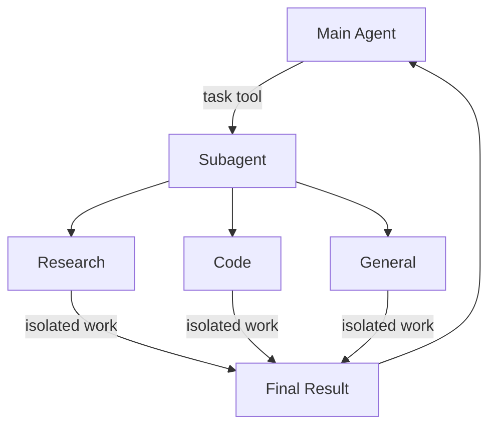

深度智能体可以创建子智能体来委派工作。您可以在 `subagents` 参数中指定自定义子智能体。子智能体对于[上下文隔离](https://www.dbreunig.com/2025/06/26/how-to-fix-your-context.html#context-quarantine)（保持主智能体上下文清洁）以及提供专门的指令非常有用。



## 为何使用子智能体？

子智能体解决了**上下文膨胀问题**。当智能体使用具有大量输出的工具（网络搜索、文件读取、数据库查询）时，上下文窗口会迅速被中间结果填满。子智能体将这些详细工作隔离开来——主智能体只接收最终结果，而不是产生该结果的数十个工具调用。

**何时使用子智能体：**
- ✅ 会扰乱主智能体上下文的多步骤任务
- ✅ 需要自定义指令或工具的专业领域
- ✅ 需要不同模型能力的任务
- ✅ 当您希望主智能体专注于高层级协调时

**何时不应使用子智能体：**
- ❌ 简单的单步骤任务
- ❌ 当您需要维护中间上下文时
- ❌ 当开销超过收益时

## 配置

`subagents` 应为一个字典列表或 `CompiledSubAgent` 对象。有两种类型：

### SubAgent（基于字典）

对于大多数用例，将子智能体定义为字典：

**必填字段：**

<ParamField body="name" type="str" required>

子智能体的唯一标识符。主智能体在调用 `task()` 工具时使用此名称。

</ParamField>

<ParamField body="description" type="str" required>

此子智能体的功能。请具体且以行动为导向。主智能体使用此描述来决定何时委派任务。

</ParamField>

<ParamField body="system_prompt" type="str" required>

子智能体的指令。包括工具使用指导和输出格式要求。

</ParamField>

<ParamField body="tools" type="list[Callable]" required>

子智能体可以使用的工具。保持最小化，仅包含所需内容。

</ParamField>

**可选字段：**

<ParamField body="model" type="str | BaseChatModel">

覆盖主智能体的模型。使用格式 `'provider:model-name'`（例如，`'openai:gpt-4o'`）。

</ParamField>

<ParamField body="middleware" type="list[Middleware]">

用于自定义行为、日志记录或速率限制的附加中间件。

</ParamField>

<ParamField body="interrupt_on" type="dict[str, bool]">

为特定工具配置人机协同（human-in-the-loop）。需要检查点。

</ParamField>

### CompiledSubAgent

对于复杂的工作流，使用预构建的 LangGraph 图：

<ParamField body="name" type="str" required>

子智能体的唯一标识符。

</ParamField>

<ParamField body="description" type="str" required>

此子智能体的功能。

</ParamField>

<ParamField body="runnable" type="Runnable" required>

一个已编译的 LangGraph 图（必须先调用 `.compile()`）。

</ParamField>

## 使用 SubAgent

```typescript
import { tool } from "langchain";
import { TavilySearch } from "@langchain/tavily";
import { createDeepAgent } from "deepagents";
import { ChatAnthropic } from "@langchain/anthropic";
import { z } from "zod";

const internetSearch = tool(
  async ({
    query,
    maxResults = 5,
    topic = "general",
    includeRawContent = false,
  }: {
    query: string;
    maxResults?: number;
    topic?: "general" | "news" | "finance";
    includeRawContent?: boolean;
  }) => {
    const tavilySearch = new TavilySearch({
      maxResults,
      tavilyApiKey: process.env.TAVILY_API_KEY,
      includeRawContent,
      topic,
    });
    return await tavilySearch._call({ query });
  },
  {
    name: "internet_search",
    description: "运行网络搜索",
    schema: z.object({
      query: z.string().describe("搜索查询"),
      maxResults: z.number().optional().default(5),
      topic: z
        .enum(["general", "news", "finance"])
        .optional()
        .default("general"),
      includeRawContent: z.boolean().optional().default(false),
    }),
  },
);

const researchSubagent = {
  name: "research-agent",
  description: "用于深入研究问题",
  systemPrompt: "你是一位出色的研究员",
  tools: [internetSearch],
  model: new ChatAnthropic({model:"claude-sonnet-4-5-20250929"}),  // 可选覆盖项，默认为主智能体模型
};
const subagents = [researchSubagent];

const agent = createDeepAgent({
  model: new ChatAnthropic({model:"claude-sonnet-4-5-20250929"}),
  subagents: subagents,
});
```

## 使用 CompiledSubAgent

对于更复杂的用例，你可以提供自己预构建的 LangGraph 图作为子智能体：

```typescript
import { createDeepAgent, CompiledSubAgent } from "deepagents";
import { createAgent } from "langchain";

// 创建自定义智能体图
const customGraph = createAgent({
  model: yourModel,
  tools: specializedTools,
  prompt: "你是一个专门用于数据分析的智能体...",
});

// 将其用作自定义子智能体
const customSubagent: CompiledSubAgent = {
  name: "data-analyzer",
  description: "用于复杂数据分析任务的专用智能体",
  runnable: customGraph,
};

const subagents = [customSubagent];

const agent = createDeepAgent({
  model: "claude-sonnet-4-5-20250929",
  tools: [internetSearch],
  systemPrompt: researchInstructions,
  subagents: subagents,
});
```

## 通用子智能体

除了任何用户定义的子智能体之外，深度智能体始终可以访问一个 `general-purpose` 子智能体。这个子智能体：
- 拥有与主智能体相同的系统提示
- 可以访问所有相同的工具
- 使用相同的模型（除非被覆盖）

### 何时使用它

通用子智能体非常适合需要上下文隔离但无需特定行为的场景。主智能体可以将复杂的多步骤任务委托给该子智能体，并获取简洁的结果，而不会因中间工具调用而产生冗余信息。

<Card title="示例">

主智能体无需自行执行10次网络搜索并用结果填充其上下文，而是委托给通用子智能体：`task(name="general-purpose", task="Research quantum computing trends")`。子智能体在内部执行所有搜索，并仅返回摘要。

</Card>

## 最佳实践

### 编写清晰的描述

主智能体使用描述来决定调用哪个子智能体。请具体说明：

✅ **良好：** `"分析财务数据并生成带有置信度评分的投资见解"`

❌ **不佳：** `"处理财务事务"`

### 保持系统提示详细

包含关于如何使用工具和格式化输出的具体指导：

```typescript
const researchSubagent = {
  name: "research-agent",
  description: "使用网络搜索进行深入研究并综合发现",
  systemPrompt: `你是一位细致的研究员。你的工作是：

  1. 将研究问题分解为可搜索的查询
  2. 使用 internet_search 查找相关信息
  3. 将发现综合成全面但简洁的摘要
  4. 提出主张时引用来源

  输出格式：
  - 摘要（2-3段）
  - 关键发现（要点列表）
  - 来源（附URL）

  请将回复控制在500字以内，以保持上下文简洁。`,
  tools: [internetSearch],
};
```

### 最小化工具集

只给予智能体它们需要的工具。这可以提高专注度和安全性：

```typescript
// ✅ 良好：专注的工具集
const emailAgent = {
  name: "email-sender",
  tools: [sendEmail, validateEmail],  // 仅与邮件相关
};

// ❌ 不佳：工具过多
const emailAgentBad = {
  name: "email-sender",
  tools: [sendEmail, webSearch, databaseQuery, fileUpload],  // 不专注
};
```

### 根据任务选择模型

不同的模型擅长不同的任务：

```typescript
const subagents = [
  {
    name: "contract-reviewer",
    description: "Reviews legal documents and contracts",
    systemPrompt: "You are an expert legal reviewer...",
    tools: [readDocument, analyzeContract],
    model: "claude-sonnet-4-5-20250929",  // Large context for long documents
  },
  {
    name: "financial-analyst",
    description: "Analyzes financial data and market trends",
    systemPrompt: "You are an expert financial analyst...",
    tools: [getStockPrice, analyzeFundamentals],
    model: "gpt-5",  // Better for numerical analysis
  },
];
```

### 返回简洁的结果

指示子智能体返回摘要，而非原始数据：

```typescript
const dataAnalyst = {
  systemPrompt: `Analyze the data and return:
  1. Key insights (3-5 bullet points)
  2. Overall confidence score
  3. Recommended next actions

  Do NOT include:
  - Raw data
  - Intermediate calculations
  - Detailed tool outputs

  Keep response under 300 words.`,
};
```

## 常见模式

### 多个专业化的子智能体

为不同领域创建专业化的子智能体：

```typescript
import { createDeepAgent } from "deepagents";

const subagents = [
  {
    name: "data-collector",
    description: "Gathers raw data from various sources",
    systemPrompt: "Collect comprehensive data on the topic",
    tools: [webSearch, apiCall, databaseQuery],
  },
  {
    name: "data-analyzer",
    description: "Analyzes collected data for insights",
    systemPrompt: "Analyze data and extract key insights",
    tools: [statisticalAnalysis],
  },
  {
    name: "report-writer",
    description: "Writes polished reports from analysis",
    systemPrompt: "Create professional reports from insights",
    tools: [formatDocument],
  },
];

const agent = createDeepAgent({
  model: "claude-sonnet-4-5-20250929",
  systemPrompt: "You coordinate data analysis and reporting. Use subagents for specialized tasks.",
  subagents: subagents,
});
```

**工作流程：**
1.  主智能体创建高级计划
2.  将数据收集任务委托给 data-collector
3.  将结果传递给 data-analyzer
4.  将洞察发送给 report-writer
5.  编译最终输出

每个子智能体仅在其任务相关的清晰上下文中工作。

## 故障排除

### 子智能体未被调用

**问题**：主智能体尝试自己完成工作，而不是进行委托。

**解决方案**：

1.  **使描述更具体：**

   

   
```typescript
// ✅ 正确示例
{ name: "research-specialist", description: "Conducts in-depth research on specific topics using web search. Use when you need detailed information that requires multiple searches." }

// ❌ 错误示例
{ name: "helper", description: "helps with stuff" }
```
   

2. **指示主智能体进行委派：**

   

   
```typescript
const agent = createDeepAgent({
  systemPrompt: `...你的指令...

  重要提示：对于复杂任务，请使用 task() 工具委派给你的子智能体。
  这可以保持你的上下文清洁并改善结果。`,
  subagents: [...]
});
```
   

### 上下文仍然臃肿

**问题**：尽管使用了子智能体，上下文仍然被填满。

**解决方案**：

1. **指示子智能体返回简洁的结果：**

   

   
```typescript
systemPrompt: `...

重要提示：仅返回必要的摘要。
请勿包含原始数据、中间搜索结果或详细的工具输出。
你的回复应少于 500 字。`
```
   

2. **使用文件系统处理大量数据：**

   

   
```typescript
systemPrompt: `当你收集大量数据时：
1. 将原始数据保存到 /data/raw_results.txt
2. 处理并分析数据
3. 仅返回分析摘要

这可以保持上下文清洁。`
```
   

### 选择了错误的子智能体

**问题**：主智能体为任务调用了不合适的子智能体。

**解决方案**：在描述中清晰地区分子智能体：

```typescript
const subagents = [
  {
    name: "quick-researcher",
    description: "适用于需要 1-2 次搜索的简单、快速的研究问题。当你需要基本事实或定义时使用。",
  },
  {
    name: "deep-researcher",
    description: "适用于需要多次搜索、综合和分析的复杂、深入研究。用于撰写全面的报告。",
  }
];
```

