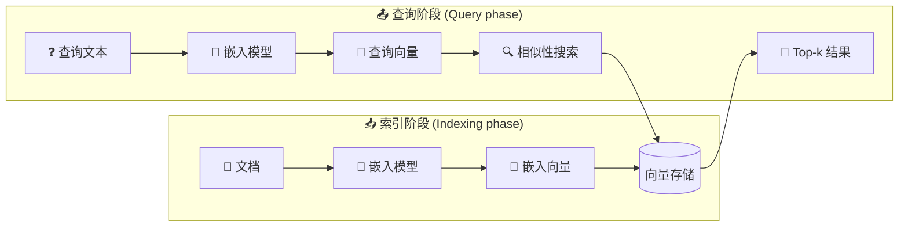

## 概述 (Overview)

[向量存储 (vector store)](/oss/javascript/integrations/vectorstores) 用于存储[嵌入 (embedded)](/oss/javascript/integrations/text_embedding)数据并执行相似性搜索。



### 接口 (Interface)

LangChain 为向量存储提供了统一的接口，允许您：

- `addDocuments` - 向存储中添加文档。
- `delete` - 根据 ID 删除已存储的文档。
- `similaritySearch` - 查询语义相似的文档。

这种抽象让您可以在不同的实现之间切换，而无需更改应用程序逻辑。

### 初始化 (Initialization)

LangChain 中的大多数向量存储在初始化时接受一个嵌入模型作为参数。

```typescript
import { OpenAIEmbeddings } from "@langchain/openai";
import { MemoryVectorStore } from "@langchain/classic/vectorstores/memory";

const embeddings = new OpenAIEmbeddings({
  model: "text-embedding-3-small",
});
const vectorStore = new MemoryVectorStore(embeddings);
```

### 添加文档 (Adding documents)

您可以使用 `addDocuments` 函数向向量存储添加文档。

```typescript
import { Document } from "@langchain/core/documents";
const document = new Document({
  pageContent: "Hello world",
});
await vectorStore.addDocuments([document]);
```

### 删除文档 (Deleting documents)

您可以使用 `delete` 函数从向量存储中删除文档。

```typescript
await vectorStore.delete({
  filter: {
    pageContent: "Hello world",
  },
});
```

### 相似性搜索 (Similarity search)

使用 `similaritySearch` 发出语义查询，它将返回最接近的嵌入文档：

```typescript
const results = await vectorStore.similaritySearch("Hello world", 10);
```

许多向量存储支持以下参数：

* `k` — 要返回的结果数量
* `filter` — 基于元数据的条件过滤

### 相似性度量与索引 (Similarity metrics & indexing)

嵌入相似性可以使用以下方法计算：

* **余弦相似度 (Cosine similarity)**
* **欧几里得距离 (Euclidean distance)**
* **点积 (Dot product)**

高效的搜索通常使用索引方法，例如 HNSW（分层可导航小世界），但具体细节取决于向量存储。

### 元数据过滤 (Metadata filtering)

通过元数据（例如来源、日期）进行过滤可以优化搜索结果：

```typescript
vectorStore.similaritySearch("query", 2, { source: "tweets" });
```

<important>
对基于元数据的过滤支持因实现而异。请查看您所选向量存储的文档以获取详细信息。
</important>

## 主要集成 (Top integrations)

**选择嵌入模型：**

:::: details OpenAI

安装依赖项：

::: code-group

```bash [npm]
npm i @langchain/openai
```

```bash [yarn]
yarn add @langchain/openai
```

```bash [pnpm]
pnpm add @langchain/openai
```

:::

添加环境变量：

```bash
OPENAI_API_KEY=your-api-key
```

实例化模型：

```typescript
import { OpenAIEmbeddings } from "@langchain/openai";

const embeddings = new OpenAIEmbeddings({
  model: "text-embedding-3-large"
});
```

::::

:::: details Azure

安装依赖项：

::: code-group

```bash [npm]
npm i @langchain/openai
```

```bash [yarn]
yarn add @langchain/openai
```

```bash [pnpm]
pnpm add @langchain/openai
```

:::

添加环境变量：

```bash
AZURE_OPENAI_API_INSTANCE_NAME=<YOUR_INSTANCE_NAME>
AZURE_OPENAI_API_KEY=<YOUR_KEY>
AZURE_OPENAI_API_VERSION="2024-02-01"
```

实例化模型：

```typescript
import { AzureOpenAIEmbeddings } from "@langchain/openai";

const embeddings = new AzureOpenAIEmbeddings({
  azureOpenAIApiEmbeddingsDeploymentName: "text-embedding-ada-002"
});
```

::::

:::: details AWS

安装依赖项：

::: code-group

```bash [npm]
npm i @langchain/aws
```

```bash [yarn]
yarn add @langchain/aws
```

```bash [pnpm]
pnpm add @langchain/aws
```

:::

添加环境变量：

```bash
BEDROCK_AWS_REGION=your-region
```

实例化模型：

```typescript
import { BedrockEmbeddings } from "@langchain/aws";

const embeddings = new BedrockEmbeddings({
  model: "amazon.titan-embed-text-v1"
});
```

::::

:::: details Google Gemini

安装依赖项：

::: code-group

```bash [npm]
npm i @langchain/google-genai
```

```bash [yarn]
yarn add @langchain/google-genai
```

```bash [pnpm]
pnpm add @langchain/google-genai
```

:::

添加环境变量：

```bash
GOOGLE_API_KEY=your-api-key
```

实例化模型：

```typescript
import { GoogleGenerativeAIEmbeddings } from "@langchain/google-genai";

const embeddings = new GoogleGenerativeAIEmbeddings({
  model: "text-embedding-004"
});
```

::::

:::: details Google Vertex

安装依赖项：

::: code-group

```bash [npm]
npm i @langchain/google-vertexai
```

```bash [yarn]
yarn add @langchain/google-vertexai
```

```bash [pnpm]
pnpm add @langchain/google-vertexai
```

:::

添加环境变量：

```bash
GOOGLE_APPLICATION_CREDENTIALS=credentials.json
```

实例化模型：

```typescript
import { VertexAIEmbeddings } from "@langchain/google-vertexai";

const embeddings = new VertexAIEmbeddings({
  model: "gemini-embedding-001"
});
```

::::

:::: details MistralAI

安装依赖项：

::: code-group

```bash [npm]
npm i @langchain/mistralai
```

```bash [yarn]
yarn add @langchain/mistralai
```

```bash [pnpm]
pnpm add @langchain/mistralai
```

:::

添加环境变量：

```bash
MISTRAL_API_KEY=your-api-key
```

实例化模型：

```typescript
import { MistralAIEmbeddings } from "@langchain/mistralai";

const embeddings = new MistralAIEmbeddings({
  model: "mistral-embed"
});
```

::::

:::: details Cohere

安装依赖项：

::: code-group

```bash [npm]
npm i @langchain/cohere
```

```bash [yarn]
yarn add @langchain/cohere
```

```bash [pnpm]
pnpm add @langchain/cohere
```

:::

添加环境变量：

```bash
COHERE_API_KEY=your-api-key
```

实例化模型：

```typescript
import { CohereEmbeddings } from "@langchain/cohere";

const embeddings = new CohereEmbeddings({
  model: "embed-english-v3.0"
});
```

::::

:::: details Ollama

安装依赖项：

::: code-group

```bash [npm]
npm i @langchain/ollama
```

```bash [yarn]
yarn add @langchain/ollama
```

```bash [pnpm]
pnpm add @langchain/ollama
```

:::

实例化模型：

```typescript
import { OllamaEmbeddings } from "@langchain/ollama";

const embeddings = new OllamaEmbeddings({
  model: "llama2",
  baseUrl: "http://localhost:11434", // Default value
});
```

::::

**选择向量存储：**

:::: details Memory

::: code-group

```bash
npm i langchain
```

```bash [yarn]
yarn add langchain
```

```bash [pnpm]
pnpm add langchain
```

:::

```typescript
import { MemoryVectorStore } from "@langchain/classic/vectorstores/memory";

const vectorStore = new MemoryVectorStore(embeddings);
```

::::

:::: details Chroma

::: code-group

```bash [npm]
npm i @langchain/community
```

```bash [yarn]
yarn add @langchain/community
```

```bash [pnpm]
pnpm add @langchain/community
```

:::

```typescript
import { Chroma } from "@langchain/community/vectorstores/chroma";

const vectorStore = new Chroma(embeddings, {
  collectionName: "a-test-collection",
});
```

::::

:::: details FAISS

::: code-group

```bash [npm]
npm i @langchain/community
```

```bash [yarn]
yarn add @langchain/community
```

```bash
pnpm add @langchain/community
```

:::

```typescript
import { FaissStore } from "@langchain/community/vectorstores/faiss";

const vectorStore = new FaissStore(embeddings, {});
```

::::

:::: details MongoDB

::: code-group

```bash [npm]
npm i @langchain/mongodb
```

```bash [yarn]
yarn add @langchain/mongodb
```

```bash [pnpm]
pnpm add @langchain/mongodb
```

:::

```typescript
import { MongoDBAtlasVectorSearch } from "@langchain/mongodb"
import { MongoClient } from "mongodb";

const client = new MongoClient(process.env.MONGODB_ATLAS_URI || "");
const collection = client
  .db(process.env.MONGODB_ATLAS_DB_NAME)
  .collection(process.env.MONGODB_ATLAS_COLLECTION_NAME);

const vectorStore = new MongoDBAtlasVectorSearch(embeddings, {
  collection,
  indexName: "vector_index",
  textKey: "text",
  embeddingKey: "embedding",
});
```

::::

:::: details PGVector

::: code-group

```bash [npm]
npm i @langchain/community
```

```bash [yarn]
yarn add @langchain/community
```

```bash [pnpm]
pnpm add @langchain/community
```

:::

```typescript
import { PGVectorStore } from "@langchain/community/vectorstores/pgvector";

const vectorStore = await PGVectorStore.initialize(embeddings, {});
```

::::

:::: details Pinecone

::: code-group

```bash [npm]
npm i @langchain/pinecone
```

```bash [yarn]
yarn add @langchain/pinecone
```

```bash [pnpm]
pnpm add @langchain/pinecone
```

:::

```typescript
import { PineconeStore } from "@langchain/pinecone";
import { Pinecone as PineconeClient } from "@pinecone-database/pinecone";

const pinecone = new PineconeClient();
const vectorStore = new PineconeStore(embeddings, {
  pineconeIndex,
  maxConcurrency: 5,
});
```

::::

:::: details Qdrant

::: code-group

```bash [npm]
npm i @langchain/qdrant
```

```bash [yarn]
yarn add @langchain/qdrant
```

```bash [pnpm]
pnpm add @langchain/qdrant
```

:::

```typescript
import { QdrantVectorStore } from "@langchain/qdrant";

const vectorStore = await QdrantVectorStore.fromExistingCollection(embeddings, {
  url: process.env.QDRANT_URL,
  collectionName: "langchainjs-testing",
});
```

::::

:::: details Weaviate

::: code-group

```bash [npm]
npm i @langchain/weaviate
```

```bash [yarn]
yarn add @langchain/weaviate
```

```bash [pnpm]
pnpm add @langchain/weaviate
```

:::

::: code-group

```typescript
import { WeaviateStore } from "@langchain/weaviate";

const vectorStore = new WeaviateStore(embeddings, {
    client: weaviateClient,
    indexName: "Langchainjs_test",
});
```

:::

::::

LangChain.js 集成了多种向量存储。您可以在下方查看完整列表：

## 所有向量存储 (All vector stores)

<Columns :cols="3">

<Card
  title="AnalyticDB"
  icon="link"
  href="/oss/integrations/vectorstores/analyticdb"
  arrow="true"
  cta="View guide"
/>
<Card
  title="Astra DB"
  icon="link"
  href="/oss/integrations/vectorstores/astradb"
  arrow="true"
  cta="View guide"
/>
<Card
  title="Azion EdgeSQL"
  icon="link"
  href="/oss/integrations/vectorstores/azion-edgesql"
  arrow="true"
  cta="View guide"
/>
<Card
  title="Azure AI Search"
  icon="link"
  href="/oss/integrations/vectorstores/azure_aisearch"
  arrow="true"
  cta="View guide"
/>
<Card
  title="Azure Cosmos DB for MongoDB vCore"
  icon="link"
  href="/oss/integrations/vectorstores/azure_cosmosdb_mongodb"
  arrow="true"
  cta="View guide"
/>
<Card
  title="Azure Cosmos DB for NoSQL"
  icon="link"
  href="/oss/integrations/vectorstores/azure_cosmosdb_nosql"
  arrow="true"
  cta="View guide"
/>
<Card
  title="Cassandra"
  icon="link"
  href="/oss/integrations/vectorstores/cassandra"
  arrow="true"
  cta="View guide"
/>
<Card
  title="Chroma"
  icon="link"
  href="/oss/integrations/vectorstores/chroma"
  arrow="true"
  cta="View guide"
/>
<Card
  title="ClickHouse"
  icon="link"
  href="/oss/integrations/vectorstores/clickhouse"
  arrow="true"
  cta="View guide"
/>
<Card
  title="CloseVector"
  icon="link"
  href="/oss/integrations/vectorstores/closevector"
  arrow="true"
  cta="View guide"
/>
<Card
  title="Cloudflare Vectorize"
  icon="link"
  href="/oss/integrations/vectorstores/cloudflare_vectorize"
  arrow="true"
  cta="View guide"
/>
<Card
  title="Convex"
  icon="link"
  href="/oss/integrations/vectorstores/convex"
  arrow="true"
  cta="View guide"
/>
<Card
  title="Couchbase Query"
  icon="link"
  href="/oss/integrations/vectorstores/couchbase_query"
  arrow="true"
  cta="View guide"
/>
<Card
  title="Couchbase Search"
  icon="link"
  href="/oss/integrations/vectorstores/couchbase_search"
  arrow="true"
  cta="View guide"
/>
<Card
  title="Elasticsearch"
  icon="link"
  href="/oss/integrations/vectorstores/elasticsearch"
  arrow="true"
  cta="View guide"
/>
<Card
  title="Faiss"
  icon="link"
  href="/oss/integrations/vectorstores/faiss"
  arrow="true"
  cta="View guide"
/>
<Card
  title="Google Cloud SQL for PostgreSQL"
  icon="link"
  href="/oss/integrations/vectorstores/google_cloudsql_pg"
  arrow="true"
  cta="View guide"
/>
<Card
  title="Google Vertex AI Matching Engine"
  icon="link"
  href="/oss/integrations/vectorstores/googlevertexai"
  arrow="true"
  cta="View guide"
/>
<Card
  title="SAP HANA Cloud Vector Engine"
  icon="link"
  href="/oss/integrations/vectorstores/hanavector"
  arrow="true"
  cta="View guide"
/>
<Card
  title="HNSWLib"
  icon="link"
  href="/oss/integrations/vectorstores/hnswlib"
  arrow="true"
  cta="View guide"
/>
<Card
  title="LanceDB"
  icon="link"
  href="/oss/integrations/vectorstores/lancedb"
  arrow="true"
  cta="View guide"
/>
<Card
  title="libSQL"
  icon="link"
  href="/oss/integrations/vectorstores/libsql"
  arrow="true"
  cta="View guide"
/>
<Card
  title="MariaDB"
  icon="link"
  href="/oss/integrations/vectorstores/mariadb"
  arrow="true"
  cta="View guide"
/>
<Card
  title="In-memory"
  icon="link"
  href="/oss/integrations/vectorstores/memory"
  arrow="true"
  cta="View guide"
/>
<Card
  title="Milvus"
  icon="link"
  href="/oss/integrations/vectorstores/milvus"
  arrow="true"
  cta="View guide"
/>
<Card
  title="Momento Vector Index (MVI)"
  icon="link"
  href="/oss/integrations/vectorstores/momento_vector_index"
  arrow="true"
  cta="View guide"
/>
<Card
  title="MongoDB Atlas"
  icon="link"
  href="/oss/integrations/vectorstores/mongodb_atlas"
  arrow="true"
  cta="View guide"
/>
<Card
  title="MyScale"
  icon="link"
  href="/oss/integrations/vectorstores/myscale"
  arrow="true"
  cta="View guide"
/>
<Card
  title="Neo4j Vector Index"
  icon="link"
  href="/oss/integrations/vectorstores/neo4jvector"
  arrow="true"
  cta="View guide"
/>
<Card
  title="Neon Postgres"
  icon="link"
  href="/oss/integrations/vectorstores/neon"
  arrow="true"
  cta="View guide"
/>
<Card
  title="OpenSearch"
  icon="link"
  href="/oss/integrations/vectorstores/opensearch"
  arrow="true"
  cta="View guide"
/>
<Card
  title="PGVector"
  icon="link"
  href="/oss/integrations/vectorstores/pgvector"
  arrow="true"
  cta="View guide"
/>
<Card
  title="Pinecone"
  icon="link"
  href="/oss/integrations/vectorstores/pinecone"
  arrow="true"
  cta="View guide"
/>
<Card
  title="Prisma"
  icon="link"
  href="/oss/integrations/vectorstores/prisma"
  arrow="true"
  cta="View guide"
/>
<Card
  title="Qdrant"
  icon="link"
  href="/oss/integrations/vectorstores/qdrant"
  arrow="true"
  cta="View guide"
/>
<Card
  title="Redis"
  icon="link"
  href="/oss/integrations/vectorstores/redis"
  arrow="true"
  cta="View guide"
/>
<Card
  title="Rockset"
  icon="link"
  href="/oss/integrations/vectorstores/rockset"
  arrow="true"
  cta="View guide"
/>
<Card
  title="SingleStore"
  icon="link"
  href="/oss/integrations/vectorstores/singlestore"
  arrow="true"
  cta="View guide"
/>
<Card
  title="Supabase"
  icon="link"
  href="/oss/integrations/vectorstores/supabase"
  arrow="true"
  cta="View guide"
/>
<Card
  title="Tigris"
  icon="link"
  href="/oss/integrations/vectorstores/tigris"
  arrow="true"
  cta="View guide"
/>
<Card
  title="Turbopuffer"
  icon="link"
  href="/oss/integrations/vectorstores/turbopuffer"
  arrow="true"
  cta="View guide"
/>
<Card
  title="TypeORM"
  icon="link"
  href="/oss/integrations/vectorstores/typeorm"
  arrow="true"
  cta="View guide"
/>
<Card
  title="Typesense"
  icon="link"
  href="/oss/integrations/vectorstores/typesense"
  arrow="true"
  cta="View guide"
/>
<Card
  title="Upstash Vector"
  icon="link"
  href="/oss/integrations/vectorstores/upstash"
  arrow="true"
  cta="View guide"
/>
<Card
  title="USearch"
  icon="link"
  href="/oss/integrations/vectorstores/usearch"
  arrow="true"
  cta="View guide"
/>
<Card
  title="Vectara"
  icon="link"
  href="/oss/integrations/vectorstores/vectara"
  arrow="true"
  cta="View guide"
/>
<Card
  title="Vercel Postgres"
  icon="link"
  href="/oss/integrations/vectorstores/vercel_postgres"
  arrow="true"
  cta="View guide"
/>
<Card
  title="Voy"
  icon="link"
  href="/oss/integrations/vectorstores/voy"
  arrow="true"
  cta="View guide"
/>
<Card
  title="Weaviate"
  icon="link"
  href="/oss/integrations/vectorstores/weaviate"
  arrow="true"
  cta="View guide"
/>
<Card
  title="Xata"
  icon="link"
  href="/oss/integrations/vectorstores/xata"
  arrow="true"
  cta="View guide"
/>
<Card
  title="Zep Open Source"
  icon="link"
  href="/oss/integrations/vectorstores/zep"
  arrow="true"
  cta="View guide"
/>
<Card
  title="Zep Cloud"
  icon="link"
  href="/oss/integrations/vectorstores/zep_cloud"
  arrow="true"
  cta="View guide"
/>

</Columns>

