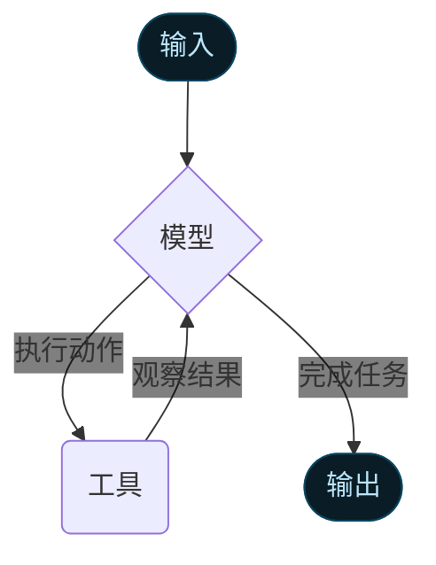

智能体 (Agents) 将语言模型与 [工具 (tools)](/oss/javascript/langchain/tools) 相结合，构建出能够对任务进行推理、决定使用哪些工具并迭代寻找解决方案的系统。

`createAgent()` 提供了一个生产级的智能体实现。

[LLM 智能体通过循环运行工具来实现目标](https://simonwillison.net/2025/Sep/18/agents/)。
智能体会持续运行，直到满足停止条件——即模型产生最终输出或达到迭代限制。



<Info>

`createAgent()` 使用 [LangGraph](/oss/javascript/langgraph/overview) 构建了一个基于 <strong>图 (graph)</strong> 的智能体运行时。图由节点 (nodes，即步骤) 和边 (edges，即连接) 组成，定义了智能体处理信息的方式。智能体在这个图中移动，执行诸如模型节点 (调用模型)、工具节点 (执行工具) 或中间件等节点。

了解更多关于 [Graph API](/oss/javascript/langgraph/graph-api) 的信息。

</Info>

## 核心组件 (Core components)

### 模型 (Model)

[模型 (model)](/oss/javascript/langchain/models) 是智能体的推理引擎。它可以通过多种方式指定，支持静态和动态模型选择。

#### 静态模型 (Static model)

静态模型在创建智能体时配置一次，并在整个执行过程中保持不变。这是最常见且最直接的方法。

要从 <Tooltip tip="遵循 `provider:model` 格式的字符串 (例如 openai:gpt-5)" cta="查看映射" href="https://reference.langchain.com/python/langchain/models/#langchain.chat_models.init_chat_model(model)">模型标识符字符串 (model identifier string)</Tooltip> 初始化静态模型：

```ts [wrap]
import { createAgent } from "langchain";

const agent = createAgent({
  model: "openai:gpt-5",
  tools: []
});
```

模型标识符字符串使用 `provider:model` 格式 (例如 `"openai:gpt-5"`)。您可能希望对模型配置有更多控制，在这种情况下，可以直接使用提供者包初始化模型实例：

```ts [wrap]
import { createAgent } from "langchain";
import { ChatOpenAI } from "@langchain/openai";

const model = new ChatOpenAI({
  model: "gpt-4o",
  temperature: 0.1,
  maxTokens: 1000,
  timeout: 30
});

const agent = createAgent({
  model,
  tools: []
});
```

模型实例让您可以完全控制配置。当您需要设置特定参数，如 `temperature`、`max_tokens`、`timeouts`，或配置 API 密钥、`base_url` 以及其他提供者特定的设置时，请使用它们。请参阅 [API 参考](/oss/javascript/integrations/providers/) 以查看模型上可用的参数和方法。

#### 动态模型 (Dynamic model)

动态模型在 <Tooltip tip="智能体的执行环境，包含在整个智能体执行过程中持久存在的不可变配置和上下文数据 (例如：用户 ID、会话详情或应用程序特定的配置)。">运行时 (runtime)</Tooltip> 根据当前的 <Tooltip tip="流经智能体执行的数据，包括消息、自定义字段以及在处理过程中需要跟踪并可能修改的任何信息 (例如：用户偏好或工具使用统计)。">状态 (state)</Tooltip> 和上下文进行选择。这可以实现复杂的路由逻辑和成本优化。

要使用动态模型，请使用 `wrapModelCall` 创建中间件，以修改请求中的模型：

```ts
import { ChatOpenAI } from "@langchain/openai";
import { createAgent, createMiddleware } from "langchain";

const basicModel = new ChatOpenAI({ model: "gpt-4o-mini" });
const advancedModel = new ChatOpenAI({ model: "gpt-4o" });

const dynamicModelSelection = createMiddleware({
  name: "DynamicModelSelection",
  wrapModelCall: (request, handler) => {
    // 根据对话复杂度选择模型
    const messageCount = request.messages.length;

    return handler({
        ...request,
        model: messageCount > 10 ? advancedModel : basicModel,
    });
  },
});

const agent = createAgent({
  model: "gpt-4o-mini", // 基础模型 (当 messageCount ≤ 10 时使用)
  tools,
  middleware: [dynamicModelSelection],
});
```

有关中间件和高级模式的更多详细信息，请参阅 [中间件文档](/oss/javascript/langchain/middleware)。

<Tip>

有关模型配置的详细信息，请参阅 [模型 (Models)](/oss/javascript/langchain/models)。有关动态模型选择模式，请参阅 [中间件中的动态模型](/oss/javascript/langchain/middleware#dynamic-model)。

</Tip>

### 工具 (Tools)

工具赋予了智能体执行动作的能力。智能体超越了简单的仅限模型的工具绑定，它可以实现：

- 按顺序执行多次工具调用 (由单次提示触发)
- 在适当时进行并行工具调用
- 基于先前结果的动态工具选择
- 工具重试逻辑和错误处理
- 跨工具调用的状态持久化

更多信息，请参阅 [工具 (Tools)](/oss/javascript/langchain/tools)。

#### 定义工具 (Defining tools)

将工具列表传递给智能体。

```ts [wrap]
import * as z from "zod";
import { createAgent, tool } from "langchain";

const search = tool(
  ({ query }) => `关于 ${query} 的搜索结果`,
  {
    name: "search",
    description: "搜索信息",
    schema: z.object({
      query: z.string().describe("要搜索的查询内容"),
    }),
  }
);

const getWeather = tool(
  ({ location }) => `${location} 的天气：晴，72°F`,
  {
    name: "get_weather",
    description: "获取指定位置的天气信息",
    schema: z.object({
      location: z.string().describe("要获取天气的地点"),
    }),
  }
);

const agent = createAgent({
  model: "gpt-4o",
  tools: [search, getWeather],
});
```

如果提供空的工具列表，智能体将仅由单个 LLM 节点组成，不具备工具调用能力。

#### 工具错误处理 (Tool error handling)

要自定义工具错误的处理方式，请在自定义中间件中使用 `wrapToolCall` 钩子 (hook)：

```ts [wrap]
import { createAgent, createMiddleware, ToolMessage } from "langchain";

const handleToolErrors = createMiddleware({
  name: "HandleToolErrors",
  wrapToolCall: async (request, handler) => {
    try {
      return await handler(request);
    } catch (error) {
      // 向模型返回自定义错误消息
      return new ToolMessage({
        content: `工具错误：请检查输入并重试。(${error})`,
        tool_call_id: request.toolCall.id!,
      });
    }
  },
});

const agent = createAgent({
  model: "gpt-4o",
  tools: [
    /* ... */
  ],
  middleware: [handleToolErrors],
});
```

当工具运行失败时，智能体会返回一个带有自定义错误消息的 <a href="https://reference.langchain.com/javascript/classes/_langchain_core.messages.ToolMessage.html" target="_blank" rel="noreferrer" class="link"><code>ToolMessage</code></a>。

#### ReAct 循环中的工具使用 (Tool use in the ReAct loop)

智能体遵循 ReAct ("推理 + 行动") 模式，在简短的推理步骤与针对性的工具调用之间交替进行，并将得到的观察结果反馈到后续决策中，直到能够给出最终答案。

:::: details ReAct 循环示例

<strong>提示词 (Prompt)：</strong> 识别当前最受欢迎的无线耳机并验证其库存情况。

```
================================ Human Message =================================

找出目前最受欢迎的无线耳机，并检查它们是否有货。
```

* <strong>推理 (Reasoning)</strong>：“流行度是随时变化的，我需要使用提供的搜索工具。”
* <strong>行动 (Acting)</strong>：调用 `search_products("wireless headphones")`

```
================================== Ai Message ==================================
工具调用：
  search_products (探索 ID: call_abc123)
  参数：
    query: wireless headphones
```
```
================================= Tool Message =================================

找到 5 款匹配“无线耳机”的产品。排名前 5 的结果：WH-1000XM5, ...
```

* <strong>推理 (Reasoning)</strong>：“在回答之前，我需要确认排名第一的产品的库存情况。”
* <strong>行动 (Acting)</strong>：调用 `check_inventory("WH-1000XM5")`

```
================================== Ai Message ==================================
工具调用：
  check_inventory (探索 ID: call_def456)
  参数：
    product_id: WH-1000XM5
```
```
================================= Tool Message =================================

产品 WH-1000XM5：库存 10 件
```

* <strong>推理 (Reasoning)</strong>：“我已经掌握了最受欢迎的型号及其库存状态。现在可以回答用户的问题了。”
* <strong>行动 (Acting)</strong>：输出最终答案。

```
================================== Ai Message ==================================

我找到了最受欢迎的无线耳机（型号 WH-1000XM5），目前库存充足（剩余 10 件）...
```

::::

<Tip>

要了解更多关于工具的信息，请参阅 [工具 (Tools)](/oss/javascript/langchain/tools)。

</Tip>

### 系统提示 (System prompt)

您可以通过提供提示词来塑造智能体处理任务的方式。`systemPrompt` 参数可以以字符串形式提供：

```ts [wrap]
const agent = createAgent({
  model,
  tools,
  systemPrompt: "你是一个得力的助手。请确保回答简洁准确。",
});
```

当未提供 `systemPrompt` 时，智能体将直接从消息中推断其任务。

`systemPrompt` 参数接受 `string` 或 `SystemMessage`。使用 `SystemMessage` 可以让您更好地控制提示词结构，这对于特定提供者的功能（如 [Anthropic 的提示词缓存](/oss/javascript/integrations/chat/anthropic#prompt-caching)）非常有用：

```ts [wrap]
import { createAgent } from "langchain";
import { SystemMessage, HumanMessage } from "@langchain/core/messages";

const literaryAgent = createAgent({
  model: "anthropic:claude-sonnet-4-5",
  systemPrompt: new SystemMessage({
    content: [
      {
        type: "text",
        text: "你是一个负责分析文学作品的 AI 助手。",
      },
      {
        type: "text",
        text: "<《傲慢与偏见》的全文本内容>",
        cache_control: { type: "ephemeral" }
      }
    ]
  })
});

const result = await literaryAgent.invoke({
  messages: [new HumanMessage("分析《傲慢与偏见》的主要主题。")]
});
```

带有 `{ type: "ephemeral" }` 的 `cache_control` 字段告知 Anthropic 缓存该内容块，从而减少使用相同系统提示词的重复请求的延迟和成本。

#### 动态系统提示 (Dynamic system prompt)

对于需要根据运行时上下文或智能体状态修改系统提示词的高级用例，您可以使用 [中间件 (middleware)](/oss/javascript/langchain/middleware)。

```typescript [wrap]
import * as z from "zod";
import { createAgent, dynamicSystemPromptMiddleware } from "langchain";

const contextSchema = z.object({
  userRole: z.enum(["expert", "beginner"]),
});

const agent = createAgent({
  model: "gpt-4o",
  tools: [/* ... */],
  contextSchema,
  middleware: [
    dynamicSystemPromptMiddleware<z.infer<typeof contextSchema>>((state, runtime) => {
      const userRole = runtime.context.userRole || "user";
      const basePrompt = "你是一个得力的助手。";

      if (userRole === "expert") {
        return `${basePrompt} 请提供详细的技术性回答。`;
      } else if (userRole === "beginner") {
        return `${basePrompt} 请用通俗易懂的方式解释概念，避免使用专业术语。`;
      }
      return basePrompt;
    }),
  ],
});

// 系统提示词将根据上下文动态设置
const result = await agent.invoke(
  { messages: [{ role: "user", content: "解释机器学习" }] },
  { context: { userRole: "expert" } }
);
```

<Tip>

有关消息类型和格式的更多详细信息，请参阅 [消息 (Messages)](/oss/javascript/langchain/messages)。有关完整的中间件文档，请参阅 [中间件 (Middleware)](/oss/javascript/langchain/middleware)。

</Tip>

## 调用 (Invocation)

您可以通过向智能体的 [`状态 (State)`](/oss/javascript/langgraph/graph-api#state) 传递更新来调用它。所有智能体的状态都包含一个 [消息序列 (sequence of messages)](/oss/javascript/langgraph/use-graph-api#messagesstate)；要调用智能体，只需传递一条新消息：

```typescript
await agent.invoke({
  messages: [{ role: "user", content: "旧金山的天气怎么样？" }],
})
```

要从智能体流式获取步骤和/或 Token，请参阅 [流式传输 (streaming)](/oss/javascript/langchain/streaming) 指南。

此外，智能体遵循 LangGraph 的 [Graph API](/oss/javascript/langgraph/use-graph-api)，并支持所有相关方法，如 `stream` 和 `invoke`。

## 高级概念 (Advanced concepts)

### 结构化输出 (Structured output)

在某些情况下，您可能希望智能体以特定的格式返回输出。LangChain 提供了一种简单且通用的方式，通过 `responseFormat` 参数来实现这一点。

```ts [wrap]
import * as z from "zod";
import { createAgent } from "langchain";

const ContactInfo = z.object({
  name: z.string(),
  email: z.string(),
  phone: z.string(),
});

const agent = createAgent({
  model: "gpt-4o",
  responseFormat: ContactInfo,
});

const result = await agent.invoke({
  messages: [
    {
      role: "user",
      content: "从以下内容提取联系信息：张三, zhangsan@example.com, (555) 123-4567",
    },
  ],
});

console.log(result.structuredResponse);
// {
//   name: '张三',
//   email: 'zhangsan@example.com',
//   phone: '(555) 123-4567'
// }
```

<Tip>

有关结构化输出的学习，请参阅 [结构化输出 (Structured output)](/oss/javascript/langchain/structured-output)。

</Tip>

### 记忆 (Memory)

智能体通过消息状态自动维护对话历史记录。您还可以配置智能体使用自定义状态模式 (state schema)，以便在对话期间记住额外的信息。

存储在状态中的信息可以被视为智能体的 [短时记忆 (short-term memory)](/oss/javascript/langchain/short-term-memory)：

```ts [wrap]
import * as z from "zod";
import { MessagesZodState } from "@langchain/langgraph";
import { createAgent } from "langchain";
import { type BaseMessage } from "@langchain/core/messages";

const customAgentState = z.object({
  messages: MessagesZodState.shape.messages,
  userPreferences: z.record(z.string(), z.string()),
});

const CustomAgentState = createAgent({
  model: "gpt-4o",
  tools: [],
  stateSchema: customAgentState,
});
```

<Tip>

要了解有关记忆的更多信息，请参阅 [记忆 (Memory)](/oss/javascript/concepts/memory)。有关实现跨会话持久化的长时记忆的信息，请参阅 [长时记忆 (Long-term memory)](/oss/javascript/langchain/long-term-memory)。

</Tip>

### 流式传输 (Streaming)

我们已经了解了如何通过 `invoke` 调用智能体以获取最终回答。如果智能体执行多个步骤，这可能需要一段时间。为了展示中间进展，我们可以流式传回产生的消息。

```ts
const stream = await agent.stream(
  {
    messages: [{
      role: "user",
      content: "搜索 AI 新闻并总结发现"
    }],
  },
  { streamMode: "values" }
);

for await (const chunk of stream) {
  // 每个 chunk 包含该时间点的完整状态
  const latestMessage = chunk.messages.at(-1);
  if (latestMessage?.content) {
    console.log(`智能体：${latestMessage.content}`);
  } else if (latestMessage?.tool_calls) {
    const toolCallNames = latestMessage.tool_calls.map((tc) => tc.name);
    console.log(`正在调用工具：${toolCallNames.join(", ")}`);
  }
}
```

<Tip>

有关流式传输的更多详细信息，请参阅 [流式传输 (Streaming)](/oss/javascript/langchain/streaming)。

</Tip>

### 中间件 (Middleware)

[中间件 (Middleware)](/oss/javascript/langchain/middleware) 提供了强大的可扩展性，用于在执行的不同阶段自定义智能体行为。您可以使用中间件来：

- 在调用模型之前处理状态（例如：消息修剪、上下文注入）
- 修改或验证模型的响应（例如：护栏设置、内容过滤）
- 使用自定义逻辑处理工具执行错误
- 根据状态或上下文实现动态模型选择
- 添加自定义日志、监控或分析

中间件无缝集成到智能体的执行中，允许您在关键点拦截并修改数据流，而无需更改核心智能体逻辑。

<Tip>

有关包含 `beforeModel`、`afterModel` 和 `wrapToolCall` 等钩子的完整中间件文档，请参阅 [中间件 (Middleware)](/oss/javascript/langchain/middleware)。

</Tip>

