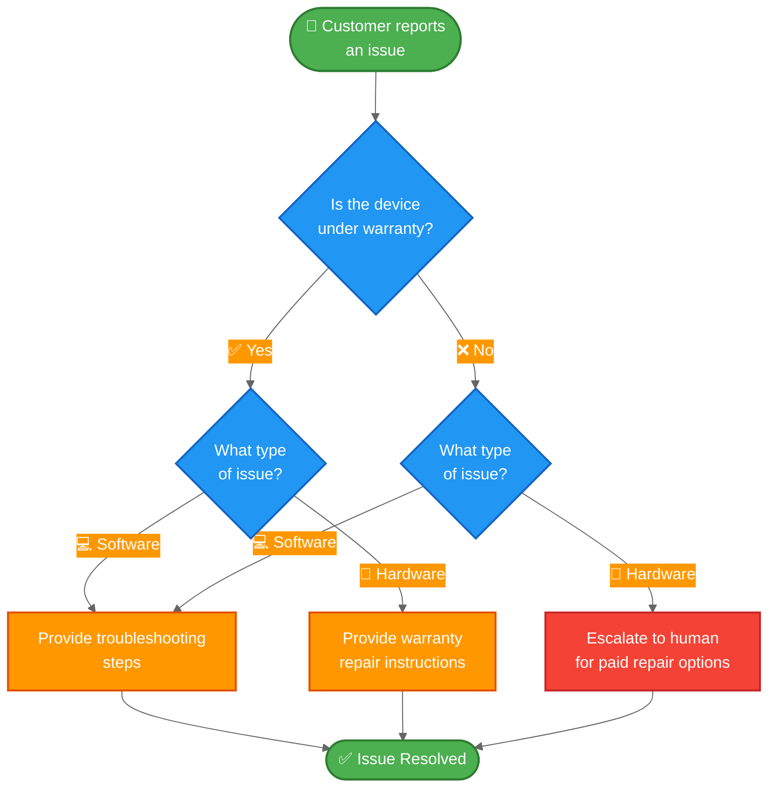

[状态机模式](/oss/javascript/langchain/multi-agent/handoffs)描述了智能体（agent）在任务的不同状态间移动时，其行为随之改变的工作流。本教程展示了如何通过工具调用（tool calls）来实现状态机，从而动态改变单个智能体的配置——根据当前状态更新其可用工具和指令。状态可以从多个来源确定：智能体的过往操作（工具调用）、外部状态（例如 API 调用结果），甚至是初始用户输入（例如，通过运行分类器来确定用户意图）。

在本教程中，你将构建一个客户支持智能体，其功能如下：

-   在继续之前收集保修信息。
-   将问题分类为硬件或软件问题。
-   提供解决方案或升级至人工支持。
-   在多轮对话中维持会话状态。

与[子智能体模式](/oss/javascript/langchain/multi-agent/subagents-personal-assistant)（其中子智能体作为工具被调用）不同，**状态机模式**使用单个智能体，其配置根据工作流进度而变化。每个“步骤”只是同一个底层智能体的不同配置（系统提示词 + 工具），根据状态动态选择。

以下是我们将要构建的工作流：



## 环境设置

### 安装

本教程需要 `langchain` 包：

::: code-group

```bash [npm]
npm install langchain
```

```bash [yarn]
yarn add langchain
```

```bash [pnpm]
pnpm add langchain
```

:::

更多详情，请参阅我们的[安装指南](/oss/javascript/langchain/install)。

### LangSmith

设置 [LangSmith](https://smith.langchain.com) 以检查智能体内部发生的情况。然后设置以下环境变量：

::: code-group

```bash [bash]
export LANGSMITH_TRACING="true"
export LANGSMITH_API_KEY="..."
```

```typescript [typescript]
process.env.LANGSMITH_TRACING = "true";
process.env.LANGSMITH_API_KEY = "...";
```

:::

### 选择 LLM

从 LangChain 的集成套件中选择一个聊天模型：

<!--@include: @/snippets/javascript/chat-model-tabs-js.md-->

## 1. 定义自定义状态

首先，定义一个自定义状态模式，用于跟踪当前处于哪个活动步骤：

```typescript
import { z } from "zod";

// 定义可能的工作流步骤
const SupportStepSchema = z.enum(["warranty_collector", "issue_classifier", "resolution_specialist"]);  // [!code highlight]
const WarrantyStatusSchema = z.enum(["in_warranty", "out_of_warranty"]);
const IssueTypeSchema = z.enum(["hardware", "software"]);

// 客户支持工作流的状态
const SupportStateSchema = z.object({  // [!code highlight]
  currentStep: SupportStepSchema.optional(),  // [!code highlight]
  warrantyStatus: WarrantyStatusSchema.optional(),
  issueType: IssueTypeSchema.optional(),
});
```

`current_step` 字段是状态机模式的核心——它决定了在每个回合加载哪个配置（提示词 + 工具）。

## 2. 创建管理工作流状态的工具

创建用于更新工作流状态的工具。这些工具允许智能体记录信息并转换到下一步。

关键点是使用 `Command` 来更新状态，包括 `current_step` 字段：

```typescript
import { z } from "zod";
import { tool, ToolMessage, type ToolRuntime } from "langchain";
import { Command } from "@langchain/langgraph";

const recordWarrantyStatus = tool(
  async (input, config: ToolRuntime<typeof SupportStateSchema>) => {
    return new Command({ // [!code highlight]
      update: { // [!code highlight]
        messages: [
          new ToolMessage({
            content: `保修状态已记录为：${input.status}`,
            tool_call_id: config.toolCallId,
          }),
        ],
        warrantyStatus: input.status,
        currentStep: "issue_classifier", // [!code highlight]
      },
    });
  },
  {
    name: "record_warranty_status",
    description:
      "记录客户的保修状态并过渡到问题分类阶段。",
    schema: z.object({
      status: WarrantyStatusSchema,
    }),
  }
);

const recordIssueType = tool(
  async (input, config: ToolRuntime<typeof SupportStateSchema>) => {
    return new Command({ // [!code highlight]
      update: { // [!code highlight]
        messages: [
          new ToolMessage({
            content: `问题类型已记录为：${input.issueType}`,
            tool_call_id: config.toolCallId,
          }),
        ],
        issueType: input.issueType,
        currentStep: "resolution_specialist", // [!code highlight]
      },
    });
  },
  {
    name: "record_issue_type",
    description:
      "记录问题类型并过渡到解决方案专家阶段。",
    schema: z.object({
      issueType: IssueTypeSchema,
    }),
  }
);

const escalateToHuman = tool(
  async (input) => {
    // 在实际系统中，这将创建工单、通知工作人员等。
    return `正在升级至人工支持。原因：${input.reason}`;
  },
  {
    name: "escalate_to_human",
    description: "将案例升级至人工支持专家。",
    schema: z.object({
      reason: z.string(),
    }),
  }
);

const provideSolution = tool(
  async (input) => {
    return `提供的解决方案：${input.solution}`;
  },
  {
    name: "provide_solution",
    description: "为客户的问题提供解决方案。",
    schema: z.object({
      solution: z.string(),
    }),
  }
);
```

请注意 `record_warranty_status` 和 `record_issue_type` 如何返回 `Command` 对象，这些对象既更新数据（`warranty_status`、`issue_type`）也更新 `current_step`。这就是状态机的工作方式——工具控制工作流的进展。

## 3. 定义步骤配置

为每个步骤定义提示词和工具。首先，定义每个步骤的提示词：

:::: details 查看完整的提示词定义

```typescript
// 将提示定义为常量以便引用
const WARRANTY_COLLECTOR_PROMPT = `您是一位帮助处理设备问题的客户支持代理。

当前阶段：保修验证

在此步骤中，您需要：
1. 热情问候客户
2. 询问他们的设备是否在保修期内
3. 使用 record_warranty_status 记录他们的回答并进入下一步

保持对话性和友好性。不要一次性提出多个问题。`;

const ISSUE_CLASSIFIER_PROMPT = `您是一位帮助处理设备问题的客户支持代理。

当前阶段：问题分类
客户信息：保修状态为 {warranty_status}

在此步骤中，您需要：
1. 请客户描述他们的问题
2. 判断是硬件问题（物理损坏、部件故障）还是软件问题（应用崩溃、性能问题）
3. 使用 record_issue_type 记录分类并进入下一步

如果不明确，请在分类前提出澄清性问题。`;

const RESOLUTION_SPECIALIST_PROMPT = `您是一位帮助处理设备问题的客户支持代理。

当前阶段：解决方案
客户信息：保修状态为 {warranty_status}，问题类型为 {issue_type}

在此步骤中，您需要：
1. 对于软件问题：使用 provide_solution 提供故障排除步骤
2. 对于硬件问题：
   - 如果在保修期内：使用 provide_solution 解释保修维修流程
   - 如果超出保修期：使用 escalate_to_human 转接人工处理付费维修选项

在解决方案中要具体且有用。`;
```

::::

然后使用字典将步骤名称映射到其配置：

```typescript
// 步骤配置：将步骤名称映射到（提示、工具、所需状态）
const STEP_CONFIG = {
  warranty_collector: {
    prompt: WARRANTY_COLLECTOR_PROMPT,
    tools: [recordWarrantyStatus],
    requires: [],
  },
  issue_classifier: {
    prompt: ISSUE_CLASSIFIER_PROMPT,
    tools: [recordIssueType],
    requires: ["warrantyStatus"],
  },
  resolution_specialist: {
    prompt: RESOLUTION_SPECIALIST_PROMPT,
    tools: [provideSolution, escalateToHuman],
    requires: ["warrantyStatus", "issueType"],
  },
} as const;
```

这种基于字典的配置使得：
- 一目了然地查看所有步骤
- 轻松添加新步骤（只需添加另一个条目）
- 理解工作流依赖关系（`requires` 字段）
- 使用带有状态变量的提示模板（例如 `{warranty_status}`）

## 4. 创建基于步骤的中间件

创建从状态中读取 `current_step` 并应用相应配置的中间件。我们将使用 `@wrap_model_call` 装饰器来实现一个简洁的实现：

</Expandable>

## 后续步骤

- 了解用于集中编排的[子智能体模式](/oss/javascript/langchain/multi-agent/subagents-personal-assistant)
- 探索[中间件](/oss/javascript/langchain/middleware)以获取更多动态行为
- 阅读[多智能体概述](/oss/javascript/langchain/multi-agent)以比较不同模式
- 使用 [LangSmith](https://smith.langchain.com) 来调试和监控您的多智能体系统
