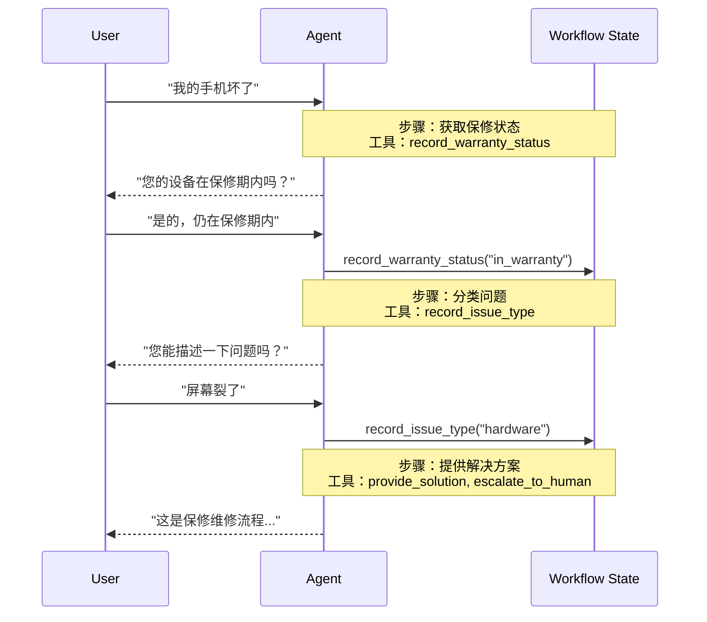

在**交接（handoffs）**架构中，行为会根据状态动态变化。其核心机制是：[工具](/oss/javascript/langchain/tools)会更新一个在多个轮次中持续存在的状态变量（例如 `current_step` 或 `active_agent`），系统读取此变量以调整行为——无论是应用不同的配置（系统提示词、工具）还是路由到不同的[智能体（agent）](/oss/javascript/langchain/agents)。这种模式既支持不同智能体之间的交接，也支持单个智能体内部的动态配置变更。

<Tip>

<strong>交接（handoffs）</strong> 一词由 [OpenAI](https://openai.github.io/openai-agents-python/handoffs/) 提出，用于描述使用工具调用（例如 `transfer_to_sales_agent`）在智能体或状态之间转移控制权。

</Tip>



## 关键特性

*   状态驱动行为：行为基于状态变量（例如 `current_step` 或 `active_agent`）变化
*   基于工具的转换：工具通过更新状态变量在不同状态间移动
*   直接用户交互：每个状态的配置直接处理用户消息
*   持久化状态：状态在对话轮次间持续存在

## 使用场景

当您需要强制执行顺序约束（仅在满足前提条件后解锁功能）、智能体需要在不同状态下直接与用户对话，或者您正在构建多阶段对话流程时，请使用交接模式。这种模式对于需要按特定顺序收集信息的客户支持场景尤其有价值——例如，在处理退款前先收集保修ID。

## 基础实现

核心机制是一个返回 [`Command`](/oss/javascript/langgraph/graph-api#command) 来更新状态的[工具](/oss/javascript/langchain/tools)，从而触发向新步骤或新智能体的转换：

```typescript
import { tool, ToolMessage, type ToolRuntime } from "langchain";
import { Command } from "@langchain/langgraph";
import { z } from "zod";

const transferToSpecialist = tool(
  async (_, config: ToolRuntime<typeof StateSchema>) => {
    return new Command({
      update: {
        messages: [
          new ToolMessage({  // [!code highlight]
            content: "Transferred to specialist",
            tool_call_id: config.toolCallId  // [!code highlight]
          })
        ],
        currentStep: "specialist"  // Triggers behavior change
      }
    });
  },
  {
    name: "transfer_to_specialist",
    description: "Transfer to the specialist agent.",
    schema: z.object({})
  }
);
```

<Note>

<strong>为什么需要包含 `ToolMessage`？</strong> 当大语言模型调用工具时，它期望得到一个响应。带有匹配 `tool_call_id` 的 `ToolMessage` 完成了这个请求-响应循环——没有它，对话历史就会变得不完整。每当你的交接工具更新消息时，这都是必需的。

</Note>

要查看完整的实现，请参考下面的教程。

<Card
title="教程：使用交接模式构建客户支持系统"
icon="people-arrows"
href="/oss/langchain/multi-agent/handoffs-customer-support"
arrow cta="了解更多"
>

学习如何使用交接模式构建一个客户支持智能体，其中一个智能体可以在不同配置之间切换。

</Card>

## 实现方法

有两种方法可以实现交接：**[使用中间件的单一智能体](#single-agent-with-middleware)**（一个具有动态配置的智能体）或 **[多智能体子图](#multiple-agent-subgraphs)**（作为图节点的不同智能体）。

### 使用中间件的单一智能体

一个单一的智能体根据状态改变其行为。中间件拦截每个模型调用，并动态调整系统提示词和可用工具。工具通过更新状态变量来触发转换：

```typescript
import { tool, ToolMessage, type ToolRuntime } from "langchain";
import { Command } from "@langchain/langgraph";
import { z } from "zod";

const recordWarrantyStatus = tool(
  async ({ status }, config: ToolRuntime<typeof StateSchema>) => {
    return new Command({
      update: {
        messages: [
          new ToolMessage({
            content: `Warranty status recorded: ${status}`,
            tool_call_id: config.toolCallId,
          }),
        ],
        warrantyStatus: status,
        currentStep: "specialist", // Update state to trigger transition
      },
    });
  },
  {
    name: "record_warranty_status",
    description: "Record warranty status and transition to next step.",
    schema: z.object({
      status: z.string(),
    }),
  }
);
```

<Note>

<strong>为什么不传递所有子代理消息？</strong> 虽然您可以在交接中包含完整的子代理对话，但这通常会带来问题。接收代理可能会因不相关的内部推理而感到困惑，并且令牌成本会不必要地增加。通过仅传递交接对，您可以使父图的上下文专注于高层协调。如果接收代理需要额外的上下文，请考虑在 ToolMessage 内容中总结子代理的工作，而不是传递原始消息历史。

</Note>

**将控制权交还给用户**

当将控制权交还给用户（结束代理的回合）时，请确保最终消息是一个 `AIMessage`。这可以保持有效的对话历史，并向用户界面发出代理已完成其工作的信号。

## 实施注意事项

在设计多代理系统时，请考虑：

* **上下文过滤策略**：每个代理将接收完整的对话历史、过滤的部分还是摘要？根据其角色，不同的代理可能需要不同的上下文。
* **工具语义**：明确交接工具是仅更新路由状态，还是也会产生副作用。例如，`transfer_to_sales()` 是否也应该创建一个支持工单，或者这应该是一个单独的操作？
* **令牌效率**：在上下文完整性和令牌成本之间取得平衡。随着对话时间的延长，总结和选择性上下文传递变得更加重要。
