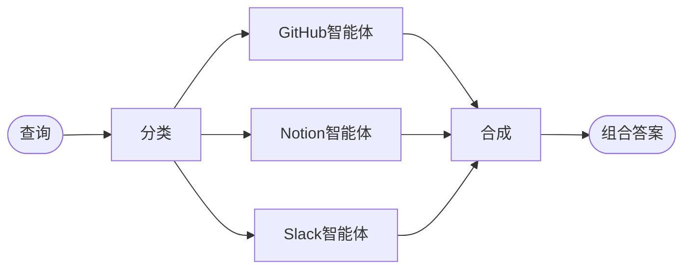

## 概述

**路由模式**是一种[多智能体](/oss/javascript/langchain/multi-agent)架构，其中路由步骤对输入进行分类并将其定向到专门的智能体，然后将结果合成为一个组合响应。当您组织的知识存在于不同的**垂直领域**（即各自需要具有专用工具和提示的智能体的独立知识领域）时，这种模式表现出色。

在本教程中，您将构建一个多源知识库路由器，通过一个真实的企业场景来展示这些优势。该系统将协调三个专家：

- 一个**GitHub智能体**，用于搜索代码、议题和拉取请求。
- 一个**Notion智能体**，用于搜索内部文档和维基。
- 一个**Slack智能体**，用于搜索相关线程和讨论。

当用户询问“如何验证API请求？”时，路由器将查询分解为特定于源的子问题，将它们并行路由到相关智能体，并将结果合成为一个连贯的答案。



### 为什么使用路由器？

路由模式提供了几个优势：

- **并行执行**：同时查询多个源，与顺序方法相比减少了延迟。
- **专用智能体**：每个垂直领域都有针对其领域优化的专用工具和提示。
- **选择性路由**：并非每个查询都需要每个源——路由器会智能地选择相关的垂直领域。
- **针对性子问题**：每个智能体收到一个针对其领域定制的问题，提高了结果质量。
- **清晰合成**：来自多个源的结果被组合成一个单一的、连贯的响应。

### 概念

我们将涵盖以下概念：

- [多智能体系统](/oss/javascript/langchain/multi-agent)
- 用于工作流编排的 [StateGraph](/oss/javascript/langchain/graphs)
- 用于并行执行的 [Send API](/oss/javascript/langchain/send)

<Tip>

<strong>路由器 vs. 子智能体</strong>：[子智能体模式](/oss/javascript/langchain/multi-agent/subagents) 也可以路由到多个智能体。当您需要专门的预处理、自定义路由逻辑或希望显式控制并行执行时，请使用路由模式。当您希望LLM动态决定调用哪些智能体时，请使用子智能体模式。

</Tip>

## 设置

### 安装

本教程需要 `langchain` 和 `langgraph` 包：

::: code-group

```bash [npm]
npm install langchain @langchain/langgraph
```

```bash [yarn]
yarn add langchain @langchain/langgraph
```

```bash [pnpm]
pnpm add langchain @langchain/langgraph
```

:::

更多详情，请参阅我们的 [安装指南](/oss/javascript/langchain/install)。

### LangSmith

设置 [LangSmith](https://smith.langchain.com) 以检查您的智能体内部发生的情况。然后设置以下环境变量：

::: code-group

```bash [bash]
export LANGSMITH_TRACING="true"
export LANGSMITH_API_KEY="..."
```

```typescript [typescript]
process.env.LANGSMITH_TRACING = "true";
process.env.LANGSMITH_API_KEY = "...";
```

:::

### 选择LLM

从LangChain的集成套件中选择一个聊天模型：

<!--@include: @/snippets/javascript/chat-model-tabs-js.md-->

## 1. 定义状态

首先，定义状态模式。我们使用三种类型：

- **`AgentInput`**：传递给每个子智能体的简单状态（仅包含查询）
- **`AgentOutput`**：每个子智能体返回的结果（来源名称 + 结果）
- **`RouterState`**：主工作流状态，用于跟踪查询、分类、结果和最终答案

```typescript
import { z } from "zod/v4";

const AgentOutput = z.object({
  source: z.string(),
  result: z.string(),
});

const RouterState = z.object({
  query: z.string(),
  classifications: z.array(
    z.object({
      source: z.enum(["github", "notion", "slack"]),
      query: z.string(),
    })
  ),
  results: z
    .array(AgentOutput)
    .default([])
    .meta({
      reducer: (current: z.infer<typeof AgentOutput>[], update: z.infer<typeof AgentOutput>[]) =>
        current.concat(update),
    }),
  finalAnswer: z.string(),
});
```

`results` 字段使用一个**归约器**（Python 中是 `operator.add`，JS 中是一个连接函数）来将并行智能体执行的输出收集到一个列表中。

## 2. 为每个垂直领域定义工具

为每个知识领域创建工具。在生产系统中，这些工具会调用实际的 API。在本教程中，我们使用返回模拟数据的存根实现。我们定义了跨 3 个垂直领域的 7 个工具：GitHub（搜索代码、问题、PR）、Notion（搜索文档、获取页面）和 Slack（搜索消息、获取线程）。

```typescript [expandable]
import { tool } from "langchain";
import { z } from "zod";

const searchCode = tool(
  async ({ query, repo }) => {
    return `Found code matching '${query}' in ${repo || "main"}: authentication middleware in src/auth.py`;
  },
  {
    name: "search_code",
    description: "Search code in GitHub repositories.",
    schema: z.object({
      query: z.string(),
      repo: z.string().optional().default("main"),
    }),
  }
);```

const searchIssues = tool(
  async ({ query }) => {
    return `Found 3 issues matching '${query}': #142 (API auth docs), #89 (OAuth flow), #203 (token refresh)`;
  },
  {
    name: "search_issues",
    description: "Search GitHub issues and pull requests.",
    schema: z.object({
      query: z.string(),
    }),
  }
);

const searchPrs = tool(
  async ({ query }) => {
    return `PR #156 added JWT authentication, PR #178 updated OAuth scopes`;
  },
  {
    name: "search_prs",
    description: "Search pull requests for implementation details.",
    schema: z.object({
      query: z.string(),
    }),
  }
);

const searchNotion = tool(
  async ({ query }) => {
    return `Found documentation: 'API Authentication Guide' - covers OAuth2 flow, API keys, and JWT tokens`;
  },
  {
    name: "search_notion",
    description: "Search Notion workspace for documentation.",
    schema: z.object({
      query: z.string(),
    }),
  }
);

const getPage = tool(
  async ({ pageId }) => {
    return `Page content: Step-by-step authentication setup instructions`;
  },
  {
    name: "get_page",
    description: "Get a specific Notion page by ID.",
    schema: z.object({
      pageId: z.string(),
    }),
  }
);

const searchSlack = tool(
  async ({ query }) => {
    return `Found discussion in #engineering: 'Use Bearer tokens for API auth, see docs for refresh flow'`;
  },
  {
    name: "search_slack",
    description: "Search Slack messages and threads.",
    schema: z.object({
      query: z.string(),
    }),
  }
);

const getThread = tool(
  async ({ threadId }) => {
    return `Thread discusses best practices for API key rotation`;
  },
  {
    name: "get_thread",
    description: "Get a specific Slack thread.",
    schema: z.object({
      threadId: z.string(),
    }),
  }
);
```

## 3. 创建专用智能体

为每个垂直领域创建一个智能体。每个智能体都拥有特定领域的工具和针对其知识源优化的提示。三者遵循相同的模式——仅工具和系统提示不同。

```typescript [expandable]
import { createAgent } from "langchain";
import { ChatOpenAI } from "@langchain/openai";

const llm = new ChatOpenAI({ model: "gpt-4o" });

const githubAgent = createAgent({
  model: llm,
  tools: [searchCode, searchIssues, searchPrs],
  systemPrompt: `
You are a GitHub expert. Answer questions about code,
API references, and implementation details by searching
repositories, issues, and pull requests.
  `.trim(),
});

const notionAgent = createAgent({
  model: llm,
  tools: [searchNotion, getPage],
  systemPrompt: `
You are a Notion expert. Answer questions about internal
processes, policies, and team documentation by searching
the organization's Notion workspace.
  `.trim(),
});

const slackAgent = createAgent({
  model: llm,
  tools: [searchSlack, getThread],
  systemPrompt: `
你是一个 Slack 专家。通过搜索团队成员分享知识和解决方案的相关线程和讨论来回答问题。
  `.trim(),
});
```

## 4. 构建路由工作流

现在使用 StateGraph 构建路由工作流。该工作流包含四个主要步骤：

1.  **分类**：分析查询，确定调用哪些智能体以及使用什么子问题
2.  **路由**：使用 `Send` 并行分发到选定的智能体
3.  **查询智能体**：每个智能体接收一个简单的 `AgentInput` 并返回一个 `AgentOutput`
4.  **综合**：将收集到的结果组合成一个连贯的响应

```typescript
import { StateGraph, START, END, Send } from "@langchain/langgraph";
import { z } from "zod";

const routerLlm = new ChatOpenAI({ model: "gpt-4o-mini" });

// 为分类器定义结构化输出模式
const ClassificationResultSchema = z.object({  // [!code highlight]
  classifications: z.array(z.object({
    source: z.enum(["github", "notion", "slack"]),
    query: z.string(),
  })).describe("要调用的智能体列表及其目标子问题"),
});

async function classifyQuery(state: typeof RouterState.State) {
  const structuredLlm = routerLlm.withStructuredOutput(ClassificationResultSchema);  // [!code highlight]

  const result = await structuredLlm.invoke([
    {
      role: "system",
      content: `分析此查询并确定要咨询哪些知识库。
为每个相关来源生成一个针对该来源优化的目标子问题。

可用来源：
- github: 代码、API 参考、实现细节、问题、拉取请求
- notion: 内部文档、流程、策略、团队维基
- slack: 团队讨论、非正式知识共享、最近对话

仅返回与查询相关的来源。每个来源都应有一个针对该特定知识领域优化的目标子问题。

例如，对于"如何验证 API 请求？"：
- github: "存在哪些身份验证代码？搜索身份验证中间件、JWT 处理"
- notion: "存在哪些身份验证文档？查找 API 身份验证指南"
（省略 slack，因为它与此技术问题无关）`
    },
    { role: "user", content: state.query }
  ]);

  return { classifications: result.classifications };
}

function routeToAgents(state: typeof RouterState.State): Send[] {
  return state.classifications.map(
    (c) => new Send(c.source, { query: c.query })  // [!code highlight]
  );
}

async function queryGithub(state: AgentInput) {
  const result = await githubAgent.invoke({
    messages: [{ role: "user", content: state.query }]  // [!code highlight]
  });
  return { results: [{ source: "github", result: result.messages.at(-1)?.content }] };
}

async function queryNotion(state: AgentInput) {
  const result = await notionAgent.invoke({
    messages: [{ role: "user", content: state.query }]  // [!code highlight]
  });
  return { results: [{ source: "notion", result: result.messages.at(-1)?.content }] };
}

async function querySlack(state: AgentInput) {
  const result = await slackAgent.invoke({
    messages: [{ role: "user", content: state.query }]  // [!code highlight]
  });
  return { results: [{ source: "slack", result: result.messages.at(-1)?.content }] };
}

async function synthesizeResults(state: typeof RouterState.State) {
  if (state.results.length === 0) {
    return { finalAnswer: "未从任何知识源找到结果。" };
  }

  // 格式化结果以进行综合
  const formatted = state.results.map(
    (r) => `**来自 ${r.source.charAt(0).toUpperCase() + r.source.slice(1)}:**\n${r.result}`
  );

  const synthesisResponse = await routerLlm.invoke([
    {
      role: "system",
      content: `综合这些搜索结果以回答原始问题："${state.query}"`

- 整合来自多个来源的信息，避免冗余
- 突出显示最相关和可操作的信息
- 注意不同来源之间的差异
- 保持回答简洁且组织良好
    },
    { role: "user", content: formatted.join("\n\n") }
  ]);

  return { finalAnswer: synthesisResponse.content };
}
```

## 5. 编译工作流

现在通过用边连接节点来组装工作流。关键是使用 `add_conditional_edges` 和路由函数来实现并行执行：

```typescript
const workflow = new StateGraph(RouterState)
  .addNode("classify", classifyQuery)
  .addNode("github", queryGithub)
  .addNode("notion", queryNotion)
  .addNode("slack", querySlack)
  .addNode("synthesize", synthesizeResults)
  .addEdge(START, "classify")
  .addConditionalEdges("classify", routeToAgents, ["github", "notion", "slack"])
  .addEdge("github", "synthesize")
  .addEdge("notion", "synthesize")
  .addEdge("slack", "synthesize")
  .addEdge("synthesize", END)
  .compile();
```

`add_conditional_edges` 调用通过 `route_to_agents` 函数将分类节点连接到代理节点。当 `route_to_agents` 返回多个 `Send` 对象时，这些节点会并行执行。

## 6. 使用路由器

使用跨越多个知识领域的查询来测试你的路由器：

```typescript
const result = await workflow.invoke({
  query: "How do I authenticate API requests?"
});

console.log("Original query:", result.query);
console.log("\nClassifications:");
for (const c of result.classifications) {
  console.log(`  ${c.source}: ${c.query}`);
}
console.log("\n" + "=".repeat(60) + "\n");
console.log("Final Answer:");
console.log(result.finalAnswer);
```

预期输出：
```
Original query: How do I authenticate API requests?

Classifications:
  github: What authentication code exists? Search for auth middleware, JWT handling
  notion: What authentication documentation exists? Look for API auth guides

============================================================

Final Answer:
To authenticate API requests, you have several options:

1. **JWT Tokens**: The recommended approach for most use cases.
   Implementation details are in `src/auth.py` (PR #156).

2. **OAuth2 Flow**: For third-party integrations, follow the OAuth2
   flow documented in Notion's 'API Authentication Guide'.

3. **API Keys**: For server-to-server communication, use Bearer tokens
   in the Authorization header.

For token refresh handling, see issue #203 and PR #178 for the latest
OAuth scope updates.
```

路由器分析了查询，对其分类以确定要调用哪些代理（对于这个技术问题，调用了 GitHub 和 Notion，但没有调用 Slack），并行查询了两个代理，并将结果综合成一个连贯的答案。

## 7. 理解架构

路由器工作流遵循一个清晰的模式：

### 分类阶段

`classify_query` 函数使用**结构化输出**来分析用户的查询并确定要调用哪些代理。这就是路由智能所在的地方：

- 使用 Pydantic 模型（Python）或 Zod 模式（JS）来确保输出有效
- 返回一个 `Classification` 对象列表，每个对象包含一个 `source` 和针对性的 `query`
- 仅包含相关来源——不相关的来源会被直接省略

这种结构化方法比自由格式的 JSON 解析更可靠，并使路由逻辑变得明确。

### 使用 send 进行并行执行

`route_to_agents` 函数将分类映射到 `Send` 对象。每个 `Send` 指定目标节点和要传递的状态：

```typescript
// 分类: [{ source: "github", query: "..." }, { source: "notion", query: "..." }]
// 变为:
[new Send("github", { query: "..." }), new Send("notion", { query: "..." })]
// 两个智能体同时执行，每个只接收它需要的查询
```

每个智能体节点接收一个简单的 `AgentInput`，只包含一个 `query` 字段——而不是完整的路由器状态。这保持了接口的简洁和明确。

### 使用归约器收集结果

智能体的结果通过**归约器**流回主状态。每个智能体返回：

```typescript
{ results: [{ source: "github", result: "..." }] }
```

归约器（Python 中的 `operator.add`）连接这些列表，将所有并行结果收集到 `state["results"]` 中。

### 合成阶段

在所有智能体完成后，`synthesize_results` 函数遍历收集到的结果：

- 等待所有并行分支完成（LangGraph 会自动处理）
- 引用原始查询以确保答案回应用户所问
- 合并所有来源的信息，避免冗余

<Note>

<strong>部分结果</strong>：在本教程中，所有选定的智能体必须在合成之前完成。对于更高级的模式，例如希望处理部分结果或超时的情况，请参阅 [map-reduce 指南](/oss/javascript/langchain/map-reduce)。

</Note>

## 8. 完整的工作示例

以下是一个可运行脚本中的完整代码：

<Expandable title="查看完整代码" :defaultOpen="false">

<Tip>

对于大多数用例，推荐使用工具包装器方法。它提供了清晰的分离：路由器处理多源查询，而对话智能体处理上下文和记忆。

</Tip>

### 完全持久化方法

如果您需要路由器本身维护状态——例如，在路由决策中使用先前的搜索结果——请使用[持久化](/oss/javascript/langchain/short-term-memory)在路由器级别存储消息历史记录。

<Warning>

<strong>有状态路由器会增加复杂性。</strong> 当在不同轮次中路由到不同的智能体时，如果智能体具有不同的语气或提示，对话可能会感觉不一致。请考虑使用[交接模式](/oss/javascript/langchain/multi-agent/handoffs)或[子智能体模式](/oss/javascript/langchain/multi-agent/subagents)——这两种模式都为与不同智能体的多轮对话提供了更清晰的语义。

</Warning>

## 10. 关键要点

路由器模式在以下情况下表现出色：

- **不同的垂直领域**：每个都需要专门工具和提示的独立知识领域
- **并行查询需求**：受益于同时查询多个来源的问题
- **综合需求**：需要将来自多个来源的结果组合成连贯的响应

该模式包含三个阶段：**分解**（分析查询并生成有针对性的子问题）、**路由**（并行执行查询）和**综合**（组合结果）。

<Tip>

<strong>何时使用路由器模式</strong>

当您拥有多个独立的知识源、需要低延迟的并行查询，并且希望对路由逻辑进行显式控制时，请使用路由器模式。

对于具有动态工具选择的更简单情况，请考虑[子智能体模式](/oss/javascript/langchain/multi-agent/subagents)。对于需要智能体与用户顺序对话的工作流，请考虑[交接模式](/oss/javascript/langchain/multi-agent/handoffs)。

</Tip>

## 后续步骤

- 了解[交接](/oss/javascript/langchain/multi-agent/handoffs)机制，用于智能体（agent）间的对话
- 探索[子智能体模式](/oss/javascript/langchain/multi-agent/subagents-personal-assistant)，实现集中式编排
- 阅读[多智能体概述](/oss/javascript/langchain/multi-agent)，比较不同模式
- 使用[LangSmith](https://smith.langchain.com)来调试和监控你的路由器
