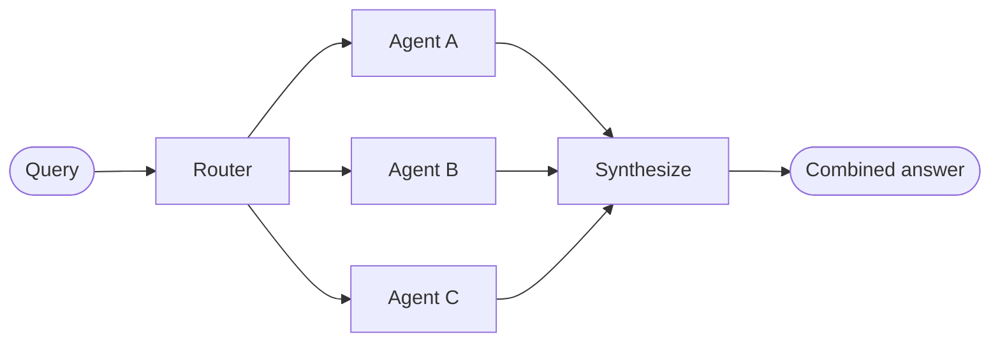

在**路由器（router）**架构中，路由步骤会对输入进行分类，并将其定向到专门的[智能体（agents）](/oss/javascript/langchain/agents)。当您拥有不同的**垂直领域（verticals）**——即各自需要专属智能体的独立知识领域时，这种架构非常有用。



## 主要特性

*   路由器对查询进行分解
*   零个或多个专门的智能体被并行调用
*   结果被合成为一个连贯的响应

## 使用时机

当您拥有不同的垂直领域（即各自需要专属智能体的独立知识领域）、需要并行查询多个来源，并希望将结果合成为一个统一的响应时，请使用路由器模式。

## 基础实现

路由器对查询进行分类并将其定向到适当的智能体。使用 [`Command`](/oss/javascript/langgraph/graph-api#command) 进行单智能体路由，或使用 [`Send`](/oss/javascript/langgraph/graph-api#send) 进行向多个智能体的并行扇出（fan-out）。

<Tabs>

<Tab title="单智能体">

使用 `Command` 路由到单个专门的智能体：

```typescript
import { Command } from "@langchain/langgraph";

interface ClassificationResult {
  query: string;
  agent: string;
}

function classifyQuery(query: string): ClassificationResult {
  // Use LLM to classify query and determine the appropriate agent
  // Classification logic here
  ...
}

function routeQuery(state: typeof State.State) {
  const classification = classifyQuery(state.query);

  // Route to the selected agent
  return new Command({ goto: classification.agent });
}
```

</Tab>

<Tab title="多智能体（并行）">

使用 `Send` 并行扇出到多个专门的智能体：

```typescript
import { Send } from "@langchain/langgraph";

interface ClassificationResult {
  query: string;
  agent: string;
}

function classifyQuery(query: string): ClassificationResult[] {
  // Use LLM to classify query and determine which agents to invoke
  // Classification logic here
  ...
}

function routeQuery(state: typeof State.State) {
  const classifications = classifyQuery(state.query);

  // Fan out to selected agents in parallel
  return classifications.map(
    (c) => new Send(c.agent, { query: c.query })
  );
}
```

</Tab>

</Tabs>

关于完整实现，请参阅下面的教程。

<Card title="教程：构建带路由功能的多源知识库" icon="book" href="/oss/langchain/multi-agent/router-knowledge-base">

构建一个路由器，并行查询 GitHub、Notion 和 Slack，然后将结果合成为一个连贯的答案。涵盖状态定义、专门智能体、使用 `Send` 的并行执行以及结果合成。

</Card>

## 无状态 vs. 有状态

两种方法：
*   [**无状态路由器**](#stateless) 独立处理每个请求
*   [**有状态路由器**](#stateful) 跨请求维护对话历史

## 无状态

每个请求被独立路由——调用之间没有记忆。对于多轮对话，请参阅[有状态路由器](#stateful)。

<Tip>

<strong>路由器 vs. 子智能体</strong>：两种模式都可以将工作分派给多个智能体，但它们在路由决策的制定方式上有所不同：

-   <strong>路由器</strong>：一个专用的路由步骤（通常是单个 LLM 调用或基于规则的逻辑），对输入进行分类并分派给智能体。路由器本身通常不维护对话历史记录或执行多轮编排——它是一个预处理步骤。
-   <strong>子智能体</strong>：一个主监督智能体在持续对话中动态决定调用哪些[子智能体（subagents）](/oss/javascript/langchain/multi-agent/subagents)。主智能体维护上下文，可以在多轮对话中调用多个子智能体，并编排复杂的多步骤工作流。

当您有清晰的输入类别并希望进行确定性或轻量级分类时，使用<strong>路由器</strong>。当您需要灵活的、对话感知的编排，由 LLM 根据不断变化的上下文决定下一步做什么时，使用<strong>监督智能体</strong>。

</Tip>

## 有状态

对于多轮对话，您需要在多次调用之间维护上下文。

### 工具包装器

最简单的方法：将无状态路由器包装成一个工具，供对话智能体调用。对话智能体处理记忆和上下文；路由器保持无状态。这避免了跨多个并行智能体管理对话历史的复杂性。

```typescript
const searchDocs = tool(
  async ({ query }) => {
    const result = await workflow.invoke({ query });  // [!code highlight]
    return result.finalAnswer;
  },
  {
    name: "search_docs",
    description: "Search across multiple documentation sources",
    schema: z.object({
      query: z.string().describe("The search query")
    })
  }
);

// Conversational agent uses the router as a tool
const conversationalAgent = createAgent({
  model,
  tools: [searchDocs],
  prompt: "You are a helpful assistant. Use search_docs to answer questions."
});
```

### 完全持久化

如果您需要路由器本身维护状态，请使用[持久化（persistence）](/oss/javascript/langchain/short-term-memory)来存储消息历史。当路由到某个智能体时，从状态中获取先前的消息，并有选择地将其包含在智能体的上下文中——这是[上下文工程（context engineering）](/oss/javascript/langchain/context-engineering)的一个杠杆。

<Warning>

<strong>有状态路由器需要自定义历史管理。</strong> 如果路由器在多轮对话中在不同智能体之间切换，当智能体具有不同的语气或提示时，对话对最终用户来说可能感觉不流畅。在并行调用的情况下，您需要在路由器级别维护历史记录（输入和合成输出），并在路由逻辑中利用此历史记录。请考虑使用[交接模式（handoffs pattern）](/oss/javascript/langchain/multi-agent/handoffs)或[子智能体模式（subagents pattern）](/oss/javascript/langchain/multi-agent/subagents)——两者都为多轮对话提供了更清晰的语义。

</Warning>

