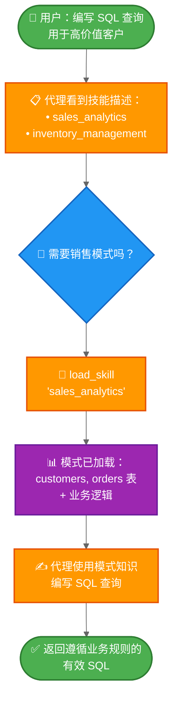

本教程展示了如何使用**渐进式披露（progressive disclosure）**——一种按需加载信息而非预先加载的上下文管理技术——来实现**技能（skills）**（基于提示的专用指令）。代理通过工具调用来加载技能，而不是动态更改系统提示，从而发现并仅加载每个任务所需的技能。

**使用场景：** 假设您正在构建一个代理，用于帮助大型企业中不同业务部门编写 SQL 查询。您的组织可能为每个部门设置了独立的数据存储，或者拥有一个包含数千张表的单体数据库。无论哪种情况，预先加载所有模式都会超出上下文窗口的容量。渐进式披露通过仅在需要时加载相关模式来解决此问题。这种架构还使得不同的产品所有者和利益相关者能够独立贡献和维护其特定业务部门的技能。

**您将构建的内容：** 一个具有两种技能（销售分析和库存管理）的 SQL 查询助手。代理在其系统提示中看到轻量级的技能描述，然后仅在用户查询相关时，才通过工具调用加载完整的数据库模式和业务逻辑。

<Note>

有关包含查询执行、错误纠正和验证的更完整 SQL 代理示例，请参阅我们的 [SQL 代理教程](/oss/langchain/sql-agent)。本教程重点介绍可应用于任何领域的渐进式披露模式。

</Note>

<Tip>

渐进式披露由 Anthropic 推广，作为构建可扩展代理技能系统的一种技术。这种方法采用三层架构（元数据 → 核心内容 → 详细资源），代理仅按需加载信息。有关此技术的更多信息，请参阅 [Equipping agents for the real world with Agent Skills](https://www.anthropic.com/engineering/equipping-agents-for-the-real-world-with-agent-skills)。

</Tip>

## 工作原理

以下是用户请求 SQL 查询时的流程：



**为什么使用渐进式披露：**
- **减少上下文使用** - 仅加载任务所需的 2-3 个技能，而非所有可用技能
- **实现团队自治** - 不同团队可以独立开发专用技能（类似于其他多代理架构）
- **高效扩展** - 添加数十或数百个技能而不会使上下文过载
- **简化对话历史** - 单一代理，单一对话线程

**什么是技能：** 技能，正如 Claude Code 所推广的，主要是基于提示的：用于特定业务任务的、自包含的专用指令单元。在 Claude Code 中，技能以文件系统上的目录和文件形式暴露，通过文件操作发现。技能通过提示指导行为，可以提供工具使用信息，或包含供编码代理执行的示例代码。

<Tip>

具有渐进式披露的技能可以看作是一种 [RAG（检索增强生成）](/oss/langchain/rag) 形式，其中每个技能都是一个检索单元——尽管不一定由嵌入或关键词搜索支持，而是由用于浏览内容的工具支持（如文件操作，或在本教程中，直接查找）。

</Tip>

**权衡：**
- **延迟**：按需加载技能需要额外的工具调用，这会增加首次需要每个技能的请求的延迟
- **工作流控制**：基本实现依赖提示来指导技能使用——如果没有自定义逻辑，您无法强制执行硬性约束，如“始终在技能 B 之前尝试技能 A”

<Tip>

<strong>实现您自己的技能系统</strong>

在构建您自己的技能实现时（如本教程所示），核心概念是渐进式披露——按需加载信息。除此之外，您在实现上拥有完全的灵活性：

- <strong>存储</strong>：数据库、S3、内存数据结构或任何后端
- <strong>发现</strong>：直接查找（本教程）、用于大型技能集合的 RAG、文件系统扫描或 API 调用
- <strong>加载逻辑</strong>：自定义延迟特性，并添加逻辑以搜索技能内容或对相关性进行排序
- <strong>副作用</strong>：定义技能加载时发生的情况，例如暴露与该技能关联的工具（在第 8 节中介绍）

这种灵活性使您能够针对性能、存储和工作流控制方面的特定需求进行优化。

</Tip>

## 设置

### 安装

本教程需要 `langchain` 包：

::: code-group

```bash [npm]
npm install langchain
```

```bash [yarn]
yarn add langchain
```

```bash [pnpm]
pnpm add langchain
```

:::

更多详情，请参阅我们的 [安装指南](/oss/langchain/install)。

### LangSmith

设置 [LangSmith](https://smith.langchain.com) 以检查代理内部发生的情况。然后设置以下环境变量：

::: code-group

```bash [bash]
export LANGSMITH_TRACING="true"
export LANGSMITH_API_KEY="..."
```

```typescript [typescript]
process.env.LANGSMITH_TRACING = "true";
process.env.LANGSMITH_API_KEY = "...";
```

:::

### 选择 LLM

从 LangChain 的集成套件中选择一个聊天模型：

<!--@include: @/snippets/javascript/chat-model-tabs-js.md-->

## 1. 定义技能

首先，定义技能的结构。每个技能都有一个名称、一个简要描述（显示在系统提示中）和完整内容（按需加载）：

```python
from typing import TypedDict

class Skill(TypedDict):  # [!code highlight]
    """一个可以渐进式披露给代理的技能。"""
    name: str  # 技能的唯一标识符
    description: str  # 在系统提示中显示的 1-2 句描述
    content: str  # 包含详细指令的完整技能内容
```

现在为 SQL 查询助手定义示例技能。这些技能设计为**描述轻量级**（预先显示给代理）但**内容详细**（仅在需要时加载）：

:::: details 查看完整的技能定义

```python
SKILLS: list[Skill] = [
    {
        "name": "sales_analytics",
        "description": "用于销售数据分析的数据库模式和业务逻辑，包括客户、订单和收入。",
        "content": """# 销售分析模式

## 表

### customers
- customer_id (主键)
- name
- email
- signup_date
- status (active/inactive)
- customer_tier (bronze/silver/gold/platinum)

### orders
- order_id (主键)
- customer_id (外键 -> customers)
- order_date
- status (pending/completed/cancelled/refunded)
- total_amount
- sales_region (north/south/east/west)

### order_items
- item_id (主键)
- order_id (外键 -> orders)
- product_id
- quantity
- unit_price
- discount_percent

## 业务逻辑

**活跃客户**：status = 'active' AND signup_date <= CURRENT_DATE - INTERVAL '90 days'

**收入计算**：仅统计 status = 'completed' 的订单。使用 orders 表中的 total_amount，该字段已考虑折扣。

**客户终身价值 (CLV)**：客户所有已完成订单金额的总和。

**高价值订单**：total_amount > 1000 的订单

## 示例查询

-- 获取上一季度收入最高的前 10 名客户
SELECT
    c.customer_id,
    c.name,
    c.customer_tier,
    SUM(o.total_amount) as total_revenue
FROM customers c
JOIN orders o ON c.customer_id = o.customer_id
WHERE o.status = 'completed'
  AND o.order_date >= CURRENT_DATE - INTERVAL '3 months'
GROUP BY c.customer_id, c.name, c.customer_tier
ORDER BY total_revenue DESC
LIMIT 10;
""",
    },
    {
        "name": "inventory_management",
        "description": "用于库存跟踪的数据库模式和业务逻辑，包括产品、仓库和库存水平。",
        "content": """# 库存管理模式

## 表

### products
- product_id (主键)
- product_name
- sku
- category
- unit_cost
- reorder_point (重新订购前的最低库存水平)
- discontinued (布尔值)

### warehouses
- warehouse_id (主键)
- warehouse_name
- location
- capacity

### inventory
- inventory_id (主键)
- product_id (外键 -> products)
- warehouse_id (外键 -> warehouses)
- quantity_on_hand
- last_updated

### stock_movements
- movement_id (主键)
- product_id (外键 -> products)
- warehouse_id (外键 -> warehouses)
- movement_type (inbound/outbound/transfer/adjustment)
- quantity (入库为正，出库为负)
- movement_date
- reference_number

## 业务逻辑

**可用库存**：inventory 表中 quantity_on_hand > 0 的记录

**需要重新订购的产品**：所有仓库中 total quantity_on_hand 小于或等于产品 reorder_point 的产品

**仅限活跃产品**：除非专门分析已停产产品，否则排除 discontinued = true 的产品

**库存估值**：每个产品的 quantity_on_hand * unit_cost

## 示例查询

-- 查找所有仓库中低于重新订购点的产品
SELECT
    p.product_id,
    p.product_name,
    p.reorder_point,
    SUM(i.quantity_on_hand) as total_stock,
    p.unit_cost,
    (p.reorder_point - SUM(i.quantity_on_hand)) as units_to_reorder
FROM products p
JOIN inventory i ON p.product_id = i.product_id
WHERE p.discontinued = false
GROUP BY p.product_id, p.product_name, p.reorder_point, p.unit_cost
HAVING SUM(i.quantity_on_hand) <= p.reorder_point
ORDER BY units_to_reorder DESC;
""",
    },
]
```

::::

## 2. 创建技能加载工具

创建一个工具来按需加载完整的技能内容：

```python
from langchain.tools import tool

@tool  # [!code highlight]
def load_skill(skill_name: str) -> str:
    """将技能的完整内容加载到代理的上下文中。

    当您需要有关如何处理特定类型请求的详细信息时使用此工具。
    这将为您提供该技能领域的全面指令、策略和指南。

    参数：
        skill_name: 要加载的技能名称（例如，"expense_reporting", "travel_booking"）
    """
    # 查找并返回请求的技能
    for skill in SKILLS:
        if skill["name"] == skill_name:
            return f"Loaded skill: {skill_name}\n\n{skill['content']}"  # [!code highlight]

    # 未找到技能
    available = ", ".join(s["name"] for s in SKILLS)
    return f"Skill '{skill_name}' not found. Available skills: {available}"
```

`load_skill` 工具将完整的技能内容作为字符串返回，该字符串作为 ToolMessage 成为对话的一部分。有关创建和使用工具的更多详细信息，请参阅 [工具指南](/oss/langchain/tools)。

## 3. 构建技能中间件

创建自定义中间件，将技能描述注入系统提示。此中间件使技能可被发现，而无需预先加载其完整内容。

<Note>

本指南演示了如何创建自定义中间件。有关中间件概念和模式的全面指南，请参阅 [自定义中间件文档](/oss/langchain/middleware/custom)。

</Note>

```python
from langchain.agents.middleware import ModelRequest, ModelResponse, AgentMiddleware
from langchain.messages import SystemMessage
from typing import Callable

class SkillMiddleware(AgentMiddleware):  # [!code highlight]
    """将技能描述注入系统提示的中间件。"""

    # 将 load_skill 工具注册为类变量
    tools = [load_skill]  # [!code highlight]

    def __init__(self):
        """初始化并从 SKILLS 生成技能提示。"""
        # 从 SKILLS 列表构建技能提示
        skills_list = []
        for skill in SKILLS:
            skills_list.append(
                f"- **{skill['name']}**: {skill['description']}"
            )
        self.skills_prompt = "\n".join(skills_list)

    def wrap_model_call(
        self,
        request: ModelRequest,
        handler: Callable[[ModelRequest], ModelResponse],
    ) -> ModelResponse:
        """同步：将技能描述注入系统提示。"""
        # 构建技能附加内容
        skills_addendum = ( # [!code highlight]
            f"\n\n## 可用技能\n\n{self.skills_prompt}\n\n" # [!code highlight]
            "当您需要有关如何处理特定类型请求的详细信息时，" # [!code highlight]
            "请使用 load_skill 工具。" # [!code highlight]
        )

        # 追加到系统消息内容块
        new_content = list(request.system_message.content_blocks) + [
            {"type": "text", "text": skills_addendum}
        ]
        new_system_message = SystemMessage(content=new_content)
        modified_request = request.override(system_message=new_system_message)
        return handler(modified_request)
```

该中间件将技能描述附加到系统提示中，使代理了解可用技能而无需加载其完整内容。`load_skill` 工具被注册为类变量，使其对代理可用。

<Note>

<strong>生产环境考虑</strong>：本教程为了简单起见，在 `__init__` 中加载技能列表。在生产系统中，您可能希望在 `before_agent` 钩子中加载技能，从而允许定期刷新技能以反映最新的更改（例如，当添加新技能或修改现有技能时）。详情请参阅 [before_agent 钩子文档](/oss/langchain/middleware/custom#before_agent)。

</Note>

## 4. 创建支持技能的代理

现在创建带有技能中间件和用于状态持久化的检查点（checkpointer）的代理：

```python
from langchain.agents import create_agent
from langgraph.checkpoint.memory import InMemorySaver

# 创建支持技能的代理
agent = create_agent(
    model,
    system_prompt=(
        "您是一个 SQL 查询助手，帮助用户"
        "针对业务数据库编写查询。"
    ),
    middleware=[SkillMiddleware()],  # [!code highlight]
    checkpointer=InMemorySaver(),
)
```

代理现在可以在其系统提示中访问技能描述，并可以在需要时调用 `load_skill` 来检索完整的技能内容。检查点（checkpointer）在多个回合中维护对话历史。

## 5. 测试渐进式披露

使用需要特定技能知识的问题测试代理：

```python
import uuid

# 此对话线程的配置
thread_id = str(uuid.uuid4())
config = {"configurable": {"thread_id": thread_id}}

# 请求 SQL 查询
result = agent.invoke(  # [!code highlight]
    {
        "messages": [
            {
                "role": "user",
                "content": (
                    "编写一个 SQL 查询，查找上个月"
                    "订单金额超过 1000 美元的所有客户"
                ),
            }
        ]
    },
    config
)

# 打印对话
for message in result["messages"]:
    if hasattr(message, 'pretty_print'):
        message.pretty_print()
    else:
        print(f"{message.type}: {message.content}")
```

预期输出：

```
================================ Human Message =================================

编写一个 SQL 查询，查找上个月订单金额超过 1000 美元的所有客户
================================== Ai Message ==================================
Tool Calls:
  load_skill (call_abc123)
 Call ID: call_abc123
  Args:
skill_name: sales_analytics
================================= Tool Message =================================
Name: load_skill

Loaded skill: sales_analytics

# 销售分析模式

## 表

### customers
- customer_id (主键)
- name
- email
- signup_date
- status (active/inactive)
- customer_tier (bronze/silver/gold/platinum)

### orders
- order_id (主键)
- customer_id (外键 -> customers)
- order_date
- status (pending/completed/cancelled/refunded)
- total_amount
- sales_region (north/south/east/west)

[... 模式其余部分 ...]

## 业务逻辑

**高价值订单**：`total_amount > 1000` 的
