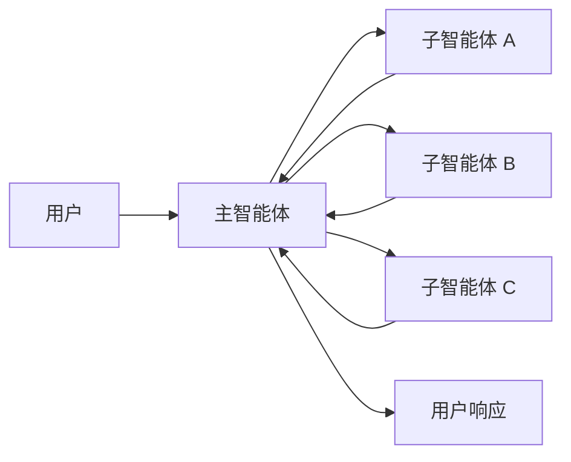
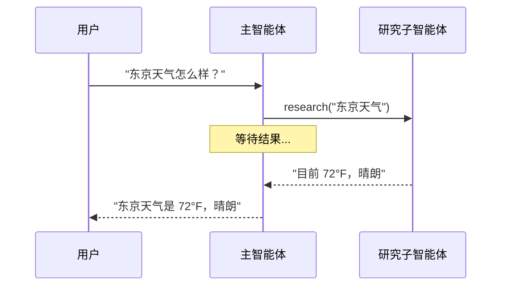
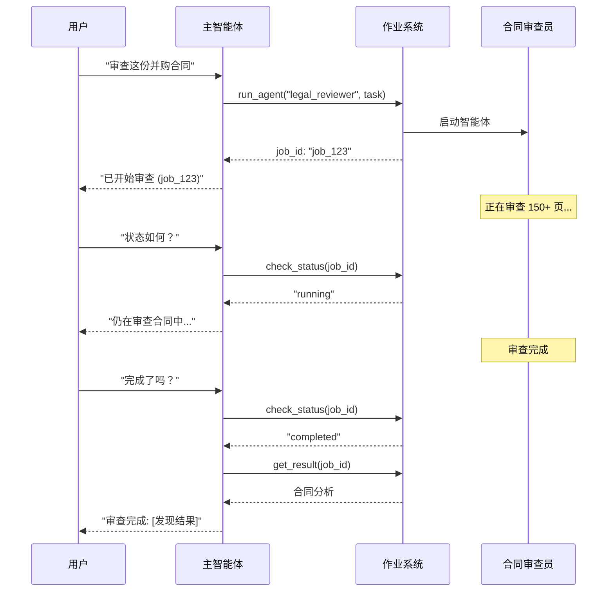
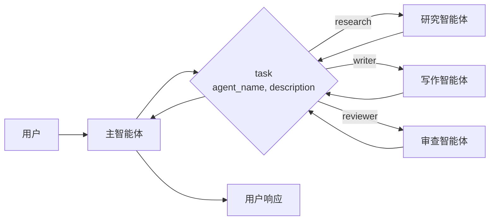

在**子智能体**架构中，一个中央主[智能体](/oss/langchain/agents)（通常称为**监督者**）通过将子智能体作为[工具](/oss/langchain/tools)调用来协调它们。主智能体决定调用哪个子智能体、提供什么输入以及如何组合结果。子智能体是无状态的——它们不记得过去的交互，所有对话记忆都由主智能体维护。这提供了[上下文](/oss/langchain/context-engineering)隔离：每个子智能体调用都在一个干净的上下文窗口中工作，防止主对话中的上下文膨胀。



## 关键特性

* 集中控制：所有路由都通过主智能体
* 无直接用户交互：子智能体将结果返回给主智能体，而不是用户（尽管你可以在子智能体内部使用[中断](/oss/langgraph/human-in-the-loop#interrupt)来允许用户交互）
* 通过工具调用子智能体：子智能体通过工具调用
* 并行执行：主智能体可以在单次轮次中调用多个子智能体

<Note>

<strong>监督者 vs. 路由器</strong>：监督者智能体（此模式）不同于[路由器](/oss/langchain/multi-agent/router)。监督者是一个完整的智能体，它维护对话上下文并动态决定在多个轮次中调用哪些子智能体。路由器通常是一个单一的分类步骤，它将任务分派给智能体，而不维护持续的对话状态。

</Note>

## 何时使用

当你拥有多个不同的领域（例如，日历、电子邮件、CRM、数据库）、子智能体不需要直接与用户对话，或者你想要集中式工作流控制时，请使用子智能体模式。对于只有少数[工具](/oss/langchain/tools)的简单情况，请使用[单一智能体](/oss/langchain/agents)。

<Tip>

<strong>需要在子智能体内部进行用户交互？</strong> 虽然子智能体通常将结果返回给主智能体，而不是直接与用户对话，但你可以在子智能体内部使用[中断](/oss/langgraph/human-in-the-loop#interrupt)来暂停执行并收集用户输入。当子智能体在继续之前需要澄清或批准时，这很有用。主智能体仍然是协调者，但子智能体可以在任务中途从用户那里收集信息。

</Tip>

## 基本实现

核心机制是将子智能体包装为主智能体可以调用的工具：

```typescript
import { createAgent, tool } from "langchain";
import { z } from "zod";

// 创建一个子智能体
const subagent = createAgent({ model: "anthropic:claude-sonnet-4-20250514", tools: [...] });

// 将其包装为工具
const callResearchAgent = tool(
  async ({ query }) => {
    const result = await subagent.invoke({
      messages: [{ role: "user", content: query }]
    });
    return result.messages.at(-1)?.content;
  },
  {
    name: "research",
    description: "研究一个主题并返回发现结果",
    schema: z.object({ query: z.string() })
  }
);

// 主智能体，将子智能体作为工具
const mainAgent = createAgent({ model: "anthropic:claude-sonnet-4-20250514", tools: [callResearchAgent] });
```

<Card
title="教程：使用子智能体构建个人助手"
icon="sitemap"
href="/oss/langchain/multi-agent/subagents-personal-assistant"
arrow cta="了解更多"
>

学习如何使用子智能体模式构建个人助手，其中一个中央主智能体（监督者）协调专门的工人智能体。

</Card>

## 设计决策

在实现子智能体模式时，你将做出几个关键的设计选择。此表总结了选项——每个选项在下面的章节中都有详细说明。

| 决策 | 选项 |
|----------|---------|
| [**同步 vs. 异步**](#sync-vs-async) | 同步（阻塞） vs. 异步（后台） |
| [**工具模式**](#tool-patterns) | 每个智能体一个工具 vs. 单一分派工具 |
| [**子智能体输入**](#subagent-inputs) | 仅查询 vs. 完整上下文 |
| [**子智能体输出**](#subagent-outputs) | 子智能体结果 vs. 完整对话历史 |

## 同步 vs. 异步

子智能体执行可以是**同步的**（阻塞）或**异步的**（后台）。你的选择取决于主智能体是否需要结果才能继续。

| 模式 | 主智能体行为 | 最适合 | 权衡 |
|------|---------------------|----------|----------|
| **同步** | 等待子智能体完成 | 主智能体需要结果才能继续 | 简单，但会阻塞对话 |
| **异步** | 在子智能体后台运行时继续 | 独立任务，用户不应等待 | 响应迅速，但更复杂 |

<Tip>

不要与 Python 的 `async`/`await` 混淆。在这里，“异步”意味着主智能体启动一个后台作业（通常在单独的进程或服务中）并在不阻塞的情况下继续。

</Tip>

### 同步（默认）

默认情况下，子智能体调用是**同步的**——主智能体等待每个子智能体完成后再继续。当主智能体的下一个操作依赖于子智能体的结果时，请使用同步模式。



**何时使用同步：**
- 主智能体需要子智能体的结果来构建其响应
- 任务具有顺序依赖性（例如，获取数据 → 分析 → 响应）
- 子智能体失败应阻止主智能体的响应

**权衡：**
- 实现简单——只需调用并等待
- 在所有子智能体完成之前，用户看不到响应
- 长时间运行的任务会冻结对话

### 异步

当子智能体的工作是独立的——主智能体不需要结果来继续与用户对话时，请使用**异步执行**。主智能体启动一个后台作业并保持响应。



**何时使用异步：**
- 子智能体工作独立于主对话流
- 用户应该能够在工作进行时继续聊天
- 你想要并行运行多个独立任务

**三工具模式：**
1. **启动作业**：启动后台任务，返回作业 ID
2. **检查状态**：返回当前状态（待处理、运行中、已完成、失败）
3. **获取结果**：检索已完成的结果

**处理作业完成：** 当作业完成时，你的应用程序需要通知用户。一种方法是：显示一个通知，点击后发送一个 `HumanMessage`，例如“检查 job_123 并总结结果”。

## 工具模式

有两种主要方式将子智能体暴露为工具：

| 模式 | 最适合 | 权衡 |
|---------|----------|-----------|
| [**每个智能体一个工具**](#tool-per-agent) | 对每个子智能体的输入/输出进行细粒度控制 | 设置更多，但定制性更强 |
| [**单一分派工具**](#single-dispatch-tool) | 许多智能体，分布式团队，约定优于配置 | 组合更简单，每个智能体的定制更少 |

### 每个智能体一个工具


关键思想是将子智能体包装为主智能体可以调用的工具：

```typescript
import { createAgent, tool } from "langchain";
import * as z from "zod";

// 创建一个子智能体
const subagent = createAgent({...});  // [!code highlight]

// 将其包装为工具  // [!code highlight]
const callSubagent = tool(  // [!code highlight]
  async ({ query }) => {  // [!code highlight]
    const result = await subagent.invoke({
      messages: [{ role: "user", content: query }]
    });
    return result.messages.at(-1)?.text;
  },
  {
    name: "subagent_name",
    description: "subagent_description",
    schema: z.object({
      query: z.string().describe("发送给子智能体的查询")
    })
  }
);

// 主智能体，将子智能体作为工具  // [!code highlight]
const mainAgent = createAgent({ model, tools: [callSubagent] });  // [!code highlight]
```

当主智能体认为任务与子智能体的描述匹配时，它会调用子智能体工具，接收结果，并继续协调。有关细粒度控制，请参阅[上下文工程](#context-engineering)。

### 单一分派工具

另一种方法是使用一个参数化的工具来调用临时子智能体以执行独立任务。与[每个智能体一个工具](#tool-per-agent)方法（每个子智能体被包装为单独的工具）不同，这种方法使用基于约定的方法，只有一个 `task` 工具：任务描述作为人类消息传递给子智能体，子智能体的最终消息作为工具结果返回。

当你希望跨多个团队分发智能体开发、需要将复杂任务隔离到单独的上下文窗口中、需要一种可扩展的方式来添加新智能体而无需修改协调器，或者更喜欢约定优于定制时，请使用此方法。这种方法以牺牲上下文工程的灵活性为代价，换来了智能体组合的简单性和强大的上下文隔离。



**关键特性：**

* 单一任务工具：一个参数化的工具，可以通过名称调用任何已注册的子智能体
* 基于约定的调用：通过名称选择智能体，任务作为人类消息传递，最终消息作为工具结果返回
* 团队分布：不同的团队可以独立开发和部署智能体
* 智能体发现：子智能体可以通过系统提示（列出可用智能体）或通过[渐进式披露](/oss/langchain/multi-agent/skills-sql-assistant)（通过工具按需加载智能体信息）来发现

<Tip>

这种方法的一个有趣之处在于，子智能体可能拥有与主智能体完全相同的功能。在这种情况下，调用子智能体<strong>主要是出于上下文隔离</strong>的原因——允许复杂、多步骤的任务在隔离的上下文窗口中运行，而不会使主智能体的对话历史膨胀。子智能体自主完成其工作，并仅返回简洁的摘要，保持主线程专注和高效。

</Tip>

:::: details 带有任务分派器的智能体注册表

```typescript
import { tool, createAgent } from "langchain";
import * as z from "zod";

// 由不同团队开发的子智能体
const researchAgent = createAgent({
  model: "gpt-4o",
  prompt: "你是一个研究专家...",
});

const writerAgent = createAgent({
  model: "gpt-4o",
  prompt: "你是一个写作专家...",
});

// 可用子智能体的注册表
const SUBAGENTS = {
  research: researchAgent,
  writer: writerAgent,
};

const task = tool(
  async ({ agentName, description }) => {
    const agent = SUBAGENTS[agentName];
    const result = await agent.invoke({
      messages: [
        { role: "user", content: description }
      ],
    });
    return result.messages.at(-1)?.content;
  },
  {
    name: "task",
    description: `启动一个临时子智能体。

可用智能体：
- research: 研究和事实查找
- writer: 内容创作和编辑`,
    schema: z.object({
      agentName: z
        .string()
        .describe("要调用的智能体名称"),
      description: z
        .string()
        .describe("任务描述"),
    }),
  }
);

// 主协调器智能体
const mainAgent = createAgent({
  model: "gpt-4o",
  tools: [task],
  prompt: (
    "你协调专门的子智能体。" +
    "可用：research（事实查找），" +
    "writer（内容创作）。" +
    "使用 task 工具来委派工作。"
  ),
});
```

::::

## 上下文工程

控制上下文在主智能体及其子智能体之间的流动方式：

| 类别 | 目的 | 影响 |
|----------|---------|---------|
| [**子智能体规范**](#subagent-specs) | 确保在应该调用子智能体时调用它们 | 主智能体路由决策 |
| [**子智能体输入**](#subagent-inputs) | 确保子智能体能够在优化的上下文中良好执行 | 子智能体性能 |
| [**子智能体输出**](#subagent-outputs) | 确保监督者能够根据子智能体结果采取行动 | 主智能体性能 |

另请参阅我们关于智能体[上下文工程](/oss/langchain/context-engineering)的全面指南。

### 子智能体规范

与子智能体关联的**名称**和**描述**是主智能体知道调用哪些子智能体的主要方式。
这些是提示杠杆——请谨慎选择。

* **名称**：主智能体如何引用子智能体。保持清晰且面向行动（例如，`research_agent`、`code_reviewer`）。
* **描述**：主智能体对
