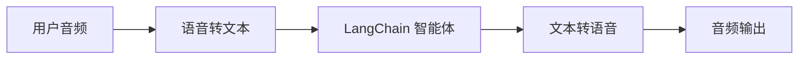
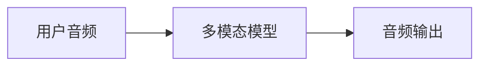

## 概述

聊天界面主导了我们与 AI 的交互方式，但最近多模态 AI 的突破正在开启令人兴奋的新可能性。高质量的生成模型和富有表现力的文本转语音（TTS）系统，现在使得构建感觉更像对话伙伴而非工具的智能体成为可能。

语音智能体就是其中一个例子。你不再需要依赖键盘和鼠标向智能体输入文字，而是可以使用口语与之交互。这是一种更自然、更具吸引力的 AI 交互方式，在某些场景下尤其有用。

### 什么是语音智能体？

语音智能体是能够与用户进行自然口语对话的[智能体](/oss/langchain/agents)。这些智能体结合了语音识别、自然语言处理、生成式 AI 和文本转语音技术，以创建无缝、自然的对话。

它们适用于多种用例，包括：

- 客户支持
- 个人助理
- 免提界面
- 辅导与培训

### 语音智能体如何工作？

从高层次来看，每个语音智能体都需要处理三个任务：

1.  **聆听** - 捕获音频并将其转录为文本
2.  **思考** - 解释意图、推理、规划
3.  **说话** - 生成音频并流式传输回用户

区别在于这些步骤如何排序和耦合。在实践中，生产级智能体遵循以下两种主要架构之一：

#### 1. STT > 智能体 > TTS 架构（"三明治"架构）

三明治架构由三个独立的组件组成：语音转文本（STT）、基于文本的 LangChain 智能体和文本转语音（TTS）。



**优点：**
- 完全控制每个组件（可根据需要更换 STT/TTS 提供商）
- 能够利用现代文本模态模型的最新能力
- 行为透明，组件间边界清晰

**缺点：**
- 需要协调多个服务
- 管理流水线增加了复杂性
- 从语音到文本的转换会丢失信息（例如，语调、情感）

#### 2. 语音到语音架构（S2S）

语音到语音架构使用多模态模型，该模型原生处理音频输入并生成音频输出。



**优点：**
- 架构更简单，组件更少
- 对于简单交互，通常延迟更低
- 直接音频处理能捕捉语音的语调和其他细微差别

**缺点：**
- 模型选择有限，供应商锁定的风险更大
- 功能可能落后于文本模态模型
- 音频处理过程透明度较低
- 可控制性和自定义选项减少

本指南演示了**三明治架构**，以在性能、可控性和现代模型能力访问之间取得平衡。使用某些 STT 和 TTS 提供商时，三明治架构可以实现低于 700 毫秒的延迟，同时保持对模块化组件的控制。

### 演示应用概述

我们将逐步构建一个使用三明治架构的基于语音的智能体。该智能体将管理一家三明治店的订单。该应用将演示三明治架构的所有三个组件，使用 [AssemblyAI](https://www.assemblyai.com/) 进行 STT，使用 [Cartesia](https://cartesia.ai/) 进行 TTS（尽管可以为大多数提供商构建适配器）。

一个端到端的参考应用可在 [voice-sandwich-demo](https://github.com/langchain-ai/voice-sandwich-demo) 仓库中找到。我们将在此处逐步讲解该应用。

该演示使用 WebSockets 实现浏览器和服务器之间的实时双向通信。相同的架构可以适配到其他传输方式，如电话系统（Twilio, Vonage）或 WebRTC 连接。

### 架构

该演示实现了一个流式处理流水线，其中每个阶段异步处理数据：

**客户端（浏览器）**
- 捕获麦克风音频并将其编码为 PCM
- 建立到后端服务器的 WebSocket 连接
- 实时将音频块流式传输到服务器
- 接收并播放合成的语音音频

**服务器（Node.js）**

- 接受来自客户端的 WebSocket 连接
- 协调三步流水线：
  - [语音转文本（STT）](#1-语音转文本)：将音频转发给 STT 提供商（例如 AssemblyAI），接收转录事件
  - [智能体](#2-langchain-智能体)：使用 LangChain 智能体处理转录文本，流式传输响应令牌
  - [文本转语音（TTS）](#3-文本转语音)：将智能体响应发送给 TTS 提供商（例如 Cartesia），接收音频块
- 将合成的音频返回给客户端进行播放

流水线使用异步迭代器来实现每个阶段的流式处理。这使得下游组件可以在上游阶段完成之前开始处理，从而最小化端到端延迟。

## 设置

有关详细的安装说明和设置，请参阅[仓库 README](https://github.com/langchain-ai/voice-sandwich-demo#readme)。

## 1. 语音转文本

STT 阶段将传入的音频流转换为文本转录。该实现使用生产者-消费者模式来并发处理音频流和转录接收。

### 关键概念

**生产者-消费者模式**：音频块被并发地发送到 STT 服务，同时接收转录事件。这使得转录可以在所有音频到达之前开始。

**事件类型**：
- `stt_chunk`：STT 服务处理音频时提供的部分转录文本
- `stt_output`：触发智能体处理的最终格式化转录文本

**WebSocket 连接**：维护与 AssemblyAI 实时 STT API 的持久连接，配置为 16kHz PCM 音频并启用自动轮次格式化。

### 实现

```typescript
import { AssemblyAISTT } from "./assemblyai";
import type { VoiceAgentEvent } from "./types";

async function* sttStream(
  audioStream: AsyncIterable<Uint8Array>
): AsyncGenerator<VoiceAgentEvent> {
  const stt = new AssemblyAISTT({ sampleRate: 16000 });
  const passthrough = writableIterator<VoiceAgentEvent>();

  // 生产者：将音频块泵送到 AssemblyAI
  const producer = (async () => {
    try {
      for await (const audioChunk of audioStream) {
        await stt.sendAudio(audioChunk);
      }
    } finally {
      await stt.close();
    }
  })();

  // 消费者：接收转录事件
  const consumer = (async () => {
    for await (const event of stt.receiveEvents()) {
      passthrough.push(event);
    }
  })();

  try {
    // 产出到达的事件
    yield* passthrough;
  } finally {
    // 等待生产者和消费者完成
    await Promise.all([producer, consumer]);
  }
}
```

该应用实现了一个 AssemblyAI 客户端来管理 WebSocket 连接和消息解析。实现见下文；可以为其他 STT 提供商构建类似的适配器。

:::: details AssemblyAI 客户端

```typescript
export class AssemblyAISTT {
  protected _bufferIterator = writableIterator<VoiceAgentEvent.STTEvent>();
  protected _connectionPromise: Promise<WebSocket> | null = null;

  async sendAudio(buffer: Uint8Array): Promise<void> {
    const conn = await this._connection;
    conn.send(buffer);
  }

  async *receiveEvents(): AsyncGenerator<VoiceAgentEvent.STTEvent> {
    yield* this._bufferIterator;
  }

  protected get _connection(): Promise<WebSocket> {
    if (this._connectionPromise) return this._connectionPromise;

    this._connectionPromise = new Promise((resolve, reject) => {
      const params = new URLSearchParams({
        sample_rate: this.sampleRate.toString(),
        format_turns: "true",
      });
      const url = `wss://streaming.assemblyai.com/v3/ws?${params}`;
      const ws = new WebSocket(url, {
        headers: { Authorization: this.apiKey },
      });

      ws.on("open", () => resolve(ws));

      ws.on("message", (data) => {
        const message = JSON.parse(data.toString());
        if (message.type === "Turn") {
          if (message.turn_is_formatted) {
            this._bufferIterator.push({
              type: "stt_output",
              transcript: message.transcript,
              ts: Date.now()
            });
          } else {
            this._bufferIterator.push({
              type: "stt_chunk",
              transcript: message.transcript,
              ts: Date.now()
            });
          }
        }
      });
    });

    return this._connectionPromise;
  }
}
```

::::

## 2. LangChain 智能体

智能体阶段通过 LangChain [智能体](/oss/langchain/agents)处理文本转录，并流式传输响应令牌。在本例中，我们流式传输智能体生成的所有[文本内容块](/oss/langchain/messages#textcontentblock)。

### 关键概念

**流式响应**：智能体使用 [`stream_mode="messages"`](/oss/langchain/streaming#llm-tokens) 在生成时发出响应令牌，而不是等待完整响应。这使得 TTS 阶段可以立即开始合成。

**对话记忆**：[检查点器](/oss/langchain/short-term-memory)使用唯一的线程 ID 在多个轮次中维护对话状态。这使得智能体能够引用对话中先前的交流。

### 实现

```typescript
import { createAgent } from "langchain";
import { HumanMessage } from "@langchain/core/messages";
import { MemorySaver } from "@langchain/langgraph";
import { tool } from "@langchain/core/tools";
import { z } from "zod";
import { v4 as uuidv4 } from "uuid";

// 定义智能体工具
const addToOrder = tool(
  async ({ item, quantity }) => {
    return `Added ${quantity} x ${item} to the order.`;
  },
  {
    name: "add_to_order",
    description: "Add an item to the customer's sandwich order.",
    schema: z.object({
      item: z.string(),
      quantity: z.number(),
    }),
  }
);

const confirmOrder = tool(
  async ({ orderSummary }) => {
    return `Order confirmed: ${orderSummary}. Sending to kitchen.`;
  },
  {
    name: "confirm_order",
    description: "Confirm the final order with the customer.",
    schema: z.object({
      orderSummary: z.string().describe("Summary of the order"),
    }),
  }
);

// 创建带有工具和记忆的智能体
const agent = createAgent({
  model: "claude-haiku-4-5",
  tools: [addToOrder, confirmOrder],
  checkpointer: new MemorySaver(),
  systemPrompt: `You are a helpful sandwich shop assistant.
Your goal is to take the user's order. Be concise and friendly.
Do NOT use emojis, special characters, or markdown.
Your responses will be read by a text-to-speech engine.`,
});

async function* agentStream(
  eventStream: AsyncIterable<VoiceAgentEvent>
): AsyncGenerator<VoiceAgentEvent> {
  // 为对话记忆生成唯一的线程 ID
  const threadId = uuidv4();

  for await (const event of eventStream) {
    // 传递所有上游事件
    yield event;

    // 通过智能体处理最终转录文本
    if (event.type === "stt_output") {
      const stream = await agent.stream(
        { messages: [new HumanMessage(event.transcript)] },
        {
          configurable: { thread_id: threadId },
          streamMode: "messages",
        }
      );

      // 产出到达的智能体响应块
      for await (const [message] of stream) {
        yield { type: "agent_chunk", text: message.text, ts: Date.now() };
      }
    }
  }
}
```

## 3. 文本转语音

TTS 阶段将智能体响应文本合成为音频，并将其流式传输回客户端。与 STT 阶段类似，它使用生产者-消费者模式来处理并发的文本发送和音频接收。

### 关键概念

**并发处理**：该实现合并了两个异步流：
- **上游处理**：传递所有事件并将智能体文本块发送给 TTS 提供商
- **音频接收**：从 TTS 提供商接收合成的音频块

**流式 TTS**：一些提供商（例如 [Cartesia](https://cartesia.ai/)）在收到文本后立即开始合成音频，使得音频播放可以在智能体完成生成完整响应之前开始。

**事件透传**：所有上游事件都保持不变地流过，允许客户端或其他观察者跟踪整个流水线的状态。

### 实现

:::python

```python
from cartesia_tts import CartesiaTTS
from utils import merge_async_iters

async def tts_stream(
event_stream: AsyncIterator[VoiceAgentEvent],
) -> AsyncIterator[VoiceAgentEvent]:
"""
转换流：语音事件 → 语音事件（包含音频）

合并两个并发流：
    1. process_upstream(): 传递事件并将文本发送到 Cartesia
    2. tts.receive_events(): 产出来自 Cartesia 的音频块
"""
