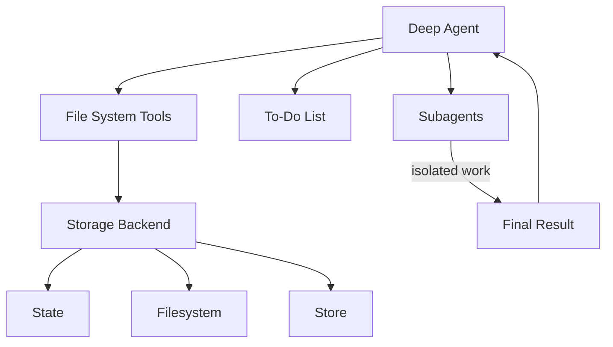

我们将 `deepagents` 视为一个["智能体工具套"](https://blog.langchain.com/agent-frameworks-runtimes-and-harnesses-oh-my/)。它与其他智能体框架拥有相同的核心工具调用循环，但内置了工具和功能。

本页面列出了构成智能体工具套的各个组件。

## 文件系统访问

该工具套提供了六个用于文件系统操作的工具，使文件成为智能体环境中的一等公民：

| 工具 | 描述 |
|---|---|
| `ls` | 列出目录中的文件及其元数据（大小、修改时间） |
| `read_file` | 读取文件内容并显示行号，支持对大文件进行偏移/限制读取 |
| `write_file` | 创建新文件 |
| `edit_file` | 在文件中执行精确的字符串替换（支持全局替换模式） |
| `glob` | 查找匹配模式的文件（例如，`**/*.py`） |
| `grep` | 搜索文件内容，支持多种输出模式（仅文件、带上下文的内容或计数） |

## 大型工具结果逐出

[`FilesystemMiddleware`](/oss/python/deepagents/middleware) 会在工具调用结果超过令牌阈值时，自动将其逐出到文件系统，从而防止上下文窗口饱和。

**工作原理：**

- 监控工具调用结果的大小（默认阈值：20,000 个令牌，可通过 `tool_token_limit_before_evict` 配置）
- 当超过阈值时，使用配置的后端将结果写入文件
- 将工具结果替换为截断的预览和文件引用
- 智能体可以根据需要从文件系统读取完整结果

## 可插拔存储后端

该工具套将文件系统操作抽象在一个协议之后，允许针对不同的用例采用不同的存储策略。

**可用后端：**

1.  **`StateBackend`** - 临时内存存储
    - 文件存在于智能体的状态中（随对话一起检查点保存）
    - 在单个线程内持久化，但跨线程不持久化
    - 适用于临时工作文件

2.  **`FilesystemBackend`** - 真实的文件系统访问
    - 从实际磁盘读写
    - 支持虚拟模式（沙盒化到根目录）
    - 与系统工具集成（使用 ripgrep 进行 grep 搜索）
    - 安全特性：路径验证、大小限制、符号链接预防

3.  **`StoreBackend`** - 跨对话的持久化存储
    - 使用 LangGraph 的 BaseStore 实现持久性
    - 按 `assistant_id` 进行命名空间隔离
    - 文件在多个对话间持久保存
    - 适用于长期记忆或知识库

4.  **`CompositeBackend`** - 将不同路径路由到不同的后端
    - 示例：`/` → StateBackend，`/memories/` → StoreBackend
    - 使用最长前缀匹配进行路由
    - 支持混合存储策略

有关配置详情和示例，请参阅[后端](/oss/python/deepagents/backends)。

## 任务委派（子智能体）

该工具套允许主智能体创建临时的"子智能体"来处理隔离的多步骤任务。

**其优势在于：**
- **上下文隔离** - 子智能体的工作不会干扰主智能体的上下文
- **并行执行** - 多个子智能体可以并发运行
- **专业化** - 子智能体可以拥有不同的工具/配置
- **令牌效率** - 大型子任务的上下文被压缩为单个结果

**工作原理：**
- 主智能体拥有一个 `task` 工具
- 调用时，会创建一个拥有自己上下文的全新智能体实例
- 子智能体自主执行直至任务完成
- 向主智能体返回一份最终报告
- 子智能体是无状态的（无法发送多条消息）

**默认子智能体：**
- 自动提供一个"通用"子智能体
- 默认拥有文件系统工具
- 可以通过额外的工具/中间件进行自定义

**自定义子智能体：**
- 定义具有特定工具的专用子智能体
- 示例：代码审查员、网络研究员、测试运行器
- 通过 `subagents` 参数进行配置

## 对话历史摘要

当令牌使用量过大时，该框架会自动压缩旧的对话历史。

**配置：**
- 在其[模型配置文件](/oss/python/langchain/models#model-profiles)中，当达到模型 `max_input_tokens` 的 85% 时触发
- 保留 10% 的令牌作为近期上下文
- 如果模型配置文件不可用，则回退到 170,000 个令牌触发 / 保留 6 条消息
- 较早的消息由模型进行摘要

**其作用：**
- 支持进行非常长的对话而不会触及上下文限制
- 在压缩久远历史的同时保留近期上下文
- 对智能体透明（显示为特殊的系统消息）

## 悬空工具调用修复

当工具调用在收到结果之前被中断或取消时，该框架会修复消息历史。

**问题：**
- 智能体请求工具调用："请运行 X"
- 工具调用被中断（用户取消、错误等）
- 智能体在 `AIMessage` 中看到 `tool_call`，但没有相应的 `ToolMessage`
- 这会产生无效的消息序列

**解决方案：**
- 检测带有 `tool_calls` 但没有结果的 `AIMessage` 对象
- 创建合成的 `ToolMessage` 响应，指示调用已被取消
- 在智能体执行前修复消息历史

**其作用：**
- 防止智能体因不完整的消息链而产生混淆
- 优雅地处理中断和错误
- 保持对话连贯性

## 待办事项列表跟踪

该框架提供了一个 `write_todos` 工具，智能体可以用它来维护结构化的任务列表。

**功能：**
- 跟踪具有状态（`'pending'`、`'in_progress'`、`'completed'`）的多个任务
- 持久化存储在智能体状态中
- 帮助智能体组织复杂的多步骤工作
- 对长时间运行的任务和规划很有用

## 人机协同

该框架可以在指定的工具调用处暂停智能体执行，以允许人工批准或修改。此功能通过 `interrupt_on` 参数选择启用。

**配置：**
- 将 `interrupt_on` 传递给 `create_deep_agent`，并附带一个工具名称到中断配置的映射
- 示例：`interrupt_on={"edit_file": True}` 在每次编辑前暂停
- 可以提供批准消息或修改工具输入

**其作用：**
- 为破坏性操作提供安全门
- 在昂贵的 API 调用前进行用户验证
- 交互式调试和指导

## 提示缓存（Anthropic）

该框架启用了 Anthropic 的提示缓存功能，以减少冗余的令牌处理。

**工作原理：**
- 缓存跨轮次重复的提示部分
- 显著降低长系统提示的延迟和成本
- 对于非 Anthropic 模型自动跳过

**其作用：**
- 系统提示（尤其是带有文件系统文档的）可能超过 5k 个令牌
- 如果没有缓存，这些提示每轮都会重复
- 缓存提供约 10 倍的速度提升和成本降低
