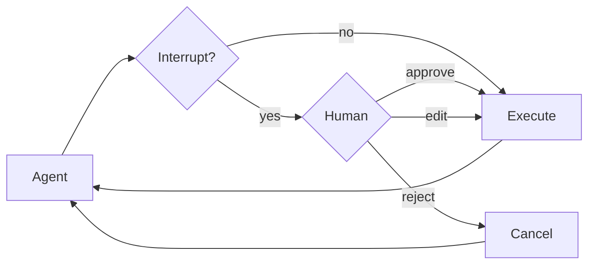

某些工具操作可能较为敏感，需要在执行前获得人工批准。Deep agents 通过 LangGraph 的中断功能支持人机协同工作流。您可以使用 `interrupt_on` 参数来配置哪些工具需要批准。



## 基本配置

`interrupt_on` 参数接受一个字典，将工具名称映射到中断配置。每个工具可以配置为：

- **`True`**：启用中断，使用默认行为（允许批准、编辑、拒绝）
- **`False`**：禁用此工具的中断
- **`{"allowed_decisions": [...]}`**：自定义配置，指定允许的决策

```python
from langchain.tools import tool
from deepagents import create_deep_agent
from langgraph.checkpoint.memory import MemorySaver

@tool
def delete_file(path: str) -> str:
    """Delete a file from the filesystem."""
    return f"Deleted {path}"

@tool
def read_file(path: str) -> str:
    """Read a file from the filesystem."""
    return f"Contents of {path}"

@tool
def send_email(to: str, subject: str, body: str) -> str:
    """Send an email."""
    return f"Sent email to {to}"

# Checkpointer is REQUIRED for human-in-the-loop
checkpointer = MemorySaver()

agent = create_deep_agent(
    model="claude-sonnet-4-5-20250929",
    tools=[delete_file, read_file, send_email],
    interrupt_on={
        "delete_file": True,  # Default: approve, edit, reject
        "read_file": False,   # No interrupts needed
        "send_email": {"allowed_decisions": ["approve", "reject"]},  # No editing
    },
    checkpointer=checkpointer  # Required!
)
```

## 决策类型

`allowed_decisions` 列表控制在审查工具调用时，人工可以采取哪些操作：

- **`"approve"`**：使用代理提出的原始参数执行工具
- **`"edit"`**：在执行前修改工具参数
- **`"reject"`**：完全跳过执行此工具调用

您可以为每个工具自定义可用的决策：

```python
interrupt_on = {
    # Sensitive operations: allow all options
    "delete_file": {"allowed_decisions": ["approve", "edit", "reject"]},

    # Moderate risk: approval or rejection only
    "write_file": {"allowed_decisions": ["approve", "reject"]},

    # Must approve (no rejection allowed)
    "critical_operation": {"allowed_decisions": ["approve"]},
}
```

## 处理中断

当中断被触发时，代理会暂停执行并返回控制权。检查结果中是否有中断，并相应处理。

```python
import uuid
from langgraph.types import Command

# Create config with thread_id for state persistence
config = {"configurable": {"thread_id": str(uuid.uuid4())}}

# Invoke the agent
result = agent.invoke({
    "messages": [{"role": "user", "content": "Delete the file temp.txt"}]
}, config=config)

# Check if execution was interrupted
if result.get("__interrupt__"):
    # Extract interrupt information
    interrupts = result["__interrupt__"][0].value
    action_requests = interrupts["action_requests"]
    review_configs = interrupts["review_configs"]

    # Create a lookup map from tool name to review config
    config_map = {cfg["action_name"]: cfg for cfg in review_configs}

    # Display the pending actions to the user
    for action in action_requests:
        review_config = config_map[action["name"]]
        print(f"Tool: {action['name']}")
        print(f"Arguments: {action['args']}")
        print(f"Allowed decisions: {review_config['allowed_decisions']}")

    # Get user decisions (one per action_request, in order)
    decisions = [
        {"type": "approve"}  # User approved the deletion
    ]

    # Resume execution with decisions
    result = agent.invoke(
        Command(resume={"decisions": decisions}),
        config=config  # Must use the same config!
    )

# Process final result
print(result["messages"][-1].content)
```

## 多个工具调用

当代理调用多个需要批准的工具时，所有中断会批量处理在一个单一的中断中。您必须按顺序为每个中断提供决策。

```python
config = {"configurable": {"thread_id": str(uuid.uuid4())}}

result = agent.invoke({
    "messages": [{
        "role": "user",
        "content": "Delete temp.txt and send an email to admin@example.com"
    }]
}, config=config)

if result.get("__interrupt__"):
    interrupts = result["__interrupt__"][0].value
    action_requests = interrupts["action_requests"]

    # Two tools need approval
    assert len(action_requests) == 2

    # Provide decisions in the same order as action_requests
    decisions = [
        {"type": "approve"},  # First tool: delete_file
        {"type": "reject"}    # Second tool: send_email
    ]

    result = agent.invoke(
        Command(resume={"decisions": decisions}),
        config=config
    )
```

## 编辑工具参数

当 `"edit"` 在允许的决策中时，您可以在执行前修改工具参数：

```python
if result.get("__interrupt__"):
    interrupts = result["__interrupt__"][0].value
    action_request = interrupts["action_requests"][0]

    # Original args from the agent
    print(action_request["args"])  # {"to": "everyone@company.com", ...}

    # User decides to edit the recipient
    decisions = [{
        "type": "edit",
        "edited_action": {
            "name": action_request["name"],  # Must include the tool name
            "args": {"to": "team@company.com", "subject": "...", "body": "..."}
        }
    }]

    result = agent.invoke(
        Command(resume={"decisions": decisions}),
        config=config
    )
```

## 子代理中断

每个子代理都可以有自己的 `interrupt_on` 配置，这会覆盖主代理的设置：

```python
agent = create_deep_agent(
    tools=[delete_file, read_file],
    interrupt_on={
        "delete_file": True,
        "read_file": False,
    },
    subagents=[{
        "name": "file-manager",
        "description": "Manages file operations",
        "system_prompt": "You are a file management assistant.",
        "tools": [delete_file, read_file],
        "interrupt_on": {
            # Override: require approval for reads in this subagent
            "delete_file": True,
            "read_file": True,  # Different from main agent!
        }
    }],
    checkpointer=checkpointer
)
```

当子代理触发中断时，处理方式是相同的——检查 `__interrupt__` 并使用 `Command` 恢复。

## 最佳实践

### 始终使用检查点

人机协同需要一个检查点来在中断和恢复之间持久化代理状态：

```python
from langgraph.checkpoint.memory import MemorySaver

checkpointer = MemorySaver()
agent = create_deep_agent(
    tools=[...],
    interrupt_on={...},
    checkpointer=checkpointer  # Required for HITL
)
```

### 使用相同的线程 ID

恢复时，必须使用具有相同 `thread_id` 的相同配置：

```python
# First call
config = {"configurable": {"thread_id": "my-thread"}}
result = agent.invoke(input, config=config)

# Resume (use same config)
result = agent.invoke(Command(resume={...}), config=config)
```

### 决策顺序与操作匹配

决策列表必须与 `action_requests` 的顺序匹配：

```python
if result.get("__interrupt__"):
    interrupts = result["__interrupt__"][0].value
    action_requests = interrupts["action_requests"]

    # Create one decision per action, in order
    decisions = []
    for action in action_requests:
        decision = get_user_decision(action)  # Your logic
        decisions.append(decision)

    result = agent.invoke(
        Command(resume={"decisions": decisions}),
        config=config
    )
```

### 根据风险定制配置

根据工具的风险级别配置不同的中断设置：

```python
interrupt_on = {
    # High risk: full control (approve, edit, reject)
    "delete_file": {"allowed_decisions": ["approve", "edit", "reject"]},
    "send_email": {"allowed_decisions": ["approve", "edit", "reject"]},

    # Medium risk: no editing allowed
    "write_file": {"allowed_decisions": ["approve", "reject"]},

    # Low risk: no interrupts
    "read_file": False,
    "list_files": False,
}
```

