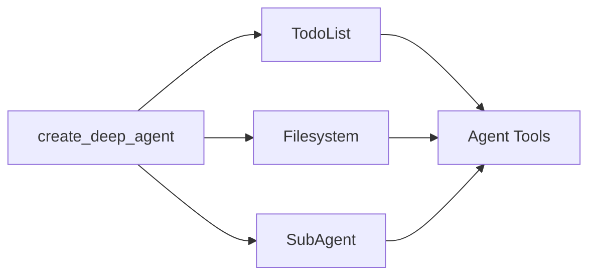

深度智能体（Deep Agent）采用模块化的中间件架构构建。深度智能体具备以下能力：

1. 规划工具
2. 用于存储上下文和长期记忆的文件系统
3. 生成子智能体（subagent）的能力

每个功能都作为独立的中间件实现。当你使用 `create_deep_agent` 创建深度智能体时，我们会自动为你的智能体附加 `TodoListMiddleware`、`FilesystemMiddleware` 和 `SubAgentMiddleware`。



中间件是可组合的——你可以根据需要为智能体添加任意数量的中间件。你也可以独立使用任何中间件。

以下部分将解释每个中间件提供的功能。

## 待办事项列表中间件

规划是解决复杂问题的关键。如果你最近使用过 Claude Code，你会注意到它在处理复杂的多部分任务之前，会先写下一个待办事项列表。你还会注意到，随着更多信息的输入，它能够动态地调整和更新这个待办事项列表。

`TodoListMiddleware` 为你的智能体提供了一个专门用于更新此待办事项列表的工具。在执行多部分任务之前和执行过程中，系统会提示智能体使用 `write_todos` 工具来跟踪它正在做什么以及还需要做什么。

```python
from langchain.agents import create_agent
from langchain.agents.middleware import TodoListMiddleware

# TodoListMiddleware 默认包含在 create_deep_agent 中
# 如果你在构建自定义智能体，可以对其进行定制
agent = create_agent(
    model="claude-sonnet-4-5-20250929",
    # 可以通过中间件添加自定义规划指令
    middleware=[
        TodoListMiddleware(
            system_prompt="Use the write_todos tool to..."  # 可选：对系统提示的自定义补充
        ),
    ],
)
```

## 文件系统中间件

上下文工程是构建高效智能体的主要挑战。当使用返回可变长度结果的工具时（例如 `web_search` 和 RAG），这一点尤其困难，因为冗长的工具结果会迅速填满你的上下文窗口。

`FilesystemMiddleware` 提供了四个工具，用于与短期和长期记忆进行交互：

- `ls`：列出文件系统中的文件
- `read_file`：读取整个文件或文件的特定行数
- `write_file`：向文件系统写入新文件
- `edit_file`：编辑文件系统中的现有文件

```python
from langchain.agents import create_agent
from deepagents.middleware.filesystem import FilesystemMiddleware

# FilesystemMiddleware 默认包含在 create_deep_agent 中
# 如果你在构建自定义智能体，可以对其进行定制
agent = create_agent(
    model="claude-sonnet-4-5-20250929",
    middleware=[
        FilesystemMiddleware(
            backend=None,  # 可选：自定义后端（默认为 StateBackend）
            system_prompt="Write to the filesystem when...",  # 可选的系统提示自定义补充
            custom_tool_descriptions={
                "ls": "Use the ls tool when...",
                "read_file": "Use the read_file tool to..."
            }  # 可选：文件系统工具的自定义描述
        ),
    ],
)
```

除了任何用户定义的子智能体外，主智能体始终可以访问一个 `general-purpose`（通用）子智能体。该子智能体具有与主智能体相同的指令和所有可访问的工具。`general-purpose` 子智能体的主要目的是上下文隔离——主智能体可以将复杂的任务委托给该子智能体，并获得简洁的答案，而不会因中间工具调用而产生冗余信息。
