## 概述

向量存储（vector store）用于存储[嵌入](/oss/python/integrations/text_embedding)数据并执行相似性搜索。

```mermaid
flowchart LR

    subgraph "📥 索引阶段（存储）"
        A[📄 文档] --> B[🔢 嵌入模型]
        B --> C[🔘 嵌入向量]
        C --> D[(向量存储)]
    end

    subgraph "📤 查询阶段（检索）"
        E[❓ 查询文本] --> F[🔢 嵌入模型]
        F --> G[🔘 查询向量]
        G --> H[🔍 相似性搜索]
        H --> D
        D --> I[📄 Top-k 结果]
    end
```



### 接口

LangChain 为向量存储提供了统一的接口，允许您：

- `add_documents` - 向存储中添加文档。
- `delete` - 根据 ID 删除存储的文档。
- `similarity_search` - 查询语义相似的文档。

这种抽象让您可以在不同的实现之间切换，而无需更改应用程序逻辑。

### 初始化

要初始化一个向量存储，需要为其提供一个嵌入模型：

```python
from langchain_core.vectorstores import InMemoryVectorStore
vector_store = InMemoryVectorStore(embedding=SomeEmbeddingModel())
```

### 添加文档

添加 <a href="https://reference.langchain.com/python/langchain_core/documents/#langchain_core.documents.base.Document" target="_blank" rel="noreferrer" class="link"><code>Document</code></a> 对象（包含 `page_content` 和可选的元数据）的方法如下：

```python
vector_store.add_documents(documents=[doc1, doc2], ids=["id1", "id2"])
```

### 删除文档

通过指定 ID 进行删除：

```python
vector_store.delete(ids=["id1"])
```

### 相似性搜索

使用 `similarity_search` 发出语义查询，它将返回最接近的嵌入文档：

```python
similar_docs = vector_store.similarity_search("your query here")
```

许多向量存储支持以下参数：

* `k` — 要返回的结果数量
* `filter` — 基于元数据的条件过滤

### 相似性度量与索引

嵌入相似性可以使用以下方法计算：

* **余弦相似度（Cosine similarity）**
* **欧几里得距离（Euclidean distance）**
* **点积（Dot product）**

高效的搜索通常使用索引方法，例如 HNSW（分层可导航小世界），但具体细节取决于向量存储。

### 元数据过滤

通过元数据（例如来源、日期）进行过滤可以优化搜索结果：

```python
vector_store.similarity_search(
  "query",
  k=3,
  filter={"source": "tweets"}
)
```

<important>
基于元数据的过滤支持因实现而异。
请查阅您所选向量存储的文档以获取详细信息。
</important>

## 主要集成

**选择嵌入模型：**

:::: details OpenAI

::: code-group

```bash [pip]
pip install -qU langchain-openai
```

```bash [uv]
uv add langchain-openai
```

:::

```python
import getpass
import os

if not os.environ.get("OPENAI_API_KEY"):
  os.environ["OPENAI_API_KEY"] = getpass.getpass("Enter API key for OpenAI: ")

from langchain_openai import OpenAIEmbeddings

embeddings = OpenAIEmbeddings(model="text-embedding-3-large")
```

::::

:::: details Azure

```bash
pip install -qU langchain-azure-ai
```

```python
import getpass
import os

if not os.environ.get("AZURE_OPENAI_API_KEY"):
  os.environ["AZURE_OPENAI_API_KEY"] = getpass.getpass("Enter API key for Azure: ")

from langchain_openai import AzureOpenAIEmbeddings

embeddings = AzureOpenAIEmbeddings(
    azure_endpoint=os.environ["AZURE_OPENAI_ENDPOINT"],
    azure_deployment=os.environ["AZURE_OPENAI_DEPLOYMENT_NAME"],
    openai_api_version=os.environ["AZURE_OPENAI_API_VERSION"],
)
```

::::

:::: details Google Gemini

```bash
pip install -qU langchain-google-genai
```

```python
import getpass
import os

if not os.environ.get("GOOGLE_API_KEY"):
  os.environ["GOOGLE_API_KEY"] = getpass.getpass("Enter API key for Google Gemini: ")

from langchain_google_genai import GoogleGenerativeAIEmbeddings

embeddings = GoogleGenerativeAIEmbeddings(model="models/gemini-embedding-001")
```

::::

:::: details Google Vertex

```bash
pip install -qU langchain-google-vertexai
```

```python
from langchain_google_vertexai import VertexAIEmbeddings

embeddings = VertexAIEmbeddings(model="text-embedding-005")
```

::::

:::: details AWS

```bash
pip install -qU langchain-aws
```

```python
from langchain_aws import BedrockEmbeddings

embeddings = BedrockEmbeddings(model_id="amazon.titan-embed-text-v2:0")
```

::::

:::: details HuggingFace

```bash
pip install -qU langchain-huggingface
```

```python
from langchain_huggingface import HuggingFaceEmbeddings

embeddings = HuggingFaceEmbeddings(model_name="sentence-transformers/all-mpnet-base-v2")
```

::::

:::: details Ollama

```bash
pip install -qU langchain-ollama
```

```python
from langchain_ollama import OllamaEmbeddings

embeddings = OllamaEmbeddings(model="llama3")
```

::::

:::: details Cohere

```bash
pip install -qU langchain-cohere
```

```python
import getpass
import os

if not os.environ.get("COHERE_API_KEY"):
  os.environ["COHERE_API_KEY"] = getpass.getpass("Enter API key for Cohere: ")

from langchain_cohere import CohereEmbeddings

embeddings = CohereEmbeddings(model="embed-english-v3.0")
```

::::

:::: details Mistral AI

```bash
pip install -qU langchain-mistralai
```

```python
import getpass
import os

if not os.environ.get("MISTRALAI_API_KEY"):
  os.environ["MISTRALAI_API_KEY"] = getpass.getpass("Enter API key for MistralAI: ")

from langchain_mistralai import MistralAIEmbeddings

embeddings = MistralAIEmbeddings(model="mistral-embed")
```

::::

:::: details Nomic

```bash
pip install -qU langchain-nomic
```

```python
import getpass
import os

if not os.environ.get("NOMIC_API_KEY"):
  os.environ["NOMIC_API_KEY"] = getpass.getpass("Enter API key for Nomic: ")

from langchain_nomic import NomicEmbeddings

embeddings = NomicEmbeddings(model="nomic-embed-text-v1.5")
```

::::

:::: details NVIDIA

```bash
pip install -qU langchain-nvidia-ai-endpoints
```

```python
import getpass
import os

if not os.environ.get("NVIDIA_API_KEY"):
  os.environ["NVIDIA_API_KEY"] = getpass.getpass("Enter API key for NVIDIA: ")

from langchain_nvidia_ai_endpoints import NVIDIAEmbeddings

embeddings = NVIDIAEmbeddings(model="NV-Embed-QA")
```

::::

:::: details Voyage AI

```bash
pip install -qU langchain-voyageai
```

```python
import getpass
import os

if not os.environ.get("VOYAGE_API_KEY"):
  os.environ["VOYAGE_API_KEY"] = getpass.getpass("Enter API key for Voyage AI: ")

from langchain-voyageai import VoyageAIEmbeddings

embeddings = VoyageAIEmbeddings(model="voyage-3")
```

::::

:::: details IBM watsonx

```bash
pip install -qU langchain-ibm
```

```python
import getpass
import os

if not os.environ.get("WATSONX_APIKEY"):
  os.environ["WATSONX_APIKEY"] = getpass.getpass("Enter API key for IBM watsonx: ")

from langchain_ibm import WatsonxEmbeddings

embeddings = WatsonxEmbeddings(
    model_id="ibm/slate-125m-english-rtrvr",
    url="https://us-south.ml.cloud.ibm.com",
    project_id="<WATSONX PROJECT_ID>",
)
```

::::

:::: details Fake

```bash
pip install -qU langchain-core
```

```python
from langchain_core.embeddings import DeterministicFakeEmbedding

embeddings = DeterministicFakeEmbedding(size=4096)
```

::::

:::: details xAI

```bash
pip install -qU langchain-xai
```

```python
import getpass
import os

if not os.environ.get("XAI_API_KEY"):
  os.environ["XAI_API_KEY"] = getpass.getpass("Enter API key for xAI: ")

from langchain.chat_models import init_chat_model

model = init_chat_model("grok-2", model_provider="xai")
```

::::

:::: details Perplexity

```bash
pip install -qU langchain-perplexity
```

```python
import getpass
import os

if not os.environ.get("PPLX_API_KEY"):
  os.environ["PPLX_API_KEY"] = getpass.getpass("Enter API key for Perplexity: ")

from langchain.chat_models import init_chat_model

model = init_chat_model("llama-3.1-sonar-small-128k-online", model_provider="perplexity")
```

::::

:::: details DeepSeek

```bash
pip install -qU langchain-deepseek
```

```python
import getpass
import os

if not os.environ.get("DEEPSEEK_API_KEY"):
  os.environ["DEEPSEEK_API_KEY"] = getpass.getpass("Enter API key for DeepSeek: ")

from langchain.chat_models import init_chat_model

model = init_chat_model("deepseek-chat", model_provider="deepseek")
```

::::

**选择向量存储：**

:::: details 内存存储

::: code-group

```bash [pip]
pip install -qU langchain-core
```

```bash [uv]
uv add langchain-core
```

:::

```python
from langchain_core.vectorstores import InMemoryVectorStore

vector_store = InMemoryVectorStore(embeddings)
```

::::

:::: details Amazon OpenSearch

```bash [pip]
pip install -qU boto3
```

```python
from opensearchpy import RequestsHttpConnection

service = "es"  # must set the service as 'es'
region = "us-east-2"
credentials = boto3.Session(
    aws_access_key_id="xxxxxx", aws_secret_access_key="xxxxx"
).get_credentials()
awsauth = AWS4Auth("xxxxx", "xxxxxx", region, service, session_token=credentials.token)

vector_store = OpenSearchVectorSearch.from_documents(
    docs,
    embeddings,
    opensearch_url="host url",
    http_auth=awsauth,
    timeout=300,
    use_ssl=True,
    verify_certs=True,
    connection_class=RequestsHttpConnection,
    index_name="test-index",
)
```

::::

:::: details Astra DB

::: code-group

```bash [pip]
pip install -qU langchain-astradb
```

```bash [uv]
uv add langchain-astradb
```

:::

```python
from langchain_astradb import AstraDBVectorStore

vector_store = AstraDBVectorStore(
    embedding=embeddings,
    api_endpoint=ASTRA_DB_API_ENDPOINT,
    collection_name="astra_vector_langchain",
    token=ASTRA_DB_APPLICATION_TOKEN,
    namespace=ASTRA_DB_NAMESPACE,
)
```

::::

:::: details Azure Cosmos DB NoSQL

::: code-group

```bash [pip]
pip install -qU langchain-azure-ai azure-cosmos
```

```bash [uv]
uv add langchain-azure-ai
```

:::

```python
from langchain_azure_ai.vectorstores.azure_cosmos_db_no_sql import (
    AzureCosmosDBNoSqlVectorSearch,
)
vector_search = AzureCosmosDBNoSqlVectorSearch.from_documents(
    documents=docs,
    embedding=openai_embeddings,
    cosmos_client=cosmos_client,
    database_name=database_name,
    container_name=container_name,
    vector_embedding_policy=vector_embedding_policy,
    full_text_policy=full_text_policy,
    indexing_policy=indexing_policy,
    cosmos_container_properties=cosmos_container_properties,
    cosmos_database_properties={},
    full_text_search_enabled=True,
)
```

::::

:::: details Azure Cosmos DB Mongo vCore

::: code-group

```bash [pip]
pip install -qU langchain-azure-ai pymongo
```

```bash [uv]
uv add pymongo
```

:::

```python
from langchain_azure_ai.vectorstores.azure_cosmos_db_mongo_vcore import (
    AzureCosmosDBMongoVCoreVectorSearch,
)

vectorstore = AzureCosmosDBMongoVCoreVectorSearch.from_documents(
    docs,
    openai_embeddings,
    collection=collection,
    index_name=INDEX_NAME,
)
```

::::

:::: details Chroma

::: code-group

```bash [pip]
pip install -qU langchain-chroma
```

```bash [uv]
uv add langchain-chroma
```

:::

```python
from langchain_chroma import Chroma

vector_store = Chroma(
    collection_name="example_collection",
    embedding_function=embeddings,
    persist_directory="./chroma_langchain_db",  # Where to save data locally, remove if not necessary
)
```

::::

:::: details FAISS

```bash
pip install -qU langchain-community
```

```python
import faiss
from langchain_community.docstore.in_memory import InMemoryDocstore
from langchain_community.vectorstores import FAISS

embedding_dim = len(embeddings.embed_query("hello world"))
index = faiss.IndexFlatL2(embedding_dim)

vector_store = FAISS(
    embedding_function=embeddings,
    index=index,
    docstore=InMemoryDocstore(),
    index_to_docstore_id={},
)
```

::::

:::: details Milvus

::: code-group

```bash [pip]
pip install -qU langchain-milvus
```

```bash [uv]
uv add langchain-milvus
```

:::

```python
from langchain_milvus import Milvus

URI = "./milvus_example.db"

vector_store = Milvus(
    embedding_function=embeddings,
    connection_args={"uri": URI},
    index_params={"index_type": "FLAT", "metric_type": "L2"},
)
```

::::

:::: details MongoDB

```bash
pip install -qU langchain-mongodb
```

```python
from langchain_mongodb import MongoDBAtlasVectorSearch

vector_store = MongoDBAtlasVectorSearch(
    embedding=embeddings,
    collection=MONGODB_COLLECTION,
    index_name=ATLAS_VECTOR_SEARCH_INDEX_NAME,
    relevance_score_fn="cosine",
)
```

::::

:::: details PGVector

::: code-group

```bash [pip]
pip install -qU langchain-postgres
```

```bash [uv]
uv add langchain-postgres
```

:::

```python
from langchain_postgres import PGVector

vector_store = PGVector(
    embeddings=embeddings,
    collection_name="my_docs",
    connection="postgresql+psycopg://..."
)
```

::::

:::: details PGVectorStore

::: code-group

```bash [pip]
pip install -qU langchain-postgres
```

```bash [uv]
uv add langchain-postgres
```

:::

```python
from langchain_postgres import PGEngine, PGVectorStore

$engine = PGEngine.from_connection_string(
    url="postgresql+psycopg://..."
)

vector_store = PGVectorStore.create_sync(
    engine=pg_engine,
    table_name='test_table',
    embedding_service=embedding
)
```

::::

:::: details Pinecone

::: code-group

```bash [pip]
pip install -qU langchain-pinecone
```

```bash [uv]
uv add langchain-pinecone
```

:::

```python
from langchain_pinecone import PineconeVectorStore
from pinecone import Pinecone

pc = Pinecone(api_key=...)
index = pc.Index(index_name)

vector_store = PineconeVectorStore(embedding=embeddings, index=index)
```

::::

::: code-group

```bash [pip]
pip install -qU langchain-qdrant
```

```bash [uv]
uv add langchain-qdrant
```

:::

```python
from qdrant_client.models import Distance, VectorParams
from langchain_qdrant import QdrantVectorStore
from qdrant_client import QdrantClient

client = QdrantClient(":memory:")

vector_size = len(embeddings.embed_query("sample text"))

if not client.collection_exists("test"):
client.create_collection(
collection
