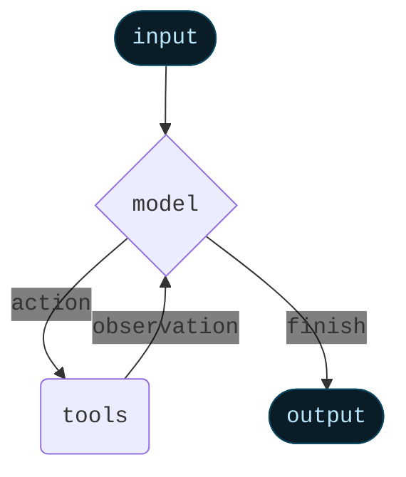

智能体（Agents）将语言模型与[工具](/oss/python/langchain/tools)相结合，构建出能够推理任务、决定使用哪些工具，并迭代式地寻找解决方案的系统。

<a href="https://reference.langchain.com/python/langchain/agents/#langchain.agents.create_agent" target="_blank" rel="noreferrer" class="link"><code>create_agent</code></a> 提供了一个可用于生产环境的智能体实现。

[LLM 智能体通过循环运行工具来实现目标](https://simonwillison.net/2025/Sep/18/agents/)。
智能体会持续运行，直到满足停止条件——即模型产生最终输出或达到迭代限制。



<Info>

<a href="https://reference.langchain.com/python/langchain/agents/#langchain.agents.create_agent" target="_blank" rel="noreferrer" class="link"><code>create_agent</code></a> 使用 [LangGraph](/oss/python/langgraph/overview) 构建一个基于<strong>图</strong>的智能体运行时。图由节点（步骤）和边（连接）组成，定义了智能体处理信息的方式。智能体在这个图中移动，执行诸如模型节点（调用模型）、工具节点（执行工具）或中间件等节点。

了解更多关于 [Graph API](/oss/python/langgraph/graph-api) 的信息。

</Info>

## 核心组件

### 模型

[模型](/oss/python/langchain/models) 是智能体的推理引擎。可以通过多种方式指定，支持静态和动态模型选择。

#### 静态模型

静态模型在创建智能体时配置一次，并在整个执行过程中保持不变。这是最常见且最直接的方法。

要从 <Tooltip tip="遵循 `provider:model` 格式的字符串（例如 openai:gpt-5）" cta="查看映射" href="https://reference.langchain.com/python/langchain/models/#langchain.chat_models.init_chat_model(model)">模型标识符字符串</Tooltip> 初始化静态模型：

```python [wrap]
from langchain.agents import create_agent

agent = create_agent("openai:gpt-5", tools=tools)
```

<Tip>

模型标识符字符串支持自动推断（例如，`"gpt-5"` 将被推断为 `"openai:gpt-5"`）。请参阅 <a href="https://reference.langchain.com/python/langchain/models/#langchain.chat_models.init_chat_model(model)" target="_blank" rel="noreferrer" class="link">reference</a> 以查看完整的模型标识符字符串映射列表。

</Tip>

为了更精细地控制模型配置，可以直接使用提供者包初始化模型实例。在此示例中，我们使用 <a href="https://reference.langchain.com/python/integrations/langchain_openai/ChatOpenAI" target="_blank" rel="noreferrer" class="link"><code>ChatOpenAI</code></a>。有关其他可用的聊天模型类，请参阅 [聊天模型](/oss/python/integrations/chat)。

```python [wrap]
from langchain.agents import create_agent
from langchain_openai import ChatOpenAI

model = ChatOpenAI(
    model="gpt-5",
    temperature=0.1,
    max_tokens=1000,
    timeout=30
    # ... (其他参数)
)
agent = create_agent(model, tools=tools)
```

模型实例让您可以完全控制配置。当您需要设置特定的[参数](/oss/python/langchain/models#parameters)（如 `temperature`、`max_tokens`、`timeouts`、`base_url` 以及其他提供者特定的设置）时，请使用它们。请参阅[参考文档](/oss/python/integrations/providers/all_providers)以查看模型上可用的参数和方法。

#### 动态模型

动态模型在 <Tooltip tip="智能体的执行环境，包含在整个智能体执行过程中持久存在的不可变配置和上下文数据（例如，用户 ID、会话详情或应用程序特定配置）。">运行时</Tooltip> 根据当前的 <Tooltip tip="流经智能体执行的数据，包括消息、自定义字段以及任何需要在处理过程中跟踪和可能修改的信息（例如，用户偏好或工具使用统计）。">状态</Tooltip> 和上下文进行选择。这实现了复杂的路由逻辑和成本优化。

要使用动态模型，请使用 <a href="https://reference.langchain.com/python/langchain/middleware/#langchain.agents.middleware.wrap_model_call" target="_blank" rel="noreferrer" class="link"><code>@wrap_model_call</code></a> 装饰器创建中间件，以修改请求中的模型：

```python
from langchain_openai import ChatOpenAI
from langchain.agents import create_agent
from langchain.agents.middleware import wrap_model_call, ModelRequest, ModelResponse

basic_model = ChatOpenAI(model="gpt-4o-mini")
advanced_model = ChatOpenAI(model="gpt-4o")

@wrap_model_call
def dynamic_model_selection(request: ModelRequest, handler) -> ModelResponse:
    """根据对话复杂性选择模型。"""
    message_count = len(request.state["messages"])

    if message_count > 10:
        # 对于较长的对话使用高级模型
        model = advanced_model
    else:
        model = basic_model

    return handler(request.override(model=model))

agent = create_agent(
    model=basic_model,  # 默认模型
    tools=tools,
    middleware=[dynamic_model_selection]
)
```

<Warning>

在使用结构化输出时，不支持预绑定模型（已调用 <a href="https://reference.langchain.com/python/langchain_core/language_models/#langchain_core.language_models.chat_models.BaseChatModel.bind_tools" target="_blank" rel="noreferrer" class="link"><code>bind_tools</code></a> 的模型）。如果您需要带有结构化输出的动态模型选择，请确保传递给中间件的模型不是预绑定的。

</Warning>

<Tip>

有关模型配置的详细信息，请参阅 [模型](/oss/python/langchain/models)。有关动态模型选择模式，请参阅 [中间件中的动态模型](/oss/python/langchain/middleware#dynamic-model)。

</Tip>

### 工具

工具赋予智能体执行操作的能力。智能体超越了简单的仅模型工具绑定，能够实现：

- 按顺序进行多次工具调用（由单个提示触发）
- 在适当时进行并行工具调用
- 基于先前结果的动态工具选择
- 工具重试逻辑和错误处理
- 跨工具调用的状态持久性

更多信息，请参阅 [工具](/oss/python/langchain/tools)。

#### 定义工具

向智能体传递一个工具列表。

<Tip>

工具可以指定为普通的 Python 函数或 <Tooltip tip="可以暂停执行并在稍后恢复的方法">协程</Tooltip>。

可以使用 [工具装饰器](/oss/python/langchain/tools#create-tools) 来自定义工具名称、描述、参数模式和其他属性。

</Tip>

```python [wrap]
from langchain.tools import tool
from langchain.agents import create_agent

@tool
def search(query: str) -> str:
    """搜索信息。"""
    return f"Results for: {query}"

@tool
def get_weather(location: str) -> str:
    """获取某个位置的天气信息。"""
    return f"Weather in {location}: Sunny, 72°F"

agent = create_agent(model, tools=[search, get_weather])
```

如果提供空的工具列表，智能体将只包含一个 LLM 节点，不具备工具调用能力。

#### 工具错误处理

要自定义工具错误的处理方式，请使用 <a href="https://reference.langchain.com/python/langchain/middleware/#langchain.agents.middleware.wrap_tool_call" target="_blank" rel="noreferrer" class="link"><code>@wrap_tool_call</code></a> 装饰器创建中间件：

```python [wrap]
from langchain.agents import create_agent
from langchain.agents.middleware import wrap_tool_call
from langchain.messages import ToolMessage

@wrap_tool_call
def handle_tool_errors(request, handler):
    """使用自定义消息处理工具执行错误。"""
    try:
        return handler(request)
    except Exception as e:
        # 向模型返回自定义错误消息
        return ToolMessage(
            content=f"Tool error: Please check your input and try again. ({str(e)})",
            tool_call_id=request.tool_call["id"]
        )

agent = create_agent(
    model="gpt-4o",
    tools=[search, get_weather],
    middleware=[handle_tool_errors]
)
```

当工具失败时，智能体将返回一个带有自定义错误消息的 <a href="https://reference.langchain.com/python/langchain/messages/#langchain.messages.ToolMessage" target="_blank" rel="noreferrer" class="link"><code>ToolMessage</code></a>：

```python
[
    ...
    ToolMessage(
        content="Tool error: Please check your input and try again. (division by zero)",
        tool_call_id="..."
    ),
    ...
]
```

#### ReAct 循环中的工具使用

智能体遵循 ReAct（"推理 + 行动"）模式，在简短推理步骤与针对性工具调用之间交替进行，并将结果观察反馈到后续决策中，直到能够给出最终答案。

:::: details ReAct 循环示例

<strong>提示：</strong> 识别当前最受欢迎的无线耳机并验证其可用性。

```
================================ Human Message =================================

Find the most popular wireless headphones right now and check if they're in stock
```

* <strong>推理</strong>："流行度是随时间变化的，我需要使用提供的搜索工具。"
* <strong>行动</strong>：调用 `search_products("wireless headphones")`

```
================================== Ai Message ==================================
Tool Calls:
  search_products (call_abc123)
 Call ID: call_abc123
  Args:
    query: wireless headphones
```
```
================================= Tool Message =================================

Found 5 products matching "wireless headphones". Top 5 results: WH-1000XM5, ...
```

* <strong>推理</strong>："在回答之前，我需要确认排名第一的商品的可用性。"
* <strong>行动</strong>：调用 `check_inventory("WH-1000XM5")`

```
================================== Ai Message ==================================
Tool Calls:
  check_inventory (call_def456)
 Call ID: call_def456
  Args:
    product_id: WH-1000XM5
```
```
================================= Tool Message =================================

Product WH-1000XM5: 10 units in stock
```

* <strong>推理</strong>："我已经有了最受欢迎的型号及其库存状态。现在可以回答用户的问题了。"
* <strong>行动</strong>：生成最终答案

```
================================== Ai Message ==================================

I found wireless headphones (model WH-1000XM5) with 10 units in stock...
```

::::

<Tip>

要了解更多关于工具的信息，请参阅 [工具](/oss/python/langchain/tools)。

</Tip>

### 系统提示

您可以通过提供提示来塑造智能体处理任务的方式。<a href="https://reference.langchain.com/python/langchain/agents/#langchain.agents.create_agent(system_prompt)" target="_blank" rel="noreferrer" class="link"><code>system_prompt</code></a> 参数可以作为字符串提供：

```python [wrap]
agent = create_agent(
    model,
    tools,
    system_prompt="You are a helpful assistant. Be concise and accurate."
)
```

当未提供 <a href="https://reference.langchain.com/python/langchain/agents/#langchain.agents.create_agent(system_prompt)" target="_blank" rel="noreferrer" class="link"><code>system_prompt</code></a> 时，智能体将直接从消息推断其任务。

<a href="https://reference.langchain.com/python/langchain/agents/#langchain.agents.create_agent(system_prompt)" target="_blank" rel="noreferrer" class="link"><code>system_prompt</code></a> 参数接受 `str` 或 <a href="https://reference.langchain.com/python/langchain/messages/#langchain.messages.SystemMessage" target="_blank" rel="noreferrer" class="link"><code>SystemMessage</code></a>。使用 `SystemMessage` 可以让您更好地控制提示结构，这对于特定提供者的功能（如 [Anthropic 的提示缓存](/oss/python/integrations/chat/anthropic#prompt-caching)）非常有用：

```python [wrap]
from langchain.agents import create_agent
from langchain.messages import SystemMessage, HumanMessage

literary_agent = create_agent(
    model="anthropic:claude-sonnet-4-5",
    system_prompt=SystemMessage(
        content=[
            {
                "type": "text",
                "text": "You are an AI assistant tasked with analyzing literary works.",
            },
            {
                "type": "text",
                "text": "<the entire contents of 'Pride and Prejudice'>",
                "cache_control": {"type": "ephemeral"}
            }
        ]
    )
)

result = literary_agent.invoke(
    {"messages": [HumanMessage("Analyze the major themes in 'Pride and Prejudice'.")]}
)
```

带有 `{"type": "ephemeral"}` 的 `cache_control` 字段告诉 Anthropic 缓存该内容块，从而减少使用相同系统提示的重复请求的延迟和成本。

#### 动态系统提示

对于需要根据运行时上下文或智能体状态修改系统提示的更高级用例，您可以使用 [中间件](/oss/python/langchain/middleware)。

:::python

<a href="https://reference.langchain.com/python/langchain/middleware/#langchain.agents.middleware.dynamic_prompt" target="_blank" rel="noreferrer" class="link"><code>@dynamic_prompt</code></a> 装饰器创建基于模型请求生成系统提示的中间件：

```python wrap
from typing
