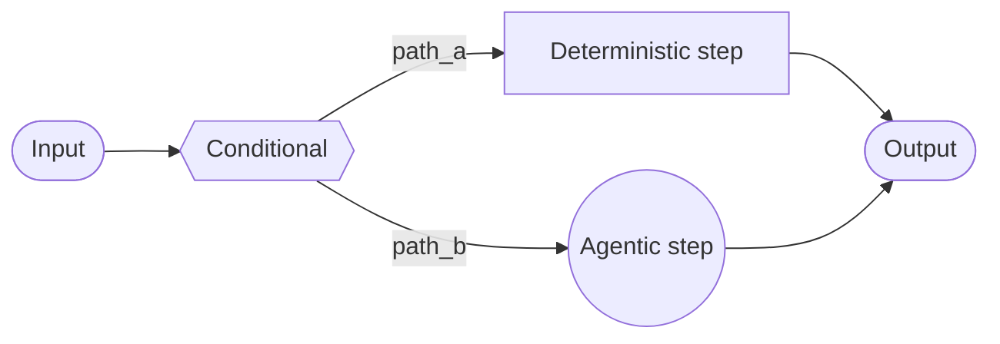
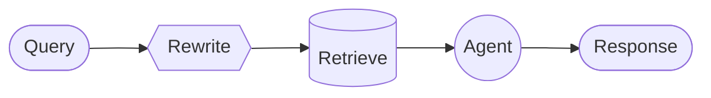

在**自定义工作流**架构中，你可以使用 [LangGraph](/oss/langgraph/overview) 定义自己的专属执行流程。你可以完全控制图的结构——包括顺序步骤、条件分支、循环和并行执行。



## 主要特点

*   完全控制图结构
*   混合确定性逻辑与智能体行为
*   支持顺序步骤、条件分支、循环和并行执行
*   可将其他模式作为节点嵌入到工作流中

## 何时使用

当标准模式（子智能体、技能等）不符合你的需求、你需要混合确定性逻辑与智能体行为，或者你的用例需要复杂路由或多阶段处理时，请使用自定义工作流。

工作流中的每个节点可以是一个简单函数、一个 LLM 调用，或者是一个包含[工具](/oss/langchain/tools)的完整[智能体](/oss/langchain/agents)。你也可以在自定义工作流中组合其他架构——例如，将一个多智能体系统作为单个节点嵌入。

有关自定义工作流的完整示例，请参阅下面的教程。

<Card
title="教程：构建一个带路由的多源知识库"
icon="book"
href="/oss/langchain/multi-agent/router-knowledge-base"
arrow cta="了解更多"
>

[路由模式](/oss/langchain/multi-agent/router)是自定义工作流的一个例子。本教程将逐步指导你构建一个路由器，该路由器可以并行查询 GitHub、Notion 和 Slack，然后综合结果。
>

</Card>

## 基本实现

核心思路是，你可以在任何 LangGraph 节点内直接调用 LangChain 智能体，从而将自定义工作流的灵活性与预构建智能体的便利性结合起来：

```python
from langchain.agents import create_agent
from langgraph.graph import StateGraph, START, END

agent = create_agent(model="openai:gpt-4o", tools=[...])

def agent_node(state: State) -> dict:
    """一个调用 LangChain 智能体的 LangGraph 节点。"""
    result = agent.invoke({
        "messages": [{"role": "user", "content": state["query"]}]
    })
    return {"answer": result["messages"][-1].content}

# 构建一个简单的工作流
workflow = (
    StateGraph(State)
    .add_node("agent", agent_node)
    .add_edge(START, "agent")
    .add_edge("agent", END)
    .compile()
)
```

## 示例：RAG 管道

一个常见的用例是将[检索](/oss/langchain/retrieval)与智能体结合。这个示例构建了一个 WNBA 数据助手，它可以从知识库中检索信息，并能获取实时新闻。

:::: details 自定义 RAG 工作流

该工作流展示了三种类型的节点：

-   <strong>模型节点</strong> (Rewrite)：使用[结构化输出](/oss/langchain/structured-output)重写用户查询以获得更好的检索效果。
-   <strong>确定性节点</strong> (Retrieve)：执行向量相似性搜索——不涉及 LLM。
-   <strong>智能体节点</strong> (Agent)：基于检索到的上下文进行推理，并可以通过工具获取额外信息。



<Tip>

你可以使用 LangGraph 状态在工作流步骤之间传递信息。这允许工作流的每个部分读取和更新结构化字段，从而轻松地在节点之间共享数据和上下文。

</Tip>

```python
from typing import TypedDict
from pydantic import BaseModel
from langgraph.graph import StateGraph, START, END
from langchain.agents import create_agent
from langchain.tools import tool
from langchain_openai import ChatOpenAI, OpenAIEmbeddings
from langchain_core.vectorstores import InMemoryVectorStore

class State(TypedDict):
    question: str
    rewritten_query: str
    documents: list[str]
    answer: str

# 包含阵容、比赛结果和球员数据的 WNBA 知识库
embeddings = OpenAIEmbeddings()
vector_store = InMemoryVectorStore(embeddings)
vector_store.add_texts([
    # 阵容
    "New York Liberty 2024 roster: Breanna Stewart, Sabrina Ionescu, Jonquel Jones, Courtney Vandersloot.",
    "Las Vegas Aces 2024 roster: A'ja Wilson, Kelsey Plum, Jackie Young, Chelsea Gray.",
    "Indiana Fever 2024 roster: Caitlin Clark, Aliyah Boston, Kelsey Mitchell, NaLyssa Smith.",
    # 比赛结果
    "2024 WNBA Finals: New York Liberty defeated Minnesota Lynx 3-2 to win the championship.",
    "June 15, 2024: Indiana Fever 85, Chicago Sky 79. Caitlin Clark had 23 points and 8 assists.",
    "August 20, 2024: Las Vegas Aces 92, Phoenix Mercury 84. A'ja Wilson scored 35 points.",
    # 球员数据
    "A'ja Wilson 2024 season stats: 26.9 PPG, 11.9 RPG, 2.6 BPG. Won MVP award.",
    "Caitlin Clark 2024 rookie stats: 19.2 PPG, 8.4 APG, 5.7 RPG. Won Rookie of the Year.",
    "Breanna Stewart 2024 stats: 20.4 PPG, 8.5 RPG, 3.5 APG.",
])
retriever = vector_store.as_retriever(search_kwargs={"k": 5})

@tool
def get_latest_news(query: str) -> str:
    """获取最新的 WNBA 新闻和更新。"""
    # 你的新闻 API 在这里
    return "Latest: The WNBA announced expanded playoff format for 2025..."

agent = create_agent(
    model="openai:gpt-4o",
    tools=[get_latest_news],
)

model = ChatOpenAI(model="gpt-4o")

class RewrittenQuery(BaseModel):
    query: str

def rewrite_query(state: State) -> dict:
    """重写用户查询以获得更好的检索效果。"""
    system_prompt = """Rewrite this query to retrieve relevant WNBA information.
The knowledge base contains: team rosters, game results with scores, and player statistics (PPG, RPG, APG).
Focus on specific player names, team names, or stat categories mentioned."""
    response = model.with_structured_output(RewrittenQuery).invoke([
        {"role": "system", "content": system_prompt},
        {"role": "user", "content": state["question"]}
    ])
    return {"rewritten_query": response.query}

def retrieve(state: State) -> dict:
    """基于重写后的查询检索文档。"""
    docs = retriever.invoke(state["rewritten_query"])
    return {"documents": [doc.page_content for doc in docs]}

def call_agent(state: State) -> dict:
    """使用检索到的上下文生成答案。"""
    context = "\n\n".join(state["documents"])
    prompt = f"Context:\n{context}\n\nQuestion: {state['question']}"
    response = agent.invoke({"messages": [{"role": "user", "content": prompt}]})
    return {"answer": response["messages"][-1].content_blocks}

workflow = (
    StateGraph(State)
    .add_node("rewrite", rewrite_query)
    .add_node("retrieve", retrieve)
    .add_node("agent", call_agent)
    .add_edge(START, "rewrite")
    .add_edge("rewrite", "retrieve")
    .add_edge("retrieve", "agent")
    .add_edge("agent", END)
    .compile()
)

result = workflow.invoke({"question": "Who won the 2024 WNBA Championship?"})
print(result["answer"])
```

::::

