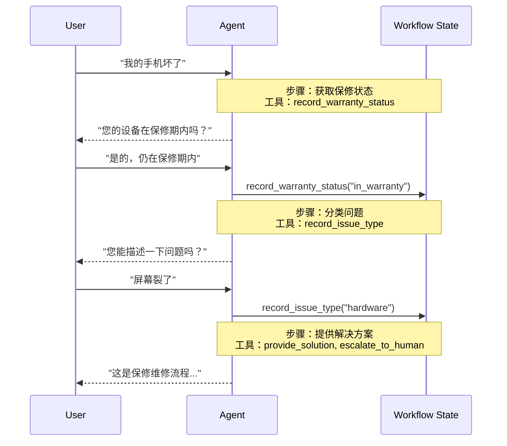

在**交接（handoffs）**架构中，行为会根据状态动态变化。其核心机制是：[工具](/oss/python/langchain/tools)会更新一个在多个轮次中持续存在的状态变量（例如 `current_step` 或 `active_agent`），系统读取此变量以调整行为——无论是应用不同的配置（系统提示词、工具）还是路由到不同的[智能体（agent）](/oss/python/langchain/agents)。这种模式既支持不同智能体之间的交接，也支持单个智能体内部的动态配置变更。

<Tip>

<strong>交接（handoffs）</strong> 一词由 [OpenAI](https://openai.github.io/openai-agents-python/handoffs/) 提出，用于描述使用工具调用（例如 `transfer_to_sales_agent`）在智能体或状态之间转移控制权。

</Tip>



## 关键特性

*   状态驱动行为：行为基于状态变量（例如 `current_step` 或 `active_agent`）变化
*   基于工具的转换：工具通过更新状态变量在不同状态间移动
*   直接用户交互：每个状态的配置直接处理用户消息
*   持久化状态：状态在对话轮次间持续存在

## 使用场景

当您需要强制执行顺序约束（仅在满足前提条件后解锁功能）、智能体需要在不同状态下直接与用户对话，或者您正在构建多阶段对话流程时，请使用交接模式。这种模式对于需要按特定顺序收集信息的客户支持场景尤其有价值——例如，在处理退款前先收集保修ID。

## 基础实现

核心机制是一个返回 [`Command`](/oss/python/langgraph/graph-api#command) 来更新状态的[工具](/oss/python/langchain/tools)，从而触发向新步骤或新智能体的转换：

```python
from langchain.tools import tool
from langchain.messages import ToolMessage
from langgraph.types import Command

@tool
def transfer_to_specialist(runtime) -> Command:
    """Transfer to the specialist agent."""
    return Command(
        update={
            "messages": [
                ToolMessage(  # [!code highlight]
                    content="Transferred to specialist",
                    tool_call_id=runtime.tool_call_id  # [!code highlight]
                )
            ],
            "current_step": "specialist"  # Triggers behavior change
        }
    )
```

<Note>

<strong>为什么需要包含 `ToolMessage`？</strong> 当大语言模型调用工具时，它期望得到一个响应。带有匹配 `tool_call_id` 的 `ToolMessage` 完成了这个请求-响应循环——没有它，对话历史就会变得不完整。每当你的交接工具更新消息时，这都是必需的。

</Note>

要查看完整的实现，请参考下面的教程。

<Card
title="教程：使用交接模式构建客户支持系统"
icon="people-arrows"
href="/oss/langchain/multi-agent/handoffs-customer-support"
arrow cta="了解更多"
>

学习如何使用交接模式构建一个客户支持智能体，其中一个智能体可以在不同配置之间切换。

</Card>

## 实现方法

有两种方法可以实现交接：**[使用中间件的单一智能体](#single-agent-with-middleware)**（一个具有动态配置的智能体）或 **[多智能体子图](#multiple-agent-subgraphs)**（作为图节点的不同智能体）。

### 使用中间件的单一智能体

一个单一的智能体根据状态改变其行为。中间件拦截每个模型调用，并动态调整系统提示词和可用工具。工具通过更新状态变量来触发转换：

```python
from langchain.tools import ToolRuntime, tool
from langchain.messages import ToolMessage
from langgraph.types import Command

@tool
def record_warranty_status(
    status: str,
    runtime: ToolRuntime[None, SupportState]
) -> Command:
    """Record warranty status and transition to next step."""
    return Command(
        update={
            "messages": [
                ToolMessage(
                    content=f"Warranty status recorded: {status}",
                    tool_call_id=runtime.tool_call_id
                )
            ],
            "warranty_status": status,
            "current_step": "specialist"  # Update state to trigger transition
        }
    )
```

```python
from langchain.agents import AgentState, create_agent
from langchain.agents.middleware import wrap_model_call, ModelRequest, ModelResponse
from langchain.tools import tool, ToolRuntime
from langchain.messages import ToolMessage
from langgraph.types import Command
from typing import Callable

# 1. 定义带有 current_step 跟踪器的状态
class SupportState(AgentState):  # [!code highlight]
    """Track which step is currently active."""
    current_step: str = "triage"  # [!code highlight]
    warranty_status: str | None = None

# 2. 工具通过 Command 更新 current_step
@tool
def record_warranty_status(
    status: str,
    runtime: ToolRuntime[None, SupportState]
) -> Command:  # [!code highlight]
    """Record warranty status and transition to next step."""
    return Command(update={  # [!code highlight]
        "messages": [  # [!code highlight]
            ToolMessage(
                content=f"Warranty status recorded: {status}",
                tool_call_id=runtime.tool_call_id
            )
        ],
        "warranty_status": status,
        # Transition to next step
        "current_step": "specialist"    # [!code highlight]
    })
```

# 3. 中间件基于 current_step 应用动态配置
@wrap_model_call  # [!code highlight]
def apply_step_config(
request: ModelRequest,
handler: Callable[[ModelRequest], ModelResponse]
) -> ModelResponse:
"""根据 current_step 配置智能体行为。"""
step = request.state.get("current_step", "triage")  # [!code highlight]

    # 将步骤映射到其配置
configs = {
"triage": {
"prompt": "收集保修信息...",
"tools": [record_warranty_status]
},
"specialist": {
"prompt": "根据保修状态提供解决方案: {warranty_status}",
"tools": [provide_solution, escalate]
}
}

config = configs[step]
request = request.override(  # [!code highlight]
system_prompt=config["prompt"].format(**request.state),  # [!code highlight]
tools=config["tools"]  # [!code highlight]
)
return handler(request)

# 4. 使用中间件创建智能体
agent = create_agent(
model,
tools=[record_warranty_status, provide_solution, escalate],
state_schema=SupportState,
middleware=[apply_step_config],  # [!code highlight]
checkpointer=InMemorySaver()  # 在多个回合间持久化状态  # [!code highlight]
)
```
:::
:::js

```typescript

// 1. 定义包含 current_step 跟踪器的状态
const SupportState = z.object({ // [!code highlight]
  currentStep: z.string().default("triage"), // [!code highlight]
  warrantyStatus: z.string().optional(),
});

// 2. 工具通过 Command 更新 currentStep
const recordWarrantyStatus = tool(
  async ({ status }, config: ToolRuntime<typeof SupportState>) => {
return new Command({ // [!code highlight]
update: { // [!code highlight]
messages: [ // [!code highlight]
new ToolMessage({
content: `保修状态已记录: ${status}`,
tool_call_id: config.toolCallId,
}),
],
warrantyStatus: status,
// 转换到下一步
currentStep: "specialist", // [!code highlight]
},
});
  },
  {
name: "record_warranty_status",
description: "记录保修状态并转换步骤",
schema: z.object({ status: z.string() }),
  }
);

// 3. 中间件基于 currentStep 应用动态配置
const applyStepConfig = createMiddleware({
  name: "applyStepConfig",
  stateSchema: SupportState, // [!code highlight]
  wrapModelCall: async (request, handler) => {
const step = request.state.currentStep || "triage"; // [!code highlight]

// 将步骤映射到其配置
const configs = {
triage: {
prompt: "收集保修信息...",
tools: [recordWarrantyStatus],
},
specialist: {
prompt: `根据保修状态提供解决方案: ${request.state.warrantyStatus}`,
tools: [provideSolution, escalate],
},
};

const config = configs[step as keyof typeof configs];
return handler({
...request,
systemPrompt: config.prompt,
tools: config.tools,
});
  },
});

// 4. 使用中间件创建智能体
const agent = createAgent({
  model,
  tools: [recordWarrantyStatus, provideSolution, escalate],
  middleware: [applyStepConfig], // [!code highlight]
  checkpointer: new MemorySaver(), // 在多个回合间持久化状态  // [!code highlight]
});
```
:::

</Accordion>

### 多智能体子图

多个不同的智能体作为图中的独立节点存在。交接工具使用 `Command.PARENT` 来指定接下来要执行哪个节点，从而在智能体节点之间导航。

<Warning>
子图交接需要仔细进行 **[上下文工程](/oss/langchain/context-engineering)**。与单智能体中间件（消息历史自然流动）不同，你必须明确决定哪些消息在智能体之间传递。如果处理不当，智能体将收到格式错误的对话历史或臃肿的上下文。请参阅下面的 [上下文工程](#context-engineering) 部分。
</Warning>

:::python

```python
from langchain.messages import AIMessage, ToolMessage
from langchain.tools import tool, ToolRuntime
from langgraph.types import Command

@tool
def transfer_to_sales(
runtime: ToolRuntime,
) -> Command:
"""Transfer to the sales agent."""
last_ai_message = next(  # [!code highlight]
msg for msg in reversed(runtime.state["messages"]) if isinstance(msg, AIMessage)  # [!code highlight]
)  # [!code highlight]
transfer_message = ToolMessage(  # [!code highlight]
content="Transferred to sales agent",  # [!code highlight]
tool_call_id=runtime.tool_call_id,  # [!code highlight]
)  # [!code highlight]
return Command(
goto="sales_agent",
update={
"active_agent": "sales_agent",
"messages": [last_ai_message, transfer_message],  # [!code highlight]
},
graph=Command.PARENT
)
```
:::
:::js

```typescript

const stateSchema = z.object({
  messages: z.array(z.instanceof(BaseMessage)),
});

const transferToSales = tool(
  async (_, runtime: ToolRuntime<typeof stateSchema>) => {
const lastAiMessage = runtime.state.messages // [!code highlight]
.reverse() // [!code highlight]
.find(AIMessage.isInstance); // [!code highlight]

const transferMessage = new ToolMessage({ // [!code highlight]
content: "Transferred to sales agent", // [!code highlight]
tool_call_id: runtime.toolCallId, // [!code highlight]
}); // [!code highlight]
return new Command({
goto: "sales_agent",
update: {
activeAgent: "sales_agent",
messages: [lastAiMessage, transferMessage].filter(Boolean), // [!code highlight]
},
graph: Command.PARENT,
});
  },
  {
name: "transfer_to_sales",
description: "Transfer to the sales agent.",
schema: z.object({}),
  }
);
```
:::

<Accordion title="完整示例：支持交接的销售与客服">

此示例展示了一个包含独立销售和客服智能体的多智能体系统。每个智能体都是一个独立的图节点，交接工具允许智能体将会话转移给对方。

:::python

```python
from typing import Literal

from langchain.agents import AgentState, create_agent
from langchain.messages import AIMessage, ToolMessage
from langchain.tools import tool, ToolRuntime
from langgraph.graph import StateGraph, START, END
from langgraph.types import Command
from typing_extensions import NotRequired

# 1. 定义包含 active_agent 追踪器的状态
class MultiAgentState(AgentState):
active_agent: NotRequired[str]

# 2. 创建交接工具
@tool
def transfer_to_sales(
runtime: ToolRuntime,
) -> Command:
"""Transfer to the sales agent."""
last_ai_message = next(  # [!code highlight]
msg for msg in reversed(runtime.state["messages"]) if isinstance(msg, AIMessage)  # [!code highlight]
)  # [!code highlight]
transfer_message = ToolMessage(  # [!code highlight]
content="Transferred to sales agent from support agent",  # [!code highlight]
tool_call_id=runtime.tool_call_id,  # [!code highlight]
)  # [!code highlight]
return Command(
goto="sales_agent",
update={
"active_agent": "sales_agent",
"messages": [last_ai_message, transfer_message],  # [!code highlight]
},
graph=Command.PARENT,
)

@tool
def transfer_to_support(
runtime: ToolRuntime,
) -> Command:
"""转接至支持智能体。"""
last_ai_message = next(  # [!code highlight]
msg for msg in reversed(runtime.state["messages"]) if isinstance(msg, AIMessage)  # [!code highlight]
)  # [!code highlight]
transfer_message = ToolMessage(  # [!code highlight]
content="从销售智能体转接到支持智能体",  # [!code highlight]
tool_call_id=runtime.tool_call_id,  # [!code highlight]
)  # [!code highlight]
return Command(
goto="support_agent",
update={
"active_agent": "support_agent",
"messages": [last_ai_message, transfer_message],  # [!code highlight]
},
graph=Command.PARENT,
)

# 3. 创建带有转接工具的智能体
sales_agent = create_agent(
model="anthropic:claude-sonnet-4-20250514",
tools=[transfer_to_support],
system_prompt="你是一名销售智能体。处理销售咨询。如果被问及技术问题或支持，请转接给支持智能体。",
)

support_agent = create_agent(
model="anthropic:claude-sonnet-4-20250514",
tools=[transfer_to_sales],
system_prompt="你是一名支持智能体。处理技术问题。如果被问及定价或购买，请转接给销售智能体。",
)

# 4. 创建调用智能体的节点
def call_sales_agent(state: MultiAgentState) -> Command:
"""调用销售智能体的节点。"""
response = sales_agent.invoke(state)
return response

def call_support_agent(state: MultiAgentState) -> Command:
"""调用支持智能体的节点。"""
response = support_agent.invoke(state)
return response

# 5. 创建检查是否应结束或继续的路由器
def route_after_agent(
state: MultiAgentState,
) -> Literal["sales_agent", "support_agent", "__end__"]:
"""基于 active_agent 进行路由，如果智能体在没有转接的情况下完成，则返回 END。"""
messages = state.get("messages", [])

    # 检查最后一条消息 - 如果是没有工具调用的 AIMessage，则结束
if messages:
last_msg = messages[-1]
if isinstance(last_msg, AIMessage) and not last_msg.tool_calls:  # [!code highlight]
return "__end__"  # [!code highlight]

    # 否则路由到活跃智能体
active = state.get("active_agent", "sales_agent")
return active if active else "sales_agent"

def route_initial(
state: MultiAgentState,
) -> Literal["sales_agent", "support_agent"]:
"""基于状态路由到活跃智能体，默认为销售智能体。"""
return state.get("active_agent") or "sales_agent"

# 6. 构建图
builder = StateGraph(MultiAgentState)
builder.add_node("sales_agent", call_sales_agent)
builder.add_node("support_agent", call_support_agent)

# 基于初始 active_agent 开始条件路由
builder.add_conditional_edges(START, route_initial, ["sales_agent", "support_agent"])

# 在每个智能体之后，检查是否应结束或路由到另一个智能体
builder.add_conditional_edges(
"sales_agent", route_after_agent, ["sales_agent", "support_agent", END]
)
builder.add_conditional_edges(
"support_agent", route_after_agent, ["sales_agent", "support_agent", END]
)

graph = builder.compile()
result = graph.invoke(
{
"messages": [
{
"role": "user",
"content": "你好，我的账户登录遇到了问题。你能帮忙吗？",
}
]
}
)

for msg in result["messages"]:
msg.pretty_print()
```
:::

:::js

```typescript

// 1. 定义带有 active_agent 追踪器的状态
const MultiAgentState = MessagesZodState.extend({
  activeAgent: z.string().optional(),
});

// 2. 创建转接工具
const transferToSales = tool(
  async (_, runtime: ToolRuntime<typeof MultiAgentState>) => {
const lastAiMessage = [...runtime.state.messages] // [!code highlight]
.reverse() // [!code highlight]
.find(AIMessage.isInstance); // [!code highlight]
const transferMessage = new ToolMessage({ // [!code highlight]
content: "Transferred to sales agent from support agent", // [!code highlight]
tool_call_id: runtime.toolCallId, // [!code highlight]
}); // [!code highlight]
return new Command({
goto: "sales_agent",
update: {
activeAgent: "sales_agent",
messages: [lastAiMessage, transferMessage].filter(Boolean), // [!code highlight]
},
graph: Command.PARENT,
});
  },
  {
name: "transfer_to_sales",
description: "Transfer to the sales agent.",
schema: z.object({}),
  }
);

const transferToSupport = tool(
  async (_, runtime: ToolRuntime<typeof MultiAgentState>) => {
const lastAiMessage = [...runtime.state.messages] // [!code highlight]
.reverse() // [!code highlight]
.find(AIMessage.isInstance); // [!code highlight]
const transferMessage = new ToolMessage({ // [!code highlight]
content: "Transferred to support agent from sales agent", // [!code highlight]
tool_call_id: runtime.toolCallId, // [!code highlight]
}); // [!code highlight]
return new Command({
goto: "support_agent",
update: {
activeAgent: "support_agent",
messages: [lastAiMessage, transferMessage].filter(Boolean), // [!code highlight]
},
graph: Command.PARENT,
});
  },
  {
name: "transfer_to_support",
description: "Transfer to the support agent.",
schema: z.object({}),
  }
);

// 3. 创建带有转接工具的智能体
const salesAgent = createAgent({
  model: "anthropic:claude-sonnet-4-20250514",
  tools: [transferToSupport],
  systemPrompt:
"You are a sales agent. Help with sales inquiries. If asked about technical issues or support, transfer to the support agent.",
});

const supportAgent = createAgent({
  model: "anthropic:claude-sonnet-4-20250514",
  tools: [transferToSales],
  systemPrompt:
"You are a support agent. Help with technical issues. If asked about pricing or purchasing, transfer to the sales agent.",
});

// 4. 创建调用智能体的节点
const callSalesAgent = async (
  state: z.infer<typeof MultiAgentState>
) => {
  const response = await salesAgent.invoke(state);
  return response;
};

const callSupportAgent = async (
  state: z.infer<typeof MultiAgentState>
) => {
  const response = await supportAgent.invoke(state);
  return response;
};

// 5. 创建检查是否应结束或继续的路由器
const routeAfterAgent = (
  state: z.infer<typeof MultiAgentState>
): "sales_agent" | "support_agent" | "__end__" => {
  const messages = state.messages ?? [];

  // 检查最后一条消息 - 如果它是没有工具调用的 AIMessage，则结束
  if (messages.length > 0) {
const lastMsg = messages[messages.length - 1];
if (lastMsg instanceof AIMessage && !lastMsg.tool_calls?.length) { // [!code highlight]
return "__end__"; // [!code highlight]
} // [!code highlight]
  }

  // 否则路由到活跃智能体
  const active = state.activeAgent ?? "sales_agent";
  return active as "sales_agent" | "support_agent";
};

const routeInitial = (
  state: z.infer<typeof MultiAgentState>
): "sales_agent" | "support_agent" => {
  // 根据状态路由到活跃智能体，默认为销售智能体
  return (state.activeAgent ?? "sales_agent") as
    | "sales_agent"
    | "support_agent";
};

// 6. 构建图
const builder = new StateGraph(MultiAgentState)
  .addNode("sales_agent", callSalesAgent)
  .addNode("support_agent", callSupportAgent);
  // 从基于初始 activeAgent 的条件路由开始
  .addConditionalEdges(START, routeInitial, [
"sales_agent",
"support_agent",
  ])
  // 在每个智能体之后，检查是应该结束还是路由到另一个智能体
  .addConditionalEdges("sales_agent", routeAfterAgent, [
"sales_agent",
"support_agent",
END,
  ]);
  builder.addConditionalEdges("support_agent", routeAfterAgent, [
"sales_agent",
"support_agent",
END,
  ]);

const graph = builder.compile();
const result = await graph.invoke({
  messages: [
{
role: "user",
content: "你好，我的账户登录遇到了问题。你能帮忙吗？",
},
  ],
});

for (const msg of result.messages) {
  console.log(msg.content);
}
```
:::

</Accordion>

<Tip>
对于大多数交接（handoff）用例，使用**带有中间件的单智能体**——这更简单。仅当您需要定制的智能体实现（例如，一个节点本身就是一个包含反思或检索步骤的复杂图）时，才使用**多智能体子图**。
</Tip>

#### 上下文工程

使用子图交接时，您可以精确控制智能体之间流动的消息。这种精确性对于维护有效的对话历史记录和避免可能使下游智能体困惑的上下文膨胀至关重要。有关此主题的更多信息，请参阅[上下文工程](/oss/langchain/context-engineering)。

**交接过程中的上下文处理**

在智能体之间进行交接时，您需要确保对话历史记录保持有效。LLM 期望工具调用与其响应配对，因此当使用 `Command.PARENT` 交接给另一个智能体时，必须同时包含：

1.  **包含工具调用的 `AIMessage`**（触发交接的消息）
2.  **确认交接的 `ToolMessage`**（对该工具调用的人工响应）

如果没有这种配对，接收智能体将看到一个不完整的对话，并可能产生错误或意外行为。

下面的示例假设只调用了交接工具（没有并行工具调用）：

:::python

```python
@tool
def transfer_to_sales(runtime: ToolRuntime) -> Command:
    # 获取触发此交接的 AI 消息
last_ai_message = runtime.state["messages"][-1]

    # 创建一个人工工具响应以完成配对
transfer_message = ToolMessage(
content="已转接至销售智能体",
tool_call_id=runtime.tool_call_id,
)

return Command(
goto="sales_agent",
update={
"active_agent": "sales_agent",
 # 仅传递这两条消息，而不是完整的子智能体历史记录
"messages": [last_ai_message, transfer_message],
},
graph=Command.PARENT,
)
```
:::

:::js

```typescript
const transferToSales = tool(
  async (_, runtime: ToolRuntime<typeof MultiAgentState>) => {
// 获取触发此交接的 AI 消息
const lastAiMessage = runtime.state.messages.at(-1);

// 创建一个人工工具响应以完成配对
const transferMessage = new ToolMessage({
content: "已转接至销售智能体",
tool_call_id: runtime.toolCallId,
});

return new Command({
goto: "sales_agent",
update: {
activeAgent: "sales_agent",
// 仅传递这两条消息，而不是完整的子智能体历史记录
messages: [lastAiMessage, transferMessage],
},
graph: Command.PARENT,
});
  },
  {
name: "transfer_to_sales",
description: "转接至销售智能体。",
schema: z.object({}),
  }
);
```

<Note>

<strong>为什么不传递所有子代理消息？</strong> 虽然您可以在交接中包含完整的子代理对话，但这通常会带来问题。接收代理可能会因不相关的内部推理而感到困惑，并且令牌成本会不必要地增加。通过仅传递交接对，您可以使父图的上下文专注于高层协调。如果接收代理需要额外的上下文，请考虑在 ToolMessage 内容中总结子代理的工作，而不是传递原始消息历史。

</Note>

**将控制权交还给用户**

当将控制权交还给用户（结束代理的回合）时，请确保最终消息是一个 `AIMessage`。这可以保持有效的对话历史，并向用户界面发出代理已完成其工作的信号。

## 实施注意事项

在设计多代理系统时，请考虑：

* **上下文过滤策略**：每个代理将接收完整的对话历史、过滤的部分还是摘要？根据其角色，不同的代理可能需要不同的上下文。
* **工具语义**：明确交接工具是仅更新路由状态，还是也会产生副作用。例如，`transfer_to_sales()` 是否也应该创建一个支持工单，或者这应该是一个单独的操作？
* **令牌效率**：在上下文完整性和令牌成本之间取得平衡。随着对话时间的延长，总结和选择性上下文传递变得更加重要。
