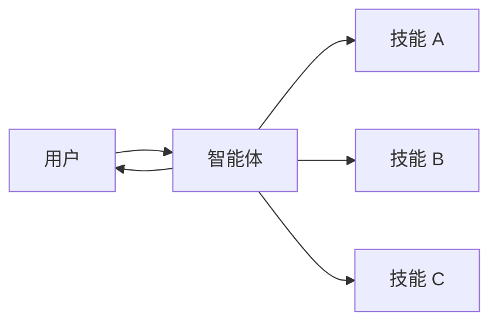

在 **技能** 架构中，专业能力被封装为可调用的"技能"，用于增强[智能体](/oss/python/langchain/agents)的行为。技能主要是由提示驱动的专业化能力，智能体可以按需调用。

<Tip>

这种模式在概念上与 [llms.txt](https://llmstxt.org/)（由 Jeremy Howard 提出）相同，后者使用工具调用来渐进式展示文档。技能模式将相同的方法应用于专业提示和领域知识，而不仅仅是文档页面。

</Tip>



## 主要特点

*   提示驱动的专业化：技能主要由专业提示定义
*   渐进式展示：技能根据上下文或用户需求变得可用
*   团队分布式开发：不同团队可以独立开发和维护技能
*   轻量级组合：技能比完整的子智能体更简单

## 何时使用

当你希望一个[智能体](/oss/python/langchain/agents)具备多种可能的专业化能力、不需要在技能之间强制执行特定约束，或者不同团队需要独立开发能力时，请使用技能模式。常见的例子包括编码助手（针对不同语言或任务的技能）、知识库（针对不同领域的技能）和创意助手（针对不同格式的技能）。

## 基础实现

```python
from langchain.tools import tool
from langchain.agents import create_agent

@tool
def load_skill(skill_name: str) -> str:
    """Load a specialized skill prompt.

    Available skills:
    - write_sql: SQL query writing expert
    - review_legal_doc: Legal document reviewer

    Returns the skill's prompt and context.
    """
    # Load skill content from file/database
    ...

agent = create_agent(
    model="gpt-4o",
    tools=[load_skill],
    system_prompt=(
        "You are a helpful assistant. "
        "You have access to two skills: "
        "write_sql and review_legal_doc. "
        "Use load_skill to access them."
    ),
)
```

完整的实现，请参见下面的教程。

<Card
title="教程：构建一个具备按需技能的 SQL 助手"
icon="wand-magic-sparkles"
href="/oss/langchain/multi-agent/skills-sql-assistant"
arrow cta="了解更多"
>

学习如何实现具有渐进式展示功能的技能，即智能体按需加载专业提示和模式，而不是预先加载。

</Card>

## 扩展模式

在编写自定义实现时，可以通过以下几种方式扩展基础技能模式：

-   **动态工具注册**：将渐进式展示与状态管理相结合，在技能加载时注册新的[工具](/oss/python/langchain/tools)。例如，加载 "database_admin" 技能既可以添加专业上下文，也可以注册数据库特定工具（备份、恢复、迁移）。这使用了跨多智能体模式的相同工具和状态机制——工具通过更新状态来动态改变智能体的能力。

-   **分层技能**：技能可以在树状结构中定义其他技能，创建嵌套的专业化能力。例如，加载 "data_science" 技能可能会使子技能如 "pandas_expert"、"visualization" 和 "statistical_analysis" 可用。每个子技能都可以根据需要独立加载，允许对领域知识进行细粒度的渐进式展示。这种分层方法通过将能力组织成逻辑分组来帮助管理大型知识库，这些分组可以按需发现和加载。
