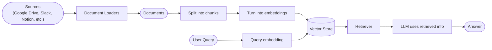
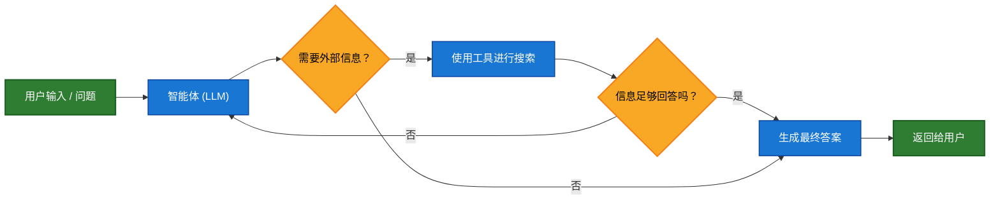
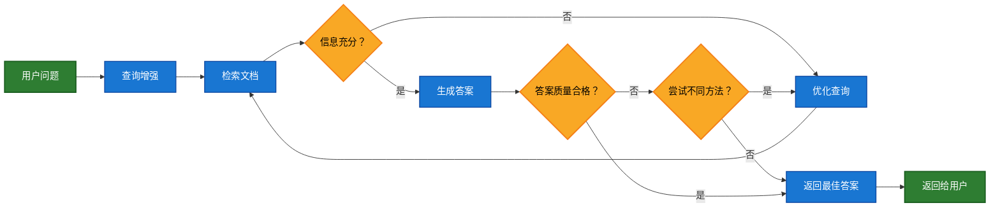

大型语言模型（LLMs）功能强大，但它们存在两个关键限制：

* **有限的上下文** —— 它们无法一次性处理整个语料库。
* **静态知识** —— 它们的训练数据在某个时间点被冻结。

检索（Retrieval）通过在查询时获取相关的外部知识来解决这些问题。这是**检索增强生成（Retrieval-Augmented Generation，RAG）** 的基础：利用特定上下文信息来增强 LLM 的答案。

## 构建知识库

**知识库** 是在检索过程中使用的文档或结构化数据的存储库。

如果你需要一个自定义的知识库，可以使用 LangChain 的文档加载器和向量存储来从你自己的数据中构建一个。

<Note>

如果你已经有一个知识库（例如，SQL 数据库、CRM 或内部文档系统），你<strong>不需要</strong>重建它。你可以：
- 将其作为<strong>工具</strong>连接到 Agentic RAG 中的智能体。
- 查询它，并将检索到的内容作为上下文提供给 LLM [（两步式 RAG）](#2-step-rag)。

</Note>

请参阅以下教程，以构建一个可搜索的知识库和最小的 RAG 工作流：

<Card
title="教程：语义搜索"
icon="database"
href="/oss/langchain/knowledge-base"
arrow cta="了解更多"
>

学习如何使用 LangChain 的文档加载器、嵌入模型和向量存储，从你自己的数据创建一个可搜索的知识库。
在本教程中，你将构建一个基于 PDF 的搜索引擎，实现对与查询相关的段落进行检索。你还将在此引擎之上实现一个最小的 RAG 工作流，以了解如何将外部知识集成到 LLM 的推理中。

</Card>

### 从检索到 RAG

检索使 LLMs 能够在运行时访问相关上下文。但大多数现实世界的应用更进一步：它们**将检索与生成相结合**，以产生有依据、具备上下文感知能力的答案。

这就是**检索增强生成（RAG）** 背后的核心理念。检索流程成为一个更广泛系统的基础，该系统将搜索与生成相结合。

### 检索流程

一个典型的检索工作流如下所示：



每个组件都是模块化的：你可以更换加载器、分割器、嵌入模型或向量存储，而无需重写应用程序的逻辑。

### 构建模块

<Columns :cols="2">

<Card
title="文档加载器"
icon="file-import"
href="/oss/integrations/document_loaders"
arrow cta="了解更多"
>

从外部源（Google Drive、Slack、Notion 等）摄取数据，返回标准化的 <a href="https://reference.langchain.com/python/langchain_core/documents/#langchain_core.documents.base.Document" target="_blank" rel="noreferrer" class="link"><code>Document</code></a> 对象。

</Card>

<Card
title="文本分割器"
icon="scissors"
href="/oss/integrations/splitters"
arrow
cta="了解更多"
>

将大型文档分解成更小的块，这些块可以单独检索，并能放入模型的上下文窗口。

</Card>

<Card
title="嵌入模型"
icon="diagram-project"
href="/oss/integrations/text_embedding"
arrow
cta="了解更多"
>

嵌入模型将文本转换为数字向量，使得语义相似的文本在该向量空间中彼此靠近。

</Card>

<Card
title="向量存储"
icon="database"
href="/oss/integrations/vectorstores/"
arrow
cta="了解更多"
>

用于存储和搜索嵌入向量的专用数据库。

</Card>

<Card
title="检索器"
icon="binoculars"
href="/oss/integrations/retrievers/"
arrow
cta="了解更多"
>

检索器是一个接口，它根据非结构化查询返回文档。

</Card>

</Columns>

## RAG 架构

RAG 可以通过多种方式实现，具体取决于你系统的需求。我们在下面的章节中概述了每种类型。

| 架构 | 描述 | 控制力 | 灵活性 | 延迟 | 示例用例 |
|-------------------------|----------------------------------------------------------------------------|-----------|-------------|----------------|----------------------------------------------------|
| **两步式 RAG** | 检索总是在生成之前发生。简单且可预测 | ✅ 高 | ❌ 低 | ⚡ 快 | 常见问题解答、文档机器人 |
| **智能体式 RAG** | 由 LLM 驱动的智能体在推理过程中决定*何时*以及*如何*进行检索 | ❌ 低 | ✅ 高 | ⏳ 可变 | 可以访问多个工具的研究助手 |
| **混合式 RAG** | 结合了两种方法的特点，并包含验证步骤 | ⚖️ 中等 | ⚖️ 中等 | ⏳ 可变 | 带有质量验证的特定领域问答 |

<Info>

<strong>延迟</strong>：在<strong>两步式 RAG</strong> 中，延迟通常更<strong>可预测</strong>，因为 LLM 调用的最大次数是已知且有上限的。这种可预测性假设 LLM 推理时间是主要因素。然而，实际延迟也可能受到检索步骤性能的影响——例如 API 响应时间、网络延迟或数据库查询——这些性能会根据所使用的工具和基础设施而变化。

</Info>

### 两步式 RAG

在**两步式 RAG** 中，检索步骤总是在生成步骤之前执行。这种架构简单直接且可预测，适用于许多应用场景，在这些场景中，检索相关文档是生成答案的明确前提。


<Card
title="教程：检索增强生成（RAG）"
icon="robot"
href="/oss/langchain/rag#rag-chains"
arrow cta="了解更多"
>

了解如何使用检索增强生成构建一个能够基于你的数据回答问题的问答聊天机器人。
本教程将介绍两种方法：
* 一个使用灵活工具进行搜索的 **RAG 智能体**——非常适合通用用途。
* 一个每次查询只需一次 LLM 调用的 **两步式 RAG** 链——对于更简单的任务来说快速高效。

</Card>

### 智能体式 RAG

**智能体式检索增强生成（Agentic RAG）** 结合了检索增强生成和基于智能体的推理的优势。与在回答之前检索文档不同，一个由 LLM 驱动的智能体逐步推理，并在交互过程中决定**何时**以及**如何**检索信息。

<Tip>

智能体要启用 RAG 行为，唯一需要的就是能够访问一个或多个可以获取外部知识的<strong>工具</strong>——例如文档加载器、Web API 或数据库查询。

</Tip>



```python
import requests
from langchain.tools import tool
from langchain.chat_models import init_chat_model
from langchain.agents import create_agent

@tool
def fetch_url(url: str) -> str:
    """从 URL 获取文本内容"""
    response = requests.get(url, timeout=10.0)
    response.raise_for_status()
    return response.text

system_prompt = """\
当你需要从网页获取信息时，使用 fetch_url；引用相关的片段。
"""

agent = create_agent(
    model="claude-sonnet-4-5-20250929",
    tools=[fetch_url], # 用于检索的工具 [!code highlight]
    system_prompt=system_prompt,
)
```

<Expandable title="扩展示例：用于 LangGraph 的 llms.txt 的智能体式 RAG">

此示例实现了一个**智能体式 RAG 系统**，以帮助用户查询 LangGraph 文档。智能体首先加载 [llms.txt](https://llmstxt.org/)，该文件列出了可用的文档 URL，然后可以根据用户的问题动态使用 `fetch_documentation` 工具来检索和处理相关内容。

```python
import requests
from langchain.agents import create_agent
from langchain.messages import HumanMessage
from langchain.tools import tool
from markdownify import markdownify

ALLOWED_DOMAINS = ["https://langchain-ai.github.io/"]
LLMS_TXT = 'https://langchain-ai.github.io/langgraph/llms.txt'

@tool
def fetch_documentation(url: str) -> str:  # [!code highlight]
    """从 URL 获取并转换文档"""
    if not any(url.startswith(domain) for domain in ALLOWED_DOMAINS):
        return (
            "Error: URL not allowed. "
            f"Must start with one of: {', '.join(ALLOWED_DOMAINS)}"
        )
    response = requests.get(url, timeout=10.0)
    response.raise_for_status()
    return markdownify(response.text)

# 我们将获取 llms.txt 的内容，因此这可以
# 提前完成，无需 LLM 请求。
llms_txt_content = requests.get(LLMS_TXT).text

# 智能体的系统提示词
system_prompt = f"""
你是一位专业的 Python 开发者和技术助手。
你的主要职责是帮助用户解决关于 LangGraph 及相关工具的问题。

指令：

1. 如果用户提出的问题你不确定——或者很可能涉及 API 使用、
   行为或配置——你**必须**使用 `fetch_documentation` 工具来查阅相关文档。
2. 引用文档时，要清晰总结并包含内容中的相关上下文。
3. 不要使用允许域之外的任何 URL。
4. 如果文档获取失败，请告知用户并基于你最好的专家理解继续。

你可以从以下批准的来源访问官方文档：

{llms_txt_content}

在回答用户关于 LangGraph 的问题之前，你**必须**查阅文档以获取最新的文档。

你的回答应该清晰、简洁且技术准确。
"""

tools = [fetch_documentation]

model = init_chat_model("claude-sonnet-4-0", max_tokens=32_000)

agent = create_agent(
    model=model,
    tools=tools,  # [!code highlight]
    system_prompt=system_prompt,  # [!code highlight]
    name="Agentic RAG",
)

response = agent.invoke({
    'messages': [
        HumanMessage(content=(
            "Write a short example of a langgraph agent using the "
            "prebuilt create react agent. the agent should be able "
            "to look up stock pricing information."
        ))
    ]
})

print(response['messages'][-1].content)
```

</Expandable>

<Card
title="教程：检索增强生成（RAG）"
icon="robot"
href="/oss/langchain/rag"
arrow cta="了解更多"
>

了解如何使用检索增强生成构建一个能够基于你的数据回答问题的问答聊天机器人。
本教程将介绍两种方法：
* 一个使用灵活工具进行搜索的 **RAG 智能体**——非常适合通用用途。
* 一个每次查询只需一次 LLM 调用的 **两步式 RAG** 链——对于更简单的任务来说快速高效。

</Card>

### 混合式 RAG

混合式 RAG 结合了两步式 RAG 和智能体式 RAG 的特点。它引入了中间步骤，例如查询预处理、检索验证和后生成检查。这些系统比固定流程提供了更多的灵活性，同时保持了对执行过程的某种控制。

典型的组件包括：

* **查询增强**：修改输入问题以提高检索质量。这可能涉及重写不明确的查询、生成多个变体或用额外的上下文扩展查询。
* **检索验证**：评估检索到的文档是否相关且充分。如果不是，系统可能会优化查询并再次检索。
* **答案验证**：检查生成的答案的准确性、完整性以及与源内容的一致性。如果需要，系统可以重新生成或修改答案。

该架构通常支持这些步骤之间的多次迭代：



这种架构适用于：

* 具有模糊或未明确指定查询的应用程序
* 需要验证或质量控制步骤的系统
* 涉及多个来源或迭代优化的工作流

<Card
title="教程：具有自我修正功能的智能体式 RAG"
icon="robot"
href="/oss/langgraph/agentic-rag"
arrow cta="了解更多"
>

一个结合了智能体推理、检索和自我修正的 **混合式 RAG** 示例。

</Card>

