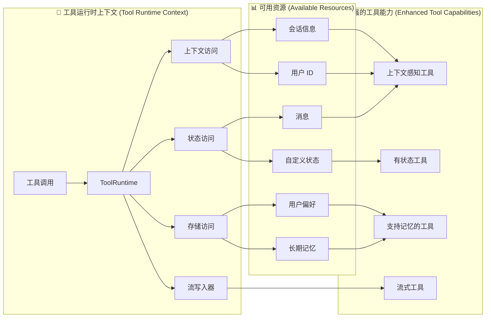

工具扩展了[智能体 (agents)](/oss/langchain/agents)的能力——让它们能够获取实时数据、执行代码、查询外部数据库，并在现实世界中采取行动。

在底层，工具是具有明确定义输入和输出的可调用函数，它们会被传递给[聊天模型 (chat model)](/oss/langchain/models)。模型根据对话上下文决定何时调用工具，以及提供哪些输入参数。

<Tip>

有关模型如何处理工具调用的详细信息，请参阅[工具调用 (Tool calling)](/oss/langchain/models#tool-calling)。

</Tip>

## 创建工具 (Create tools)

### 基础工具定义 (Basic tool definition)

创建工具最简单的方法是使用 <a href="https://reference.langchain.com/python/langchain/tools/#langchain.tools.tool" target="_blank" rel="noreferrer" class="link"><code>@tool</code></a> 装饰器。默认情况下，函数的文档字符串会成为工具的描述，帮助模型理解何时使用它：

```python
from langchain.tools import tool

@tool
def search_database(query: str, limit: int = 10) -> str:
    """在客户数据库中搜索与查询匹配的记录。

    Args:
        query: 要查找的搜索词
        limit: 要返回的最大结果数
    """
    return f"Found {limit} results for '{query}'"
```

类型提示是**必需的**，因为它们定义了工具的输入模式 (input schema)。文档字符串应具有信息性且简洁，以帮助模型理解工具的用途。

<Note>

<strong>服务端工具使用 (Server-side tool use)</strong>

一些聊天模型（例如 [OpenAI](/oss/integrations/chat/openai)、[Anthropic](/oss/integrations/chat/anthropic) 和 [Gemini](/oss/integrations/chat/google_generative_ai)）具有[内置工具 (built-in tools)](/oss/langchain/models#server-side-tool-use)，这些工具在服务端执行，例如网络搜索和代码解释器。请参阅[提供商概览 (provider overview)](/oss/integrations/providers/overview)以了解如何通过你特定的聊天模型访问这些工具。

</Note>

### 自定义工具属性 (Customize tool properties)

#### 自定义工具名称 (Custom tool name)

默认情况下，工具名称来自函数名。当你需要更具描述性的名称时，可以覆盖它：

```python
@tool("web_search")  # 自定义名称
def search(query: str) -> str:
    """在网络上搜索信息。"""
    return f"Results for: {query}"

print(search.name)  # web_search
```

#### 自定义工具描述 (Custom tool description)

覆盖自动生成的工具描述，以提供更清晰的模型指导：

```python
@tool("calculator", description="执行算术计算。对于任何数学问题请使用此工具。")
def calc(expression: str) -> str:
    """评估数学表达式。"""
    return str(eval(expression))
```

### 高级模式定义 (Advanced schema definition)

使用 Pydantic 模型或 JSON 模式定义复杂输入：

::: code-group

```python [Pydantic model]
from pydantic import BaseModel, Field
from typing import Literal

class WeatherInput(BaseModel):
    """天气查询的输入。"""
    location: str = Field(description="城市名称或坐标")
    units: Literal["celsius", "fahrenheit"] = Field(
        default="celsius",
        description="温度单位偏好"
    )
    include_forecast: bool = Field(
        default=False,
        description="包含 5 天天气预报"
    )

@tool(args_schema=WeatherInput)
def get_weather(location: str, units: str = "celsius", include_forecast: bool = False) -> str:
    """获取当前天气和可选的预报。"""
    temp = 22 if units == "celsius" else 72
    result = f"Current weather in {location}: {temp} degrees {units[0].upper()}"
    if include_forecast:
        result += "\nNext 5 days: Sunny"
    return result
```

```python [JSON Schema]
weather_schema = {
    "type": "object",
    "properties": {
        "location": {"type": "string"},
        "units": {"type": "string"},
        "include_forecast": {"type": "boolean"}
    },
    "required": ["location", "units", "include_forecast"]
}

@tool(args_schema=weather_schema)
def get_weather(location: str, units: str = "celsius", include_forecast: bool = False) -> str:
    """获取当前天气和可选的预报。"""
    temp = 22 if units == "celsius" else 72
    result = f"Current weather in {location}: {temp} degrees {units[0].upper()}"
    if include_forecast:
        result += "\nNext 5 days: Sunny"
    return result
```

:::

### 保留参数名 (Reserved argument names)

以下参数名是保留的，不能用作工具参数。使用这些名称将导致运行时错误。

| 参数名 (Parameter name) | 用途 (Purpose) |
|----------------|---------|
| `config` | 保留用于在内部向工具传递 `RunnableConfig` |
| `runtime` | 保留用于 `ToolRuntime` 参数（访问状态、上下文、存储） |

要访问运行时信息，请使用 <a href="https://reference.langchain.com/python/langchain/tools/#langchain.tools.ToolRuntime" target="_blank" rel="noreferrer" class="link"><code>ToolRuntime</code></a> 参数，而不是将你自己的参数命名为 `config` 或 `runtime`。

## 访问上下文 (Accessing context)

<Info>

<strong>为什么这很重要：</strong> 当工具能够访问智能体状态、运行时上下文和长期记忆时，它们的功能最为强大。这使得工具能够做出上下文感知的决策、个性化响应，并在对话间维护信息。

运行时上下文提供了一种在运行时将依赖项（如数据库连接、用户 ID 或配置）注入到工具中的方法，使它们更具可测试性和可重用性。

</Info>

工具可以通过 `ToolRuntime` 参数访问运行时信息，该参数提供：

- **状态 (State)** - 在执行过程中流动的可变数据（例如消息、计数器、自定义字段）
- **上下文 (Context)** - 不可变的配置，如用户 ID、会话详情或特定于应用程序的配置
- **存储 (Store)** - 跨对话的持久长期记忆
- **流写入器 (Stream Writer)** - 在工具执行时流式传输自定义更新
- **配置 (Config)** - 当前执行的 `RunnableConfig`
- **工具调用 ID (Tool Call ID)** - 当前工具调用的 ID



### `ToolRuntime`

使用 `ToolRuntime` 在单个参数中访问所有运行时信息。只需将 `runtime: ToolRuntime` 添加到你的工具签名中，它将被自动注入，而不会暴露给 LLM。

<Info>

<strong>`ToolRuntime`</strong>：一个统一的参数，为工具提供对状态、上下文、存储、流式传输、配置和工具调用 ID 的访问。这取代了使用单独的 <a href="https://reference.langchain.com/python/langgraph/agents/#langgraph.prebuilt.tool_node.InjectedState" target="_blank" rel="noreferrer" class="link"><code>InjectedState</code></a>、<a href="https://reference.langchain.com/python/langgraph/agents/#langgraph.prebuilt.tool_node.InjectedStore" target="_blank" rel="noreferrer" class="link"><code>InjectedStore</code></a>、<a href="https://reference.langchain.com/python/langgraph/runtime/#langgraph.runtime.get_runtime" target="_blank" rel="noreferrer" class="link"><code>get_runtime</code></a> 和 <a href="https://reference.langchain.com/python/langchain/tools/#langchain.tools.InjectedToolCallId" target="_blank" rel="noreferrer" class="link"><code>InjectedToolCallId</code></a> 注解的旧模式。

运行时会自动为你的工具函数提供这些能力，而无需你显式传递它们或使用全局状态。

</Info>

**访问状态 (Accessing state)：**

工具可以使用 `ToolRuntime` 访问当前的图状态：

```python
from langchain.tools import tool, ToolRuntime

# 访问当前对话状态
@tool
def summarize_conversation(
    runtime: ToolRuntime
) -> str:
    """总结到目前为止的对话。"""
    messages = runtime.state["messages"]

    human_msgs = sum(1 for m in messages if m.__class__.__name__ == "HumanMessage")
    ai_msgs = sum(1 for m in messages if m.__class__.__name__ == "AIMessage")
    tool_msgs = sum(1 for m in messages if m.__class__.__name__ == "ToolMessage")

    return f"Conversation has {human_msgs} user messages, {ai_msgs} AI responses, and {tool_msgs} tool results"

# 访问自定义状态字段
@tool
def get_user_preference(
    pref_name: str,
    runtime: ToolRuntime  # ToolRuntime 参数对模型不可见
) -> str:
    """获取用户偏好设置的值。"""
    preferences = runtime.state.get("user_preferences", {})
    return preferences.get(pref_name, "Not set")
```

<Warning>

`runtime` 参数对模型是隐藏的。对于上面的示例，模型在工具模式中只能看到 `pref_name` —— `runtime` <strong>不</strong>包含在请求中。

</Warning>

**更新状态 (Updating state)：**

使用 <a href="https://reference.langchain.com/python/langgraph/types/#langgraph.types.Command" target="_blank" rel="noreferrer" class="link"><code>Command</code></a> 来更新智能体的状态或控制图的执行流程：

```python
from langgraph.types import Command
from langchain.messages import RemoveMessage
from langgraph.graph.message import REMOVE_ALL_MESSAGES
from langchain.tools import tool, ToolRuntime

# 通过移除所有消息来更新对话历史
@tool
def clear_conversation() -> Command:
    """清除对话历史记录。"""

    return Command(
        update={
            "messages": [RemoveMessage(id=REMOVE_ALL_MESSAGES)],
        }
    )

# 在智能体状态中更新用户姓名 (user_name)
@tool
def update_user_name(
    new_name: str,
    runtime: ToolRuntime
) -> Command:
    """更新用户的姓名。"""
    return Command(update={"user_name": new_name})
```

#### 上下文 (Context)

通过 `runtime.context` 访问不可变的配置和上下文数据，如用户 ID、会话详情或特定于应用程序的配置。

工具可以通过 `ToolRuntime` 访问运行时上下文：

```python
from dataclasses import dataclass
from langchain_openai import ChatOpenAI
from langchain.agents import create_agent
from langchain.tools import tool, ToolRuntime

USER_DATABASE = {
    "user123": {
        "name": "Alice Johnson",
        "account_type": "Premium",
        "balance": 5000,
        "email": "alice@example.com"
    },
    "user456": {
        "name": "Bob Smith",
        "account_type": "Standard",
        "balance": 1200,
        "email": "bob@example.com"
    }
}

@dataclass
class UserContext:
    user_id: str

@tool
def get_account_info(runtime: ToolRuntime[UserContext]) -> str:
    """获取当前用户的账户信息。"""
    user_id = runtime.context.user_id

    if user_id in USER_DATABASE:
        user = USER_DATABASE[user_id]
        return f"Account holder: {user['name']}\nType: {user['account_type']}\nBalance: ${user['balance']}"
    return "User not found"

model = ChatOpenAI(model="gpt-4o")
agent = create_agent(
    model,
    tools=[get_account_info],
    context_schema=UserContext,
    system_prompt="你是一个金融助手。"
)

result = agent.invoke(
    {"messages": [{"role": "user", "content": "我现在的余额是多少？"}]},
    context=UserContext(user_id="user123")
)
```

#### 记忆 (存储) (Memory (Store))

使用存储 (Store) 访问跨对话的持久数据。存储通过 `runtime.store` 访问，允许你保存和检索用户特定或应用程序特定的数据。

工具可以通过 `ToolRuntime` 访问和更新存储：

```python [expandable]
from typing import Any
from langgraph.store.memory import InMemoryStore
from langchain.agents import create_agent
from langchain.tools import tool, ToolRuntime

# 访问记忆 (Memory)
@tool
def get_user_info(user_id: str, runtime: ToolRuntime) -> str:
    """查找用户信息。"""
    store = runtime.store
    user_info = store.get(("users",), user_id)
    return str(user_info.value) if user_info else "Unknown user"

# 更新记忆 (Memory)
@tool
def save_user_info(user_id: str, user_info: dict[str, Any], runtime: ToolRuntime) -> str:
    """保存用户信息。"""
    store = runtime.store
    store.put(("users",), user_id, user_info)
    return "Successfully saved user info."

store = InMemoryStore()
agent = create_agent(
    model,
    tools=[get_user_info, save_user_info],
    store=store
)

# 第一个会话：保存用户信息
agent.invoke({
    "messages": [{"role": "user", "content": "保存以下用户：userid: abc123, name: Foo, age: 25, email: foo@langchain.dev"}]
})

# 第二个会话：获取用户信息
agent.invoke({
    "messages": [{"role": "user", "content": "获取 ID 为 'abc123' 的用户信息"}]
})
# 以下是 ID 为 "abc123" 的用户信息：
# - Name: Foo
# - Age: 25
# - Email: foo@langchain.dev
```

#### 流写入器 (Stream writer)

使用 `runtime.stream_writer` 在工具执行时流式传输自定义更新。这对于向用户提供关于工具正在做什么的实时反馈非常有用。

```python
from langchain.tools import tool, ToolRuntime

@tool
def get_weather(city: str, runtime: ToolRuntime) -> str:
    """获取指定城市的天气。"""
    writer = runtime.stream_writer

    # 在工具执行时流式传输自定义更新
    writer(f"正在查询城市数据：{city}")
    writer(f"已获取城市数据：{city}")

    return f"It's always sunny in {city}!"
```

<Note>

如果你在工具内部使用 `runtime.stream_writer`，该工具必须在 LangGraph 执行上下文中调用。有关更多详细信息，请参阅[流式处理 (Streaming)](/oss/langchain/streaming)。

</Note>

