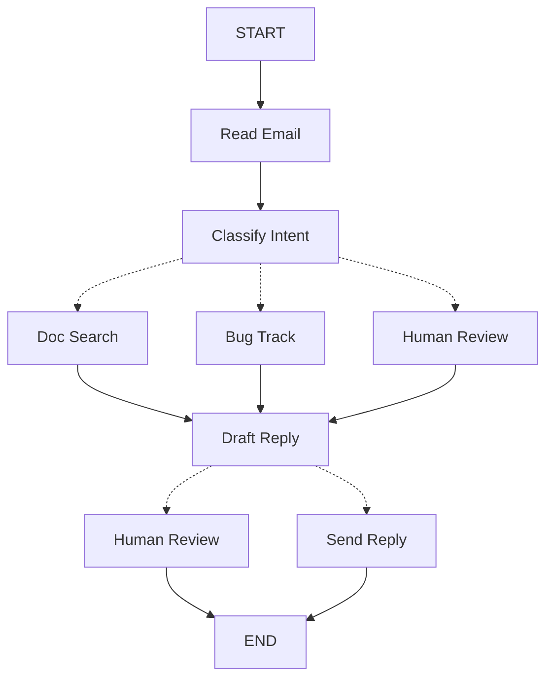

使用 LangGraph 构建智能体时，首先需要将其分解为称为 **节点** 的离散步骤。然后，描述每个节点的不同决策和转换。最后，通过一个共享的 **状态** 将节点连接起来，每个节点都可以读取和写入该状态。

在本教程中，我们将引导您完成使用 LangGraph 构建客户支持邮件智能体的思考过程。

## 从您想要自动化的流程开始

假设您需要构建一个处理客户支持邮件的 AI 智能体。您的产品团队给出了以下要求：

```txt
智能体应：

- 读取收到的客户邮件
- 根据紧急程度和主题进行分类
- 搜索相关文档以回答问题
- 起草适当的回复
- 将复杂问题升级给人工客服
- 在需要时安排后续跟进

需要处理的示例场景：

1. 简单的产品问题："如何重置我的密码？"
2. 错误报告："当我选择 PDF 格式时，导出功能崩溃了"
3. 紧急的账单问题："我的订阅被重复扣费了！"
4. 功能请求："能否为移动应用添加深色模式？"
5. 复杂的技术问题："我们的 API 集成间歇性地出现 504 错误"
```

要在 LangGraph 中实现一个智能体，通常需要遵循相同的五个步骤。

## 步骤 1：将工作流程映射为离散步骤

首先，识别流程中的不同步骤。每个步骤将成为一个 **节点**（执行特定功能的函数）。然后，勾勒出这些步骤如何相互连接。



图中的箭头显示了可能的路径，但实际选择哪条路径的决策发生在每个节点内部。

既然我们已经识别了工作流程中的组件，接下来让我们理解每个节点需要做什么：

- `Read Email`：提取并解析邮件内容
- `Classify Intent`：使用 LLM 对紧急程度和主题进行分类，然后路由到适当的操作
- `Doc Search`：查询您的知识库以获取相关信息
- `Bug Track`：在跟踪系统中创建或更新问题
- `Draft Reply`：生成适当的回复
- `Human Review`：升级给人工客服进行审批或处理
- `Send Reply`：发送邮件回复

<Tip>

请注意，有些节点决定下一步的去向（`Classify Intent`、`Draft Reply`、`Human Review`），而其他节点总是转到相同的下一步（`Read Email` 总是转到 `Classify Intent`，`Doc Search` 总是转到 `Draft Reply`）。

</Tip>

## 步骤 2：确定每个步骤需要做什么

对于图中的每个节点，确定它代表什么类型的操作以及它需要什么上下文才能正常工作。

<CardGroup :cols="2">

<Card title="LLM 步骤" icon="brain" href="#llm-steps">

当您需要理解、分析、生成文本或做出推理决策时使用

</Card>

<Card title="数据步骤" icon="database" href="#data-steps">

当您需要从外部源检索信息时使用

</Card>

<Card title="操作步骤" icon="bolt" href="#action-steps">

当您需要执行外部操作时使用

</Card>

<Card title="用户输入步骤" icon="user" href="#user-input-steps">

当您需要人工干预时使用

</Card>

</CardGroup>

### LLM 步骤

当一个步骤需要理解、分析、生成文本或做出推理决策时：

:::: details 分类意图

- 静态上下文（提示词）：分类类别、紧急程度定义、响应格式
- 动态上下文（来自状态）：邮件内容、发件人信息
- 期望结果：决定路由的结构化分类

::::

:::: details 起草回复

- 静态上下文（提示词）：语气指南、公司政策、响应模板
- 动态上下文（来自状态）：分类结果、搜索结果、客户历史记录
- 期望结果：可供审核的专业邮件回复

::::

### 数据步骤

当一个步骤需要从外部源检索信息时：

:::: details 文档搜索

- 参数：根据意图和主题构建的查询
- 重试策略：是，对于瞬时故障使用指数退避
- 缓存：可以缓存常见查询以减少 API 调用

::::

:::: details 客户历史记录查询

- 参数：来自状态的客户邮箱或 ID
- 重试策略：是，但如果不可用则回退到基本信息
- 缓存：是，使用生存时间（TTL）来平衡新鲜度和性能

::::

### 操作步骤

当一个步骤需要执行外部操作时：

:::: details 发送回复

- 何时执行节点：审批后（人工或自动）
- 重试策略：是，对于网络问题使用指数退避
- 不应缓存：每次发送都是唯一的操作

::::

:::: details 错误跟踪

- 何时执行节点：当意图为 "bug" 时总是执行
- 重试策略：是，对于错误报告至关重要，不能丢失
- 返回：要包含在响应中的工单 ID

::::

### 用户输入步骤

当一个步骤需要人工干预时：

:::: details 人工审核节点

- 决策上下文：原始邮件、草稿回复、紧急程度、分类
- 期望的输入格式：布尔值批准加上可选的编辑后回复
- 何时触发：高紧急程度、复杂问题或质量疑虑

::::

## 步骤 3：设计您的状态

状态是智能体中所有节点都可以访问的共享[内存](/oss/python/concepts/memory)。可以将其视为您的智能体在处理过程中用来跟踪它学习和决定的一切的笔记本。

### 什么属于状态？

对于每一份数据，问自己这些问题：

<CardGroup :cols="2">

<Card title="包含在状态中" icon="check">

它是否需要跨步骤持久存在？如果是，就放入状态。

</Card>

<Card title="不存储" icon="code">

您能从其他数据推导出它吗？如果是，请在需要时计算它，而不是存储在状态中。

</Card>

</CardGroup>

对于我们的邮件智能体，我们需要跟踪：

- 原始邮件和发件人信息（以后无法重建这些）
- 分类结果（多个后续/下游节点需要）
- 搜索结果和客户数据（重新获取成本高）
- 草稿回复（需要持久化以供审核）
- 执行元数据（用于调试和恢复）

### 保持状态原始，按需格式化提示词

<Tip>

一个关键原则：您的状态应存储原始数据，而不是格式化文本。在需要时在节点内部格式化提示词。

</Tip>

这种分离意味着：

- 不同的节点可以根据需要以不同方式格式化相同的数据
- 您可以更改提示词模板而无需修改状态模式
- 调试更清晰——您可以看到每个节点接收到的确切数据
- 您的智能体可以演进而不会破坏现有状态

让我们定义我们的状态：

```python
from typing import TypedDict, Literal

# Define the structure for email classification
class EmailClassification(TypedDict):
    intent: Literal["question", "bug", "billing", "feature", "complex"]
    urgency: Literal["low", "medium", "high", "critical"]
    topic: str
    summary: str

class EmailAgentState(TypedDict):
    # Raw email data
    email_content: str
    sender_email: str
    email_id: str

    # Classification result
    classification: EmailClassification | None

    # Raw search/API results
    search_results: list[str] | None  # List of raw document chunks
    customer_history: dict | None  # Raw customer data from CRM

    # Generated content
    draft_response: str | None
    messages: list[str] | None
```

请注意，状态仅包含原始数据——没有提示词模板、没有格式化字符串、没有指令。分类输出作为单个字典存储，直接来自 LLM。

## 步骤 4：构建您的节点

现在我们将每个步骤实现为一个函数。LangGraph 中的节点只是一个 Python 函数，它接收当前状态并返回对其的更新。

### 适当地处理错误

不同类型的错误需要不同的处理策略：

| 错误类型 | 由谁修复 | 策略 | 何时使用 |
|------------|--------------|----------|-------------|
| 瞬时错误（网络问题、速率限制） | 系统（自动） | 重试策略 | 通常重试即可解决的临时故障 |
| LLM 可恢复的错误（工具故障、解析问题） | LLM | 将错误存储在状态中并循环返回 | LLM 可以看到错误并调整其方法 |
| 用户可修复的错误（信息缺失、指令不清晰） | 人工 | 使用 `interrupt()` 暂停 | 需要用户输入才能继续 |
| 意外错误 | 开发者 | 让它们冒泡 | 需要调试的未知问题 |

<Tabs>

<Tab title="瞬时错误" icon="rotate">

添加重试策略以自动重试网络问题和速率限制：

```python
from langgraph.types import RetryPolicy

workflow.add_node(
    "search_documentation",
    search_documentation,
    retry_policy=RetryPolicy(max_attempts=3, initial_interval=1.0)
)
```

</Tab>

<Tab title="LLM 可恢复" icon="brain">

将错误存储在状态中并循环返回，以便 LLM 可以看到哪里出错并重试：

```python
from langgraph.types import Command

def execute_tool(state: State) -> Command[Literal["agent", "execute_tool"]]:
    try:
        result = run_tool(state['tool_call'])
        return Command(update={"tool_result": result}, goto="agent")
    except ToolError as e:
        # Let the LLM see what went wrong and try again
        return Command(
            update={"tool_result": f"Tool error: {str(e)}"},
            goto="agent"
        )
```

</Tab>

<Tab title="用户可修复" icon="user">

在需要时暂停并收集用户信息（如账户 ID、订单号或澄清说明）：

```python
from langgraph.types import Command

def lookup_customer_history(state: State) -> Command[Literal["draft_response"]]:
    if not state.get('customer_id'):
        user_input = interrupt({
            "message": "Customer ID needed",
            "request": "Please provide the customer's account ID to look up their subscription history"
        })
        return Command(
            update={"customer_id": user_input['customer_id']},
            goto="lookup_customer_history"
        )
    # Now proceed with the lookup
    customer_data = fetch_customer_history(state['customer_id'])
    return Command(update={"customer_history": customer_data}, goto="draft_response")
```

</Tab>

<Tab title="意外错误" icon="triangle-exclamation">

让它们冒泡以便调试。不要捕获您无法处理的错误：

```python
def send_reply(state: EmailAgentState):
    try:
        email_service.send(state["draft_response"])
    except Exception:
        raise  # Surface unexpected errors
```

</Tab>

</Tabs>

### 实现我们的邮件智能体节点

我们将每个节点实现为一个简单的函数。请记住：节点接收状态，执行工作，并返回更新。

```python
from typing import Literal
from langgraph.graph import StateGraph, START, END
from langgraph.types import interrupt, Command, RetryPolicy
from langchain_openai import ChatOpenAI
from langchain.messages import HumanMessage

llm = ChatOpenAI(model="gpt-5-nano")

def read_email(state: EmailAgentState) -> dict:
    """Extract and parse email content"""
    # In production, this would connect to your email service
    return {
        "messages": [HumanMessage(content=f"Processing email: {state['email_content']}")]
    }

def classify_intent(state: EmailAgentState) -> Command[Literal["search_documentation", "human_review", "draft_response", "bug_tracking"]]:
    """Use LLM to classify email intent and urgency, then route accordingly"""

    # Create structured LLM that returns EmailClassification dict
    structured_llm = llm.with_structured_output(EmailClassification)

    # Format the prompt on-demand, not stored in state
    classification_prompt = f"""
    Analyze this customer email and classify it:

    Email: {state['email_content']}
    From: {state['sender_email']}

    Provide classification including intent, urgency, topic, and summary.
    """

    # Get structured response directly as dict
    classification = structured_llm.invoke(classification_prompt)

    # Determine next node based on classification
    if classification['intent'] == 'billing' or classification['urgency'] == 'critical':
        goto = "human_review"
    elif classification['intent'] in ['question', 'feature']:
        goto = "search_documentation"
    elif classification['intent'] == 'bug':
        goto = "bug_tracking"
    else:
        goto = "draft_response"

    # Store classification as a single dict in state
    return Command(
        update={"classification": classification},
        goto=goto
    )
```

    

:::js

```typescript

const llm = new ChatAnthropic({ model: "claude-sonnet-4-5-20250929" });

async function readEmail(state: EmailAgentStateType) {
// Extract and parse email content
// In production, this would connect to your email service
console.log(`Processing email: ${state.emailContent}`);
return {};
}

async function classifyIntent(state: EmailAgentStateType) {
// Use LLM to classify email intent and urgency, then route accordingly

// Create structured LLM that returns EmailClassification object
const structuredLlm = llm.withStructuredOutput(EmailClassificationSchema);

// Format the prompt on-demand, not stored in state
const classificationPrompt = `
Analyze this customer email and classify it:

Email: ${state.emailContent}
From: ${state.senderEmail}

Provide classification including intent,
